# 快团团私域 202308

> 来源：[`remhu1p2pr.feishu.cn/docx/F8g5dcDLlomGiCxkgxkcwYgEnCz`](https://remhu1p2pr.feishu.cn/docx/F8g5dcDLlomGiCxkgxkcwYgEnCz)

出品时间：2023 年 8 月 11 日

手册使用说明：本文旨在向你展示一个项目的更多可能性，帮助你更好地理解或实操。

建议：如果需要快速定位到精确内容，可以使用快捷键 Ctrl + F/Command + F 的形式，搜索「关键字/词」，查找你想要的内容。

写在前面

💡

Hi,

欢迎大家来到 5 月航海 | 快团团社群团购 | 实战手册，相信在接下来的日子里，我们将在这里见面很多次。

❗️每一期航海手册我们都会持续迭代，如果你是本项目上次航海的老船员，那么以下有新增/有修改的内容可能更值得关注：

1.1 什么是快团团

4.8.1 小红书引流实操方法

4.9 方法九：如何在公众号平台引流

4.10 方法十：线上社群的私域引流

本次航海的核心是带大家了解快团团，并能在 21 天时间里，尝试通过帮卖模式，完成快团团的第 1 笔变现。而本次航海在原有的基础上，新增了从小红书公域平台获取流量的内容。

因此重点内容为第二章节中的「帮卖团长如何参与帮卖」以及第四章节中的「如何在小红书引流？」，大家注意认真阅读和学习操作。

快团团是什么呢？依托于微信小程序的快团团，是一款便捷的私域社群电商工具，目前正在演变成提供大量产品的私域电商平台。用户可以通过在快团团上开团或帮卖，实现私域变现。

它的优势主要集中在以下几点：

✅功能人性化，使用体验较好，可一键开团

✅平台提现快、手续费少✅聚集大量流量，且可在上面获取公共流量

✅产品相对丰富，目前已覆盖的产品品类与 SKU 较多

对于私域有流量沉淀，但一直不知道如何变现的玩家来说，快团团无疑是个合适的工具。

而对于暂时没有私域沉淀的人来说，将快团团作为自己后端变现的工具，前端在小红书、抖音等内容平台获取流量，是一个非常好的业务模型。

比如，在小红书、抖音等平台搭建资料引流账号，后端通过快团团发布对应资料的团购链接，完成变现。有圈友实操半个月，总共获利 2340 元（星球帖指路：《小红书资料引流+快团团社群团购，新手也能在 20 天赚回门票钱》）

手册里的操作教程参考了部分快团团官方资料，并在全流程上（包括选品、引流建群、群运营等部分），我们特邀了几位老师，结合现有的星球帖与学习资料，为大家展现了更多元的操作方法。大家可以根据自身的实际情况，选择最适合自己的路径。

别担心，作为目前较为火热的私域变现工具，快团团的操作方式是相对容易上手的。

同时，为了让大家能够快速上手，短时间内拿到正反馈，我们特意邀请了 8 个快团团供应商，为大家提供近期他们手里的热卖、具备一定竞争力的商品等，帮助大家解决一开始的货源问题。与此同时，在航海期间出现的售后问题，也都会由他们来解决。

具体内容，将在航海开始后，在航海群内公布，请多留意下群消息。

万事俱备，只欠东风，希望大家能通过本次航海与手册成功学会快团团，实现私域的丝滑变现。这里有第一批服务快团团的供应链团队，也有一起学习小伙伴。大家遇到任何问题，都可以在航海期间和教练、其他船员及时交流讨论，尽量少走弯路少踩雷。

以下内容由生财有术联合圈友资料制作而成，仅供航海船员以及生财有术星球圈友学习使用。

同时也欢迎圈友们在实践过程中持续反馈，和我们共同完善，可以联系鱼丸（yuwan387）提供修改建议～

# 一、认识快团团

💡

章节概要本章节中，我们将一起逐渐认识快团团。

快团团是什么？如何找到快团团？快团团有什么特点？快团团运作体系中，有几种角色构成？……这些，都是我们在本章节中会解决的问题。

在完整的快团团成交体系中，角色共分为 5 种：

✅如果有货源，你就可以成为供应商；

✅有货源有发货能力，愿意卖货你就可以成为大团长；

✅没货源没发货能力，愿意卖货你就可以成为帮卖团长；✅有货源有发货能力，愿意直接对接 C 端客户，可以成为自卖团长；

✅看到自己想要的商品，你就可以成为团员买货。

本次航海的重点，就是告诉大家如何成为一个自卖/帮卖团长，这对于大部分有私域沉淀的朋友们来说，这是最友好且直接的入局办法。

上述角色的玩法已在本章节详细叙述，一起来了解一下吧。

## 1.1 什么是快团团

快团团是拼多多旗下用于私域社群团购的工具小程序，可以做到快速发布团购、线上统计订单与收款。

具体点说，快团团以工具的能力为团长私域提供服务，连接商品和团员。没有入驻费用，支持一键开团，服务费较低，且能够提供订单管理系统。包含团购、报名、帮卖、直播、订单管理、店铺等特色功能，且入驻是免费的。

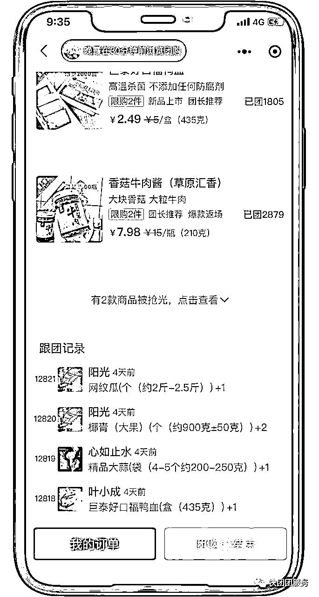

快团团就是将社群、私域的力量放大，在熟人经济里，每个团长都是一个小的意见领袖。

相对拼多多，某宝、某东的商家商业销售行为而言，快团团的团长更像是身边的好物推荐官。追求的是用户信任后的超长期粘性及复购率，属于在微信世界里的“直播间”。你的角色等同于公域直播间的“李佳琦”，为团员更好的选品、更好的服务，同时也让社群的经济价值最大化。

对于有私域流量沉淀的朋友们来说，快团团能实现高效利用私域流量，开团之后可以在朋友圈与微信群内传播分享。

快团团平台特性 @徐福建

快团团作为在私域进行交易的工具，吸引着越来越多的人躬身入局，一定是有它存在的价值的。

首先快团团不是平台，也没有任何撮合交易的功能，所有的成交需要团长自己去寻找流量，相对其他平台来说，快团团更适合新手也适合深耕。

其次它的特点其他工具不具备的，有哪些特点呢？

简单方便易使用无论是在有赞微盟还是线下，你想去卖货都需要开设一个店铺才能卖货，但是在快团团，你只需要一键复制帮卖或者上传简单的图片描述文案，填写价格佣金就可以开团了，0 学习成本 0 成本、提现及时帮卖团长不需要任何的成本就可以卖货，开团团长也只需要收取 0.6%的交易通道费，还有各种的奖励费用返还。可能更吸引是实时提现，这个对于任何平台工具都是无先例的存在，确实极大的提升了团长的体验全域裂变，玩法丰富在快团团的工具里面不是固定的组织架构，其实每个人的身份是可以随时切换的，传统的社交电商是 S2b2c 模型（平台为中心，系统封闭，先入局者优势大，我们都是打工人），快团团是 b²2c 模型（团长为中心，开发系统，多劳多得，自己做老板）。

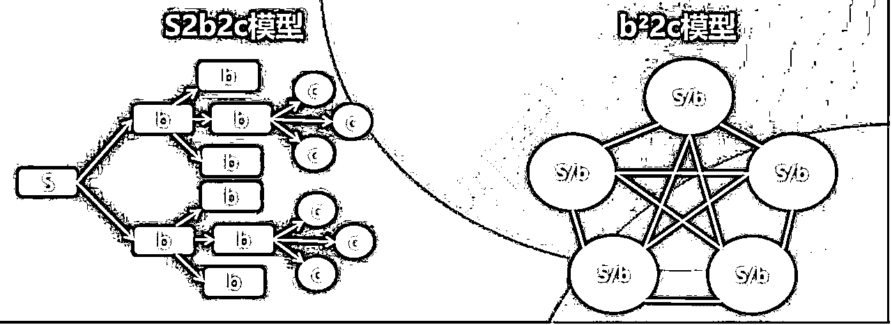

同时快团团也支持了大量的免费营销工具，秒杀，满减，拼团，红包等等，给予团长足够的玩法支持。

以上就是快团团独具的特性，成交方式也多种多样，比如私信自动咨询、比如朋友圈宣传、比如在社群运营产生交易等等。

内容来源：《沉淀一些朋友，用快团去经营》

快团团的几类角色关系在完整的快团团成交体系中，角色共分为 5 种：

以上关系，可以互相重叠，比如大团长，如果有消费用户，也可以像帮卖团长一样进行销售商品，本图只是为了区分各个角色关系，做的基础定义，「1.2 快团团体系里的 5 大角色」会有更全面的各个角色的关系介绍。

如何找到快团团？

微信搜索【快团团】，选择【快团团小程序】，即可找到快团团，开团可点击【一键开团】-【创建普通团购】：

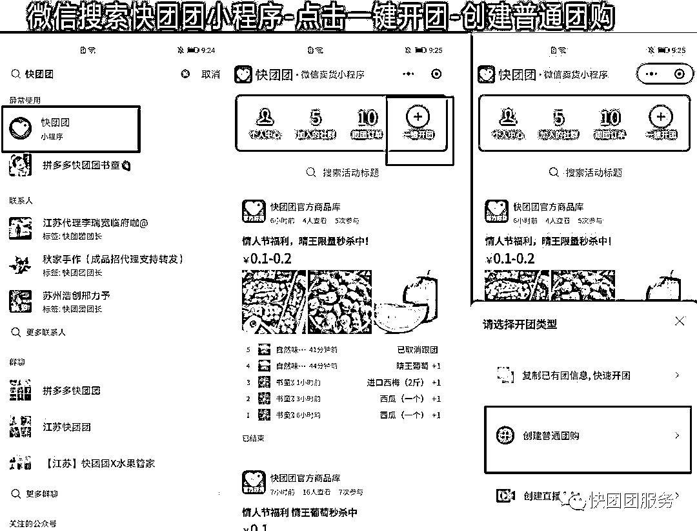

或者直接手机扫描下方小程序二维码进入「快团团」：

接下来，来认识一些快团团的基础规则。

快团团需要注册吗？

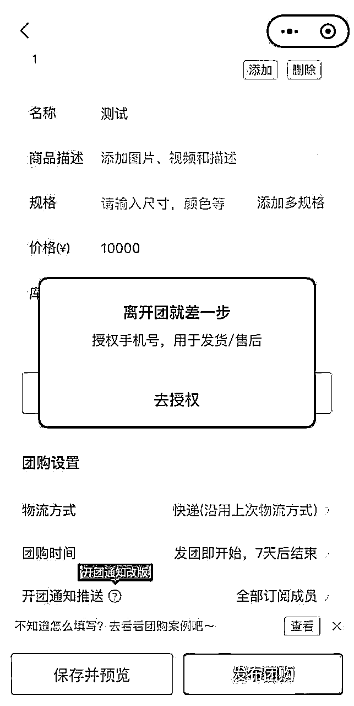

快团团收费吗？

快团团小程序所有功能「完全免费」提供给团长使用，无年费、无抽佣，但顾客在使用快团团做支付时，微信官方会收取交易额 0.6% 费用，该费用由供货大团长支付。

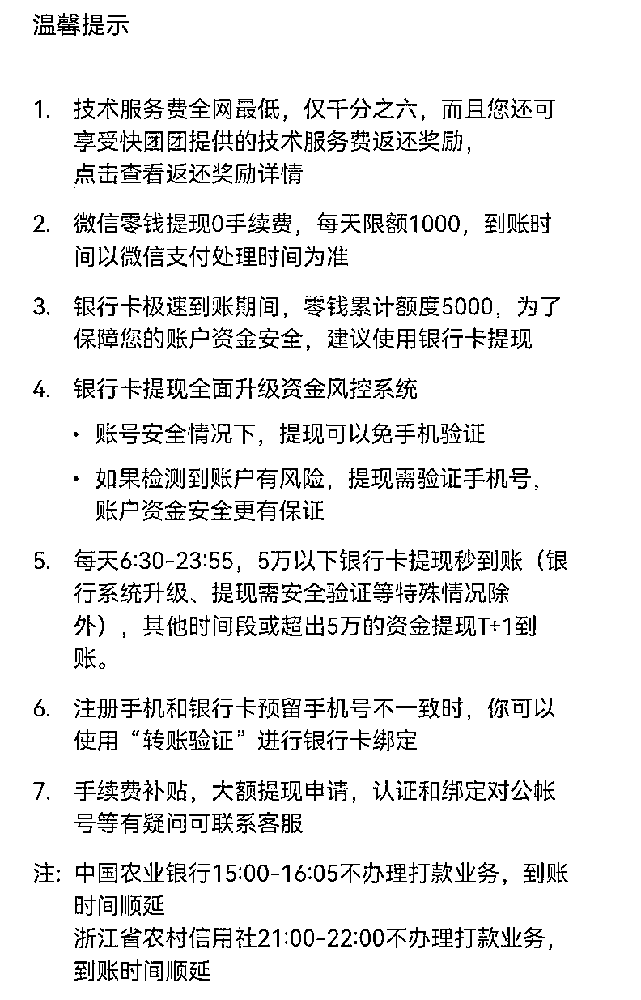

快团团有网页版吗？

有，快团团网页版网址：https://ktt.pinduoduo.com/

在快团团电脑端，可以更高效的发布团购、创建新商品、导入和导出各种类型的订单、导入快递单号、打印电子面单完成快速发货。

PS. 作为帮卖团长用不用 PC 后台都没关系。

顾客下单后，钱多久到达账户

帮卖团长卖出去的货物，佣金是直接到自己的账上吗？还是在供货团长那里，还是需要一定的周期才能到账呢？

这点需要看具体团的设置，有些团是大团长设置手动发放，如果不设置的话，默认是自动发放，佣金会自动到自己的快团团账户。

如果默认自动发放，顾客下单后，钱会立即到帮卖团长的快团团账户，帮卖团长即可提现，提现可至微信零钱和银行卡，提现不收费。

提现时间与限额：提现到微信零钱每天限额 3000 元，实时到账；

提现到银行卡每天限额 5 万，每天 9:00-23:00，5 万以下银行卡提现秒到账，其他时间段 T+1 到账。

实时结算的货品会有如下图的提示：

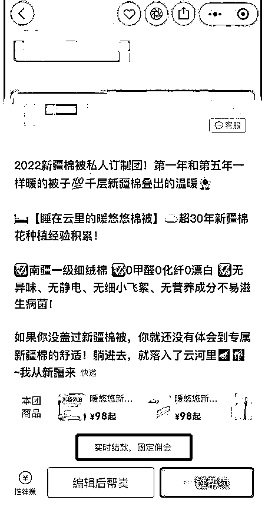

## 1.2 快团团体系里的 5 大角色

快团团是针对团长私域的工具类小程序，核心玩法是基于供货大团长-帮卖团长-团员的帮卖体系。

整个玩法体系中包含以下 5 个角色：供应商

供货大团长帮卖团长

自卖团长

团员本次航海的重点，是告诉大家如何成为一个自卖/帮卖团长，这对于大部分有私域沉淀的朋友们来说，这是最友好且直接的入局办法。

那么大团长和帮卖团长之间是什么关系呢？

我们知道其实很多平台会有代理的定义。但实际上在快团团帮卖团长并不属于代理，而是帮卖，友情帮助互帮互助的这样一个关系。

大团长和帮卖团长实际上是平级的关系，大家互相帮助的关系，在这样的一个比较良性的体系下面，很多人的业绩就做的非常快，大家找到了好的货，就可以分享给自己的顾客。

快团团以货为核心，作为团长，你可以帮卖他人，也可以自己开团让别人帮卖你。

接下来我们依次展开说下，几个角色在快团团中的玩法。

### 1.2.1 什么是供货商

供货商，简单理解就是供货给大团长货的商家，大部分是一件代发，团长产生订单之后，交由给供货商代发。

快团团体系内，根据团长来源分类，主要有淘宝店主、海淘代购、微商、淘客、宝妈和实体店等。

供货商参与快团团的合作模式目前有两个：

1）官方商品库，拼多多开企业店铺，交保证金报名快团团活动，类似于一个小 1688。适合品牌方或者有拼多多店铺的商家。

2）与大团长建立分销关系，用供应商系统来同步订单，属于团长和供货商之间的个人交易，快团团不做担保。适合有供应链优势，有 BD 拓展大团长合作的商家。

### 1.2.2 供货大团长

供货大团长，即我们后文中会不断提到的大团长，指拥有可以独立完成货源-上架-发货的能力的团长。

供货大团长不仅可以直接卖货给顾客，也可以设置一定比例的佣金，其他团长进行帮卖，从而得佣金。并且无需供货大团长操心的是，顾客从帮卖团长侧下单，订单信息和资金都是自动分配，无需供货大团长手动操作，结算更加省心。这个角色更适合有选品能力、活动策划和团长管理能力的商家，优势在于，大团长还可以借助快团团积累自己的私域客户和帮卖团长。

快团团虽然本身定位是私域社群团购小程序，但在私域体系之外，也正在建立一个公域的帮卖团长流量池。这个公域流量池有个对应项目名，叫明星团长计划。截止目前，官方组建了 60 + 官方帮卖群和 20 + 母婴帮卖群，每天安排 5-6 名明星团长在群里分享好物，覆盖 TOP20000 帮卖团长。

那么如何快速成为明星团长，吸引帮卖团长呢？官方基本门槛是：连续 60 天以上，在快团团上卖货；

连续月度销量自卖 20 万以上，或者供货 30 万以上；

团成员数 3000 人以上。

所以如果你自己供应链优势比较明显，又有自己的私域来帮助自己启动（明星团长有业绩和成员数要求），推荐可以使用快团团来承载自己的私域流量，并且报名明星团长链接更多的公域帮卖团长。

### 1.2.3 帮卖团长

帮卖团长是直接面向团员进行售货，多为自己没有货品，但有私域客户的团长。

帮卖团长可以帮卖其他团长的货品，活跃自己私域粉丝的同时，还能赚取佣金；

用户来源：初始的私域客户可能是来自线上的引流，也可能是来源于线下的积累，比如曾做过其他社区团购、做过菜鸟驿站、母婴店，美容院等线下实体项目的朋友，再或者是在线上有一定粉丝，平时混迹在各个社群里。

很多朋友确实积累很多客户在微信里，但长期无法变现或多渠道变现，也很少有运营的动作，现在就可以用快团团来卖更多品类产品，补充自己的变现渠道，变成客户的哆啦 A 梦，增加客户粘性。

综合来说，只要你愿意做 C 端顾客，大都适合做帮卖团长，只有起步快慢的关系。

对于大部分朋友来说，入局快团团的最快路径，就是成为帮卖团长，这也是我们本次手册的重点。后续的大部分内容都将围绕「做好一个帮卖团长」展开。

但对于其他角色来说，例如大团长、自卖团长等，后文中提到的选品、引流、建群、群运营等方法逻辑都是相通的，大家同样能够从这些内容中汲取养分。

### 1.2.4 自卖团长

自卖团长，指自己有线下货源的团长，既能够做自己的供货商，也能够处理发货售后等问题，同时又能直接链接到自己的售卖对象（即团员），特别适合做多多买菜、开连锁店等拥有大量线下用户的城市经理，进一步开拓线上市场。

当然，我们目前讲的 4 个角色，供应商、大团长、帮卖团长和自卖团长之间也是有互相重叠的。比如我作为大团长，也可以帮卖其他大团长的货品，而我作为帮卖团长，顾客看到的都是我在卖货，并且无痕发货，所以这里网络效应更加显著，团长粘性也更加高。

### 1.2.5 团员

团员就最容易理解了，指通过快团团小程序，在团长/帮卖团长那边购买商品的人，也就是快团团社群团购的买家。

团员完成下单，大团长/帮卖团长才能收获佣金。

## 1.3 航海权益

对于帮卖团长而言，找对适合、靠谱的大团长也非常重要。

如果大团长不够靠谱，有可能会出现如下情况：

用户付款了但大团长不发货；

产品实际与描述不相符；

发出来的货品有瑕疵但售后困难；……

所以不要随便帮卖，不要随便帮卖，不要随便帮卖。

同样的，对于不认识的人推荐的帮卖卡片，需要各位谨慎，一定对大团长做深度的分析和理解，否则会有隐患。最大的隐患就是，如果你通过 A 帮卖了一个团长，结果你的客户买了有问题，你要给他退款，这时候如果 A 账户里面没钱，你是操作不了的。

怎么理解这句话呢？比如：

我推荐你成为帮卖团长了，即你点击我发给你的二维码卡片成为了别人的帮卖团长，那么你卖出一单我有 1%-1.5% 左右的佣金（佣金的概念可以跳转至「2.2.1 帮卖团长参与帮卖」的特别说明中进行了解）。

如果后续你的客户要发生退款，系统会把我获得的 1.5% 的佣金退回去。假如这时候我已经把我的账户提现了，0 余额，你就无法给客户退款了。

不要只看团长的排名、订单数据，都是可以作假的。要对快团团货源渠道有一定的甄别能力，后文也有甄别策略：「2.3 快速去看如何甄别大团长是否靠谱」

所以推荐帮卖的人，也很重要。

为了保障大家在本次航海中的安全与稳定，本期航海，我们为大家联系到一些靠谱的供货商大团长圈友来提供货品，希望帮大家快速上手项目。具体名单在开船以后，我们在航海群中给大家推荐。

大家如果没有货品，可以先从他们的产品中选择合适的商品帮卖，出单后你们就可以拿到佣金。先上手拿到正反馈，走出第一步。

航海期间，航海群内仅支持展示推荐团长的货品。主要为了保证航海期间减少大家因为货品问题带来的初建群的“信任危机”，帮助各位圈友开出第一单。也经过多轮验证，15%以上的圈友首次发朋友圈带商品即当天开单。

航海期后，后续更加丰富的供货资源，大家需要自行拓展，但需要大家务必筛选寻找，千万不要加入大团长账号后立刻带货，一定要验证靠谱！

# 二、快团团的基本操作

💡章节概要

了解完快团团后，我们就要正式开始借助这个工具，启动自己的社群团购了。所以本章节，我们将教会大家，如何使用快团团。

「2.1 如何开团卖货」，主要是大团长需要操作的步骤，展示在这里作为资料拓展，也是为了让大家了解供货大团长开团的底层逻辑；

「2.2.1 帮卖团长如何参与帮卖」开始，我们会带着各位帮卖团长实操快团团，包括：

✅第一步：参与帮卖

✅第二步：顾客下单✅第三步：查看收入与提现

✅第四步：处理售后问题

在「2.4 快团团其他功能讲解」中，我们还整理了快团团小程序中的高频问答，大家可以点击链接，直接跳转答案，也可以前往快团团小程序中的团团学堂，找寻更多信息。

如果你想要自己找更多的供货团长，可以参考「2.3 自己如何选择供货团长」中提到的办法寻找，需注意的是，不要轻易选择一个团长，你需要花一些精力去辨别这个团长是否靠谱。

看千遍不如动手做一遍，开始操作你的快团团吧。

## 2.1 （拓展）大团长如何开团卖货

「2.1.1 如何开团卖货」这一小节，其实是大团长需要做的操作，但是对于帮卖团长而言，要了解自己的帮卖逻辑，最好也需要知道大团长开团的逻辑。所以请帮卖团长自行了解这一节，作为资料拓展。

第一步：大团长发布团购，销售产品

团长可以通过发布团购销售自己的产品，可选择自提或快递模式，自提适合小区周边落地配，快递则可覆盖更多顾客群体。

开团操作步骤如下：

1）进入快团团小程序-【一键开团】-【创建普通团购】：

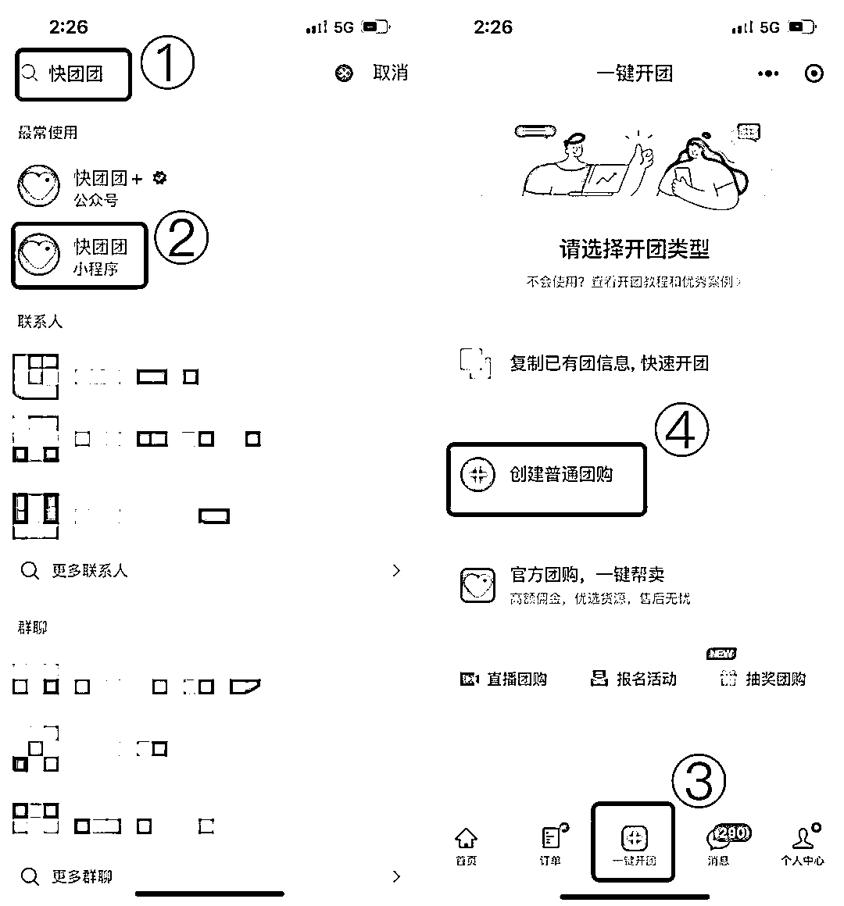

2）依次填写【团购介绍】-【团购商品】-【团购设置】-点击发布团购：

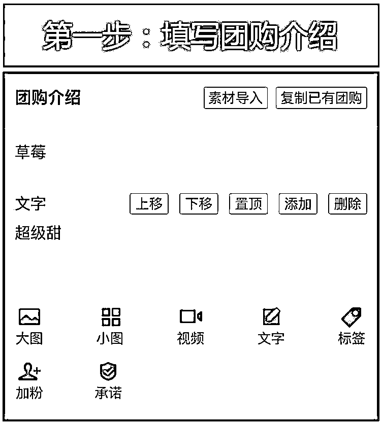

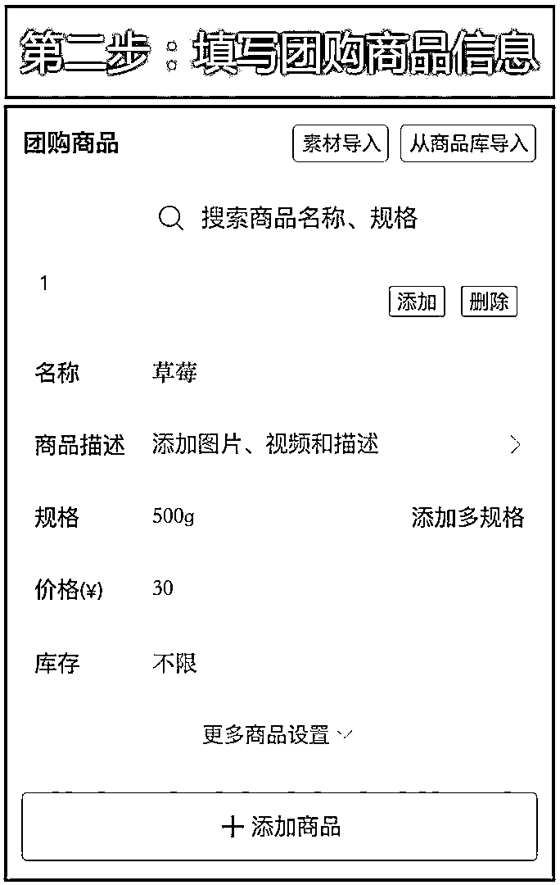

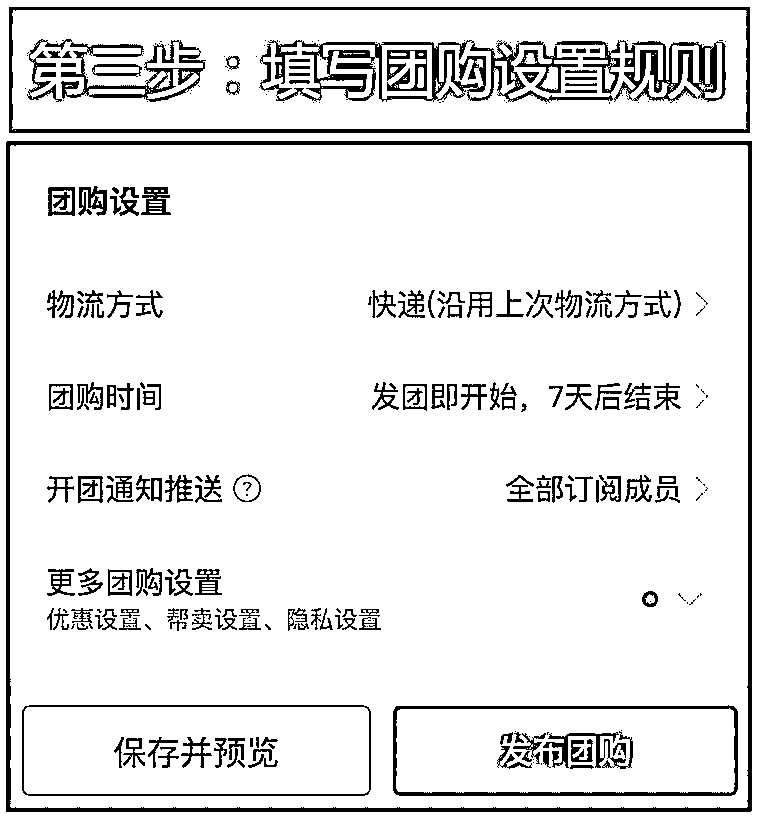

视频演示：https://mp.weixin.qq.com/s/fgcKbswY8JyDp_qISAtMxQ

第二步：大团长设置并发布帮卖开团团长自己有货品，但是想要更多的出货量，团长就可以给其他有顾客资源的团长设置佣金，邀请其他团长帮忙卖货。

团长如何设置帮卖？

1）团购设置-更多团购设置-设置团长帮卖 2）选择【团长以自己的身份，复制/分享你的帮卖】-设置帮卖佣金比例

「复制帮卖」和「分享帮卖」的区别如下：

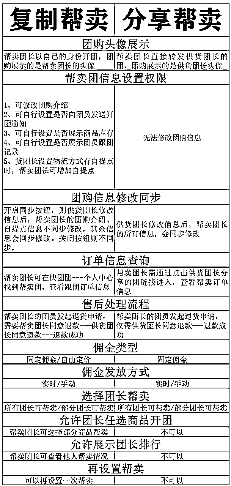

3）发布帮卖团购

第三步：邀请帮卖团长帮卖

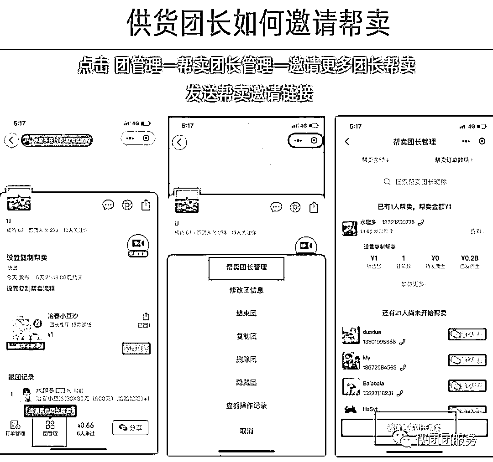

注意事项：大团长开团的重要操作说明

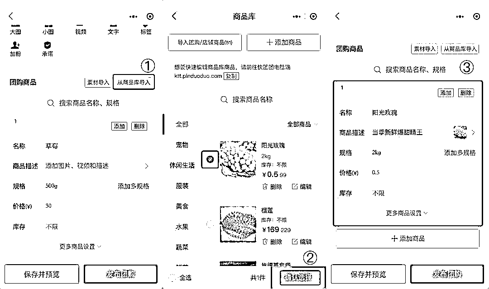

2）可以从买买相册素材添加商品：

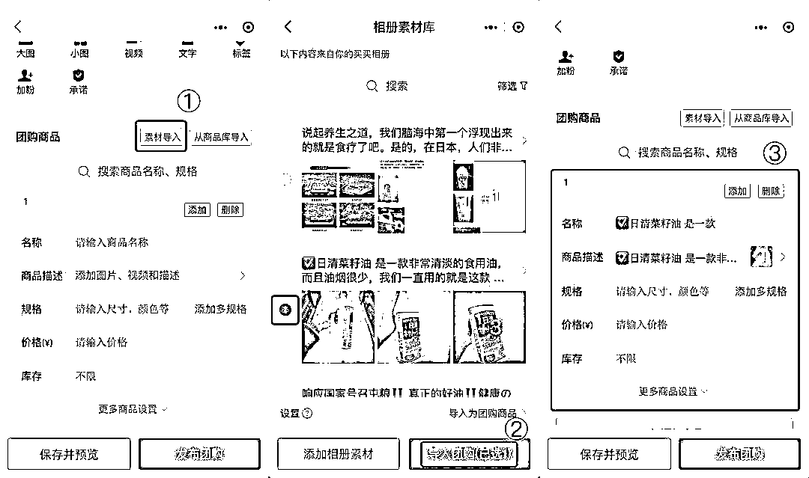

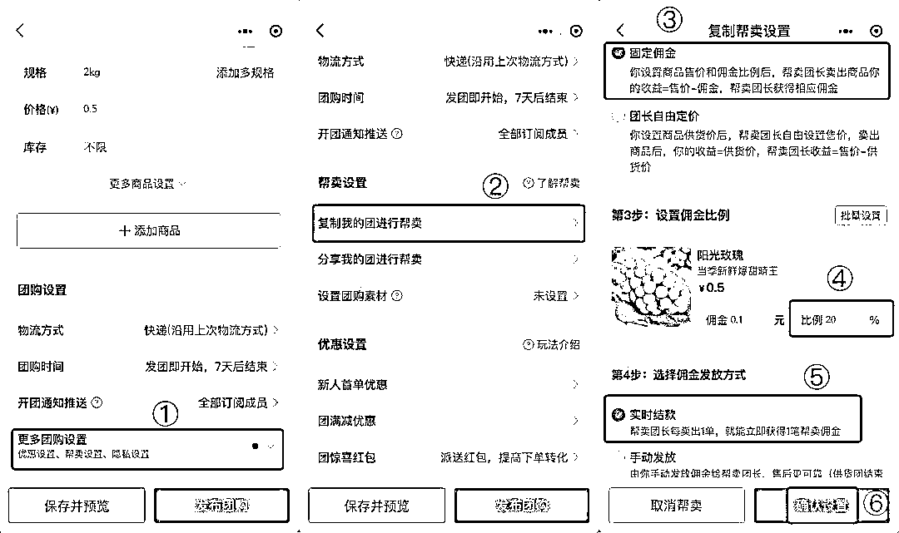

4）【团购设置】-【更多团购设置】-【隐私设置】中，可以设置团购的展示与转发权限、跟团用户显示的信息：

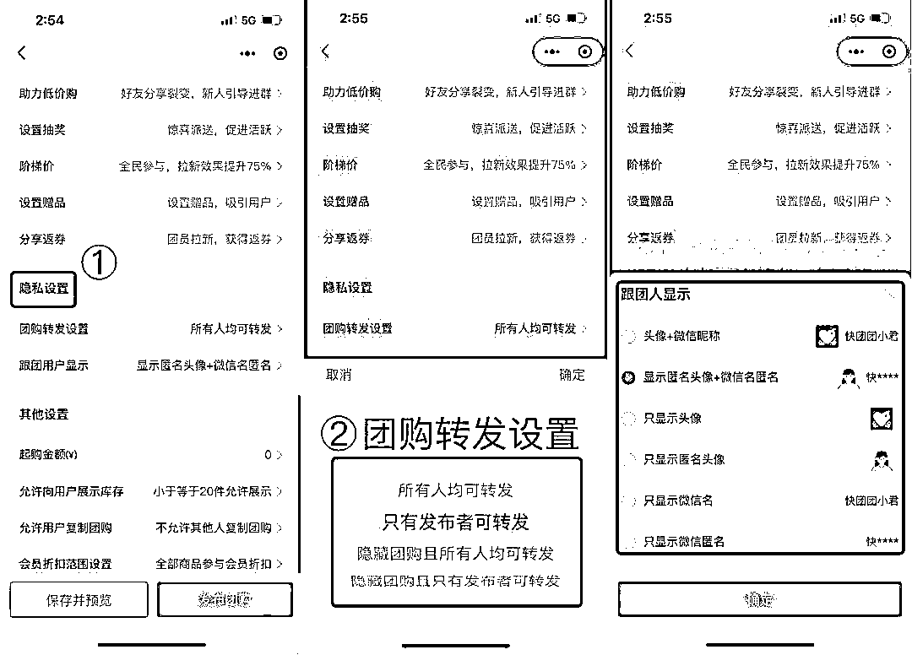

## 2.2 🔥如何运用快团团进行帮卖 - 基础流程

### 2.2.1 🔥帮卖团长如何参与帮卖

🔥🔥这一小节即为各位帮卖团长们需要学习实操的重点。

第一步：找准个人定位，完善基础配置 @星宇流量决定你的快团团定位，定位决定了未来选品策略，社群运营策略。所以定位很重要，你要先考虑清楚你要做什么？

有些商品是属于高复购的商品，例如水果，生鲜肉类；

有些商品属于品质刚需的商品，例如尿不湿、绘本，厨房湿巾；有些商品属于提升生活情趣需求商品，例如鲜花，好看的餐具，厨具。

一切的一切都围绕你手头拥有的用户的需求，以及你想要做的用户的需求是什么

切记越垂直越好，越精准越好。虽然前期开展带来的变现空间有限，但随时间沉淀，你会越来越有价值。比如你只做 3-5 岁妈妈群，卖的都是 3 - 5 岁刚需的商品，用户有需求就会很快找到你。同理，如果你是做水果群，那大家想吃水果，就会找到你。

以下是测定位的四象限，供大家思考：

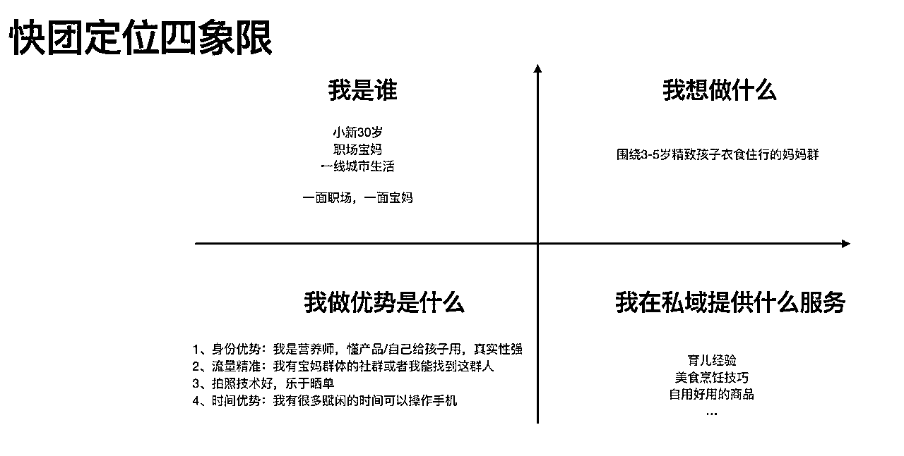

2\. 完善基础配置

想清楚个人定位以后，需要把头像、昵称、简介、背景图进行完善。

例如你是宝妈，想要做母婴群。

【昵称】你可以叫「安妮妈妈」

【简介】可以是我是谁，我为什么做这个号来写：自己基础信息进行提炼，包括昵称、性别、年龄、生活状态、价值观等方面，越详细越好，内容越多，内容越丰富，越真实越好。（人设不等于本人）

【头像】可以是自己抱着孩子的照片，或者是用在线设计网站设计一个。

第二步：成为「供货团」的帮卖团长

帮卖某个团的商品前，需要先识别该供货团的小程序二维码，成为这个团的帮卖团长。

本期航海，我们为大家联系到一些靠谱的供货商大团长圈友来提供货品，希望帮大家快速上手项目（不限制数量，可以 8 个都加入）。

8 个供货商大团长的简介与二维码如下：

1）元宇宙供应链

⚠️并非暴雷的「糯米福利社」，两者完全无联系

元宇宙供应链简介：元宇宙供应链是千寻供应链衍生出来针对中小型团长的团，为帮卖团长提供食品、生鲜、百货、为主，小众其他品类为辅的供应链服务。经过一年多供应链的沉淀，目前已经设立上海仓、嘉兴仓、西安仓、安徽仓、等多品多类仓发货需求，联合战略品牌方厂家建仓稳定发货。

千寻供应链主要给快团团、群接龙的私域社群团长提供产品代发服务，是快团团、群接龙全国 P 妈、趣趣、海涛、樱花、77、骄傲等全国 Top 团长的核心服务商。（如果需要 Top20 开过的团品，千寻可以提供供应链服务。)

元宇宙供应链目前主要开团的品为能稳定输出品质有保证的品，例如自己仓发货、战略合作厂家为主。另外元宇宙供应链也承接了战略品牌方的全私域运营（包含私域平台、有好东西、万物心选、蜜桃、严寻等）

本期航海选品主要围绕自己仓发货的食品、产地直发生鲜水果、以及品牌方配合的福利品为主。例如溯源过的厂家的有出口资质的饮品枸杞原浆、产地直发应季新鲜水果、陕西甜瓜、新疆的哈密瓜、甘肃金银水果玉米、自由仓发的牛奶、食品，清仓福利产品。

识别小程序二维码，成为其帮卖团长

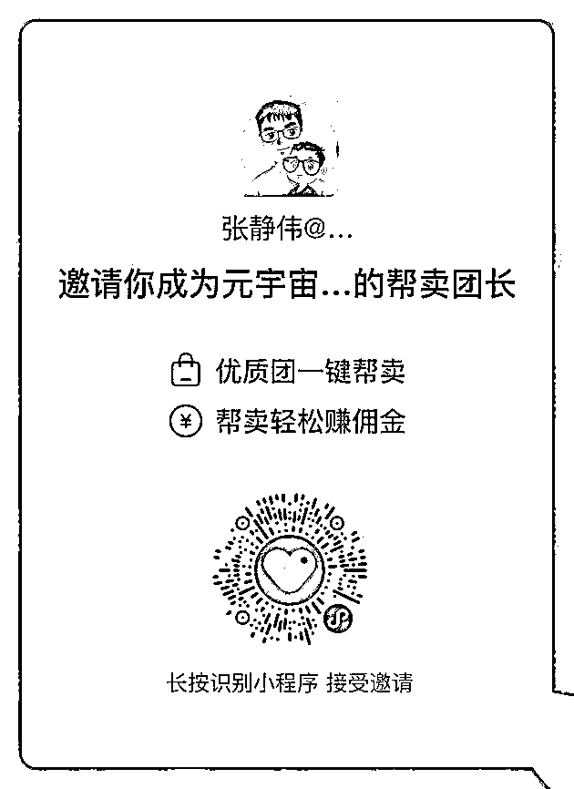

2）忘忧惠团忘忧惠团简介：

公司成立于 2019 年 6 月，总部位于青岛，采用分布式办公的运营形式，在北京、杭州、新疆、广州设有营销商务部，从 2020 年从事快团团供应链业务，主要代理包括联合利华在内多个品牌商家与蜜瓜，云爸，猫家等私域头中部大团长快速建联商品合作并完成销售目标，年社群团购销售 GMV 过亿。

2022 年 12 月以孵化+定向邀请模式创建快团团大团长账号-忘忧惠小团，经营类目包含食品、母婴、百货、宠物及护肤五大类，主打品牌直签，官仓发货，售后兜底。

主理人连续 4 期担任生财有术快团团航海教练，为生财圈友的商品保驾护航。

识别小程序二维码，成为其帮卖团长、

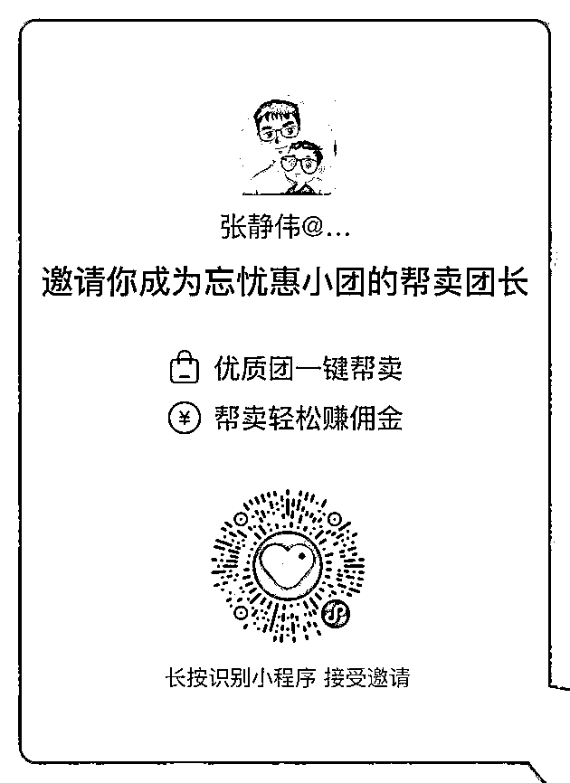

3）深藏好肉团

深藏好肉团简介：

深藏好肉是一家专注中高端牛肉的新零售品牌（其前身是赛鲜浦乐牧），主打美国黑安格斯和澳洲和牛产品。在供应链端，与美国澳洲的顶尖供应商都是深度合作十余年。深耕电商，并在淘宝，快团团等团购平台取得销售额 10 倍增长。疫情期间产品配送到上海上百个小区，和上海女神团等大团长都有深度合作。

产品供应上海多家日式烤肉以及西餐厅，产品线覆盖“全牛部位”，包括牛排，火锅寿喜烧，烤肉，牛肉饼，中式炖煮等。

识别小程序二维码，成为其帮卖团长

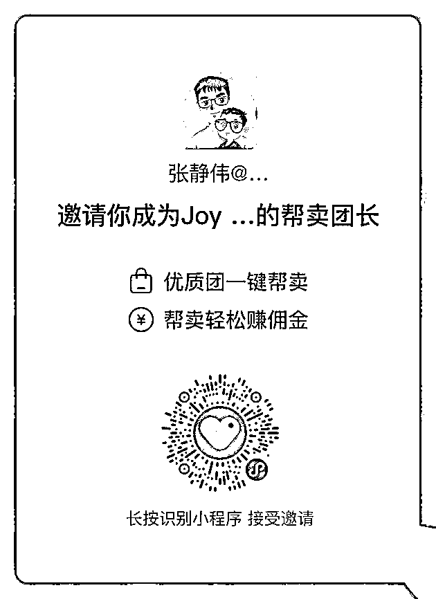

4）创港渔农生鲜创港渔农生鲜简介：

✅创始人父辈是渔村朴素的渔民，家就在南海博贺渔村，从小就接触各种海鲜；

✅公司自有捕捞船，收渔船，海鲜加工厂，快递打包仓库，真正实现捕捞到运输发货一条龙；✅专注海鲜全国快递团已经 8 年，口碑非常好，客户满意度达到 99.99%。

🦑🦐🦀专注做一件事，做好这件事，让全国各地的小伙伴吃到实惠的海鲜❗️❗️❗

识别小程序二维码，成为其帮卖团长

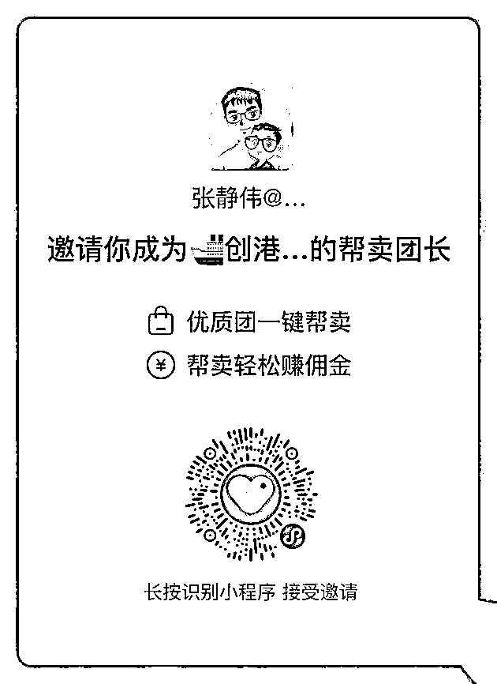

5）小果臻选团小果臻选团简介：

拥有 20 万私域粉丝，爱惜羽毛，不做假货，产品授权链路完整，珍惜所有粉丝和团长的信任，专业客服团队支撑，全程售后无忧，让大家放心帮卖，做靠谱的团长。

✅只开高转化团，每款产品到样开团，和快团前 50 团长都有合作。

✅自有 20 万私域用户，积累了丰富的一线服务经验，毫无保留分享快团运营经验。

✅每月给帮卖团长提供免费公益赠书引流方案，以及抽奖促活活动。

识别小程序二维码，成为其帮卖团长

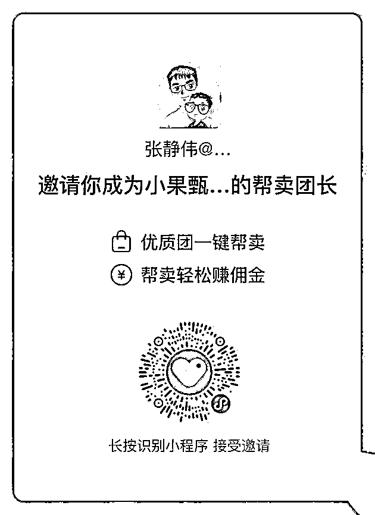

6）Ume 好品福利社

Ume 好品福利社简介：Ume 好品福利社是 22 年 10 月由苏宁易购官方发起的，面向头部团长供货的专业供应链工具，目前合作苏苏高品质、阿迷高品质、三妈团、柯柯、小马优选、欣欣优选等近 50 位团长，月度合作单品 100+，多个万单爆款。

Ume 福利社是苏宁易购易开团推出的面向帮卖团长的供货团，精选大团长万单爆款，覆盖食品生鲜、生活日用、小家电等全品类商品，给予最低价格、最高佣金、最好品质服务。

识别小程序二维码，成为其帮卖团长

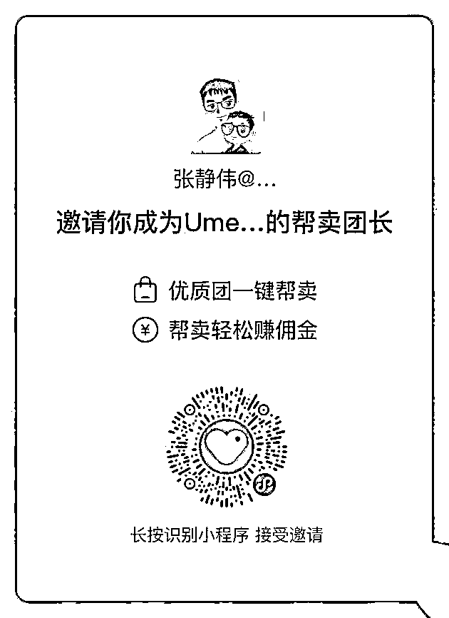

7）简爱乐选

简爱乐选简介：

简爱乐选致力于“宝妈美好生活服务者”的定位，为帮卖团长主要提供丰富的母婴产品及围绕生活日常所需的食品，百货，家居等全品类选品。简爱具备自营仓超 1000 平方，具备超 30 人的选品、运营及客服团队，为三妈，小象，猫家等母婴全国 Top 团长提供服务。

在这次航海，主要为大家提供母婴夏季热卖品，包括防晒驱蚊，服装，零辅食，洗护，玩具等，主打大牌货平民价，同时具备超多流量款，为船员们开单赋能～识别小程序二维码，成为其帮卖团长

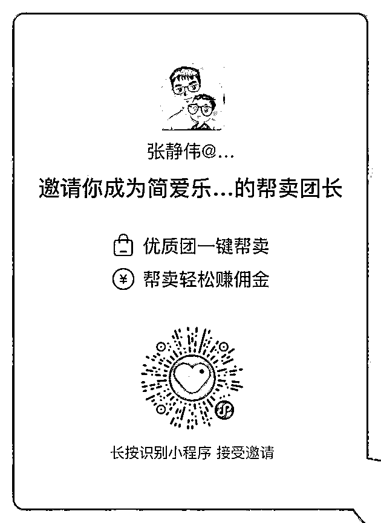

8）模范妈妈尖货严选

模范妈妈尖货严选简介：

模范妈妈尖货严选是一家图书供应链公司，依托自营图书电商优势，为大家严选图书文教类产品。目前已经和全国 200 家以上出版社建立了合作，主营 3-12 岁婴幼儿童类图书，在库图书品种 sku 超过 1W+，同时在湖州、香河、咸宁三地设立分仓，每个仓库占地都在 5000 平，发货迅速且专业。

识别小程序二维码，成为其帮卖团长

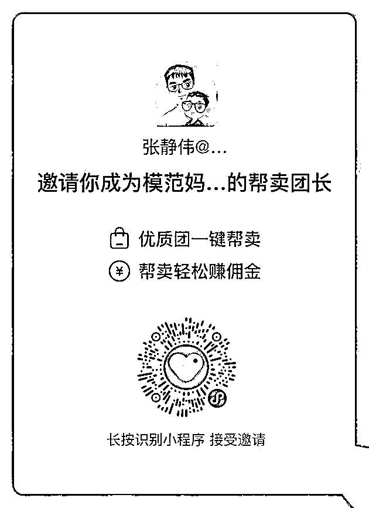

9）魔都卷妈魔都卷妈简介：

魔都卷妈致力于“为孩子做实实在在的严选”，依托于魔都的优势 和 多年文教类产品的渠道的耕耘，为大家严选图书课程教具等文教类产品。目前已经和全国 数百家 出版社、课程品牌、亲子剧场 等建立了合作，除了国内常见出版社的 3-12 岁婴幼儿童类图书、课程，更有英语、小语种类目的书籍和课程，虽然在库产品种 sku 超过 1W+，但只上架经过验证的精选书籍课程。保证品质、保证性价比、为每一位团员助航。

识别小程序二维码，成为其帮卖团长

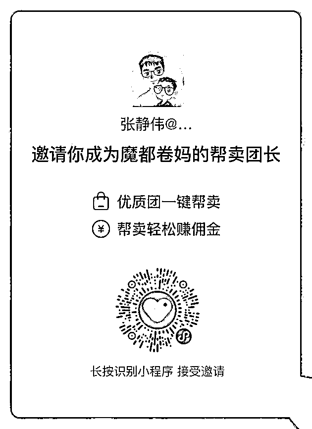

第三步：帮卖团长参与帮卖

1）点击快团团长转发的帮卖链接如果不需要修改任何信息，直接点击，一键帮卖

如果需要修改帮卖团团购介绍信息，点击，编辑后帮卖，编辑界面中可以修改如下内容：

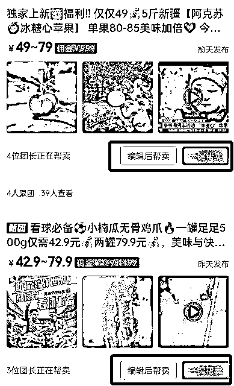

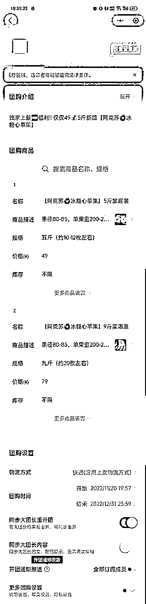

2）点击「编辑后帮卖」，需要修改帮卖团的团购介绍信息，可以关闭「同步大团长内容」后，再进行修改。需要注意的是，关闭后，若大团长修改了团购介绍内容，无法同步至你的帮卖团哦。

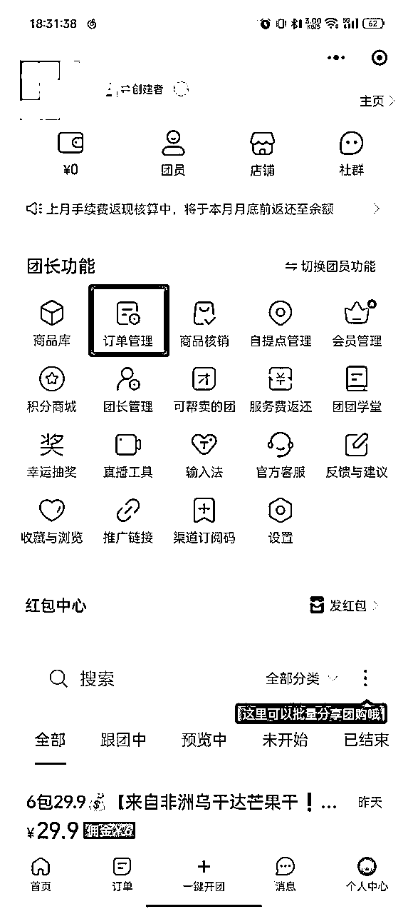

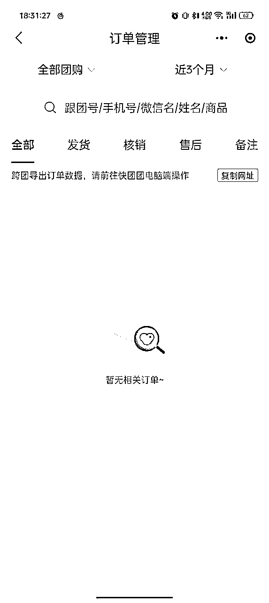

第四步：顾客下单与查询订单状态

发送「帮卖团购卡片」给顾客后，就会产生顾客订单。这里展示下单成交的流程。

1）顾客如何下单：

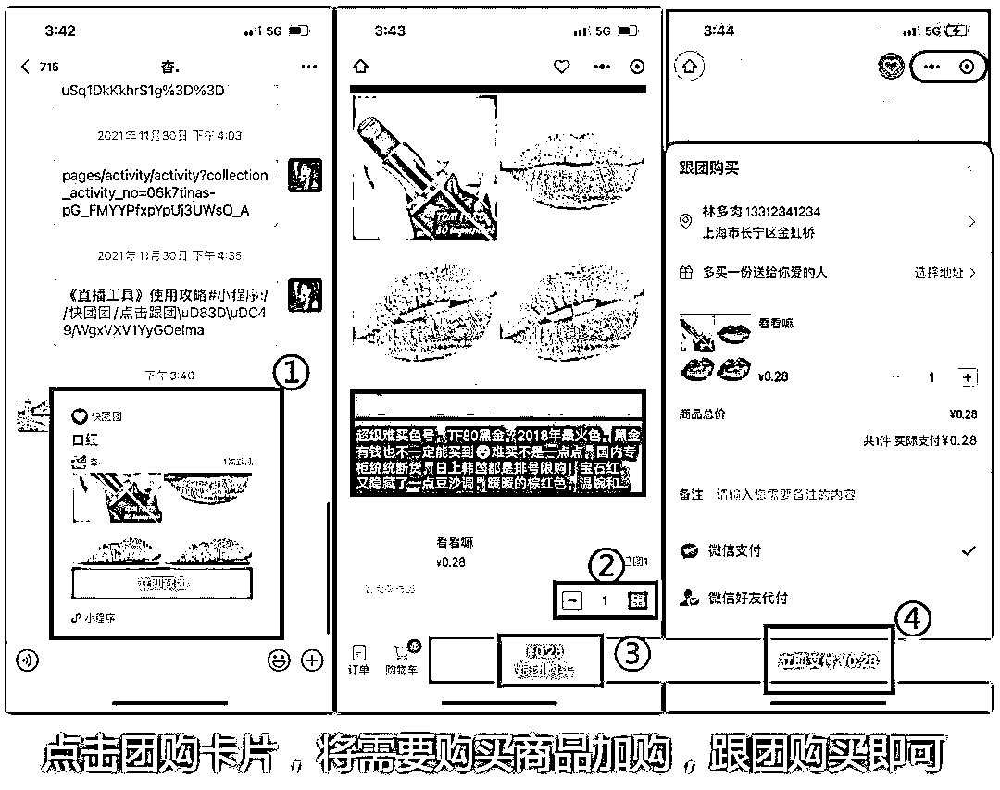

2）顾客如何查看自己购买的订单及物流信息：

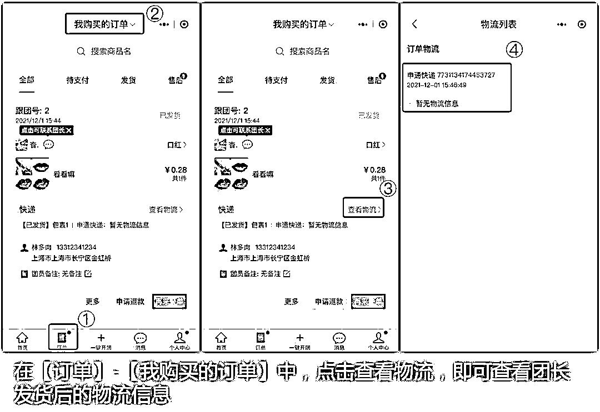

3）顾客如何联系团长

一般来说，顾客下单后都会联系或添加团长的联系方式，在快团团小程序中，可以通过以下路径实现：

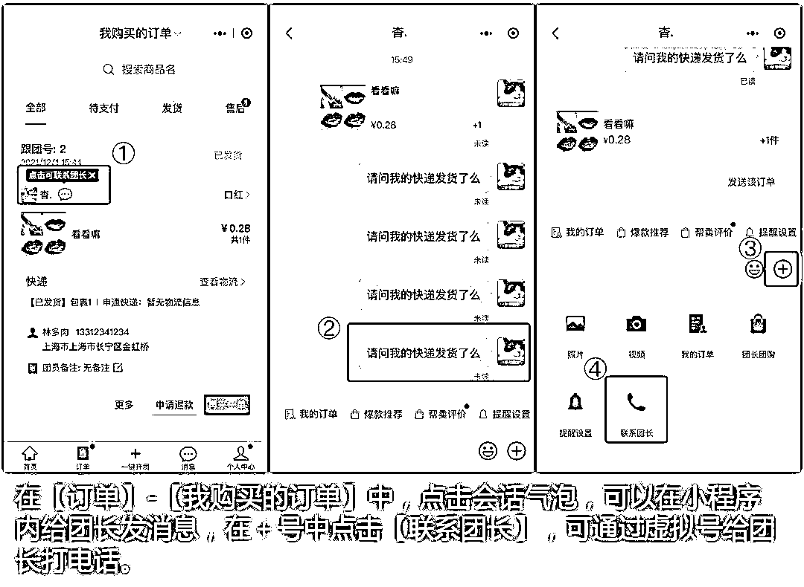

注：通过谁的团购卡片购买，这里就会联系到谁。比如顾客从帮卖团长（即你）的卡片完成下单，联系到的团长即为帮卖团长。如果帮卖团长无法解决问题，可以由帮卖团长再联系供货团长。

到这一步，顾客下单后，帮卖团长就已经完成售出任务，发货等事情都会由大团长解决。

第五步：团长如何查看团购收入和提现（帮卖团长与供货大团长同操作）

1）团长如何查看团购收入：

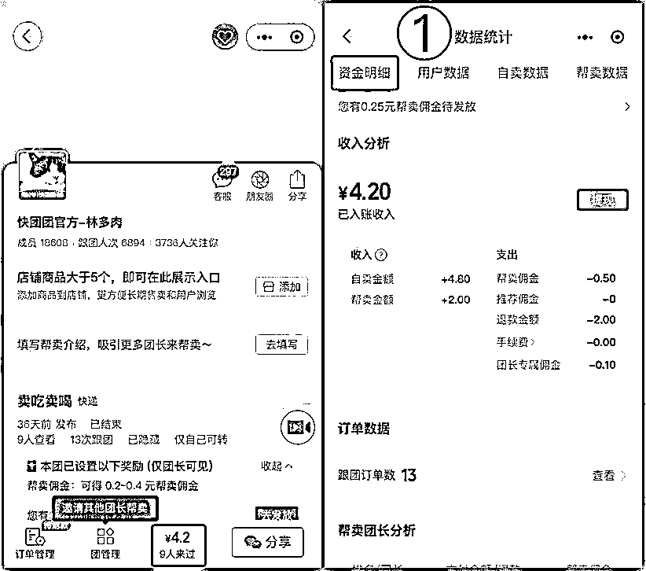

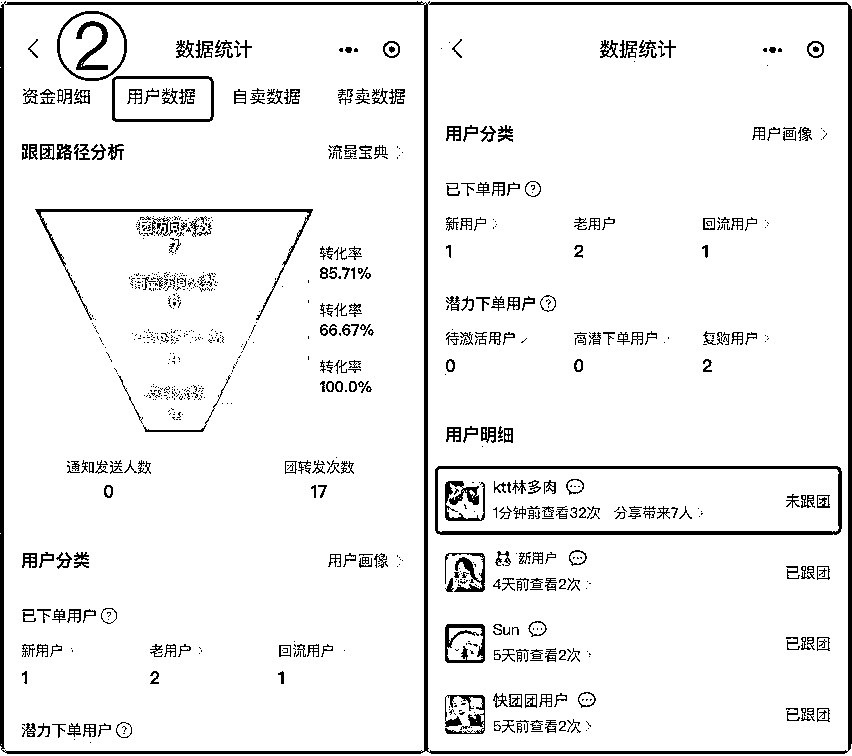

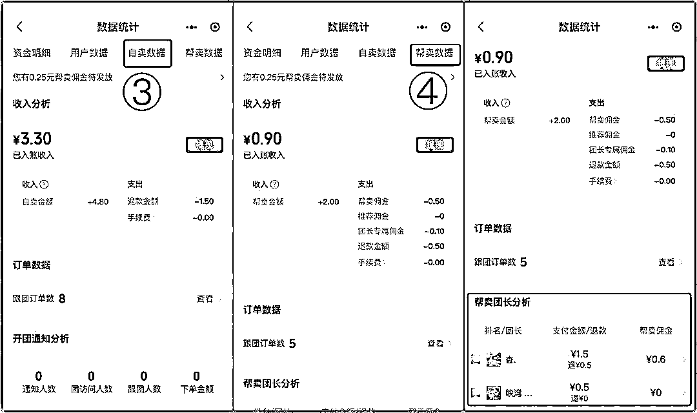

进入团购详情页，点击左下角的金额，即可进入资金明细页面。在这里可以看到该团购的——资金明细

用户数据：在用户数据中能看到团员的查看次数，分享带来的人数，是否新用户，以及是否跟团 2）团长如何查看全部数据：2）团长如何查看全部数据：在“个人中心”中进入“我的钱包”，在这里可以将钱包里的钱提现。

如果供货大团长没有特殊设置，默认佣金自动发放，那么顾客下单后，钱会立即到你的快团团账户，提现可提现至微信零钱和银行卡，提现不收费。

提现时间与限额：

微信零钱提现每天限额 3000 元，实时到账；

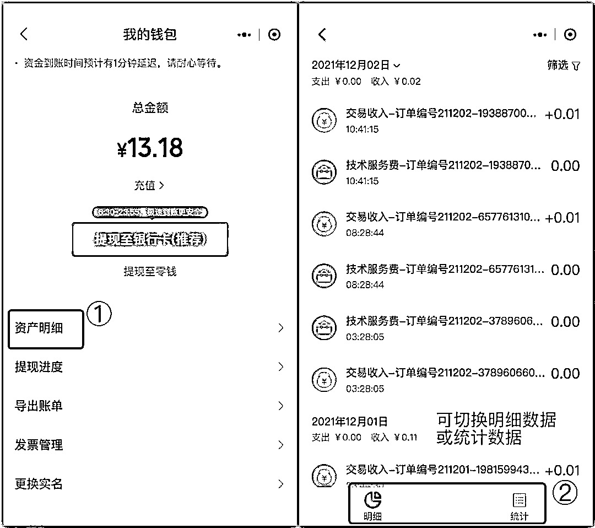

在“个人中心”中进入“我的钱包”，点击“资产明细”。

在明细中可以看到相关的明细数据，在统计中可以按日/按月查看收入/支出数据。

5）团长如何导出账单：

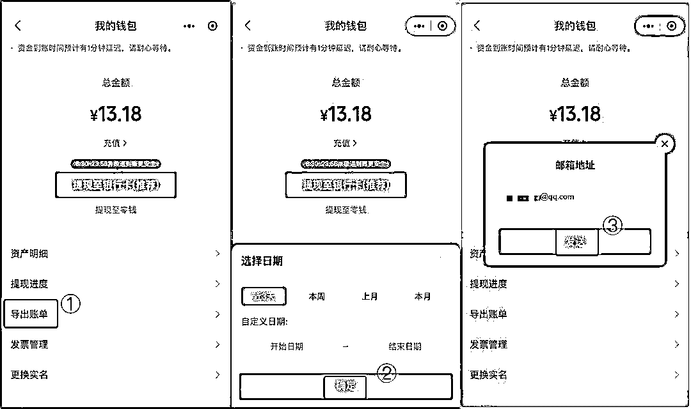

在“个人中心”中进入“我的钱包”，点击“导出账单”，选择日期将账单导出到邮箱中，导出后大概 10 分钟，你的邮箱就会收到账单了。

第六步：处理售后问题

退货退款流程退款逻辑：

团长退款：只有供货团长具备主动退款的功能，帮卖团长没有主动退款的功能顾客退款：需要帮卖团长和供货团长都确认退款才可以进行退款

如果是顾客退款，帮卖团长确认退款前，需要注意自己的账户中是否有足够退款的佣金，因为供货团长确认退货时，也需要退还这笔订单的佣金。

退款视频演示：https://mp.weixin.qq.com/s/AuJBaJGCRiH7a9XZN1n1rw

常规售后问题与处理方式常见的售后问题包括以下 3 种：

（1）产品问题

售后的产品问题大多是标品产品本身与描述不符合，例如描述写 100% 棉质，产品本身出现了纤维面料质量问题。

大家协助做好退换货即可。

（2）物流问题

这部分大部分是和发货相关的问题，其中生鲜产品因为有时效性，这部分问题会比较多。现在因为有疫情原因，客户的地址是否能发货，有时候需要提前和供应商确认的（用户下单的时候，如果地址不能发，会有提示）。

常见的物流问题：

由于快递原因导致事件较长，冷冻类产品变质由于快递暴力，部分生鲜水果各别坏果

有快递单号，结果快递位置错误，或者快递丢失，这个客户提供快递单号，商家重新安排发出（3）退换货问题

大部分售后问题的重点，都是退换货问题，这个一定要和供应商/供货大团长沟通好，什么样的条件和标准才能退换货。

因为团长不但要站在客户角度，保证客户的权益，提高体验度，也要站在供应端角度保证公平，比如生鲜产品，一定要及时签收放到冰箱，有问题要拍照第一时间反馈。

帮卖团长对客户的反馈速度非常重要，最好能做到秒回，底层逻辑是：

要尽量第一时间确认客户的问题，作出回应，如果可以直接回答的，第一时间回复；对于需要和供应商的售后联系的问题，要尽快联系供应商的售后人员，代表客户和供应商沟通，把问题的解决方案回复客户；

所有商品品质问题，第一时间回复可以退换；对于需要退换货的，按流程完成退换货

各团售后处理方式汇总对于不同团来说，其售后处理方式可能略有不同。

以下是我们本次合作的帮卖团中，其中 4 个团的售后处理方式，大家在日后也可以作为参考：

💡

元宇宙供应链 1）所有由于快递原因的售后，操作均为，马上联系快递处理赔付，该补发的补发（客户联系帮卖团长，帮卖团长联系供货大团长，供货大团长联系发货快递。谁发货，谁负责联系快递）；

2）如因快递暴力问题导致的商品破损，请第一时间联系快递公司（谁发货，谁负责联系快递），需提供照片（麻烦客户提供一下）：外箱单号 + 照片

破损货物 + 外箱单号合照，需要显示外箱单号货物正面以及破损的样子

整个的外箱整体外观照片

3）如果需要按照比例退款售后，直接发红包售后（后台可以操作），提供证据给元宇宙供应链申请赔付红包；

4）客户需要修改地址：未发货状态，取消订单重新拍，已发货状态联系元宇宙供应链客服修改地址；5）如果因为标品的质量问题退换货，来回产生的快递费用均由元宇宙供应链承担，但买了不喜欢无理由退换货，退回的快递费用由客户承担，收到货后退全款；

6）清仓、特价、食品类、美妆类、贴身衣物团品不接受 7 天无理由退换货。接受 7 天无理由退换货的团品需往返运费自理，支持 7 天无理由退换货的团品，须确保不影响二次销售，换货往返运费自理，退货需扣回发货运费后退款；

7）如因漏发、错发等卖家问题，请在签收当天联系客服处理，需提供照片外箱单号 + 照片

整个的外箱整体外观照片货物 + 外箱单号合照

超过 24 小时不售后

8）因质量问题产生的退换货，运费补贴标准视地区情况为 5-10 元；请务必不要用顺丰寄退回件。

9）特别说明：买家擅自拒收，买家需承担来回运费

食品类不以个人口感喜好做售后依据服饰类商品拍摄光线原因，色差难免，介意者勿拍；

工厂出品难免有线头，请自己动手修剪一下，不在质量售后范畴

尺码问题，请按提示购买，售后需提供证明照片或视频，确认尺码标注与实物不符。

服饰鞋包类收到可能会有加工原料的气味，清洗或是凉放一下就可以了，不在售后范围。

有些工厂出货的品可能会无吊牌，如果介意的话请勿拍单，不在售后范围。

💡

无忧惠团 1）所有由于快递原因的售后，操作均为，马上联系快递处理赔付，该补发的补发；

2）如果需要按照比例退款售后，直接发红包售后（可后台操作），提供产品和面单一起的图片给忘忧团售后申请赔付红包；

3）客户需要修改地址：未出快递单号的订单，联系忘忧团客服修改地址；若已出单号，需要客户自行联系快递方，询问是否可以修改地址；

4）如果因为标品的质量问题退换货，来回产生的快递费用均由忘忧团承担，但买了不喜欢无理由退换货，退回的快递费用由客户承担，收到货后退全款。

💡

JoyMeat 团 1）所有订单在 48 小时内发货，最长不超过 72 小时；

2）如果有质量问题或出现少发，错发的情况，需要在收货后 24 小时内带面单 + 产品照片联系客服反馈，我们会在第一时间进行售后处理；

3）生鲜产品一旦发出后，不可变更地址，不可退换货，在未联系客服的情况下，拒绝任何形式的拒签；

4）因客户地址电话信息不正确导致货物不能送达，不在售后范围内；5）发货和上传运单号有 24-48 小时时差，没有运单号不代表没有发货，对物流信息有任何疑问，请联系客服；

6）因为生鲜产品的冷冻保温具有时效性，为保证质量，某些边远地区比如新疆，内蒙古，海南，黑龙江等超过 48 小时时效的地区，我们无法发货，请谅解！如不清楚自己的区域是否能发货，请联系客服确认；

7）因为疫情管控，部分地区可能因无法发货导致无法下单，如有疑问，请和客服确认。

💡

创港渔农生鲜产品：博贺港海鲜

发货地：茂名博贺快递：顺丰冷链

快递时效：广东省内次日达，省外 2-3 天保存方式：-18°C 冷冻保存

售后须知：

1）请您一定留正确的地址和电话号码，快递一旦发出，恕不再更改地址哦；

2）请一定及时查收快递，第一时间开箱检查。勿放快递柜，驿站等；3）产品运输过程中，真空袋个别会有漏气的情况，不影响海鲜品质，海鲜的真空只为缓解运输途中化冻时效；

4）有任何问题请签收后 24 小时内凭【损坏产品+快递面单】 合照售后；

5）快递为冷链汽运，请耐心等待收货，收货后产品有问题可按照上述正常流程申请理赔。

特殊时期，只要彼此多些理解与耐心，一定可以度过难关的，比心～售后对接：

各团的售后小伙伴会都会加入航海大群，大家可以在其中找到对应的售后解决问题或者在各团的帮卖主页，寻找该团客服，下图所示为举例

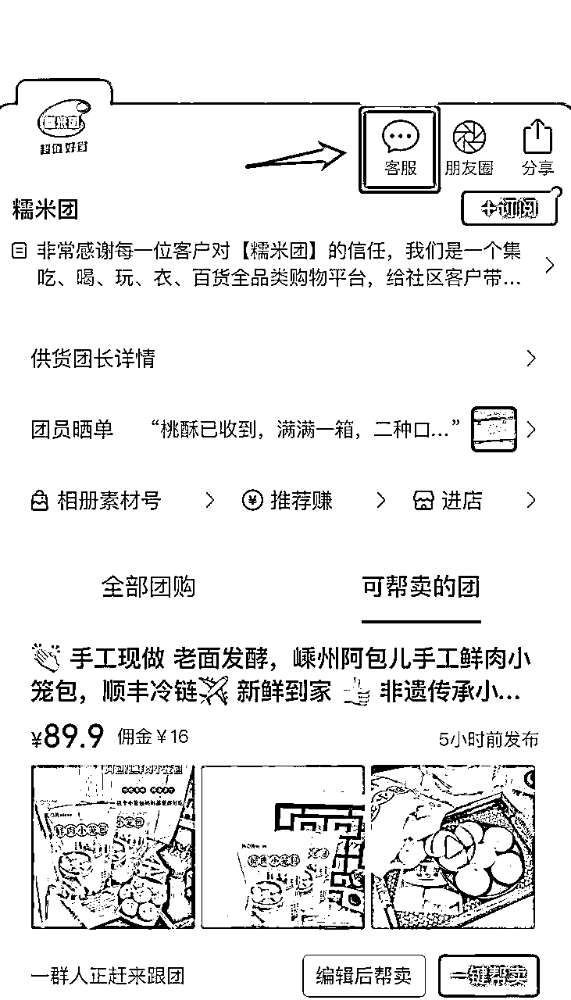

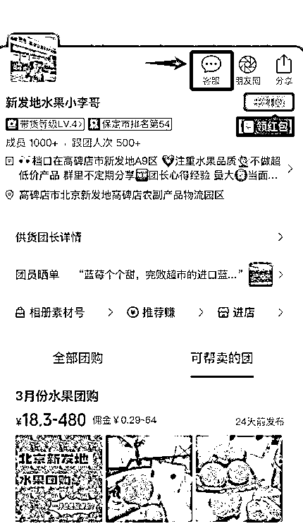

一定记住，你是中间的桥梁，要做好衔接工作。

如果遇到产品质量或产品瑕疵问题，有个处理原则，就是想办法超过客户预期，这种方式表面上看你付出了更多，但实际会帮助赢得更多的口碑，变危为机。比如：产品出现问题，需要给客户退货退款，你可以退款不退货，再追加给予下次的购买优惠。

### 2.2.2 快团团帮卖流程总结

整个帮卖路径，可以梳理为以下三个大步骤：1）供货团长开团，设置佣金

2）帮卖团长通过一键帮卖/编辑后帮卖，进行帮卖

3）成交后，供货团长发货，帮卖团长拿佣金

帮卖团长要做的，就是选择适合的货品，发在群里，提升自己的售货率，并从中赚取佣金。

## 2.3 自己如何选择供货团长 @宝藏小鹿 @星宇

如果你需要更多的品类，也可以自己找供货团长，但是在这一步，更需要我们认真仔细的辨别供货团长的情况，避免踩坑，圈友@宝藏小鹿分享了一些寻找供货团长和辨别的方法供你参考：

1）寻找大团长的渠道之微信搜“快团帮卖团长”

寻找大团长的方式比较多，例如在闲鱼 \ 小红书 \ 微信 \ 抖音搜索：快团团、快团团大团长等关键词。也有很多相关公众号和文

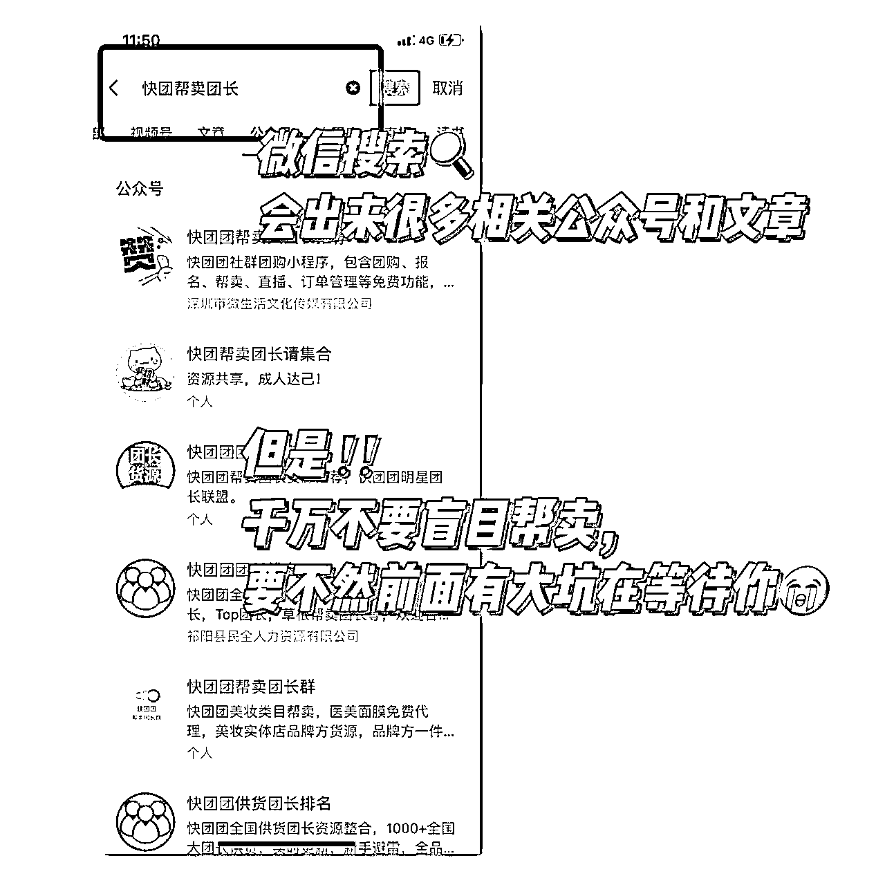

2）如何判断供货团长是否靠谱？

一些人鉴别团长是否靠谱，会去看这个团有多少团成员，团品销量，团品在快团团的级别排名，当然具备一定参考性，但也正是因为太过于“显性”的，所以不具备全部参考价值，是存在假数据的可能性。

⚠️不是团员人数越多，团的售后风险就越低，不存在正比关系。那么看什么才是鉴别大团长的试金石呢？并且鉴别什么？怎么鉴别？以下鉴别流程，请往下看👇

基础判断 - 看商品观察商品的销售价格与商品的关系。一般商品会分为 2 类，品牌商品与非品牌商品。

品牌商品是具有市场价格基础的，比如苹果手机，市场销售价格 8000 块，如果快团团内卖 7500，有可能，但如果卖 5000，你就要谨慎了，为什么便宜？如果这么便宜，是不是有坑呢？如果卖到 3000 块，你赶紧跑。

非品牌商品鉴别价格就有难度了，这里就做个区间参考即可。比如苹果，3 斤苹果水果店卖 30，快团团卖 20，可以理解，如果卖到 9.9 元 3 斤，就打破了价格带的关系了，收到的货品有坑的概率就一定大。

判断售后 - 分场景压力测试【场景 A】

添加大团长的售后客服微信 - 购买一单你想要带货的商品 - 未发货前立刻申请退货。需要小心的是，有些商品大团长会埋个坑，禁止退货。

鉴别目的：

检测大团长售后响应速度，查看退款效率。

【场景 B】添加大团长的售后客服微信 - 购买一单你想要带货的商品 - 发货签收后申请退货。也需要小心有些商品大团长会埋个坑，禁止退货。

鉴别目的：

a. 检测大团长售后响应速度，查看退款效率

b. 看看货品品质如何，商品是否有超预期感知

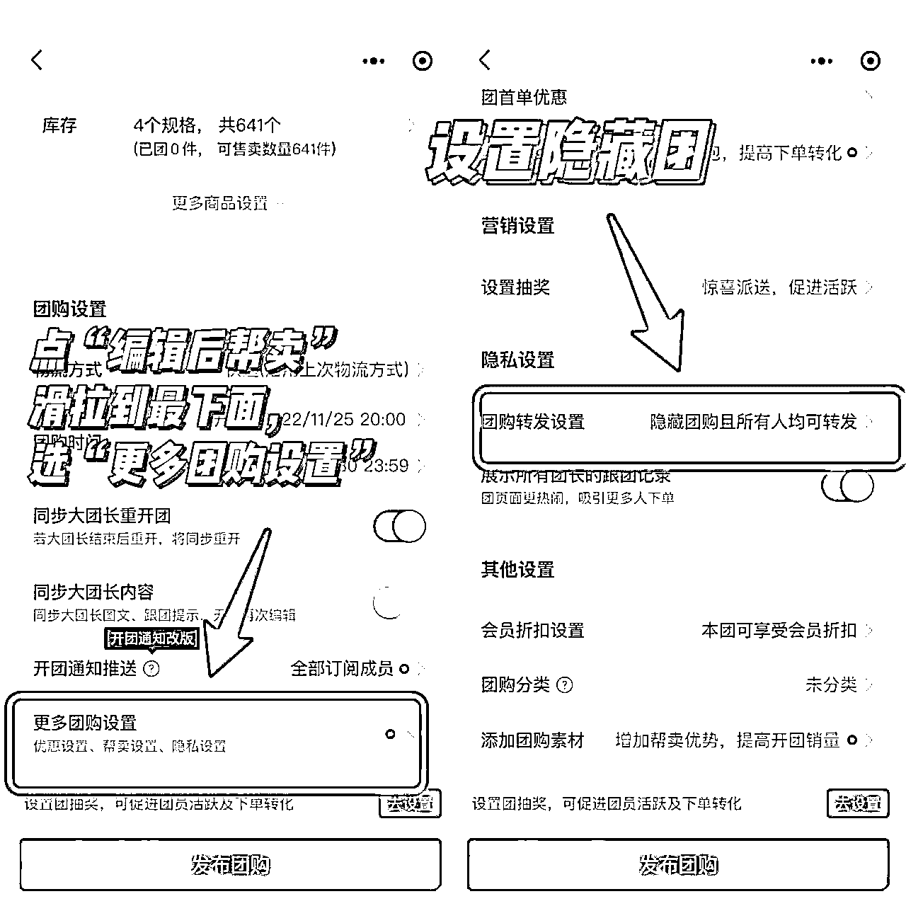

进阶办法：比价佣金关系

这属于是高阶需求了，随着自身作为帮带团长的带货量逐渐增多，是可以去权衡不同团长同货源的佣金比例关系，这不展开，懂得都懂。

⚠️重点提醒一下：

快团上的化妆品一定要谨慎帮卖，假货太多！！即使这个团长的衣服鞋很好，但是化妆品不一定是靠谱的正规渠道，一定要慎重再慎重！

3）如何提升自己的团员人数和跟团人次随着现在快团的发展，很多供货团长为了避免全民帮卖，设置的门槛越来越高，让新团长起步越来越困难。很多小伙伴在经营了一段时间后，想申请更多的团长，但是团员和跟团人次不够，可以通过以下两步来进行数据优化：

a. 闲鱼有刷团员数的（找到后先刷一点，判断是否靠谱）

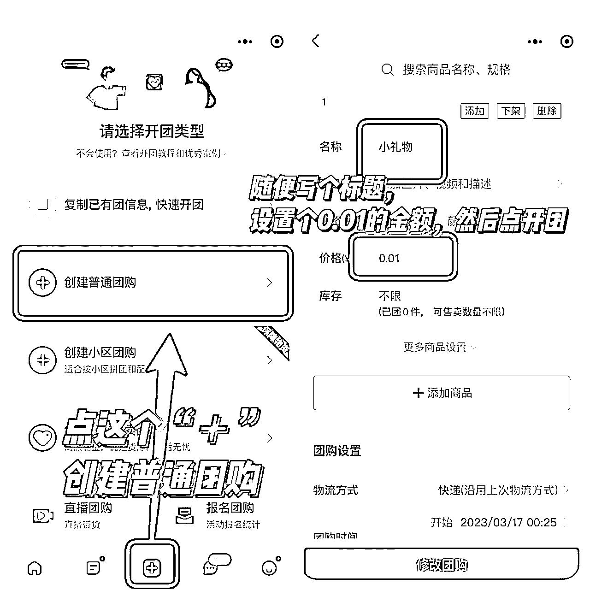

团员 1000，跟团人次 1000，可以申请的团长就很多啦！

内容来源：《新手团长快速“脱白”的几个步骤》

## 2.4 快团团其他功能讲解

「2.2 如何运用快团团进行帮卖 - 基础流程」中，我们主要对开团与帮卖的流程做了梳理。但在实际操作中，我们往往还会遇到一些更个性化的问题。

对官网的高频问答做了梳理后，我们整理了一个问答库，大家可以根据自己的实际情况，点击具体问题查询教程或答案→点击跳转（文末附录：快团团高频问答库）

更多问题解答，大家可以从手机端进入快团团小程序，找到团团学堂。需要注意的是，团团学堂中的部分解答可能过时，如果无法解决你的问题，可以在航海群中 #举手求助（本次航行期间）。

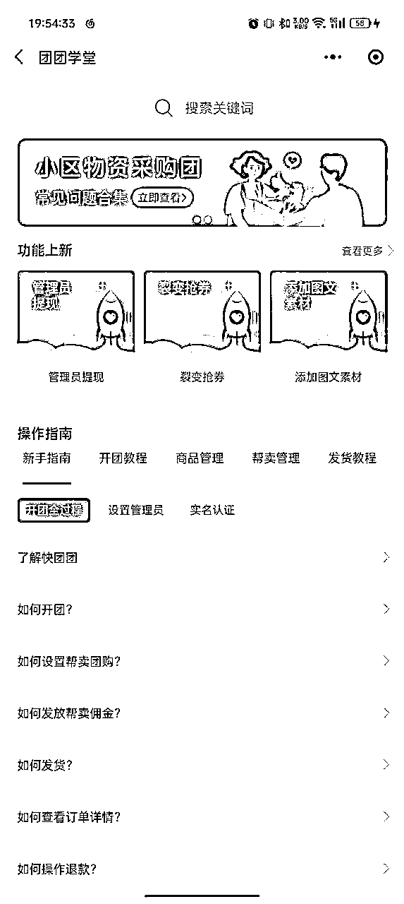

对于自己想问的问题，也可以直接检索关键词，寻找答案：

# 三、如何选择合适的货品

💡

章节概要

选品，不论在什么项目中都是至关重要的一环。选对了适合的商品，同样能让你在快团团中快速打开局面，成交第一单、第十单、第一百单……

对于不同类型的私域或社群而言，选品的方向都有所不同，所以我们集合了正在实操快团团项目的老师，邀请他们从自己的操作中提取经验，复用给大家。所以也诞生了本章节的几大选品办法：

✅如果你是新手，建议优先查看方法一

✅如果你有一定社群经验或选品经验，方法二、三、四、五、六、七、八、九或许更适合你当然，我的建议是，对于下述选品方法，通读通学，其中底层逻辑大多是相通的。看的越多，相信你的感悟越深。

当然，最重要的，是看完之后亲自实操，找出商品库中，最适合你的那一批选品。

## 3.1 方法一：新手团长的五大选品思路 @深藏 blue

选品有很多纬度，主要看这几个：品类（红海，蓝海，复购率）

品牌知名度（认知度和接受度）

价格（高客单价和低客单价，是否有价格优势）

服务（售后）

其实大团长和刚起步的新手团长在选品的思路上是有很大的差异性的，今天我们先讲讲新手团长。

1）结合自身或顾客特点选品

首先，对于一个新手团长，最重要的还是要结合自己的特点，因为新手团长首先一定是从身边的朋友（小区邻居，同事，同学等）来起盘，所以，选品应该要结合自己的特点来看，结合自己身边朋友的需求的特点。

是否为自己熟悉的品类，自己熟悉的品类，自己使用越多的产品，也越容易去介绍产品，发掘产品的特性。

比如自己是一个科技产品粉丝，那么电器类产品可以考虑，如果自己是个美食爱好者，零食类可以考虑；

如果自己是个宝妈，那么母婴类用品就很合适了。

总的来说，现在是个人 IP 时代，团长也是个人 IP，所以一定要思考自己擅长什么，对什么领域了解，这样结合自己的特点来带货，效果会更好。

2）品类选择品类选择思维上，应该要有差异性。大家知道，现在的团购市场，越来越卷，同质化严重，如果和大部分团长做完全一样的品类，面临的竞争也非常大。所以我的建议是在“有流量”的大品类种选择“有差异性的”子品类。

举个例子，我们做进口牛肉，在进口牛肉这个大品类上，我们选择“美国”，“谷饲牛肉” 这个细分品类；如果再细分，还可以选择“牛排”，“火锅肉片”，“烤肉片”；如果再细分，还可以更垂直，比如 “厚切牛排” 。

只要比普通牛排更细分，他就能够满足一些专业用户，他们在普通超市满足不了的需求（超市都是薄切牛排），接着我们再看“流量”，发现“战斧牛排”是一个“流量牛排产品”，这样结合一下， “美国谷饲厚切战斧牛排”就是一个可以尝试的产品方向。

3）品牌知名度品牌就是流量的保证，越大的品牌，认知越高，越容易销售。

但是大品牌又有一个问题，就是竞争很大，所以如果要卖大品牌产品，主要考虑的就是价格，越有价格优势，越容易销售。

作为小团长来说，没有这样的优势渠道的大品牌货源话，可以去考虑一些中小品牌或新锐品牌，比如说很火的空刻意大利面（现在已经是大品牌了）。

不过不同市场是有差异的，还有一些领域，其实品牌的影响力没有那么大的，比如我们的原切牛肉，没有什么特别有影响力的品牌，大部分是不知道国外工厂品牌的，对于他们来说，他们的认识就是安格斯牛肉，和牛牛肉，澳洲牛肉，这样以地域或牛种的区分。

总结来说，品牌对销售来说重要，但也不是那么重要，因为大的品牌能够帮助给你的产品销售助力，但是你必须要有价格优势（或者你能拿到市场难买到的新品，我想这个太难了）。

如果没有品牌知名度，可以从产地、工厂、原料来挖掘，让客户产生认知，你的产品确实不错。 比如麦当劳的“黑安格斯牛堡”，黑安格斯就是通过牛种的认知来提升大家对产品的认可。

4）价格价格对于团购来说是个很重要的因素，大部分人来买团购产品，就是希望能够更低价格买到好的产品。

但希望大家要有避开“价格”竞争的思路，这里的思路很多，我讲 3 个：

做不方便比价的产品，比如新的品类（市面上无法直接比价的商品），比如非标品（定制类商品，特殊产品），像牛肉就是一种非标品，级别不同，饲养方式不同，厂家不同，牛种不同，会导致价格差别。;

寻找一个“比价”的角度，避开产品和产品之间的直接比价，比如我们牛排套餐，在团购重新设计一款与“官方天猫旗舰店铺“售卖的规格不一样的套餐，这样客户就没有办法来直接比较了还有一种思路，就是寻找一个主动对标的产品，比如我们牛排经常会选择餐厅的牛排的价格做对标，同样 500g 的西冷牛排，我们只有餐厅价格的 1/2，品质却完全一样。 那么也让客户的认知跟随我们的思路来走。

高客单价和低客单价产品的选择是个学问，有利有弊，低客单价容易出单，容易起量，但是低客单价客户追求价格，忠诚度不高，高客单价客户更追求品质，一旦产生信任，黏度高。

如果有条件，最好是选择做高客单价产品，前面会难一些，但是后期有了客户群，就更容易做。

5）服务供应商的售后服务很重要，售后的响应速度，退换的速度。在团长的考核标准，尤其是专业团长特别重视，一般都会要求响应速度要在多长时间以内，所以这个在选择的时候要看清楚供应商写的”物流和售后政策“，并要求对方明确确认。

## 3.2 方法二：4 大选品逻辑，做到人无我有，人有我优 @叶子、@佳佳

选品之前，要知道私域用户和公域（淘宝、京东、拼多多、抖音、快手等）用户的区别，私域的用户是确定性的，而非随机性。也就是说，选品之前，你需要先了解你的用户详细画像（性别、收入水平、所在城市、周边商超销售的商品情况等）。

因为你选择的品是需要满足你的客户的喜好，是需要选择其买不到的，或者你的性价比要高于客户平常买到商品。也就是，人无我有，人有我优。

鉴于这点，我们总结出了私域常见公认的几个选品方法：稀缺性、特色性，选择的产品是市面少见的或者特色性强，不选家门口夫妻店遍地都是的产品；

背书强，选择的产品有强的销售数据、渠道背书（山姆、costco、麦德龙等高端渠道背书）、有热度（小红书、李佳琪、东方臻选等推荐），因为私域用户来你这购买，肯定是你的东西比其他地方好，而这一些背书就是证明你的东西比其他地方好；价差大，越大越好，用户都喜欢贪便宜，你所选择的产品，在你这个购买相比官方旗舰店、淘宝等渠道，你的价格越便宜，效果越好；

利润高，售后少，这一点是所有做帮卖的团长格外关心的，因为大家都希望轻松的赚钱，如果你产品售后多，肯定会很烦。

总结来说：

私域选品，围绕人无我有，人有我优。选择的产品需要具备稀缺、特色强、背书强、热度高、价差大、售后少。

除了明白选品思路，对于不同朋友而言，找对选品类目同样重要。

每个团长都有自己的粉丝客户标签，主要可以划分为产品类目团长（生鲜食品团长、日化百货团长、进口产品团长、服装团长、美妆团长等等）、杂货团长、母婴团长等……虽然上述主要是供货大团长的分类，但对于帮卖团长来说，找对自己要做的类目同样重要。

分析清自己的客户群体，才能更明白应该帮卖哪一类货品。

如果你的客户是宝妈，那么产品围绕家庭生活、吃穿住行、孩子为主，因为宝妈对产品的痛点是好用的厨房用具、优质的食材、提高生活品质的装饰品等等；如果你的客户是小区的用户，没有详细区分，那就选择不管男女老少都可以购买的产品、受众群体大的产品，例如性价比高特色的零食等；

如果你的客户是品牌积累客户，那么我建议你一开始选择的产品调性要和你品牌调性搭配的，不要让客户感觉突兀，客户最不喜欢挑战其心智的产品；

如果你的客户是淘系、抖系等客户，也同样产品一开始选择和你店铺调性相关的产品。

任何一个团长想要做好，必须花时间了解、测试出自己的客户群体详细画像。

一开始做私域的圈友，一定需要测试，通过你的分析，选择不同调性、价位等产品去测试你的用户喜好，然后逐步的提升产品的准确性。

## 3.3 方法三：IP 定位法 + 找对供货大团长，确定选品 @102℃De 月亮

选品首先一点要关注的肯定是符合自身 ip 定位。

这边举一个反面案例：之前做供应链的时候，给一个头部宝爸团长介绍了一款大品牌的健身速食鸡胸肉，但是当时忽视了该团长主打的就是无添加，给孩子最天然的选择，不卖任何有添加剂的产品，自然这个生意就没能做成。

同时，选品也要仔细评估产品品牌影响力和开团产品售卖价格与公域价格的比较，特别要注意的是，在很多平台大促期间价格变动幅度大，也会有一些非官方旗舰店价格扰乱市场，这些问题要提前和团友解释好，我们的选品都是官方旗舰店同仓直发，品质有保证。

当然也会有一些品牌临期清货的情况，那么就要在链接醒目多次提醒保质期的实际情况，避免产生不必要的售后问题。

同时，对于帮卖团长来讲，选品还有最重要一点，即选择关注适合自己的大团长，对大团长的选品规则有一定了解，如果能了解到大团长之前的职业背景和一些资源的话就更有助于你评估大团长的供应链。

所以帮卖团长应该加一下大团长的素材群，大团长一般会在群里做一些产品预告、详细介绍、客户好评、素材分发。在群中，你还能挑选你的客户们可能会重点关注的信息，存下来在开团的时候发到群里会给你的团购加分。

那么如何找到靠谱的供货大团长呢？

寻找靠谱的供货大团长需要有很强的识别能力，我们要识别对方的真实实力：

报价有没有水分？

售后处理是否流畅？

……

最后通过一系列综合因素确定这个供货大团长是否靠得住。

PS：为了保障大家在本次航海中的安全与稳定，本期航海，生财官方为大家联系到一些靠谱的供货商大团长圈友来提供货品，希望帮大家快速上手项目。具体名单在开船以后，我们在航海群中给大家推荐。

大家如果没有货品，可以先从他们的产品中选择合适的商品帮卖，出单后你们就可以拿到佣金。

当然，后续更加丰富的供货资源，需要大家去筛选寻找了。

## 3.4 方法四：4 个路径搜集选品 @刘梁

在选择团品方面，我也是下了很多功夫。我自己热爱美食，曾经在家带娃的时候也写过一个美食类的公众号，所以我总是去寻找好吃的东西，分享团购，像是给我打开了一个新的世界，我可以找到全国各地开团的好东西。

在寻找团品方面，我是这么做的：

自己平时在其他平台购买到的好东西，如果品质是过硬的，经得起考验的，那么我会去找卖家，谈团购价开团。

在群接龙平台上寻找，自己试吃，试用，然后和大团长对接，进入大团长的社群，观其言，查其行，看大团长的风格是否靠谱，自己也试着拍几次，看看售后反应速度，如果为人靠谱，东西一致，售后反应迅速，那么就可以试着引到社群里销售了。

有一些群友会提需求的，她们在其他平台上找到了不一样的美食好物，也会要我去找来开团，先有需求，再去找合适的团品开团。

也有一些是朋友和团长介绍的靠谱供应链。

内容来源：《一个转化率 40%的乌托邦式的社群团购是如何做到的》

## 3.5 方法五：用沉浸式体验法找到精准用户画像 @泳怡

讲到选品这块，就有一个很重要的前提，你必须搞懂你的用户是谁。

做销售，从来都不是单向，而是双向付出。搞懂了用户，并且深刻知道用户到底要什么，基本上一卖一个准。

所以重点来了，怎么搞懂用户？也就是我们常说的用户画像。

用户画像在学术概念里，基本上需要用到庞大的数据作为支撑，去提取品牌的用户数据，在电商领域尤为重要，但针对我们超级个体，客户体量没那么大，只要找对了用户画像，完全能做到精细化运营，也能保证复购率。

那怎么找精准的用户画像？

那就是“用户沉浸式体验法”

来，跟着我做，首先你闭上双眼，脑海中先幻想出一个人：

TA 是谁？TA 是男生女生？TA 几岁了？TA 已婚还是未婚，家里有没有孩子（用户的基础信息）

TA 在哪？TA 现在在干什么？（用户的日常行为轨迹）

TA 最喜欢刷什么社交软件，TA 爱看什么剧？（用户的喜好）

TA 是什么工作，月收入多少？家庭资产多少？会住在均价多少钱一平的房子里？（用户的收入）TA 喜欢吃什么？TA 会消费什么类型的品牌？TA 爱买什么？（用户的消费水平）

TA 最近有什么困扰？（用户的需求）

.....

这看起来像一个 vlog，甚至像一幕话剧，这就叫“用户情境体验”

如果你能把用户的一天，甚至是用户的一生，编排成一幕非常美妙的剧，或者一个真实且具体的 vlog，那么你一定能清晰地捕捉用户的想法和情感，再提供正中用户痛点的产品和情绪价值，试问，如此了解用户的人，怎么会卖不好产品？

这里还可以补充一点：

如果你想卖的更好，或者更了解你的用户，那么首先你就必须是自己的精准用户。

我拿我和刘梁姐来举例：

我的用户，是属于 90 后妈妈群体，大部分在 26-35 岁的区间，孩子都处于 0-4 岁，也有部分二胎妈妈，大宝的年龄会大一些，基本上都很活跃，喜欢社交，也很爱买。

有段时间我看到快团有些很好的食材，我就卖了一波，结果发现成交寥寥可数，一看刘梁姐的订单哗哗涨，我就有点郁闷了，到底为啥呢？

首先，我的客户很多都是 90 后，基本上没有几个做饭的，要做也是做宝宝辅食，但宝宝能吃的东西也就是那几样，比如胡萝卜、玉米、番茄、贝贝南瓜、水果这类我就能卖特别好，但涉及到肉类或者其他生鲜食材，基本上就卖不好。

核心关键在于，我的客户很多要么是跟公婆住，要么就是家里有阿姨，根本就不需要自己做饭，家里买菜的费用基本上是公婆出或者阿姨采购，是不会想着网上囤菜的。

那刘梁姐的客户，大部分孩子年龄都偏大一些，估计很多都上小学了，这时候的孩子正是长身体，需要吃很多有营养的食物，所以这类孩子的妈妈都会很关注于膳食均衡，对于食材的要求就会更高。

这个小细节，就能区分出很多的选品品类。

那我卖哪一类产品特别好卖？

关于内衣、服装、饰品、宝宝衣服，零食等，数据都不错

比如我开服装工作室，第二个月流水就过了 20w，最高纪录一个客户单次买了 1w+我的客户有个共性，大家都是 30 岁之前生了孩子，好不容易熬了前两年，孩子长大了，终于可以打扮自己了，于是就在我这里各种下单关于自己能变美、能舒服的产品，现阶段，比起孩子，自己开心更重要一些。

所以，都是妈妈群体，但年龄不一样，所处环境不一样，都有很大的区分，这就是弄清楚自己用户画像的重要性，只有找对、找准了用户刚需，才能事半功倍。

内容来源：《人均复购 80 次的秘籍》

## 3.6 方法六：铺量上品让好的品自己跑出来 @五加皮

常见的一般有两种选品方式：有特别好的、精准选品直觉，一上一个准，上一个爆一个；这个是天赋的事情，我们不讨论，反正我是靠努力，但是我也负责任的告诉大家，努力就是有用。

铺量上品让好的品自己跑出来（🌟这也是我的方式）

每天上 100 个品，是一个合适我们的数字。分哪几个时间段上很关键。

每天这 100 个品是哗啦啦一下上完吗？不是！下面是我们的一个上品时间（和发朋友圈的时间点类似）⬇️

选品+上品时间：

8:00 10 个 （🌟上班早高峰）

9:30 10 个

11:30 15 个 （🌟吃午饭休息）

14:00 10 个

16:00 10 个

18:00 15 个 （🌟下班时间）

20:00 10 个

21:00 15 个 （🌟晚上刷朋友圈高峰期）

22:00 10 个

还有一个关键点，这里存在一个工作日和周末的区别，尤其到了周五晚上开始，到周末，你只有在 22:00 前后上品效果明显，这一点要结合自己的用户群来做测试。

100 个品哪儿来？

找大团长，盲上，好的马上拿货（自己测评，加推朋友圈）

快团团官方商店（多多商品库还有对应的素材群）

别的平台（拼多多、淘宝、抖音）卖得好的搬过来，做无货源（一般人我不告诉他）

内容来源：《私域如何转型做快团团？10 个月一千万，我做对了这 3 件事》

## 3.7 方法七：剖析用户+测品+筛选产品渠道+确认产品 @叶子

1）剖析自己的用户大多数的帮卖团长，基本都是萌新开始的，兼职卖货，或者零散时间卖货，没用一个专业的团队，所以自己仅有的客户，怎么让其价值最大化很重要，我这里不说运营方法，只说产品。

剖析自己朋友圈的客户的消费水平，生活在几线城市、住在什么样的房子、开什么样的车、周边的商场等级，就足够去判断自己做什么调性的产品，判断主流是做常规品、新奇特品、小而美产品、品牌产品、进口产品等，这个过程中不会也不碍事，后续会说测品。

年龄层次和性别，这个特别重要，如果你的客户都是男性、年轻人，建议慎重考虑，因为快团里面的供货团长的产品，基本都是围绕 30 岁以上的女性，如果你的客户群体和快团供货团长产品不太搭配，就很少有产品适合给其帮卖。

2）测品

分析好自己的客户后，大多数都还是存在很迷茫的情况，这个时候，测品就非常重要，一定不要盲目的去选，会消耗掉自己客户信任度。

首次来你团买东西的客户，基本都是抱着尝试的态度，所以让客户试错成本越低的产品越容易成单，一旦成单了，后续的服务到位后，客户就容易发展成你的忠实粉丝，所以第一印象特别重要。

首先推荐大家做生活日用品，一开始测品的产品，一定不要选择什么服装、美妆啥的，一定要换位思考，选择大多数客户都熟悉的品类，生活居家日用品，是前期应该选择的方向。

然后是生鲜食品，这个品类也同样是初次尝试的客户乐于接受的品类，但是务必务必，一定不要选择售后多的生鲜产品（除非供货团长特别专业），一个差评毁了你 100 个好评，一个差评在群里炸锅，会无限放大不良评论。

选择客单低的产品，这同样是降低客户的试错成本，花一点小钱哪怕不满意，心里也不会太难受，同样也不太会影响你和客户的关系。

初次尝试的产品，一定要去比价，正常是淘宝或者线下商超，价格一定要便宜，客户讨厌被欺骗。

最后才尝试穿插一点客单价高、利润好、特别喜欢的产品，来测试你的客户的接受度，其中数据最好的价位产品是以后核心选品的类目、方向。

3）帮卖团长选品原则经历了测品的环节，基本可以判断自己适合卖什么了。

帮卖团长，需要秉着 3 个普适基础原则：

相同品质的产品，你的价格一定要比其他购物渠道低；售后率一定要低！售后率一定要低！售后率一定要低！重要的事说说三遍，售后服务占比了你卖货 60%的精力；

利润好，卖货是一件苦逼的活，一定要让自己快速赚钱，不然很难去坚持；当然，这是适合大多数帮卖团长的普适原则，前文提到的新奇特、稀缺性产品，如果有就更好，但是这种产品太少。

4）筛选产品渠道

A、选品先选择人选择了合适靠谱的供货团长，才能安心的去卖其产品，在这里，我说下对于萌新的帮卖团长的一些很实用的策略：

选择垂直领域的很专业的团长，现在快团的供货团长已经发展成专注于自己垂直领域的产品。

例如：渔乐专业做生鲜、小 Q 米洛等专业做服装等，因为他们这类供货团长服务的帮卖团长，比全国 TOP 供货团长服务的帮卖团长要少，精力相对够，同时垂直领域、产品不差、价格不错。

也就是说，他们能给你提供一个相对产品本身质量好、服务又好的产品。

如果你一个萌新团长上来就去帮卖全国 Top 的，你在他们几万个帮卖团长中得不到重视，产品再好服务不好都是对你的伤害。

明星团长也是相同逻辑，明星团长是处于发展阶段的供货团长，官方认可的团长，他们产品相对要求高，但是下面的帮卖团长不多，服务效率也跟得上。

Top 团长

能成为 Top 团长，其产品价格基本没有问题，一定是最优的，但是其服务速度可能会有一定的延迟。

权威推荐

有一些行业内相对权威的玩家，专门在私域里面玩，他们推荐的一些团长也是靠谱的，例如：生财。

B、供货团长怎么来？

平台推荐有一些行业公众号会推荐一些团长。例如：快团团团长推荐，呱呱爆品，其中呱呱爆品是我常用的快团团分析工具，上面很多团长排名、爆品数据，值得关注（Ps：部分内容收费）

找专业快团服务团队咨询

5）确认产品

A、别人卖的好的产品（跟团数高、转化率高）

快团里面转化率高于 10% 的就算非常好的产品，常规产品转化率一般在 5% 。这类产品，有 2 个优点：

能降低你的试错成本利用消费者的从众心理促进容易开单

例如：跟团数 3 万+ ，转化率 21% ，属于超级牛品，一个月可能快团就个位数。跟团数超过 1000 ，转化率大于 10% ，基本可以安心的去帮卖。

B、差价大，全网最低价，利润好的产品

这点就是我说的选品的普适原则，选择到这种品，可能不一定爆，但是一定不会让客户骂，是加深下单客户关系的产品。

可以安心的去帮卖。B、差价大，全网最低价，利润好的产品这点就是我说的选品的普适原则，选择到这种品，可能不一定爆，但是一定不会让客户骂，是加深下单客户关系的产品。

这种原价 XXX ，开团 XX ，一定是你需要重点选择的，这种产品，一般的客户都无法拒绝，这种产品一般是品牌清仓、或者临期的产品。

C、标题很牛逼的产品这个特别重要，是帮卖团长，尤其萌新帮卖团长选品特别适用的技巧。

上面我截图的几个案例，就是标准标题特别牛逼的，这类产品，客户看了，基本都心动。常见的牛逼标题，客户很心动标题模式如下：原价 xxx，开团 xx；

几折清仓；历史最低价；

0.01 或者 0.1 抢购；

山姆、ole、COSTCO 等同款（这类标题是突出产品背书，容易引起客户信任）等一切让消费者看起来很劲爆、信任度高的产品标题，都是优先考虑的，一定需要减少客户下单的心理包袱。

D、链接内容，前面和尾部的内容很有诱惑力的产品私域或者说快团本质还是电商，就必须遵守电商的基本逻辑，消费者下单大多数只在一个链接停留 3S ，如果前面的内容和后边内容不丰富，这个产品可以选择不卖了。

本着基础逻辑：快团本质还是电商，客户看不到实物，选择的产品链接内容，需要让用户感觉性价比特别高。

内容来源：《从供货团长的视角，来讲讲选品和售后》

## 3.8 方法八：用数据来支撑选品和推品 @小白

首先是人群维度，对我们来讲最重要的 3 个维度是：

用户性别年龄范围

需求维度

比如用户是女性、30～50 岁妈妈/奶奶/外婆、比较关注孩子学习，所以选品会围绕 30～50 岁女性用户的教育需求、生活需求（打理家庭、变美等维度）展开。

然后就可以根据以下三个数据来进行选品

转化率（查看数、订单数）

出单率（最近订单时间排序）

开团时间对应的大家在开团的时候可以重点关注，基本上满足以上任意两点就会开团。

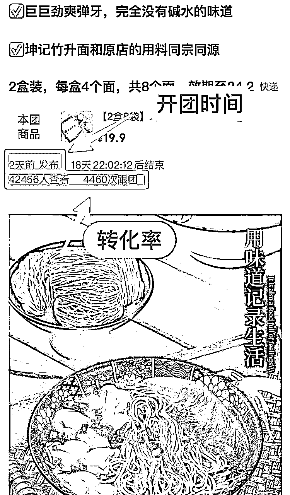

内容来源：《如何用数据来支撑选品和推品，提升用户体验和粘性？》

## 3.9 方法九：人货场逻辑选品 @贾璐 luca

（1）大家应该会迷茫，快团团帮卖，卖什么呢？那要先解决卖给谁的问题

我现有的微信群体的人群画像很集中：中产阶级的家庭主妇需求：家庭主妇没太多事，每天有大把时间，在群里比较活跃，个人没有收入，个体的价值也不高，主要是依附家庭存在，他们的开支主要是家庭相关开支，因此主妇给自己很难花大钱。

但是以孩子、家庭的名义，可以满足自己的消费欲望，也来带来社交价值；收入高的家庭，在日常饮食、刚需消费、家庭教育等高频消费品，往往会选择高品质，高价值，生活方式角度上能带来高势能的东西。

大城市女白领：女白领工作繁忙的多，情感生活有限，个体的价值很强，且非常依赖消费来实现，个体的消费能力也比较强，对于这个群体比更爱自己，在晒单和表现社交价值时，也更在乎对自身价值的烘托，爱生活会生活懂生活的人设是必须的，但是时间又很有限，所以需要一些能快速帮助其提高爱生活这个设定的商品。

（2）根据他们的具体需求，再深挖具体卖什么产品

首先有个词要理解，生活方式，很多朋友对这个概念理解很浅，绝对无非是装逼，但是没有这么简单，生活方式来源于英文 life style，就是生活的格调和风格，结合现在的社交媒体经济，生活方式的意义和价值得到充分的放大。

简单的说，生活方式消费，就是能给消费的人带来格调的感知，有格调的生活的消费，人通过生活方式，成为更有格调的人，成为自己更欣赏，更喜欢，更希望成为的人。

也就因为如此，有格调的消费才有人愿意付出额外的价格，否则大家只想给低价；在今天，社交媒体使得个人的生活方式的价值可以快速折现成社交价值，让发布者站在高地，所以，选品如果在生活方式的角度是成功的，一定能自然激发消费者的分享欲望而不是靠晒单换打折。

当然，这个说来容易，人愿意为生活方式付出的钱是有限的，光有格调不够，所以在选品和定价的时候，追求给买家提升格调的同时，如果价值的感知更突出，让买家觉得占了便宜，才会爆。

比如直播间里的大牌主播，需要先把自己定位成懂的生活懂得美学懂的格调的人，大家接受这个设定后，再看到折扣价，才会把持不住，但是如果对主播不够信任，同样的商品，与主播不匹配，效果也不会太好。

当然不同人定义的生活方式不同，格调也不同，人货场人货场，永远人是第一位的，倾听人的需求，关注人的需求，再来做选品。

因为我小区属于中高端小区，通过长期在群里的交流，我就对于两类目标人群的消费能力和社交价值评估有所评估和理解，进行了针对性的选品和定价。结合这两个人群的特点，水果成了我的首选。

首先，对于女性，水果这个品类，经过多年的教育，已经具备了天然的亲近；其次，水果整体颜值高，具备一定的社交价值；再次，水果是高频消费，三不五时要买；最后，水果店的水果定价很高，有低价击穿的空间和可能。

当然，水果也有一定的不足，首先，水果容易坏，品相和质量问题带来的赔付少不了；另外，水果比较非标，很难保证稳定性，所以这两点也限制了水果团的天花板。

不过，我们先看机会的部分，总结下来，基于对“人”的理解，我作为人货场的“场”，结合我的"吃货属性”，定位了“货”-性价比高的水果生鲜。具体的选品是颜值高，品质高，消费欲望强的水果：葡萄，草莓，蓝莓，高端柑橘等。而快团团只是我的工具。

内容来源：《快团团新手如何帮卖月佣金达到 8 万》

# 四、社群冷启动：如何吸粉、引流建群

💡

章节概要

对于快团团而言，要团起来，需要靠什么呢？答对了，人。本章节我们要解决的问题，就是如何吸引人们成为你的客户。

综合老师们的经验后，我们提炼了以下 8 种办法：

✅方法一：借助私域裂变与朋友圈

✅方法二：创造记忆点，找到特殊品完成冷启动✅方法三：找到种子用户，依托活动裂变

✅方法四：设置群托，活跃社群初始氛围

✅方法五：本地资源积累+混群+做好口碑

✅方法六：公域平台引流+朋友圈运营

✅方法七：线下广告引流✅方法八：在小红书引流

其中，小红书引流是目前公域平台引流中比较适合的一种方式，不少在做快团团的圈友都在小红书进行引流，并且取得一定的成绩，值得一试。

上述 8 种方法的即视感很强，大家一定在各大群聊中见过一种或几种，今天就是跟大家一起了解其庐山真面目的时刻～

当然，上述方法并不独立存在，许多方法都互相交织，有其操作的共通点，比如都要努力活跃社群、建立靠谱有人情味的形象、适当依托活动裂变、注意维持朋友圈形象等……

往下看吧，相信你也能找到适合自己的办法。找到方法后，记得开始自己的社群冷启动哦～

## 4.1 方法一：私域裂变+朋友圈打造，建立高信任度社群，完成冷启动 @刘梁

1） 一开始是亲朋好友，身边熟悉的人。

2） 朋友圈分享美食好物后，有些人购买后，我就会去询问，要不要进群。

3） 群友们会自发拉一些亲朋好友进群，这一步裂变非常重要，因为她们都是精准粉丝。

2） 分享每天团到的团品，当然是喜悦的，享受的气氛

3） 真实的生活分享，有时候也会吐槽一下。让大家看到一个有血有肉有灵魂幽默的我。

4） 朋友圈也会有鲜花啊，健身啊，旅游啊，这些情绪价值的东西，让大家看到一个积极的，热爱生活的我。

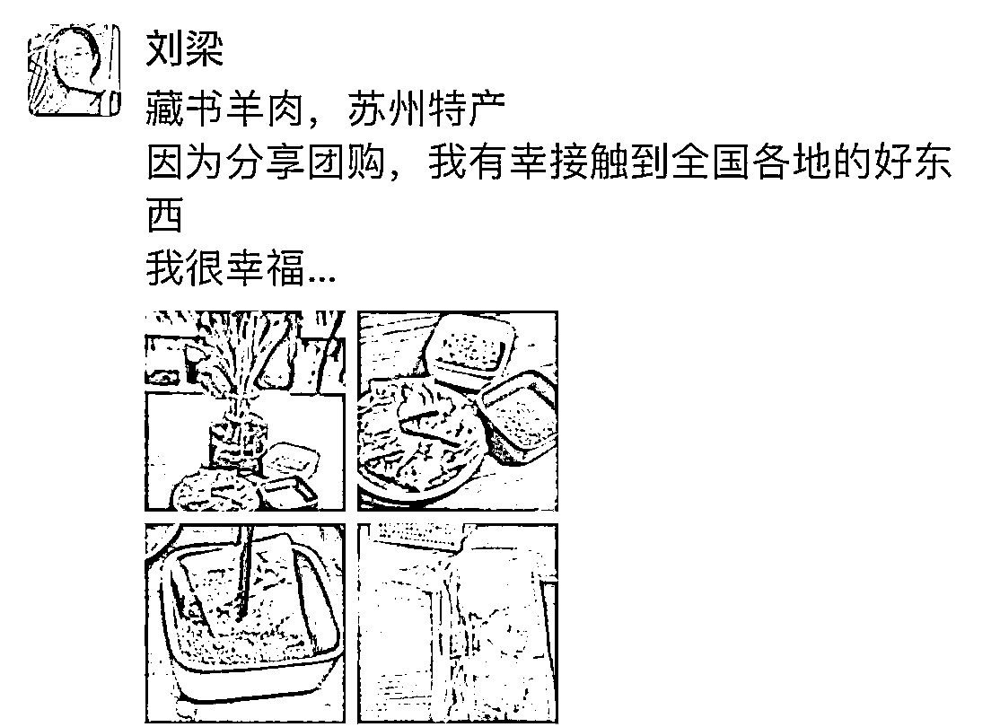

3\. 如何赢得群友的信任和认可？

1） 真诚，还是真诚，真诚分享，好的地方分享，不好的地方也都坦诚告诉大家。

2） 品质，永远还是品质，品质是社群的基石，离开了品质的团品，只能是灾难，所以，在选品和选供应链这块，严格谨慎，毕竟，不好的东西，很快就会在群里传开，臭名远扬了。

3） 责任心，是社群的保障，如果选品不小心踩雷了，一定要积极面对，改售后的售后，改补偿的补偿。譬如有的衣服，供应链不让退换，我就会让群友给我，自己留着穿或者送朋友，不能光想着赚钱对吧，也要拿出一部分做好保障的，让群友知道，即使我在你这里买到的东西不好，也是有人兜底的。

4\. 建立社群矩阵，加大社会联系触角

除了好物分享群，还可以建立其他社群，加大社会联系触角。

譬如我还有 1 个社群是分享学习的，有 1 个社群是断舍离群，还有 1 个社群是专门卖有机菜群的，这些社群矩阵都可以为团购群引流。在那些群里的无私公益付出，也是为我在好物分享群里做了背书，并且团购群里的人都是强链接的，很少有人退群。

内容来源：《一个转化率 40%的乌托邦式的社群团购是如何做到的》

## 4.2 方法二：创造记忆点，两个步骤完成冷启动 @深藏 blue

冷启动是个技术活，主要包括两个步骤：（1） 通过优质的引流品创建记忆点，传播口碑

（2） 找到有需求的客户，建立自己的私域

这里有个核心词，叫做“记忆点”，怎么做记忆点呢？这就是冷启动的关键，这里我认为核心的思路就是通过“好的产品”让别人记住你。

这里的好产品，或者说你的冷启动的引流产品就很关键了。 在团购竞争这么大的情况下，引流产品一定要做到“惊艳”，超出预期，让客户感觉的，在你这里买到了别的地方买不到的好东西（所以在这里一定要记住，不用通品通货来做引流产品，因为这个是没有记忆点）。

那具体来说，什么产品才算好产品呢？举几个好引流品的例子：

（1）有地方特色的农产品

（2）比较难购买的网红产品

（3）有性价比的高端产品选对了好的引流品，你会发现，你不但创造了记忆点，还吸引了优质的客户，

那么引流来客户后，如何搭建私域呢？

建群的方式主要就是两种：一个是线下活动，一个是线上朋友圈。

（1） 线下活动

线下活动，主要是利用一些社区活动来找到一些志同道合的朋友，比如有些小区的主题活动，你可以摆个摊做个分享，然后把有相关兴趣的人放到一个群。

比如找到小区喜欢自驾露营的朋友，建立一个露营分享群。

（2）线上朋友圈

简单来说，就是通过有吸引力的产品或有价值的内容建立一个群，在这个群的基础上扩展。

通过前面说的引流品，让有兴趣的客户入群购买

发一个有吸引力的内容，比如免费课程，免费讲座，免费资料等等，吸引有兴趣的客户进入微信群内。

举个例子：找一个专业的朋友给大家在微信群分享“如何低碳饮食”，这样让有兴趣的人可以进入你的分享群。

建立群其实并不复杂，比较难的是如何运营好群，保持群的活跃度。这点我们后文会讲到。

## 4.3 方法三：找到自己的种子用户，充分利用，完成冷启动与裂变 @叶子、@佳佳

冷启动需要分群体来说，一类是已经拥有一定私域的用户，需要吸引更多客户做增量；另外一类是从 0 到 1 的圈友，想自己做私域，做一份自己的兼职或者一份事业。

如果你已经拥有了一定的私域用户，那恭喜你，你去做增量会容易的多。你需要充分利用你的种子用户，通过活动、抽奖、赠品等等，去让你的种子用户拉周边的人到你的社群。

常见的种子用户裂变方法：拼团，设置 2 人拼团，3 人拼团这种，一定不要多人拼团，引流一定要舍得投入，降低用户的门槛；

分销，开通二级分销，有一些客户乐意把好产品分享出去，然后自己还能赚钱推荐，老用户推荐新用户，给老新用户奖励等等

……

社群裂变方法大多通用，大家可以去自行去网上学习，去选择适合自己的方法。最重要一点：私域的口碑特别重要，好的口碑，会自动吸引很多客户

如果你是新手，想做私域，但是没有一点种子用户，那怎么做？

私域的门槛很高，但是也很低，高在于选品难；低在于什么人都能做，只要努力坚持，一定能做的起来。对于新手，首先需要锚定自己的客户在哪里，大多数的客户一般在小区、写字楼、自己多年朋友圈的积累等。

在这里，我建议大家，小区、朋友圈的客户相对容易起步，因为私域在于半熟人、在于聚集，如果客户粘性聚集不够，私域相对难启动。

这里针对从小区、朋友圈冷启动的朋友们，给一些吸粉、建群的思路：

如果从小区做冷启动，可以找小区的便利店、快递代收点、物业合作，通过他们的影响力，来引导小区居民做团购，而且正常这一些人在小区内都有一定的社群；或者寻找小区内社群的组建者来合作；如果都没有，那就只有最原始的方法，小区内摆摊，采取入群送 XX 这种活动。

从微信朋友圈做冷启动，我相信这是圈友最想做的一块。对于朋友圈，大多数人就胡乱拉群、大面积的朋友圈发广告，我个人认为这个方法效率低。不如采取邀请几个闺蜜、或者几个有一定影响力又有空余时间的朋友，一起来操作。因为建群，需要有人来烘托气氛，需要有铁杆来支持你。

对于微信朋友圈的圈友启动，还有一点也重要，你建立的第一个群的每个群友，一定要经过 1 对 1 私聊下，让他们知道你需要做这个事，降低防范心。

那么找到种子用户并建群后，如何进一步拓展客户群体呢？

大家可以做以下几件事：

1）找大约 10-15 个铁杆粉丝，让其支持你做这个事；

2）发福利，不要发看起来廉价的产品，最常见的是拿水果抽奖送；

3）准备 2-3 个，性价比特别高（用户在你这购买的价格，远远低于在其他地方购买的价格）的产品，让用户直接看到这个群的价值，留下好的第一印象；4）购买商品再送奖品，比如任意购买产品，新群福利送 XX；

5）邀请周边朋友购买，再额外赠送 XX，而且朋友购买同样享受福利 XX；

6）最后一条比较重要，告知大家，本群每天 XX 时间，准时开团 XX 产品，让用户记住你们是干啥的、能提供啥、产品非常好、能为他们谋福利。

很多团长最开始都是跌跌撞撞起步的，但慢慢也能聚集起多方面的资源支持，所以一定要用好身边能发挥的所有资源。

最后，关于吸粉、建群，再补充一点：在现在快节奏的生活下，在消费者选择困难症的情况下，一旦你服务好一个用户，后续这个用户基本就是你的铁杆粉丝。

有一个杭州的朋友，做高档舟山海鲜的，服务了杭州大概 20 几个小区，仅仅卖海鲜，一年的利润在 100 多万。

## 4.4 方法四：埋伏群「托」，定时激活社群，人情味形象更打动客户 @102℃De 月亮

冷启动比较推荐的方法，是让几个自己关系好的朋友先埋伏在你准备好的社群内部，同时制订好社群简介和群规则，在你正式拉人进来的时候可以帮你附和。

同样，你也可以利用提前埋伏在群内的“托”询问大家有什么想要的产品，通过“托”的嘴把你接下来要上架的产品推出来。

当然，也不能一直用这招，不然容易被发现。可以适当地征求下真实意见，或者去找供货大团长选一些他们最新反馈的需求。

同时，建议帮卖团长每天定时在群内抛一些话题激活群，同时用红包来收获一些真实的好评返图，大单也可以适当给一些返现奖励。

刚建的新群活跃度是最高的，所以我们可以利用快团团配套的工具玩法设置游戏，比如说首次下单有新人首单优惠等等让顾客下单，收货后再收集一波好评，第一波启动就没那么困难了。

新人首单优惠教程：

#小程序://快团团/HNSFAEXXfoz4scp（复制该小程序文字到微信打开）

实操举例：团长欣欣最近通过自媒体，引流了一批新人进私域社群。但发现新团员多持观望态度，一进群便“休眠”，迟迟不产生订单。着急看到转化的欣欣，在群里设置发放了新人首单专属优惠券：首单立减 2 元，限制人数 120 人，有效期 3 天。又同步开团了几款低客单价商品，等于几元钱可以买十几块钱的东西，新人们纷纷下单。在一个 500 人群中产生了 109 单新人订单，转化神速。部分新人首次下单就订阅了欣欣，这样每次开团，他们都能收到通知。

【操作路径】：创建普通团购→更多团购设置→新人首单优惠

一定要发朋友圈，不要抗拒或者担心发了朋友圈以后会被拉黑，但是一定要控制好发朋友圈的频率，太多低质量朋友圈会拉低别人对你的期待，也不要纯带货，夹杂一些生活气息类的内容会更有人情味而不是一个没有感情的卖货机器：

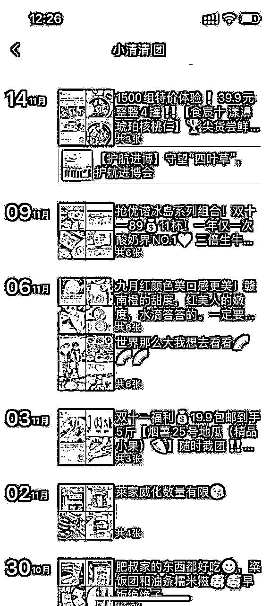

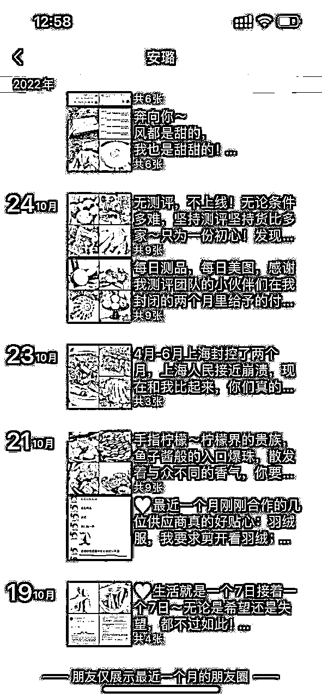

## 4.5 方法五：本地资源积累+混群+做好口碑 @泳怡

1）本地资源积累我的第一批种子用户，其实是我在我的月子中心和孕妇瑜伽学院积累来的，那时候其实没有想过做社群，就每次上完胎教课、瑜伽课，会坐在大厅跟一起上课的妈妈们聊会天，学院也给我们这届妈妈建立了一个大群，一来二去就熟悉了。

月子中心的平均客单价在 5w+，孕妇瑜伽 300 块一节课，自然消费力都比较高。所以大家也可以去参加一些本地的线下活动，通过积极社交去积累客源，但一定要精准。

2）混群

从本地瑜伽学院的妈妈群，又延伸了好几个妈妈群，当时的我也比较有空，喜欢分享宝宝的内容，加上我风格比较搞笑，所以一下子就占了个”社群氛围组“的生态位，而且也比较真诚待人，所以在我建立自己社群的时候，好几个群主都愿意给我宣传，自然也引流了一些精准且有一定信任基础的客户。

那如果没有这么多群，去哪里找？

这里提供第二个方法，在你充分了解用户的消费习惯，你会知道用户喜欢买什么品牌，自然也能在这类品牌会员群里找到你的精准用户。

我举个例，比如我的客户，是属于注重安全、品牌、颜值，同时对价格敏感度低的妈妈，她们都很喜欢一款有设计感但有点小贵的睡袋，均价在 400+，我也在淘宝买了一件，打开快递盒，看到卡片上有一个会员群的邀请，进了群之后发现这里全是精准用户，只要你好好混群聊天，一定能引流一些到自己的微信里。

那要如何混的好？很简单，别让人家看出你是来混群的，就像狼人杀玩的好的狼人，都会把自己代入到平民的身份，自然也会被信任了。

还是那句老话，别人的私域，就是你的公域呀。

3）做好口碑，客户自然来我建群的时候，第一批只有 42 个人，最巅峰到过 800 人，又被我清掉剩下 462 个人。

都是怎么来的呢？我没做过公域引流，也不怎么发二维码到朋友圈里喊人，纯靠转介绍。而转介绍的核心，就是口碑和服务。

在我看来，建群的初始，人多人少都没关系，就算你只有 10 个人，但如果你能把 10 个人服务到极致，这 10 个人就能给你裂变至少 10 个用户，你继续把这 20 个客户服务好，再继续裂变，用户的数量是无法估量的。

只要培养好一百个铁杆粉丝，基本上你是不缺生意的。用一颗真心，把用户服务好，并坚持不懈，你一定能有源源不断的客户。而我就靠着这 462 个客户，做到了人均复购 80 次，我不求多，我就想把这 462 个人都转变为我的忠实用户，已经足矣。

内容来源：《人均复购 80 次的秘籍》

## 4.6 方法六：公域平台引流+朋友圈运营 @五加皮

1）公域平台引流

先说第一个问题，公域怎么导私域？

同样的方法，抖音、知乎、快手、微博、小红书。。。用我的方法，这些平台你一样可以倒过来，因为人性是一样的；当然了，也可以用这套方法把你朋友圈的用户导流到社群。

最常用的 5 个方法：送优惠券

抽奖（我最常用）

折扣

送资源/资料

免费的引流品（比如：送你 100 片面膜；承包你 3 个月的纸巾等）

接下来看案例⬇️

我用了 4 个奖品钩子来引流，分别是：抽奖送英文原版书、送价值 129 元的泰国 Ray（射线）面膜以及 20 元无门槛优惠券，还有英文原版杂志：

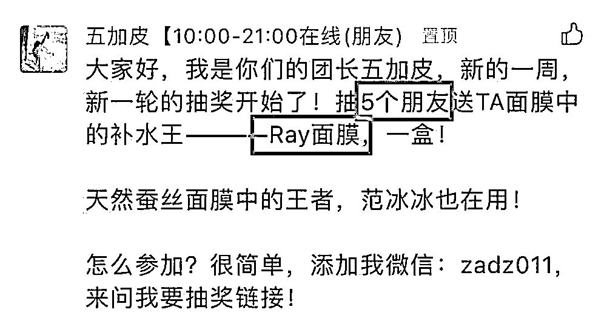

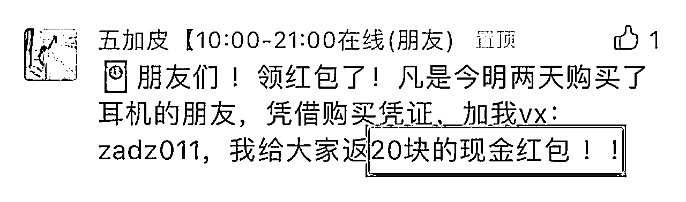

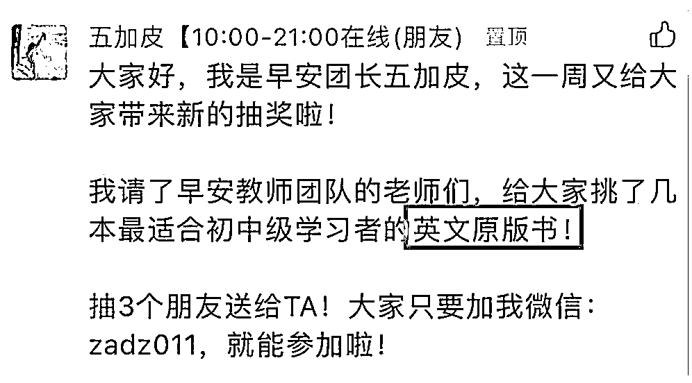

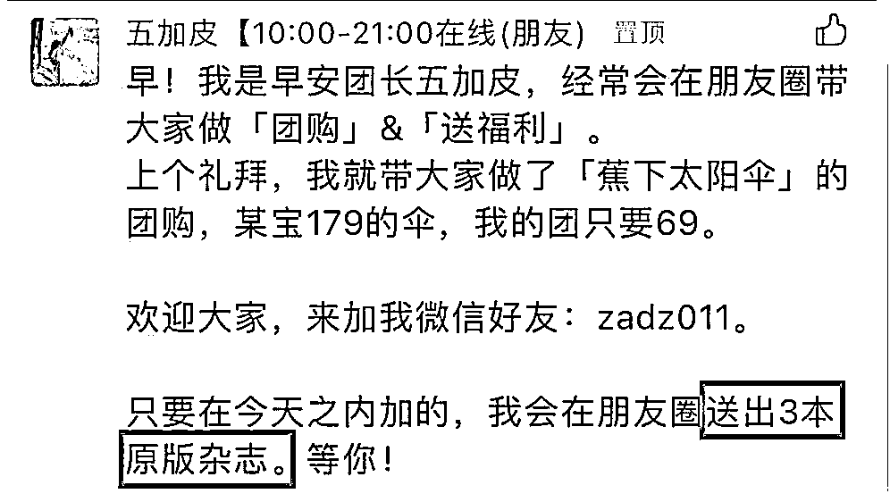

大家猜一猜：哪一个抽奖/引流效果最好？

经过我们数据验证过的：效果最好的就是英文原版杂志和英文原版书，因为我们的流量很精准。

这里我就不多拓展了，大家对自己的用户是最了解的，要强调的是——抽奖的奖品，选品非常重要，直接决定了你的导流效果。

我们目前的情况：每周开一次抽奖，平均每次抽奖可以带来 300-700 订阅，4-600+私人微信好友。

2）朋友圈怎么发第二个问题，我知道也是生财里困扰很多新手朋友的问题——朋友圈怎么发？

大家来做一道填空题：

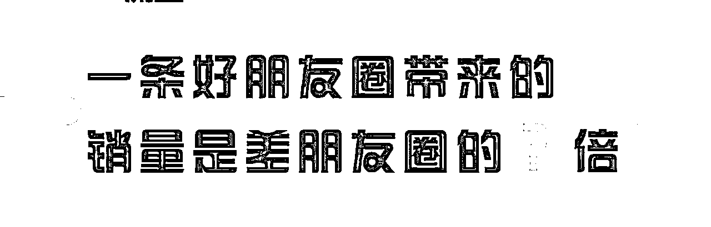

答案是 10-20 倍！

接下来我会从文案、配图和发圈时间来分享怎么发好朋友圈：

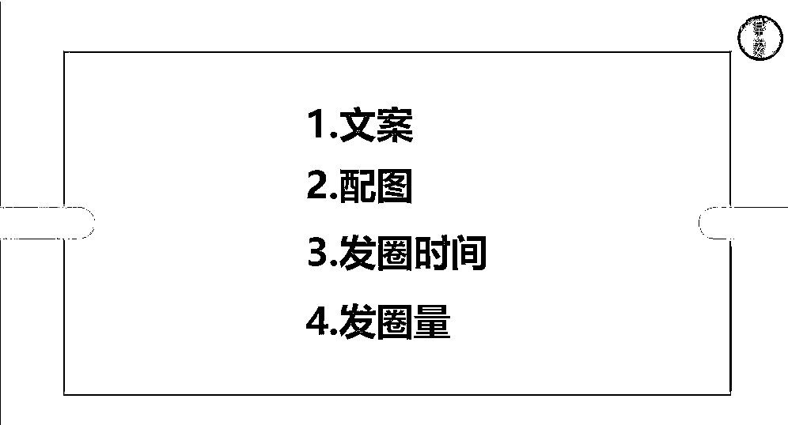

A、朋友圈文案

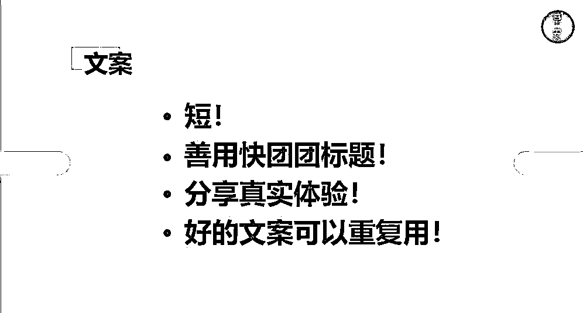

好的文案不需要太长，控制在 4 行，每行 16 个字以内，就不会被折叠，太长没人看，短不是要点，精炼才是。

不会写文案？每个人都有体验，比如你去包子店吃了一个包子，这个包子好吃还是不好吃，你是有感知的，把你的真实体验分享出来，就是最好的文案。

还是不会写怎么办？对于大团长来说，他们都是有专门的文案团队的，标题就是对这个品特点的最好概括。快团团标题复制修改，把重点信息摘出来，把文案变精炼。这一点我推荐大多数人，一是节省时间，二是真的有效，这是一个可以批量化生产的事情。

还有好的文案是可以重复用的，我们的文案都会不定期给文案复盘，做记录，到底哪些文案转化最好。

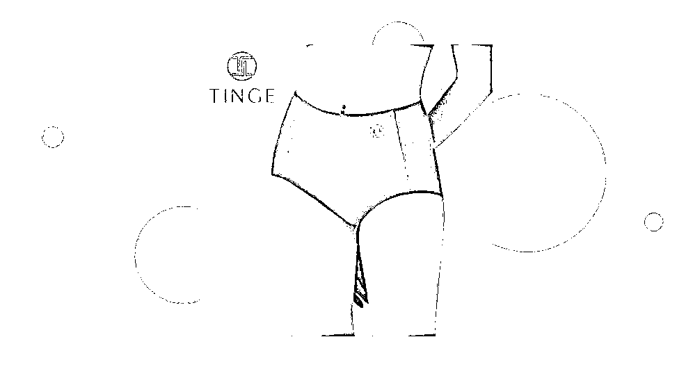

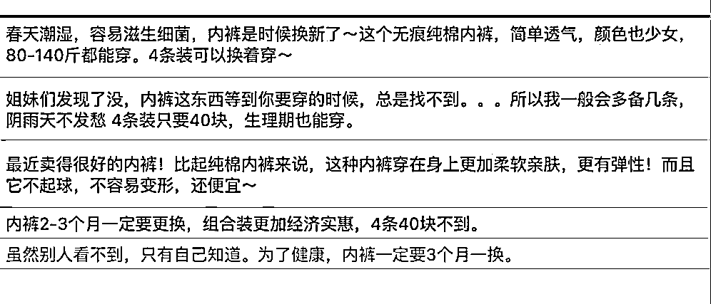

这条标红的关于内裤的圈，我印象很深刻，只要一发这条朋友圈，内裤订单 10+ 以上，而且我会不定期重复拿出来发，我都不需要说“哎我的内裤好啊，快来买吧买吧”，只要发这条文案，带上内裤二维码，就能哗哗出单。

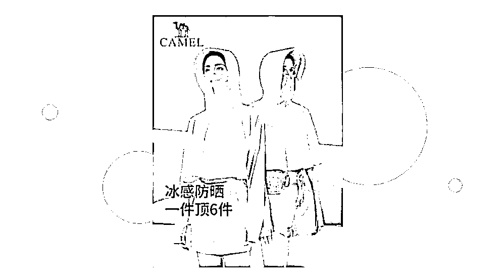

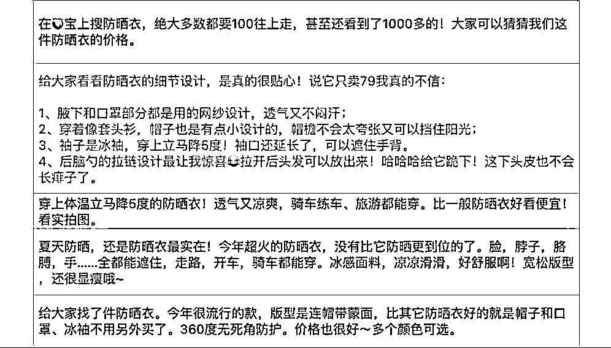

大家可以重点看下这条朋友圈，我圈红的，就是关于体验型文案最好的例子，虽然字多，但是排版上注意列了 1234，显得很有条理；而且它不是干巴巴的体验，它是有情绪的，比如“我真的不信”、给它跪下！

B、朋友圈配图

互动：你们觉得是多图好还是单图好？为什么？（大家都在说多图啊）

这里要分情况：食品类、服装、鞋类强烈建议发多图，而且是好看的模特图、实拍图（ 3-4 张）

日用品类、引流款放单张图（引流款比如 9.9 的紫米面包，一箱，它的优势在价格，凸显价格就够了。)

这些方法都是可以用来批量化生产的，很好复制。

C、发圈时间

关于发朋友圈，大家都知道文案和图片很重要，很容易忽视发圈时间。

互动：你们觉得什么时候发圈好？

这 5 个重点时间段，是一定要发的：8:00-8:30 上班高峰期

11:30-12:30 午饭休息时间 16:00-16:30 肚子饿了，发吃的

17:30-18:00 下班高峰期

20:30-21:30 晚饭后睡觉前，所有人都在玩手机下午四点和晚上我们会集中发食物（不是米粮油，是零食这些）淘宝有个数据，下午四点的时候是逛淘宝高峰期，其中零食又是这个时段搜索最高的关键词。

D、发圈数量

关于发圈量，我们是怎么做的？

我们早 8:00-23:30 ，每半小时 3 条圈，原则是每一个时间段均匀的出现在用户的朋友圈里，多做触达。

很多人怕发多了被删，收到一两个好友提醒就开始担心了，这样发不行啊。你加他是干嘛的？给你朋友圈点赞吗？你是卖货的！不在你这里花钱对你来说就是 0 价值用户，删了不用觉得可惜。

如果不知道是不是对，跟着我做就好了，一定有用，一定要多触达用户，他都看不到你的圈，怎么会在你这里花钱。

总结一下，怎么运营好私域呢？翻译下就是，我每天疯狂发圈，怎么让人不删我？

人设很重要！要利他、要真诚、要解决对方的问题。

我的朋友圈人设：就是一个喜欢抽奖送礼+带着你薅羊毛+性价比好物，会经常在朋友圈分享好看的照片、有趣生活，长得像泰国人的 90 后女生。

不管每天发多少条，别忘了每天保证 3 条私人圈！

内容来源：《私域如何转型做快团团？10 个月一千万，我做对了这 3 件事》

## 4.7 方法七：线下广告引流 @水果小李哥

小区内做线下广告引流主要有两种办法：

一种是直接建水果群。简单直接精准。

另一种建「小区闲置群」，这是刚需，加群的转化很高。因为你是群主，后面和小号配合洗出购买群。另外闲置群有太多变现模式了（这儿不多说偏离主题，反正有用户需求的地方就有钱赚）。

这两种对于某个小区的宝妈来说都是比较合适的。

此外，你还可以和门店 / 快递点合作，北京费用在 100 元 / 月。

和老板利益绑定，作为自提点，按单量分成，这样拉人效率更高。通过多多驿站、美团自提点这种方式来找合作，因为本身他们就在搞自提，也希望赚钱，谈起来更容易。

还有个另辟蹊径的办法，但需要结合具体城市、具体小区的情况来判断是否能这么做。

如果你想引流的某个小区可以帖广告，那么以下是一些小技巧；

如果小区内不允许这个动作，那么是否尝试这个办法需要你自己判断，可以尝试贴在公示栏等地：

1.高层坐电梯上去，一层一层往下贴。低层贴单元楼门口（爬楼太累了），最好在有专门公示栏的地方贴。

时机：周五下午 4 点左右贴比较好

周六日大家有空出来转夏天比冬天好，夏天暖和大家出来转悠；天黑的晚留存时间长。

用喷胶贴，一喷一贴，效率超级高。不要喷的太多，稍微沾上就行（用胶带啥的落伍了）

4.广告文案参考

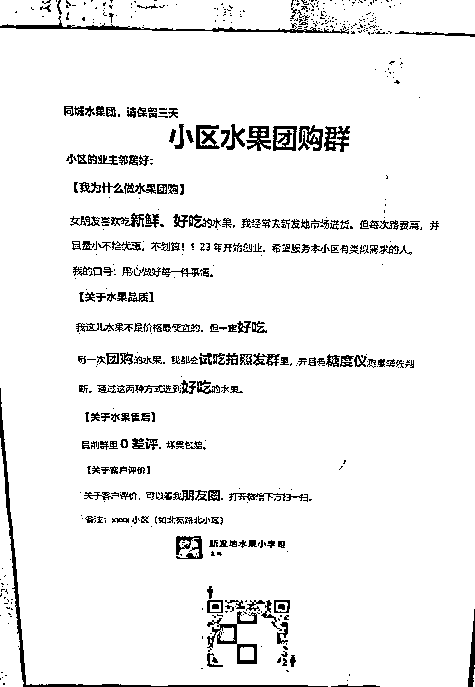

内容来源：《新手做水果团购，首月交易额破 2 万，我是如何从 0 到 1 的？》

## 4.8 方法八：🔥如何在小红书平台引流

💡

这个时代是表达者的红利。这句话可以理解为，每个人都有擅长的专业领域或独特经历，把这些变成内容，就可以成为我们独特的人设、标签，以此吸引同频的人，成为我们流量的原始动力。

目前小红书平台正反馈来的比较快，如果有合适的帮卖方向后，在小红书上进行引流是个不错的办法。所以这里把在小红书引流的方式做进一步展开讲解。如果你想更详细的了解如何制作一篇爆款笔记内容，如何更好的运营小红书，可以到「5 月航海｜小红书运营｜实战手册」进行查阅。

所以大家都可以把自己想要吸引的人群关心的内容，发到小红书上把他们吸引过来，期待大家在小红书公域上找到精准的引流人群。

### 4.8.1 小红书引流实操方法 @张岳

#### 4.8.1.1 小红书引流特性

内容生产成本低

生产成本低，降低反馈预期，容易坚持下去，同时也易于批量生产，增加流量效率。

素人爆款率高

这和两个维度有关，一是和平台本身去中心化程度有关，另一则是和内容领域在平台中的竞争饱和度相关。

目前小红书上个月引流有 1500 人。做了 2 个账号，一个号是记录生活的老号，一个是新号。

老号发的第 1 篇引流笔记就爆了，新号发的第 3 篇笔记爆的，甚至流量还超过了老号。每篇笔记生产不超过 15 分钟，完美符合上述的两个原则。

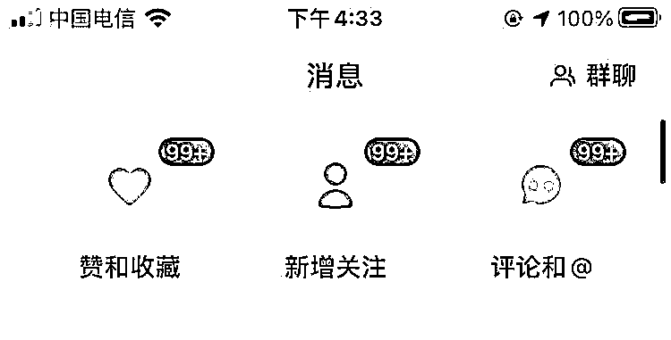

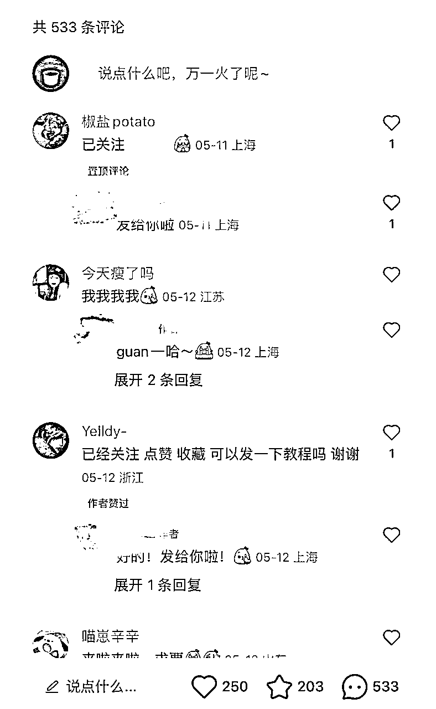

#### 4.8.1.2 挖掘精准钩子

钩子一般为：实物、虚拟资料、信息差渠道/服务而且一定要保证该钩子是平台上有帐号尝试过且有效的。

如何挖掘爆款钩子，我总结如下三点。

基于垂直需求人群越垂直，需求越精准，钩子越好找，相对流量效率就越高。

再举个亲身例子，二月份做中年养生人群的项目，15 天导流了 600 私域。当时起盘前流量侧的思路是，先理解这类人群的关注的是什么，需求是什么，生活模式是什么。

那首先，就需要找到这群人在哪里？我就在小红书上搜养生类的关键词，在热门笔记的评论区里，去看留言的用户。

根据用户头像和留言内容可以初步判断是否符合我的目标，然后再点击用户的关注列表和收藏列表，一页一页过。

初步翻几个用户，就可以整理出一份人群兴趣标签库了：

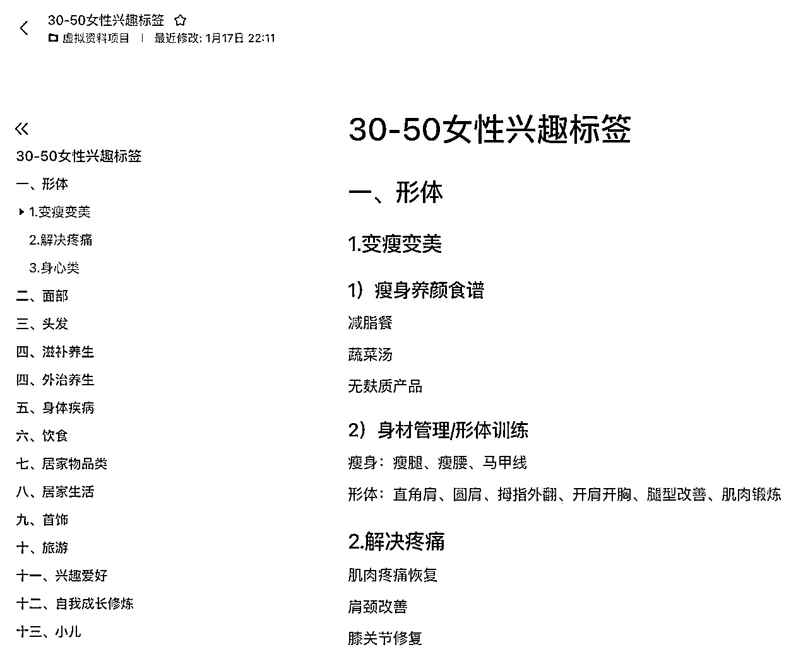

再根据目标用户的年龄画像、后端定位及产品体系，进行更加精细化的筛选，最后决定将艾灸、面部刮痧、小儿推拿等关键词，作为我切入的需求。

而精准钩子，就要从这些需求关键词入手。

基于平台属性

找到需求关键词后，就要根据平台属性制作钩子。

小红书，根据抓住用户关注实用价值这个逻辑，我做了虚拟资料: 全套艾灸课资料+艾灸百问宝典来引流（资料性质的安全性大家需要自己考虑）。

如果想要快速尝试引流效果，可以参考这个思路：本着先销售再交付的思路，我只做了张 pdf 封面图，就放到小红书上去引流了。如果很多用户对钩子感兴趣，我再去做，如果寥寥无几，我直接换下一个钩子进行测试

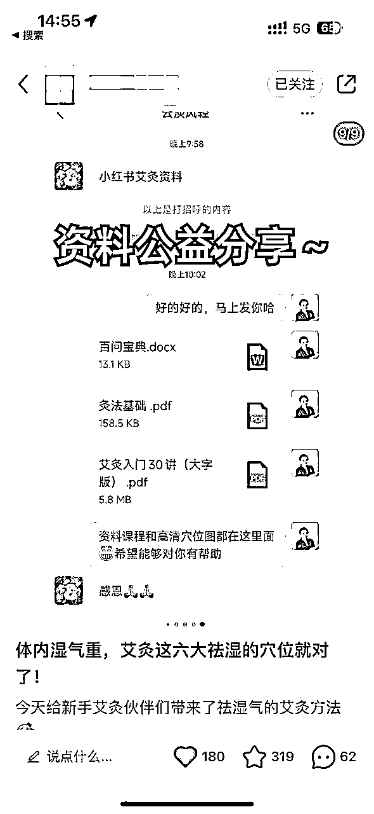

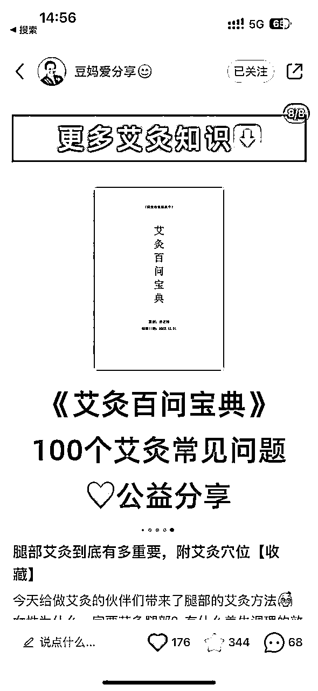

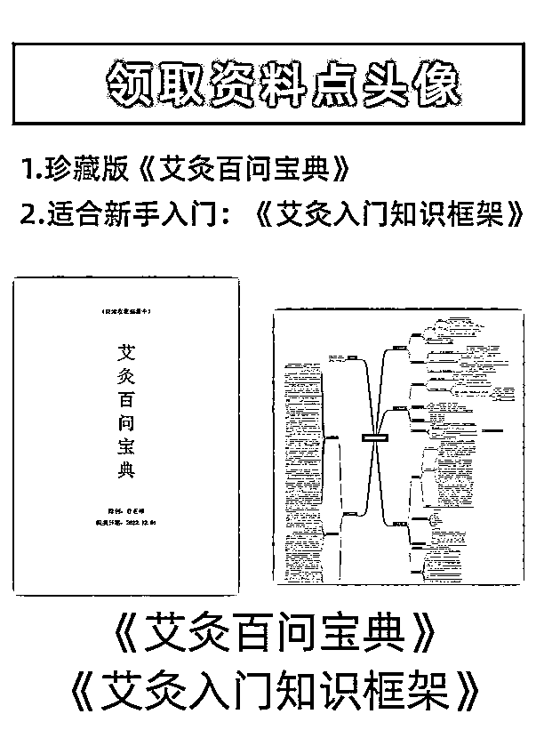

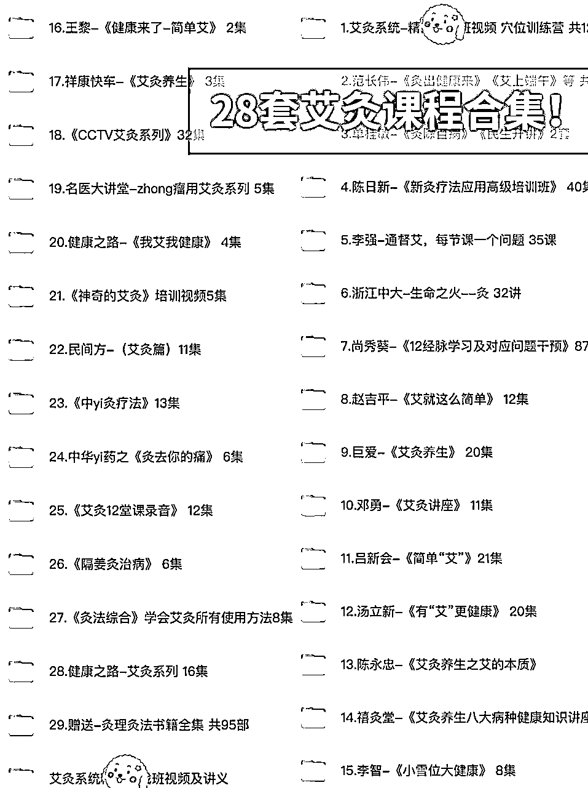

图中这是当时做的矩阵号，大家也看到，测试了很多不同类型的钩子。因为我本身有养生类后端合作，所以艾条是真的低价出给客户，而不是引流幌子。

基于交付成本

当然，钩子的交付成本也是需要考虑的。

如果是实物引流，则要评估引流产品的成本和后期转化的投产比；如果是虚拟资料引流或者是信息差服务引流，则要评估公转私后，承接过程中的沟通和交付成本。

导流一个人，客服半小时，肯定是效率比较低的，越简单的交付流程越好，目前我这边可以做到工具完成自动化交付，人工回一些简单的表情包和话术即可。

#### 4.8.1.3 创造有效内容

准备好钩子之后，就要开始做内容了，视频、笔记或者商品详情。

起初我想起的小标题是，如何创造爆款内容，后来思忖了会，改成了有效内容。原因在于，爆款内容真的不是常态，一味追求只会导致心态失衡，动作变形。

我比较喜欢细水长流的流量，是每天都有，源源不断且流量精准，长期布局下量级也是很大的。只要内容有效，就有源源不断的长尾流量。

持续拆解，持续优化

做好内容大概分为以下 4 点大量收集对标账号

深入分析对标内容像素级别模仿生产

细微创新优化迭代

这部分内容，很多项目的航海手册和精华帖都有提到，大家可以自主学习一下，我们就不展开了。

关键词布局

我想要的是精准的、源源不断、具备长尾属性的流量。那关键词布局，是实现的必要条件。

关键词带来的，就是直接的曝光提升，以及赋予内容以长期曝光属性。

而图片内文字、标题、正文、tag，都会纳入关键词收录，关于这一块生财的小红书航海和很多帖子都有提到。

简单拿当时做的一篇笔记举例，红色标识的都是布局的关键词。而其实，每一篇笔记我都是以关键词为纲，填充内容的。这几个账号已经停了好几个月没更新，但是到现在每天还有精准用户线索。

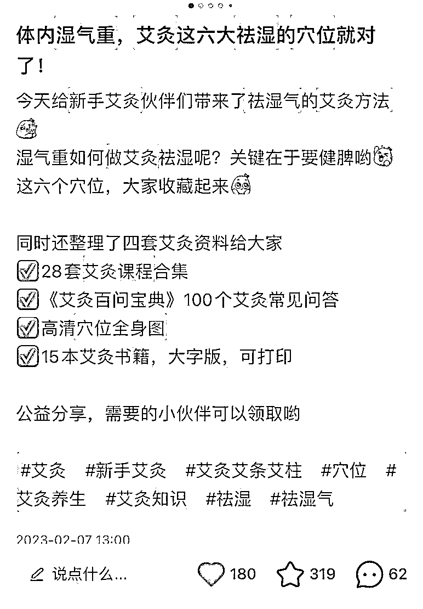

#### 4.8.1.4 放大流量效率

当一旦测试出钩子是目标用户想要的，同时也跑出了有效内容，拿到流量反馈之后，不要想其他了，最重要的事情，没有之一，就是放大流量效率。你不做，你的流量就是同行的。

如何放大，下面有三个思路爆款重复发

第一个思路是爆款重复发。当你有一篇内容有比较好的流量反馈时，就可以重复发了，不是重复 1 次，而是重复至没流量为止。

这里的重复，有两个层面：内容重复、形式重复

这个操作思路具备可行性基于的逻辑是：

爆过的还会爆：在未掌握爆款生产方法论前，只需要记住这点就可以平台查重不严：小红书我自己跑下来，目前对查重不是很严，简单换张图片，调整下文字，基本上不影响流量

矩阵多账号基于前文提到的逻辑，一定要选择生产成本低的引流素材，这放在流量增长阶段的重要性就来了。

当一天可以生产多篇笔记的时候，就可以多个账号进行分发。

加上关键词布局，可以实现的效果就是：用户搜某个词，展开的内容，前几名，全是你布局的账号和内容。

也就是说，你囊括了这个领域多个关键词下，大部分的流量。

有个场景我记忆很深刻，小红书用户私信加我微信，惊呼：我怎么已经加过你了！

用付费撬动流量面对高效的引流素材，除了怼量，一定还要有付费投流的意识。小红书内容加热用薯条就可以了。

一方面，付费投流可以撬动优质素材更大的流量级；另一方面，我小红书账号有段时间被限流了，笔记没有自然流曝光，但薯条还能投。

有一次，我就怼曾经数据最好的那篇笔记投薯条，光靠纯付费流量，也能做到私域单粉 5-10 元。

策略这块，我的方法比较笨，就是对一篇笔记创建不同投流策略，把数据记下来，看哪个 roi 比较好，再不断跟投。

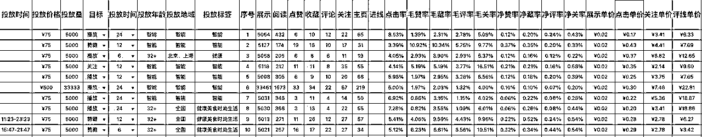

这张图仅供参考哈，是被限流账号的某篇笔记投流情况，除了付费流量之外没有一点点自然流的。

#### 4.8.1.5 重复导流动作

导流动作，需要关注这几个指标：

是否及时：这点单拎出来，因为是影响转化率高低最重要的因素

转化损耗：主要和导流场景（评论区/私信/群聊）、添加理由话术、联系方式的隐晦度有关动作成本：引流动作越简单越好，当流量起来了，你会发现导流是一件很累的事情。tips：可以用讯飞快捷输入法

安全程度：平台对导流动作抓得都很严，需要尽可能规避，找到安全的引流方式，这个生财帖子也有很多提及先给大伙做个心理建设，但凡做导流的，没有没被封过号的。我小红书总共废过 5 个号以上。

废号不可怕，重新起号再做，千万不要因此畏首畏尾，记住我们的目的，是导流，而不是做大号。

#### 4.8.1.6 做好私域承接

私域承接，分享两点。

自动化工具

这点适合每天有一定增量的私域的朋友，流量太少没必要使用，还是精细化运营吧。

早期没用工具，真是忙不过来，白天公域发私信导流，半夜公域流量少了，开始微信通过好友。弄了四天没通过完，导致 300 多好友申请过期，难过了很久。

提醒一下哈，我网上查微信好友申请可以保留一周，但我实测是 4 天就过期了，可能和微信号本身权重也有关系。

后来用了 wetool，自动通过好友+发招呼语+发群链接，直接节省了一半时间。不过需要注意的是，话术千万不能死板像个机器人，不然会影响用户感受。当用户回复你后，可以手动回个表情包或者简单话术。

超预期交付当用户本身被导流时，哪怕是出于某种需求和目的，添加这个动作，也会给用户带来行动成本。

用户可能会觉得有点麻烦，加上双方处于陌生状态，所以这时候一定要破冰。

我的核心策略是：超预期 卖人情，从而创造亏欠+建立信任+塑造人设。

这里的超预期价值，尽量以边际成本低的产品形式提供，譬如会员身份、虚拟资料、信息差渠道等。其中会员身份和权益是非常好的一种策略，可以直接转化用户的心智立场，变成消费者，这点很妙，大家体会一下。

实物产品尽量不要，一方面成本问题，另一方面会让用户养成白嫖意识。

内容来源：《新手小白如何通过公域平台精准导流快团团私域》

### 4.8.2 如何确定笔记的选题方向 @小野

从小红书上引流，出发点是找到大多数人都希望被满足的需求，立足点是干货输出，然后设置钩子引流（想要交流的欲望，或者想要获得刚需的资料）。

那么，如何发现流量的低洼机会？有一些建议：1、想想自己特别需要什么？我们需要的，但网络上又搜索不到的，那可能也是一部分人的共同需求；

2、去看大家都喜欢什么，在大家都喜欢的选题里，有没有可以再做优化、自己能提供更好内容输出的地方；

3、去链接有经验的人，去围观、去请教，看有经验的人是如何做的，再优化自己的思路 。

如果你热爱穿搭且很擅长，你可以做穿搭类内容（形成自己的风格）；

如果你是一个音乐/数学/英语老师，你可以输出相关知识的干货；

如果你是一个金融领域的妈妈，那么你来讲如何给孩子投资和储蓄，一定更加实用；如果你是一个吃货，探店、美食测评、美食分享一定也是你可以分享的生活日常。

做个表达者，流量就来了。

### 4.8.3 如何做笔记内容 @水果小李哥

选题像电商选品一样重要。我的选题分为：干货类（挑水果小技巧）、产品素材类、稀缺内容类。

干货类：比如“挑水果小技巧”话题非常容易爆。我 0 粉账号做到了 1.5 万赞，但是下单人数很少，原因是相关性不大。优点是可以涨粉，粉丝用来背书，还可以提高账号权重。

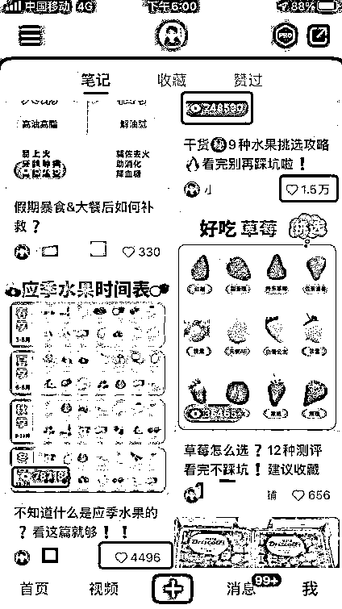

如何写干货内容？

参考小红书已有干货内容 + 加上搜集的资料 + 加上自己认知的加工

其中产品介绍类的内容素材，吸引到的用户足够精准。创作门槛低，靠量怼。可能每个播放 500，但一天发 10 个就是 5000。

素材怎么来？

自己买产品实拍，最好是各个角度多拍几张，分开几天发布。

稀缺内容类怎么做？

找平台稀缺的内容，能让你的笔记持续火爆。

举例：这篇笔记讲关于国外软件，一直有流量进来，因为平台可选择的内容不多或没有时，会推荐你的内容（数据截止到去年）

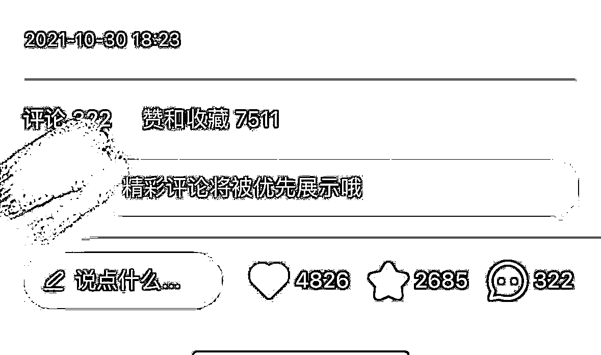

怎么找稀缺内容/词（词代表着内容）

1）在 https://account.5118.com/ 通过一个关键词找相关词、行业热词；通过小红书下拉框、推荐词等等方式找。

2）在小红书搜索对应的词，看他的笔记数量和阅读数，差异大的就是稀缺内容。

如果想要提高效率，我们就可以采用套模版的办法，找到好的模版一直持续发。

如何找模版？

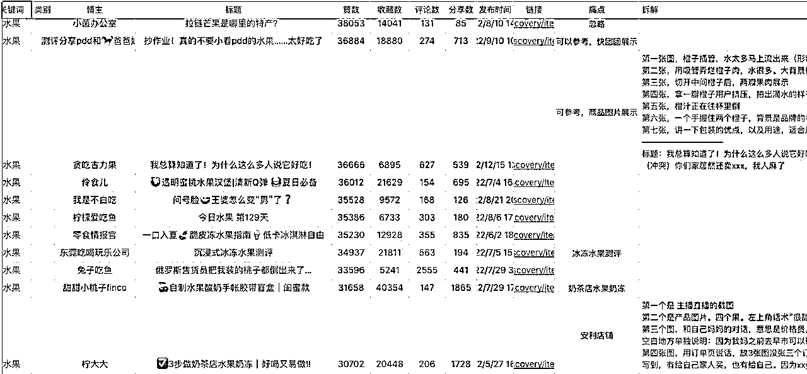

### 4.8.4 如何引流到微信 @小野 @水果小李哥

引流的步骤第一种：建小红书群 ->> 笔记下边挂群 ->> 群里拿小号定时发微信

第二种：个人主页@小号 ->> 小号主页简介引导 “看第一个笔记” ->> 第一个笔记中留联系方式

第三种：对于在评论的流量 ->> 私信对方 ->> 让对方先发自己的联系方式（注意不要一个话术重复使用）

引流的钩子设计有一个最简单的思路是，找同频的人，一起做相同的事。

以生孩子这件事为例，

「要开始备孕了，应该做什么检查？」

「有没有同样备孕的姐妹？来聊聊」「大家帮我看看，这是双杠吗？」……

还有很多不适合小红书直接说的，就在微信群里聊吧。

同理，

有没有人一起拼团？

有没有人一起减肥？

有没有人一起考试？……

当你擅长什么、或处在什么时期，就建立什么样的社群，这个阶段以交流为主，不要有功利心。

### 4.8.5 如何建群 @小野

（1）建群前准备第一，从引流开始，每个人微信我都打上了标签“小红书/备孕”，这为发朋友圈做基础；

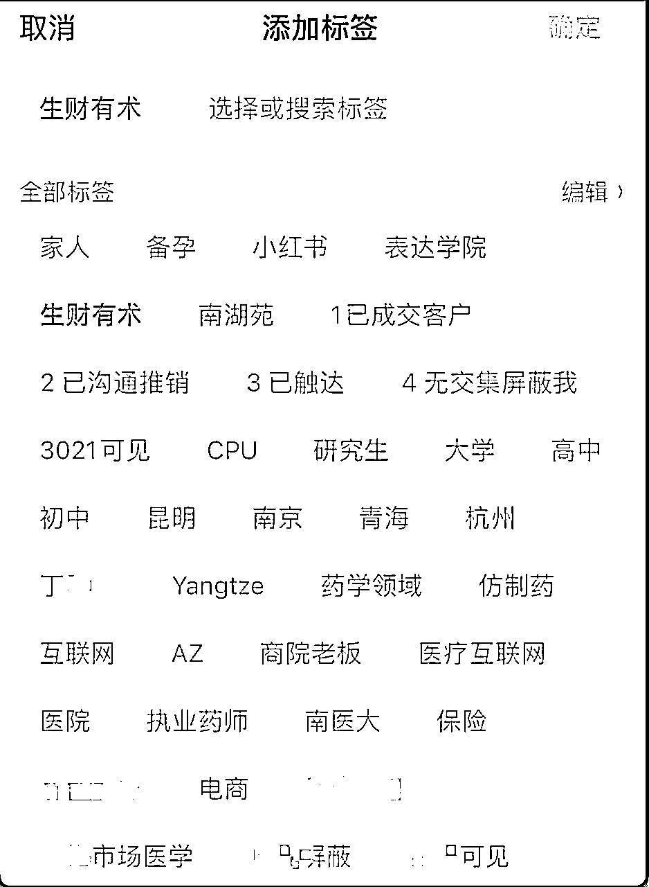

第二，转化之前，建好了群，写好群介绍、群规则等，甚至后来我还做了团购主页的品牌 logo，更有专业性；

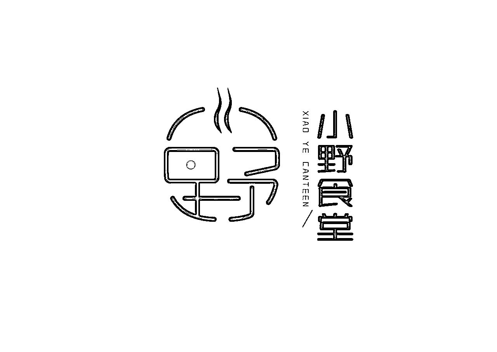

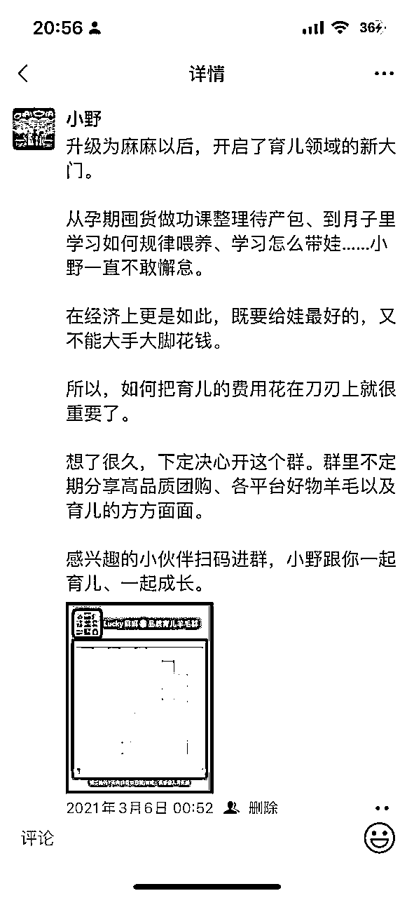

（2）群邀请：一对一沟通邀请、每个群都设置触达和转化的钩子

由于有很好的信任基础，我一对一发消息，跟对方说明，我也建立了一个团购群，如果对方感兴趣，可以来玩，大多数姐妹都是会进群的。

此外，因为我有好几个孕期交流群，就可以做群之间的转化。这样，我建立的几个社群都联动起来，不浪费。

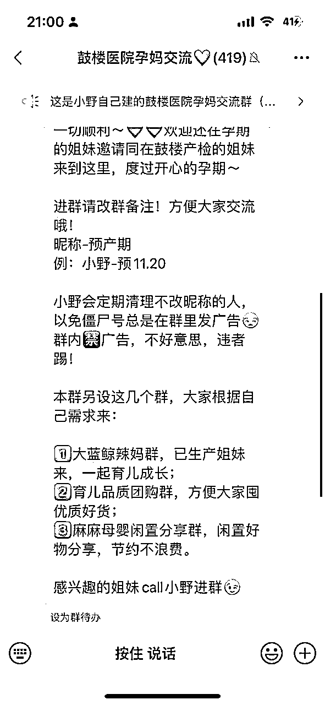

（3）群裂变：真诚和口碑才是王道

团购群新建立时，大多数人会观望一段时间后才下单。

不过当有过好的团购体验后，姐妹们开始主动邀请她们自己在的其他育儿交流群的人进团购群。实际上，后来主动裂变的人数是超过前期的硬广拉新的。 因此，我的总结是，想要实现群更大的裂变和价值，真诚和口碑才是王道。

内容来源：《新手做水果团购，首月交易额破 2 万，我是如何从 0 到 1 的？》、《作为职场宝妈，我如何从小红书引流并做到百万营业额的？》

## 4.9 方法九：如何在公众号平台引流 @小野

我是 2014 年开始运营公众号，已经近 10 年了。

曾经运营的公众号领域都比较垂直，2015 年运营的订阅号主要服务药企客户，1 年多时间从 0 到 2w 粉丝，后来给市级政府做过公众号服务号从 0 到 1 的全套策划运营，现在主业里也带团队运营了一个近 2w 关注的肿瘤患者服务号。

公众号口号和愿景是「再小的个体，也有自己的品牌」，是非常鼓励原创优质内容的。如果你本身想要建立自己的 IP 或品牌，同时也想要引流，强烈建议你把公众号做起来。

公众号的流量来源包括搜索流量、推荐流量以及与视频号、问一问等联动的流量。其中，搜索流量的权重考量因素包括点赞、在看、收藏、互动、转发以及浏览时长等等。微信搜一搜也是一个非常好的搜索引擎，可以带来很多流量。

2023 年公众号是流量非常好的平台，很值得做起来。另外，推荐流量是今年的一个新机制，如果是一篇原创的文章，只要你发布文章时允许被推荐，那么就有被推荐的机会。

### 4.9.1 微信体系内的超强链接能力

公众号在微信体系里有非常强的链接能力，它可以链接整个公众号体系内的所有功能。

在发布文章时，你就可以选择与小程序、视频号、以及橱窗带货等功能联动起来，也就是说，你可以在公众号体系内与其他板块相互导流。

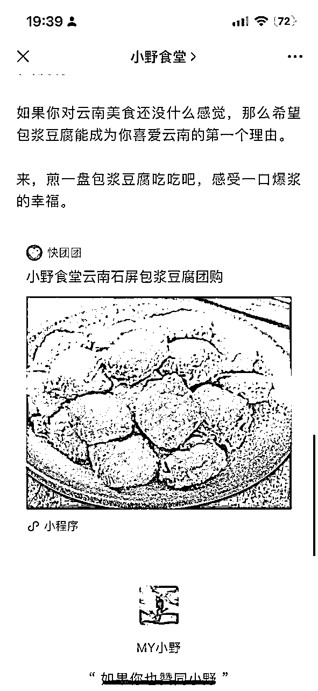

另外，公众号与微信最新刚出的「问一问」也可以很好链接，从问一问引流到公众号、再引流到私域，非常丝滑。

在「问一问」功能里，需要你以公众号或视频号的身份来回答问题，当你的回答足够的精准，有观点，有趣，被其他用户看到之后，用户可以第一时间去点击你的公众号、关注你、进而加到你的微信，路径非常通畅。

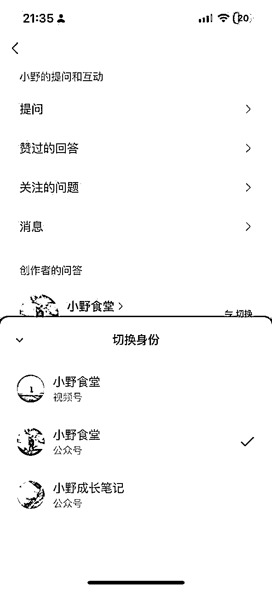

### 4.9.2 公众号如何留钩子增加关注？

公众号也不能仅仅引流，也要增加关注粉丝，才能持续把好内容触达用户。

公众号涨粉的核心因素是持续生产有趣有价值的内容，让用户能够愿意去关注你。一个特别有用的技巧是，文章里跟用户做互动，设置一个跟文章内容有关的福利或者有价值的资料，在文章里做回复特定关键词领取的动作指令。

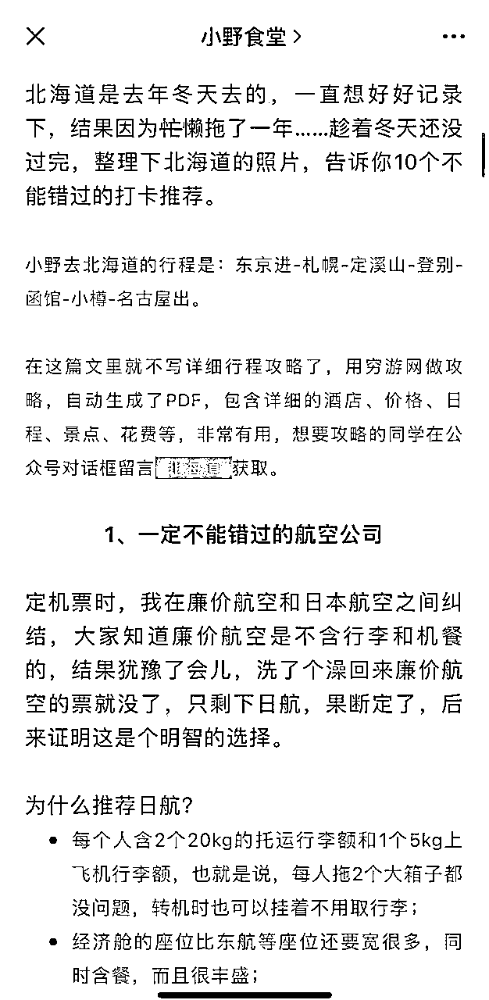

那么用户想要回复关键词，就必须先关注，才可以在公众号对话框里回复，这时候就带来一个涨粉的动作。紧接着，如果你是

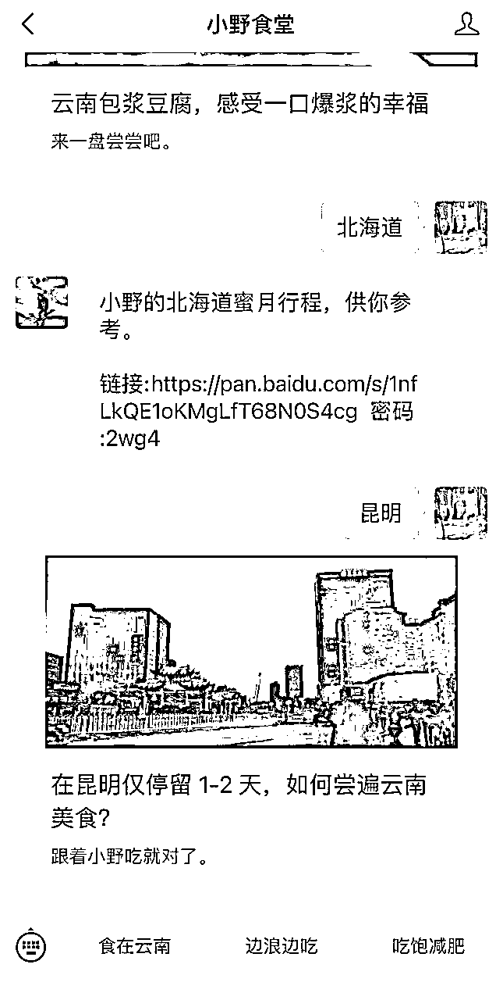

### 4.9.3 公众号如何留微信号？

公众号是所有公域平台里留微信号引流最畅通无阻的，有这几种方式：

文章里留微信号

公众号文章末尾是直接可以放微信二维码的，这是最直接简单粗暴的。但不建议每篇文章后面都放，引流气息有点太重了，用户可能不喜欢，除非以利他的方式，留微信号的同时，让用户知道加你有什么价值。

关注自动回复

首先第一个触点是关注自动回复，关注回复的招呼语中，就要放出来你的微信号，留下线索，让每一个关注你的人，可以第一时间找到你。

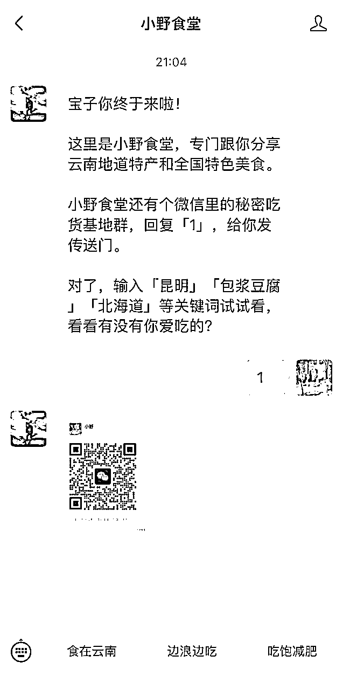

菜单设置触点

菜单是很重要的触点，如果第一时间用户没有加你，时间长了以后他找不到刚关注时的招呼语了。那么菜单里就可以设置一个

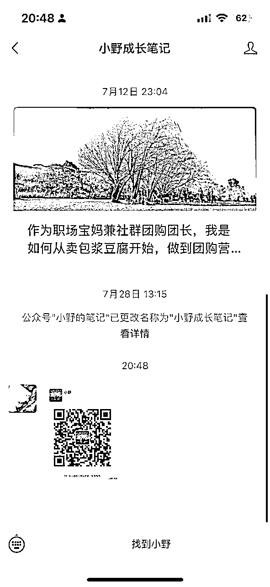

无论通过以上什么方式加上好友后，记得做一个大方、真诚的自我介绍，引流进入你的团购群，成为你的客户，然后用心地为他们提供产品和服务吧

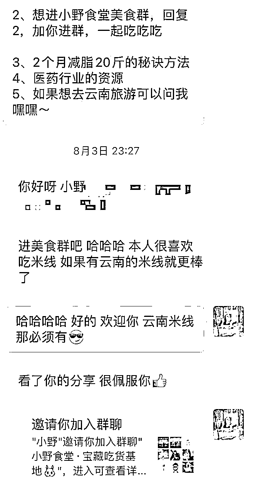

## 4.10 方法十：线上社群的私域引流 @小野

### 4.10.1 自建主题交流群

围绕特定用户需求建群或群矩阵围绕某类精准用户的需求和周期，是可以建很多种主题交流群的，比如围绕母婴这个群体，从备孕群、怀孕群，到妈妈交流群以及二手闲置群等等。

这样做的好处是，满足了用户的不同阶段的需求，无论用户成长到哪个阶段，都在你的生态圈子里，那么相应的购物需求自然也是会找你的。

以母婴社群的搭建为例，我是通过小红书引流，形成了从备孕、怀孕、孕妈到团购群的群矩阵。

备孕群最早用小红书就是因为备孕，想要找人一起交流，仅是发一个记录自己经历的帖子，就可以吸引到同样在备孕的姐妹，这批好友成了后来一起经历孕期生活的好姐妹，甚至有的孩子都同年同月同日生。

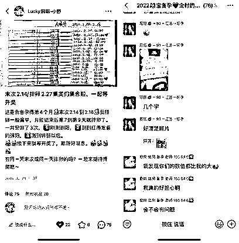

同城同医院的孕妈交流群我在生孩子之前，发现鼓楼医院竟然没有官方孕妈交流群，于是我发了一篇小红书笔记「南京鼓楼医院助产士才会告诉你的待产注意事项」，就这一篇帖子，帮我建了一个近 500 人的鼓楼医院孕妈交流群。后来我的母婴团购群，就是这样建起来的，孕妈交流群里大多数人，后来理所当然地都成了我母婴团购群的客户。

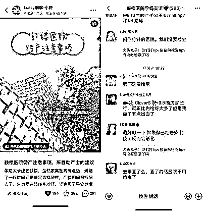

育儿群

孕妈交流群生产后，自然就继续到了育儿群里，或者也可以继续从小红书引流。

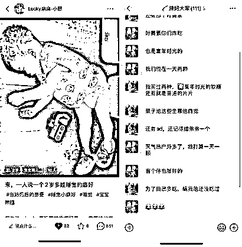

团购群

自然从前面的交流群矩阵引流过来，也可以在团购群里通过活动做裂变。

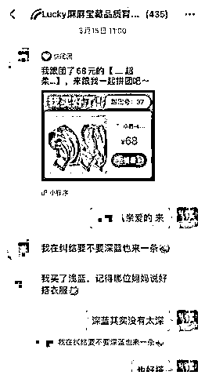

交流群与团购群之间如何联动引流

当有了自己的群以后，怎么引导到团购群里呢？

第一种方法：做一个正式发布，以真诚的分享，在群里告诉群友，你要做一个团购群

分享时，一定要讲清楚，为什么要做团购群、自己有什么优势/背景可以做好这件事、可以为大家提供什么价值和服务。通过真诚+利他+自己核心背景优势，也可以加上引流品和抽奖，以此完成团购群的初始流量冷启动。

大多数情况下，用户是不会排斥群主做这件事的，就算有人排斥也没关系，这也是个双向选择的过程。

正式发过一次另建团购群的分享后，可以把这件事挂在日常群公告里，本来的主题交流群在运营过程里，只要有人进群就需要再次发公告，那么就有人会看到你还有团购群这件事，感兴趣的人自然会找你进团购群。

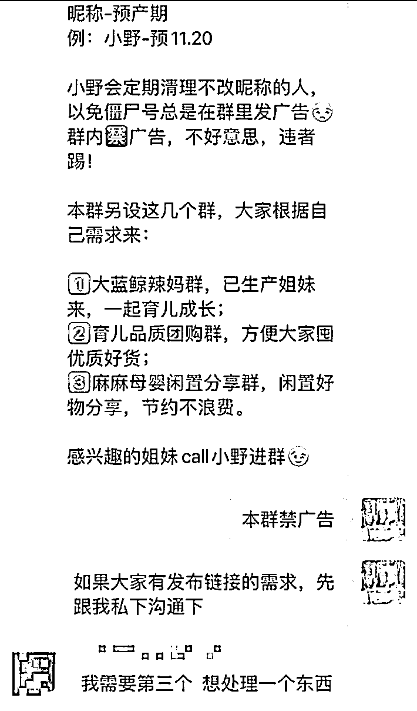

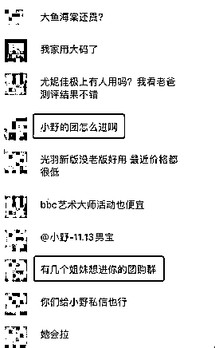

### 4.10.2 和群内成员建立信任

前面一种方法是自建主题群，的确是要花时间和心思的。

如果你暂时没有精力去自建群，可以通过「混群」的方式引流加好友，这里说的「混群」是一种利他的行为，在群里展现自己并提供价值，绝对不是那种无脑加人的爆粉方式哦！

思考你要进入哪些群

小区群，做生活、美食团购，最容易「混」的就是小区群，而小区圈子也是做团购的最好土壤；

行业群，你所在的同行业交流群/校友群等，一定要好好链接你的同行，未来同行可能成为你很优质的客户，例如我 vip 客户里，有很多都是以前同行业的小伙伴，究其原因，因为相同行业、所以信任度更高；

兴趣群，包括学习群、育儿群、同一个品牌车主群等等，通过小红书、微信、豆瓣等等通过关键词搜索优质内容，一定可以找到跟你兴趣或经历同频的社群。

如何在群里体现自己价值可以加到好友

在群里定位好自己的角色：氛围组、干货组、红包组

氛围组：可以使用夸夸大法，多夸群主/活跃成员/社群小助手等，跟发言同学产生互动/回应，然后再大方加好友，可以做一个为别人鼓掌的人，让人喜欢的人。

干货组：在群里积极做学习笔记，分享给大家；跟群主处好关系，也可以自荐当嘉宾分享专题内容，或是参与话题讨论、输出知识点，亦或是分享个人技能和生活经验。不要害怕，但凡你愿意分享的，一定都是有价值的。在群主允许的情况下（提前沟通），可以留引流的钩子，让别人有兴趣主动加你。

红包组：这适合于大多数人，进群发红包介绍自己，如果领到别人红包，主动感谢等等。

加好友时，如何让对方有好感

帮助：群里看到你有 xx 困惑，资料可以分享给你；

感谢：感谢群里解答 xx 问题，希望有机会多多交流；

表扬：刚刚/爬楼看到你的发言，收获很大，想你学习；期待：看到你也在 xx 城市，期待更多链接和交流。

加好友后，请做一个大方的自我介绍，否则别人根本不了解你，更别说后续转化为客户了，可以简要真诚地介绍自己，我是谁、我在做什么、我可以提供什么资源、我需要什么帮助。

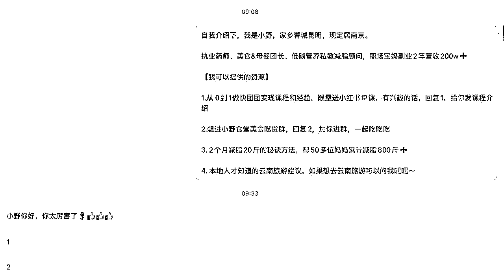

要特别说明的是，可以通过上述方法引流的社群最好是你生活圈子里的社群，例如小区群、校友群、妈妈群等，如果是你加了某个付费社群或购物群，请一定尊重群主，未经群主推荐，不要随便加人哦！

最后，不要小看泛流量的力量，每天加 3 个人，一年下来你也可以加 1000 人。加人时做好自我介绍的话术，邀请对方进团购群，或者通过朋友圈运营，吸引好友加入团购群，长期坚持下来，转化率也是不可小觑的。

# 五、如何做好活跃社群

💡

章节概要

社群建立起来了，如何维持其长期良好发展，就是我们接下来要关心的话题了。

本章节中，我们综合了几位老师的活动经验，以及部分门店私域的玩法，为大家提供了以下「打造活跃社群」的路径：

✅方法一：打造乌托邦社群，树立优质人设

✅方法二：注重群消息构成，促进下单

✅方法三：打造社群规则，维持稳定社群

✅方法四：参考门店私域玩法，通过活动烘托氛围✅方法五：把握社群活跃时间，事半功倍

✅方法六：高复购率海王模型

✅方法七：饥饿营销+刺激购买+同类对比

✅方法八：社群里的内容分享同样，一种方法并不单独为一种方法，它更多是一种活跃社群的思路，希望能给你更多启发。你也可以在各类方法中寻找适合自己的，开辟出新的社群组合拳。

当然，社群运营中也需要一些规则，这便是我们在本章节最后说的「运营禁忌点」，希望能帮助大家少走弯路。

来吧，开始活跃你的社群，助力社群团购。

## 5.1 方法一：打造乌托邦式社群，转化率高达 40% @刘梁

我的理想是，建立一个乌托邦式的社群，在这个社群里，你所需要的好东西都可以找到，你所有的问题可以得到回应，你买到的任何东西都可以在群里和大家分享讨论，而且社群里的东西价格要比公域的价格更划算，任何东西不满意都可以得到妥善的售后。

社群团购天然就带有解决大部分购物痛点的属性，而我在这个基础上，为达到一个理想化的乌托邦式的购物场景，又做了一些改进和升华，具体我是这么做的：

1） 构建社群文化，每天早上，我会给大家发一首诗歌和音乐，和一幅绘画，让艺术滋养人心，人在世上，唯有爱和艺术是最美好的东西，我们要享受艺术，享受爱，人生意义不只是赚钱和奋斗，在爱和艺术的滋养下，我们的人生是兴致勃勃的，也是精神饱满的。

2） 每个人在群里的反馈都会得到回馈，无论是好评和差评，都有人回应，而且允许群友分享差评的东西，告诉其他人，这个东西不能买，真实的反馈，让每个人都得到了尊重。每个人在群里的精神是自由的，无忧无虑的。

3） 大部分团品我都自己亲测过和比较过，保证团品的品质。亲测的过程中发现了大量优质的，物美的东西，这样也有底气分享给群友了。

4） 群里每个人都可以分享自己的生活经历，健身心得，去过的好地方，吃过的好东西，在这个群里，大家都是朋友，亲人，强关联的关系。

5） 所有团品如果不满意，都可以得到售后，我也是很真实地告诉大家，做团购我是有一点利润的，我愿意把利润拿出来，给大家做好售后保障，所以，所有团品退货，是可以报销运费的。很多人退了货后，不收我的运费，我就会告诉她们，这是群规，大家都要遵守的。

6） 控制价格的竞争性，让大家感受到物超所值的喜悦感。

这样运营了一阵子，大家越来越喜欢我的社群，很多人买到好东西后，又自发地分享给身边的亲朋好友，或者拉她们进群。我心里非常感动于大伙儿对我的信任，于是又在群里执行了这样一个抽奖方法： 任何人邀请朋友进群，我们都会抽一个奖，来欢迎新朋友进群，手气最佳的，可以得到一份奖品，奖品选择在 30-40 元之间的爆品。

为什么不是直接给拉群的和进群的群友发奖品呢，我是出于这么考虑的：

因为是乌托邦式的社群，我们崇尚顺其自然，要真的发自内心喜欢，才拉朋友进群，如果用奖品的鼓励，来鼓励人拉人，事实上是违背了初心了；

抽奖让进群的人感受到一种仪式感，而且觉得自己很重要；

群里热闹热闹，让大伙儿都喜欢新朋友进群，有机会抽到奖品。这种发自内心的欢迎气场很重要。

长此以往，群里的人越来越多，越来越多，从去年 10 月份一开始建群时候的 100 多人，到现在的 400 多人，大部分都是人拉人进来的，有时候，我也会清理一些群里的人出去，譬如从来不发言的，从来也不参团的，或者连红包都懒得抢的。

内容来源：《一个转化率 40%的乌托邦式的社群团购是如何做到的》

## 5.2 方法二：3 类群消息构成组合拳，活跃社群的同时，促进下单 @深藏 blue

群里每天发的信息是需要提前规划的，主要包括三种：

每日发的产品购买内容

引发群内互动的内容组织活动的内容

以美食群为例——第一种：每日发的产品购买内容

我会做的不那么生硬，不是简单发产品介绍，而是告诉客户我的选品逻辑，比如西冷牛排，我会讲为什么我会选美国极佳级别的西冷牛排，原因是因为这是上海高端餐厅选择率最高的产品，然后这个级别有和牛的品质，但价格只有和牛的一半。这个时候，你的选品思路就有可能打动客户，只要再加上合适的价格，就能触发购买。

第二种，群内互动内容

这个是内容目的是引发客户的互动。比如我会问，这个新的牛肋条有没有人用空气炸锅做个，能不能分享下，这个时候，可能就有客户会分享，你就形成了互动，这个的关键就是让用户自己来发内容，有段时间，我特别做了优质内容奖励，如果有产品体验分享，我直接红包奖励。

第三种，活动内容

群内定期要做一些活动，活动要有仪式感和趣味性，利用人的心理。

比如我曾经做过一个膨胀金活动，规则是今晚 12 点首发新品，大家可以支付 10 元定金到我的账户，第 1-2 名支付 10 元，10 元可以当 100 元使用，第 3-5 名，10 元可以当 50 元使用，第 6-10 名，10 元可以当 30 元使用。

活动效果非常好，因为大家都看不到别人支付的情况，所以利用人希望博弈的心理，可以起到很好的作用。

## 5.3 方法三：7 条规则，做好稳定社群 @叶子、@佳佳

其他行业社群一般是分享知识、课程等，而快团团社群特别简单，是最最落地、接近大众的社群，所以一定要摒弃那一些高深艰的晦涩词句。

1）做好社群定位

你的群名字一定要简单明了，例如我们是元宇宙供应链，会给上海很多小区提供物美价廉的产品，我们就会这样取群名：元宇宙供应链#上海万科#XXX 家园团购群。

这样起名，有这么几个好处表示自己是一个正规的团购，不是散兵游勇，让大家觉得放心；

上海万科，拿他们做背书，再打消客户的防备心理；XXX 家园团购群，就是归属感了，让用户觉得这是我小区，那么我肯定相信支持。

2）社群设置群规，禁止发一切和产品不相关的内容，发现就踢出群

很多社群为什么大家不愿意说话，因为里面什么垃圾内容都有，对自己没有价值，肯定不会活跃了，所以告诉大家，我这个群只有一个目的：以后买好东西，来我这就够了。

做好以上两点，社群基本就活跃了一半，接下来是具体一些卖货社群的活跃方法。

3）找好铁杆粉丝，培养一些 KOL

社群内活跃起来，一定需要有牵头的人，有 3-5 个铁杆粉丝，会带动其他的群成员活跃 4）定期开团，不定期活动

定期开团，让群成员知道什么时间这个群有好产品了，去记住这个群，不定期活动，是让群成员没事多看下这个群，不要错过什么活动。

5）邀请有礼

群成员邀请新的伙伴进群，偶尔发一发红包，这一块根据成本来控制。

6）鼓励群成员晒单好评

和一些忠诚度高的客户保持粘性，让其把产品好评都发到群里，刺激大家消费。

7）不定期换血

当你社群满员之后，一定要把不活跃的群友踢出，新的血液特别重要。

## 5.4 方法四：参考门店私域活动运营方法，烘托社群内团购氛围

1）活动预告确定要做的活动后，可以在在朋友圈里、群里发布活动预告，告诉大家 xxx（几月几号几点）会有红包雨＋优惠活动。

2）红包雨＋烘托气氛

在距离活动开始之前的 10 分钟，开始陆续发红包，把大家的注意力引导到群里，防止有些用户把活动的事情给忘了。

等到了活动开始的时间，连续发 5 个红包，且每次的红包金额都是逐次递增。这里大家要注意，红包金额不要太小，且个数也不宜过多，确保能抢到的人有获得感，没抢到的人有期待感。

连续发 5 个红包后，开始用小号在社群里烘托气氛，比如发一些“群主也太好了吧”，或者“终于抢到了，第一次抢到这么大的红包”等等。

温馨提示：注意控制成本。

3）公布活动＋引导话题当社群的气氛起来之后，你就可以公布你的活动或者团购商品了。

多数情况下，当活动公布之后，大部分用户其实是沉默的，用户都在观察，卖货社群就是这样，需要有人第一个站出来引导情绪。所以，小号这个时候就该出场了。

根据参与活动的人数，你可以用 2-3 个小号，或者更多，提出不同的问题，注意不要太刻意。而且，小号不能连续说话，A 提出问题后，可以稍等一会，看有没有其它用户咨询，如果没有，等群主回答问题后，B 再继续问。

这里要提醒大家，小号千万不要说出这些话，都属于太刻意：这个活动太好了吧，我赶紧购买一个。

这是真的吗？也太优惠了吧，比如之前看到的便宜不少。

我能多买几个吗？真的太便宜了。

以上这些话术，用户一看就是假的，瞬间就会对你的活动产生质疑和不好的感觉，也许就会退群或者大众在群里指出“有托”。

正确的做法是提问，提出一些针对此次活动流程，或者产品/服务的细节问题，我给大家几个话术模板。

问下群主，xxx 在此次活动范围内吗？

如果我买 xx 份，在能在 xx 的基础上再打折吗？

截止日期后，我要是购买是什么价格？

4）实时解答＋订单接龙

当社群中有人提问时，一定要通过 @他的方式来回答，一个是让他时刻把注意力放在群里，另外一个是防止问题多了，大家不知道你在回答谁。

这时，如果有社群用户点击商品链接，鼓励他晒单并且接龙，以刺激其它用户的购买情绪。

怎么让用户晒单？可以额外给他一些福利，具体就看你的活动设置与成本控制了。

一般来说有以下几种办法：

晒单再多送一个超值赠品购买 x 个并晒单，可以在原有优惠基础上再打折

晒单赠送一个商品会员，未来购买其它商品还可以打折

5） 库存更新＋倒计时最后要注意，你的活动一定要有限时和限量，否则你没办法在群里制造稀缺感，没有稀缺感，订单接龙这个动作就没意义了。

当订单接龙数量达到你的限量一半以上，或者活动时间距离结束还有一半以上，群主就可以说“还剩 XX 个名额了/举例活动结束还有 XX 小时，想要购买的朋友要抓紧了”。

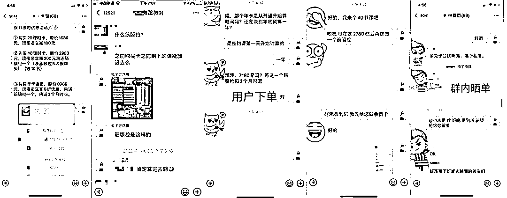

6）小结总结一下，你需要记住以下几个重点：

一定要提前预告，留出足够的时间去触达用户，引导进活动群。

快闪群里的小号，一定要准备好，如果快闪群用户较多，最好多准备几个用户话题引导，否则一旦冷场，很难挽回局面。

操作顺序：发红包→发布商品/活动→小号引导→用户下单→群接龙晒单→实时公布库存和活动时间 这个顺序要记牢。

内容来源：《门店私域运营｜小航海学习手册》

## 5.5 方法五：把握社群活跃时间，分享产品真实反馈，活跃社群事半功倍 @102℃De 月亮

每天上午十点半到一点半、晚上六点半到十点半是社群活跃时段，具体为什么？你可以想想你上班下班后这个时间段是不是摸鱼或者是最放松的时间。

在这个时间段内在群内分享产品、晒好评通常能够事半功倍。

群内分享自己对产品的真实感受会更加分，我一直强调社群团购是在私域中销售，绝对不是几个公域平台的商详图就能让顾客

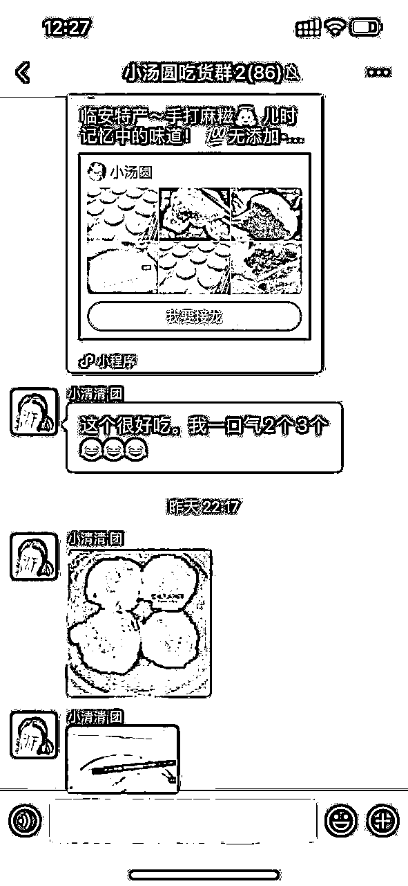

## 5.6 方法六：高复购率海王模型 @泳怡

说到高复购，那就是我的独门秘籍了，这套方法，我也亲身践行了两年多，不仅卖货赚了钱，还给我的个人品牌积累了很多粉丝，总之，现在泳怡这两个字，在我的用户心里，基本是金字招牌了。

那我是怎么做到的呢？我总结了一个方法：海王模型，简称：跟用户谈一场浓烈且漫长的恋爱。

为什么叫海王模型？我们要跟众多用户谈恋爱，自然就是海王，并且还要成为中央空调，逮谁暖谁，让客户对你欲罢不能，产生依赖性，直至上瘾，一天不看你朋友圈就难受。这也叫做习惯的力量。

当用户思考什么，下意识会找你，不再主动思考，形成条件反射的时候，习惯就养成了。比如我在我社群的标签叫做：无所不能的乐妈百货商店，所以她们在买东西前都会习惯性来群里或者私聊我。

这个模型有四步：吸引--接触--甜蜜--投入 1）吸引

首先，你要通过不同的触发去吸引用户，比如外部的触发，是物美价廉的产品，是朋友的推荐，用户认识了你，你也进入了用户的生活。

那内部触发就很关键了，比如你的人格魅力，你朋友圈散发出来的能量和磁场，比如在用户需要情绪价值需要陪伴的时候，你或你的社群是否能让她感受到温暖。

我继续来举例：我朋友圈的头像是海马体拍的艺术照，一打开就是灿烂的笑容，微信签名：超厉害的女人，所以客户加到我微信的第一印象，就是很真实且有能量。而我的朋友圈，经常会发一些小作文，抒发人生感慨，三观正到客户连连点头称赞，基本上我的形象已经稳稳立住了。

再回到社群，我除了卖货，还做知心小姐姐，只要是产后抑郁，不开心的，来社群聊天，我都会尽我所能去疏导，有我带头，加上社群其他妈妈也乐于助人，感同身受，所以久而久之，社群里也变得温暖了，大家也养成了习惯，遇到困难或者不开心的事，第一时间来群里聊。

从建群开始，我都以”姐妹“相称，无论是言语还是行动，但这简单的两个字，却让社群里素未谋面的用户，彼此间也有了姐妹之情。

比如有一次，有个客户在群里说遇到了棘手的问题，另一个身为检察官的客户，立马帮她看了卷宗，事后我去谢谢她，她只跟我说了句，大家都是群里的姐妹，不用客气。

一旦形成了吸引力，那基本上你在用户的内心就占领了一席之地，俗称占领用户心智。

2）接触

光是吸引还不行，具体得落到每一步行动，我也称之为服务行动。当用户跟你进行了交易，从被吸引到下单，再到收到货，这条服务链路非常关键。一旦做不好，前功尽弃。

假设一个情景：今天，你的用户，正好想买个好穿的瑜伽裤，看到你这里有，于是就下单了，收到货之后，有两种情况：

①很好穿，很满意；

②怎么跟宣传不符啊，要退货。

这两种情况要怎么处理呢？

满意的状态：

用户收到货，可以适当追踪一下，预计收到货后，主动去询问对产品是否满意。

如果客户很满意，你可以来一句，感谢亲爱的支持，这时候你也知道了客户有做瑜伽的打算，那就去小红书上找找关于瑜伽的注意事项，发给客户，并简单附上几句关心的话语，最后不忘说一句：使用过程中有任何问题随时联系我呀，我都在，保证把售后处理好，让你满意。

不满意的流程：

客户收到货，不满意，立刻启动售后流程，先问清楚用户哪里不满意，拍照、拍视频搜集证据，同步去跟厂家反馈。

这一步非常关键，也是很多人做错的地方。在客户不满的时候，千万不要在此刻跟客户论对错，先跟客户共情！

你觉得你的产品绝对没问题，但客户却认为不好，没关系，那你就跟客户一起骂厂家就是了：“哎呀！这厂家怎么回事！之前他推的品都不错，这个瑜伽裤也挺多好评，我就想着也是好穿的，真是抱歉啊亲爱的”，这时候再来几个哭泣的表情来卖个惨。

如果你是客户，这时候也会觉得这个团长也不容易，是厂家的问题，不要怪他了。

接下来，你只需要走正常的售后流程，反馈给厂家-争取退换货，即可。

这里跟大家分享一个我的售后服务原则：千万不要被眼前的小利益困住，要往长远看。

比如这单售后，是真的有质量问题，那没问题我负责到底，来回运费团长只报销 6 块，但客户只能找到 10 块的快递，那没关系，我来补差价，并且会单独补一个小红包给用户表示歉意，让她舒服。

那如果是客人主观认为不喜欢，供货团长也不给退，在金额可控的范围，我会自己买下来，尤其是针对第一次下单，正在建立信任的用户，其他比如经常光顾的老客户，我自然也会，毕竟只是少数。

我试过一单只赚 10 块佣金，却因为售后，自己多花了 100+ 原价买下来，但没关系，在我眼里，跟客户长久的信任关系比小钱重要，只要客户一直在我这里，我迟早会十倍赚回来。

但注意了，如果是纯粹薅羊毛和挑剔的用户，我是不会给第二次机会的，好的服务也需要底线。

总结：

其实对于快团团，我们并不会占据”独家“的优势，所有的团长都卖一样的产品，包括文案、图片也一样，甚至有些团长还会自降佣金给你打价格战，这时候，我们就一定要把服务链路做好，只要做的比同行再贴心一些，这就是你的竞争力。

3）甜蜜

从吸引，到好的接触，恭喜你，正式跟用户开启了热恋甜蜜期。一般小情侣到这时候，就要开始写情书、送礼物了。我们对用户，也要有多变的赏酬。

身为一个海王，那自然要广撒网，广结缘啊。

A、千万不要错过你客户的朋友圈比如我，只要是客户的朋友圈，必点赞，如果遇上了自拍、或者宝宝的照片，那我必定评论一句：太可爱了！太美了吧！如果是生日，那我必定会评论一句：祝亲爱的生日快乐。

总之，哪哪都有我，有些客户可能很久没想起我，但正好看到了我的评论，顺路点进去我朋友圈，又被我圈一波粉。没有人不喜欢被表扬，所有人都需要认同感以及被欣赏，这就是人性。

B、表示感谢

在我做社群带货的这些年，我始终对用户保持最大的感恩之心，没有她们的支持，我是绝对没办法走到现在的。所以无论是社群，还是朋友圈，还是私聊，我都一直强调。甚至我还会给一些重要的 vip 送出手写信，一字一句表达我的感谢和祝福。

对于用户来说，我只是在你这消费，却无意帮助了你，这么久了，你还一直谢谢我，这一份真诚，会让用户想继续帮助你。

小绝招：绝大多数人，都抵不过手写信的真心，尤其在现在。

C、记住客户的节日

对于我的用户，重要的节日，莫过于自己的生日、母亲节、宝宝的生日。

对于重要的用户，我会在她生日的时候，送上红包祝福或者悄咪咪送上一束花，如果是宝宝的生日，除了给宝宝红包，我还会给一个妈妈红包，因为孩子的生日就是母亲的受难日，很多人只记得这一天要给宝宝祝福，却忽略了最辛苦的妈妈，这一点我感同身受，所以都会附上：妈妈辛苦了。

而对于母亲节，我会安排送花的小伙子，在早上 09：00 前就送达用户的家门口，我的花，一定要是第一束，比老公定的还要早。

而到了每年的圣诞节到跨年，我都会给消费前十名的 vvvip 准备一份厚礼，那就是价值 500+一份的大牌彩妆和一些年货，感谢她们这一年的支持和鼓励。

在送礼这件事，我把浪漫的双鱼本性发挥到了极致，海王到了极点。

C、当客户的客户

很多时候，不要只想这自己赚钱，有时候也可以成为客户的客户，比如说你看到了哪位客户也在做着点小生意，小副业，也不跟你冲突的，那就去支持一下生意，自然客户也把你当她的客户真心对待，有来有往才有长远的关系。

这也是很重要的利他主义。

E、建立自己和客户专属的称呼（这一条比较适用于女性）

身为一个高级海王，除了在社群里喊大家叫姐妹，跟客户的私聊里，我都喊的宝贝，就像谈恋爱一样，每一位客户都是我的宝贝，聊天的结尾，一定会配上一句爱你哦+亲亲表情包，不知不觉客户也会形成一种被你宠爱的感觉，习惯也就逐渐养成了，慢慢也就离不开你。

F、把自己覆盖在用户的方方面面要想用户养成新习惯，就必须增加自己的出现频率，为什么我给自己的定位是百货商店。我要的就是客户家里吃的用的，老公穿的内裤，婆婆穿的拖鞋，睡衣，孩子的衣服，玩具，绘本，都是从我这买的。

只要一看到，就会自然想起我，久而久之，她们就习惯性在购物前先找我，甚至也不去淘宝了，自然就认为我这的东西又好又便宜，去别的团长那买反而还会有”认知障碍”。

4）用户投入

我们对某件事或者某个人投入的时间和精力越多，就会越重视，我们也会逐渐舍不得放弃。就像小情侣，度过了热恋期，来到了平淡期，就得看彼此的付出和投入。

就好像激励机制，我们在这里得到了更多，就会想投入更多。所以我们需要跟用户产生真正的互动和共鸣。

A、提供真正有价值的内容在我看来，光卖好货，是不足以支撑长远的用户关系，不仅是物质，在客户的内心也要满足她。

所以我从 2021 年开始，就做个人 IP，拍短视频、直播，写文章，去抒发我对于产后抑郁、女性成长这类的观点，我很多用户是从这个时候开始真正喜欢我，从虚拟的微信文字互动，到在直播里看见我，不娇柔不造作，真实输出，有话直说，粉转铁粉。

再比如有些客户会来找我聊天，关于她们遇到的困境，我都是尽力去鼓励和开导。并且我身体力行地在学习和变好，也不知不觉给予了很多客户成长的动力。

我用我的能量，鼓舞了很多客户去开启她们的人生新篇章，自然而然，她们也会发自内心的欣赏我和爱上我。

C、让用户有参与感

在我建社群的第 6 个月，我就遇到了瓶颈，社群活跃度开始下降，做快团的母婴类同行也越来越多，我开始在思考，如何做一个能持续运营的社群，如何做一个让用户愿意留下的社群？

在我一筹莫展之际，看到了一个 399 的社群运营课程，抱着运气去试试，没想到还真给了我一些启发，那就是让客户真正参与到社群里。这个参与，不仅仅是卖货，我更是希望客户在我的社群里，能有所得。

当时正值产后半年，还在做产后康复，于是我灵机一动，发起了一个盆底肌恢复的打卡活动，当时群里的妈妈大多都跟我有一样的需求，我还自费买了很多奖品，所以参与的人很多。

活动内容很简单，就是每天抽五分钟出来跟着康复视频进行收缩运动，做完在小程序打卡，坚持 30 天打卡成功我就会送大奖。

这个活动，一下子就让我濒临解散的社群找回了生机，那一个月，大家除了积极打卡，还一直互相加油打气，我也因为这个活动，收获了一波忠实用户。

接下来的一年多，我还如法炮制了读书会活动、早睡早起、早晚护肤变美打卡活动，虽然又累又费钱，但我也很开心，用户能通过参与这些活动并有所收获，也就能在心里埋下一颗关于我社群的种子，并且生根发芽。

另外，也可以让用户参与社群运营的一部分，比如让客户去做相关主题分享，或者分发一些社群岗位给到用户，让他们产生责任感，自然而然也离不开了。除此之外，还有建立社群货币奖励机制，让客户积极参与各项社群活动等等。

以上，就是我的一整个海王模型。

我们不能把自己当成单纯的销售，而是一个产品。我们要推给客户的，不是商品，而是值得信任的“你”。一旦你这个优良产品让用户产生了依赖，那就是一种极其强烈的竞争优势。客户也不仅仅只是客户，你要把 TA 当成你的好友、爱人，真心相待。

很多人问我的成交秘籍，我只有三个词：真诚、利他、长期主义。能完全践行的人真的不多，很多人做着做着就放弃了，或者变了初心，失去了客户的信任。

而我，也一直坚持着，我也跟我的客户说，就算我以后不卖货了，我也要把这个社群做到 80 岁，大家以后还约着一起跳广场舞，一起玩。这是我美好的愿景，也希望自己能永保初心。

内容来源：12 月 5 日《人均复购 80 次的秘籍》@泳怡

## 5.7 方法七：饥饿营销+刺激购买+同类对比 @贾璐 luca

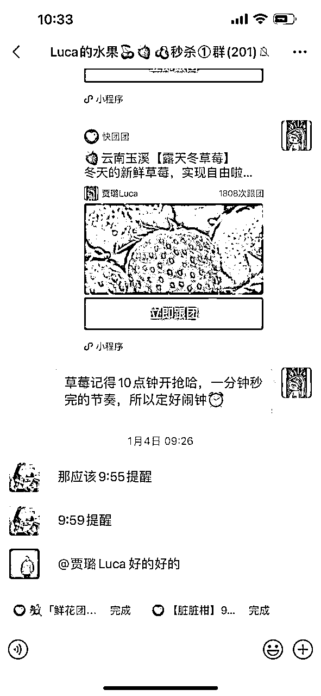

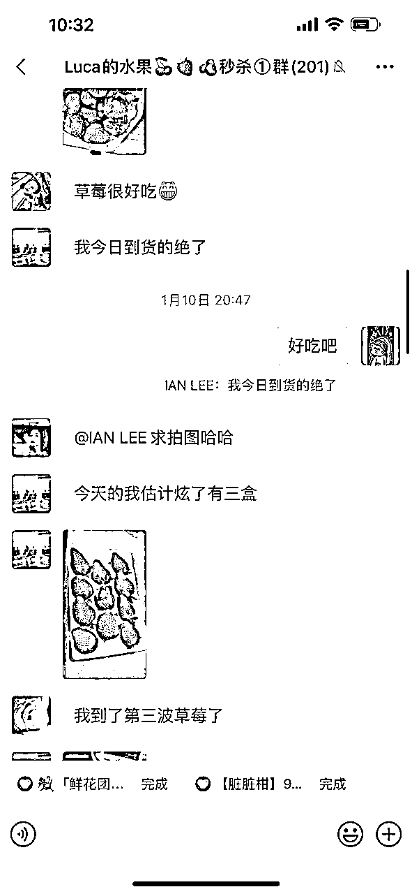

内容来源：《快团团新手如何帮卖月佣金达到 8 万》

## 5.8 方法八：在社群里进行内容分享 @小野

首先，要设定好新人进群后的欢迎话术，群介绍 / 群公告等，让人第一时间知道社群的定位、价值。

其次，要定期 / 不定期输出内容，提供附加价值。

对于母婴群来说，附加价值是育儿干货、育儿心路历程、自己使用团品后的真诚分享和体验等。

对于美食类群来说，附加价值是美食做法（如何煎出完美的包浆豆腐）、美食讲解（如何选择好的进口牛肉）等等。

有了内容，团购群才不会变成一个卖货素材群，而是一个有温度的社群。当然如果刚开始缺少内容，也不要焦虑，有时候好的产品、订单、晒图本身就是很好的内容。

另外也可以巧用快团团红包机制。用户之所以选择快团团这个渠道进行下单购买，是因为团品在品质不变的基础上，会有更好的价格。

利用客户这个低价心理，我会通过红包进一步增加用户的粘性。但我不是用微信里的红包，更多是用快团团里的红包，因为这些红包只能在团购里使用，只能用于下单，更有利于促进成交。

内容来源：《作为职场宝妈，我如何从小红书引流并做到百万营业额的？》

## 5.9 注意事项：社群运营禁忌点 @叶子、@佳佳、@102℃De 月亮

当然，社群有一些东西是一定不能做的：

一定不要发和社群主体不相关的内容，切记！人以类聚，物以群分，尤其在现在社群满大街的情况下，用户都只会选择有价值的社群；

一定保持自己群主的活跃性，群主如果都害怕发一些东西，群成员更觉得群没有价值，每个群主都是 KOL，同时给铁杆粉丝设置 KOL，提高他们的价值和归属感，帮你一起运营社群。一定要保证群内活跃度，哪怕是你发消息没人回，也不能不发，坚持开团，坚持发素材；

不要和群成员有任何的争吵，哪怕客户错的，也不能群里说，对于消费者而言，他们会觉得自己是弱势方，哪怕其他成员看到某个人做的不对，但是也不会指责。有时候一个售后，如果处理好了，是非常好的加分项；不允许在群内发拼多多砍一刀、多人团等与团购无关的链接，尽量少的讨论无关话题；不要碰一些禁忌红线。例如触及党政问题、社会负面情绪、民族仇恨、暴力恐怖、黄赌毒等，发现后及时禁止并撤回相关言论。

祝大家都能做出最棒的快团团社群，成为最棒的团长～

# 六、如何做好售后服务

## 6.1 方法一：方法快速响应+态度要好+懂得让利+心胸宽广 @刘梁

社群团购社群团购，顾名思义，就是在社群这个场里面，通过人和人的链接，来销售各种各样的物。

快团团和群接龙就是为社群团购而生的。因为里面的商品都是一键代发，有海量的选品团长和团品供我们双向选择，而我们卖货团长，最主要的最基本的，就是要做好人和人的链接。

那么在卖货这个场景下，咱们和消费者，在哪个环节是最可能私聊的？最可能在交易过程中产生直接的链接？

对的，就是售后。

卖货的时候，她们会看朋友圈，也会看群，链接里，商品各种信息都很详细，大家都可以自己快速获取信息。

消费者最主动，最需要我们卖货团长是在哪个环节呢？就在她们收货后，发现货物不合适，发的货有问题，收到的货有品质问题，或者发错货了，这时候，就需要我们来解决了。

我们的沟通态度，我们反应速度，还有售后跟踪闭环，直接影响到消费者在我们这里的购物体验，直接影响到客户的复购，也直接影响到客户愿不愿意把朋友拉进群里来，影响我们社群的裂变。你视若珍宝，她会反馈你芬芳，当然，我还是骄傲的我，不卑微，也不求人。我们是有底气的，我们是美好商品和事物的分享者和提供者，但是我们也有责任要做好我们的售后

我的社群，从一开始的 100 多人，慢慢增加到现在的 700 多人，很多都是靠口口相传，朋友拉朋友进群的。

虽然比较缓慢，但是大部分都是有效客户，而且复购率非常高，毕竟我们社群团购看的就是复购率，最终目标就是要让一个人买 1000 次。

我看了一下，我的客户里面，还是有非常多都在几百上千次复购的。

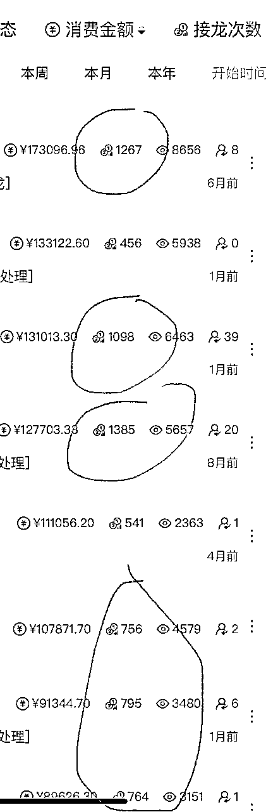

那么具体落实到细节上是怎么做呢？我从下面几个方面和大家聊一聊：1）快速响应

平时有空就多看看手机，看到有售后诉求，就快速响应，并且提交给选品团长也就是大团长。

需要退换货的就要退换货地址。

生鲜有品质问题就和大团长沟通退款。

提交的售后如果大团长没有快速反应，后面还需要跟踪，让每一个售后形成闭环。

2）态度要好

在和消费者沟通的时候，在态度方面，我们还是报以认可，同理，解决问题出发，消费者没有对错，解决问题才是王道。

如果和消费者争论，即使赢了她又如何呢，她以后一气之下不跟你买了，损失的是团长自己，我们要时刻想着她是要跟我买 1000 次的。

3）懂得让利我们做团购都是有利润的，要舍得提高团友们的售后福利。譬如，我给我们社群里的福利是：退换货的运费全部报销。

如果团友们不满意的东西，大团长不给退换或者售后，我就自己接了，把费用退给团友，大不了自己用或者送给朋友好了，让团友知道，每一次购物都是有团长兜底的。

只要团友购物舒适了，未来还会源源不断地复购的，或者不断帮你介绍朋友来社群。

4）心胸宽广

团长的心胸一定要宽大，要像山川一样大，配得上”团长肚里能撑船“。

举个例子：有一次，我有个团友跟我买了 37 码的鞋子，她说太小了，要退。于是安排退，报销运费。 她重新拍了 38 码，她又说太大了，还是要退。这时候，我还是二话不说给她退了，还是给她报销运费。

当这样的客户，在其他地方没有收到这种包容的服务，她就会成为我们的铁粉，连续不断复购，复购 1000 次以上。

内容来源：《讲讲社群团购里的重中之重-售后服务》

## 6.2 方法二：可度量售后+特殊售后+质疑类售后 @叶子

俗话说，常在江湖篇，哪能不挨刀，你选品再严格再小心，也必定遇到翻车的时候，翻车是一定出现的，只要你卖货，必然遇到售后。

所以遇到售后之后，首先需要心态平和，其次才是解决问题，所以怕麻烦的人做快团也会累。

我在这里提出遇到售后的看法：售后不要怕麻烦，而是区别于你和其他卖家不同的机会。客户也不是要你真正的怎样，而是需要你一个好的态度从而弥补其心理的不平衡。

我在这里说下常见的一些售后以及应对方法：

1）大多数售后是可度量的售后。

例如：催发货、快递卡件、产品质量破损补偿、退换货等。这里面最不好处理的是催发货，因为供货团长的货很多也不在自己的仓库，面对这种售后，需要和供货团长沟通清楚，延迟发货具体延迟多久。

如果延迟时间不确定，而且是不可抗拒因素造成的（灾害以及最近的疫情）直接出一个专业的说辞，让客户先退款，等发货稳定了，再让客户重新下单。

如果是商家自己原因，和商家沟通给延迟发货的客户补偿红包（基本没有客户不同意这个售后，如果有可能是红包金额不够）。至于产品质量破损补偿，灵活把控，看供货团长给的金额大小以及客户的重要性。

2）部分售后是特殊售后，主要是不按照我们的售后标准提供售后依据。

这类售后也是最头疼的。我们的做法是跟进客户的情况和态度来处理，如果客户很重要，态度好，我们会给出售后标准，然后会说下次还请提前准备售后依据，这次我补偿个红包（其实这类客户要的也是一个好的态度），这里我举一些案例：

有客户反馈，丑苹果没有果柄，是不是不新鲜？很多卖家会回复客人：生鲜运输过程中有水份流失很正常，除大面积磕碰和腐烂以外，没办法售后；这种回复，客户是不认可的，他就觉得找你买货，品质不好；而且很多人的评判标准是不同的，卖家觉的这个苹果又不皱皮怎么会不新鲜呢？

卖家就是认为，一定放很久了，不然果柄怎么都会掉呢？当你告诉客人：我们的丑苹果都是 15 年的老树果子，很多果树没有改良，所以采摘没办法剪果，都是扭下来，他当然就没有果柄啦！！很轻松的一句话，打消了客人所有的顾虑，找你买果，少了些猜疑和担心，多了份信任。

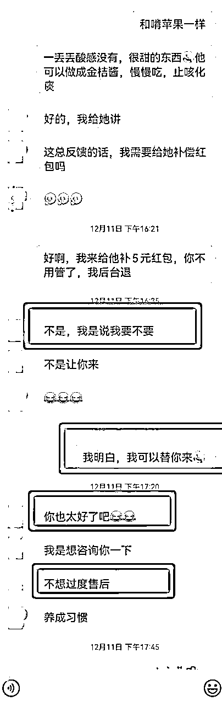

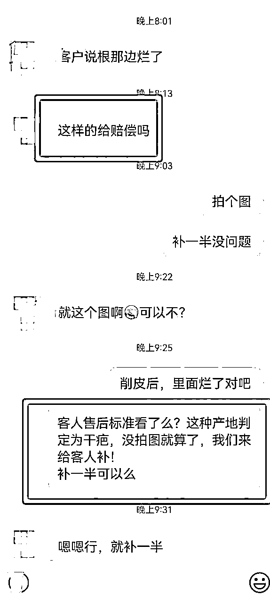

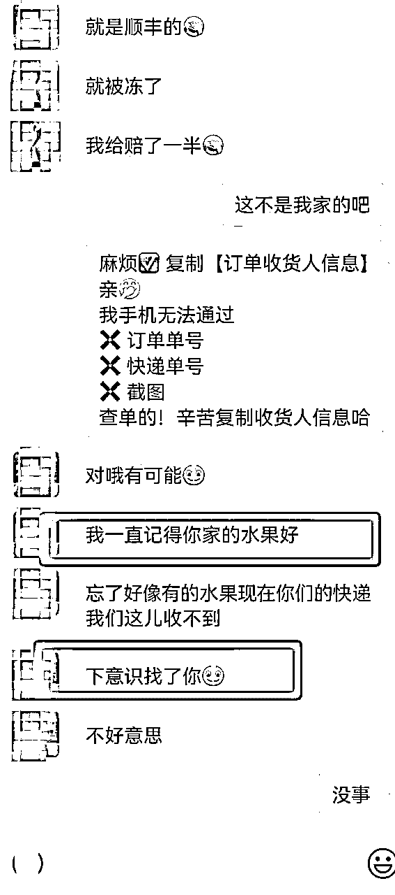

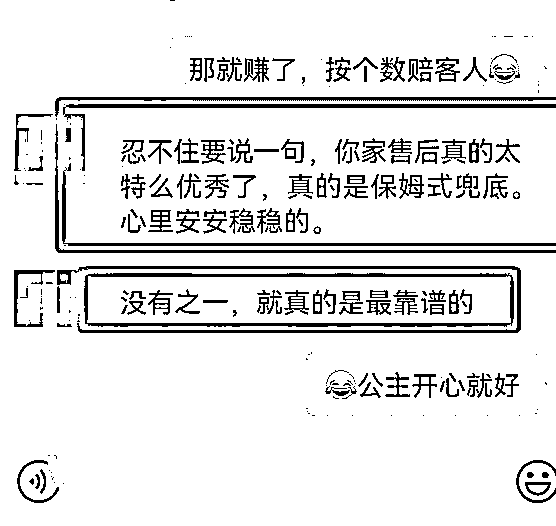

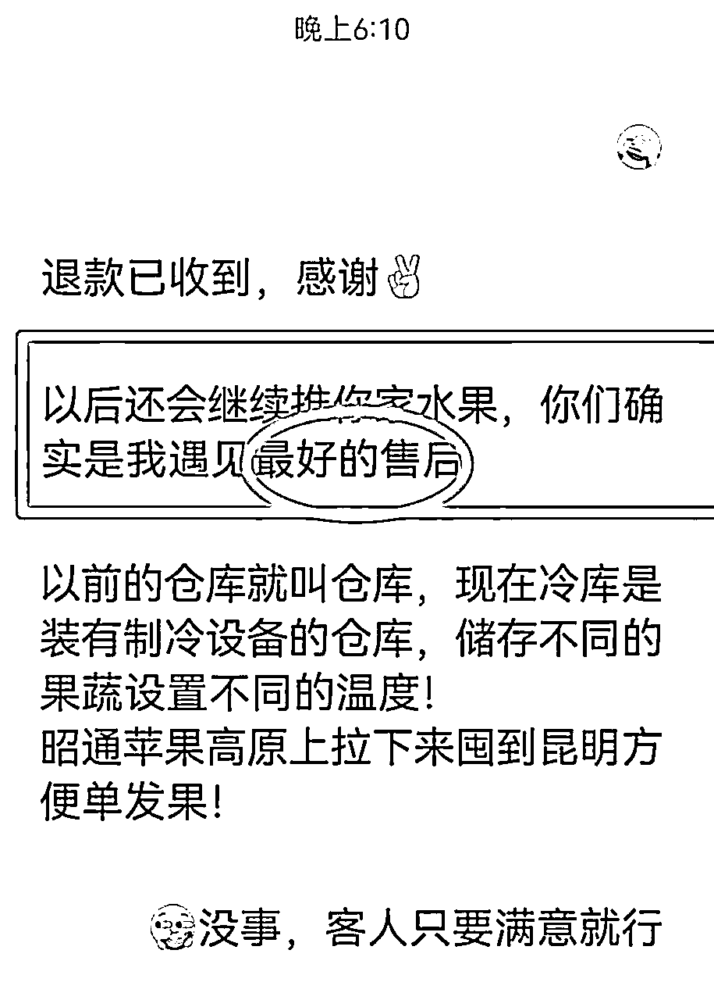

3）少量质疑类售后。

主要表现出是不好吃、不好用等，这类售后解决，在私域里面不要用电商的售后标准去解决（例如：千万不要说：口感问题不售后）。

这类售后一定需要秉着两个态度：专业知识+诚恳态度。

我这里举个例子，也是借用其他人的案例——例如：当客户收到脆皮金桔时，有人觉的皮硬，他找你售后，会有部分团长会直接回复一句话：「因口感问题不售后」

我们可以这么回复：「11 月中旬开始，国家级地标融安脆皮金桔开始采摘，给客户推荐的是金桔二代。

相对于原有的皮薄麻嘴、不甜有籽的一代金桔来说，二代金桔果香浓郁，甜度高，汁水多。

但是头茬果皮会稍微厚一些，不过很多客户是很容易接受的，金桔这个品种很神奇，一棵树上，他是要开三四次花，果子也是逐步成熟的，头茬果子就是皮个别会厚一些；

带皮吃营养更丰富，当然也可把皮啃掉再吃，做成金桔酱也是不错的选择，随时冲水喝，秋冬季化痰止咳必备神器；

不过，我们也没有重点把链接里的内容再介绍给您，所以可以这边补个小红包，略表诚意……」这一套干货输出，再加上诚意表达，首先会让客户觉得你专业，或许有些客户听完后，反而还会觉得是自己太不懂行；这结果一目了然。

内容来源：《从供货团长的视角，来讲讲选品和售后》

## 6.3 方法三：调整预期 + 态度积极真诚 + 不要怕吃亏 @小野

好的售后，可以巩固客户信任；不好的售后，会加速客户流失。私域之所以是私域，就是区别于 tb、jd 那样的机械化客服式售后。

我以血泪教训，总结了团购售后最重要的 3 点，分享给大家：a. 如果有团品预售或者发货慢，提前在群里或私下沟通好，把客户发货速度预期降低；

我曾经花了很长时间在群里反复跟大家解释为什么快团发货会比较慢一些，正常时间是 48 - 72 小时内发货。后来渐渐地，大家接受和习惯了这个模式。

b. 售后态度要积极和真诚。如果有售后，一定要积极。私域那么宝贵，如果售后态度不好，客户分分钟流失，客户不如去找李佳琦或隔壁团购群买。

c. 做好兜底赔付的准备，不要怕吃亏，否则一个对赔付结果不满意的客户会立马失去信任，不如大大方方，换货邮费包邮，有质量问题，无论供货团长是否赔付，我也包赔到底。

内容来源：《作为职场宝妈，我如何从小红书引流并做到百万营业额的？》

# 七、附录：快团团高频问答库

下面的问题都可以到公众号 快团团服务 里面找到

🔥顾客端常见问题

1.

顾客如何下单？

2.顾客如何查询订单？

顾客如何查看物流信息？

顾客如何申请退款？

顾客如何填写备注？

顾客如何修改收货人信息？

7.顾客如何联系团长？

顾客如何扫码核销？

顾客如何订阅团长？

🔥帮卖团长常见问题

1.帮卖 - 如何查看自己的佣金收入？

帮卖团长自己下的订单从哪里申请退款？

帮卖团长如何参与推荐团长赚佣金？

商品管理

1.如何设置商品分类？

如何添加多规格商品？

如何添加商品描述？

如何设置秒杀商品？

如何设置商品满减活动？

6.如何设置商品限购？

如何设置商品分类横排（竖排）显示？

如何自主设置商品编码？

如何修改商品的库存数量？

如何批量上传多规格商品的图片？

11.如何修改团购内商品分类名称？

如何设置商品标签？

如何设置商品划线价？

🔥订单管理

1.团长如何给顾客发送通知？

电脑端如何上传物流单号？

团长如何进行核销？

如何导出详细订单数据？

如何打印订单小票？

6.如何查看订单？

如何搜索订单？

如何查询已退款订单？

如何修改顾客收货信息？

如何进行单品取消？

11.如何打印电子面单？

如何筛选导出部分订单？

如何同时导出多个团的订单？

如何不允许顾客申请退款？

电脑端如何打印订单？

16.一个订单有多个物流单号如何操作？

团购设置

1.

如何设置团起购金额？

如何隐藏跟团人信息？

3.如何复制其他团长的团购信息？

如何设置满减活动？

如何展示 / 关闭商品库存数量？

如何设置默认物流方式？

如何设置新人首单优惠券？

8.团长如何设置幸运大转盘抽奖？

如何设置拼团商品？

如何设置助力低价购？

🔥个人中心管理

1.如何设置管理员

2.

如何设置管理员的操作权限？

如何屏蔽某个成员（不让他看到我的团购）？

如何查看顾客团购次数、金额？

如何生成团长主页二维码？

6.如何删除团购和恢复团购？

团长如何收到顾客下单通知？

如何设置自提点负责人？

如何设置会员奖励？

如何使用数据中心？

11.团长如何获得物流查询码？

团长如何设置积分奖励？

如何设置个人排名标签？

分销设置

1.如何设置自由定价？

如何设置部分商品帮卖？

如何手动发放帮卖佣金？

如何设置推荐佣金？

如何设置自提点分佣？

6.如何设置自提点单品佣金？

如何设置专属团长佣金？

如何审核帮卖团长？

如何查看帮卖团长的帮卖金额？佣金支出？

不同种类佣金功能的对比说明

11.供货团长如何查看帮卖团长的订单？

直播团购

1.

如何开启直播团购？

2.如何进行直播分享？

直播如何禁言？

直播如何授权摄像头和麦克风？

直播中如何添加商品？

团长其他问题

6.

如何将团购链接插入公众号？

团长如何分享单品？

如何屏蔽他人开的团？

团长如何在线联系顾客？

10.如何设置运费模板？

多个自提点，如何创建配送路线？

如何查看用户画像？

如何使用电脑端客服聊天系统？

更多问题解答，大家可以从手机端进入快团团小程序，找到团团学堂。需要注意的是，团团学堂中的部分解答可能过时，如果无法解决你的问题，可以在航海群中#举手求助（本次航行期间）。

操作路径：快团团小程序-个人中心-官方客服-团团学堂

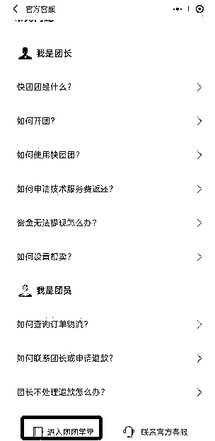

对于自己想问的问题，也可以直接检索关键词，寻找答案：

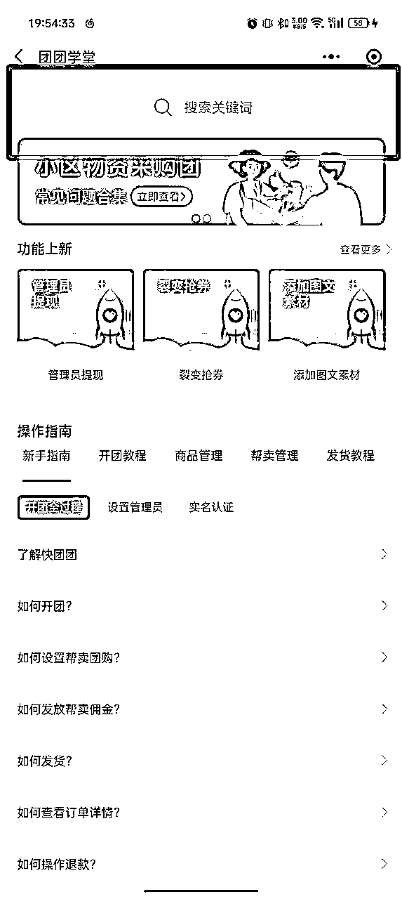

