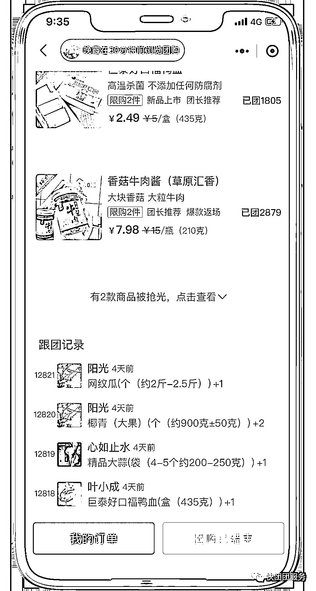
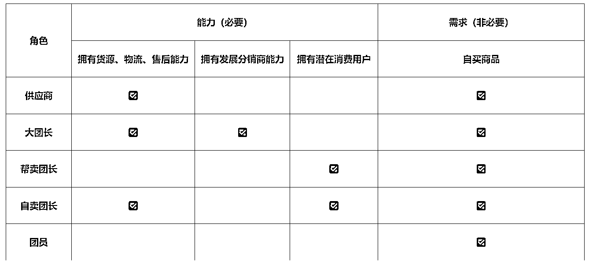
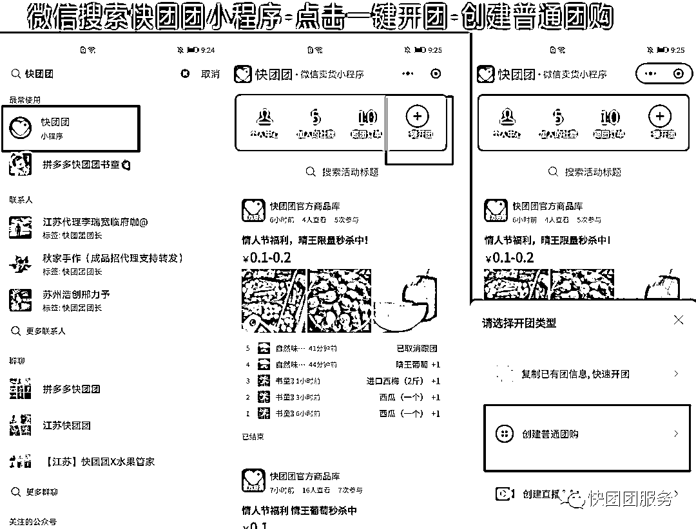
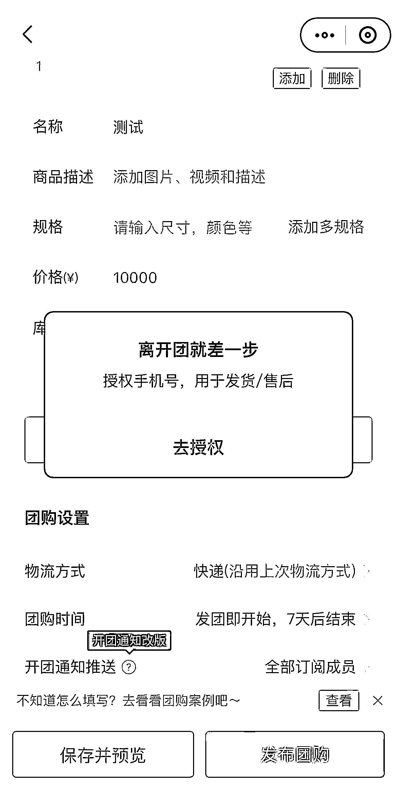
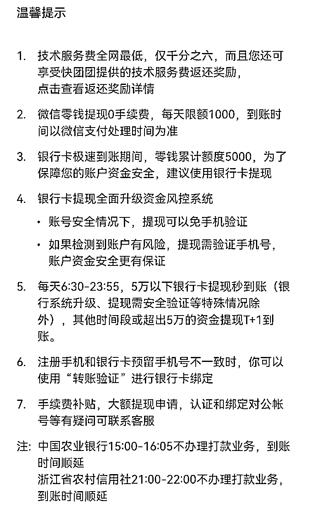
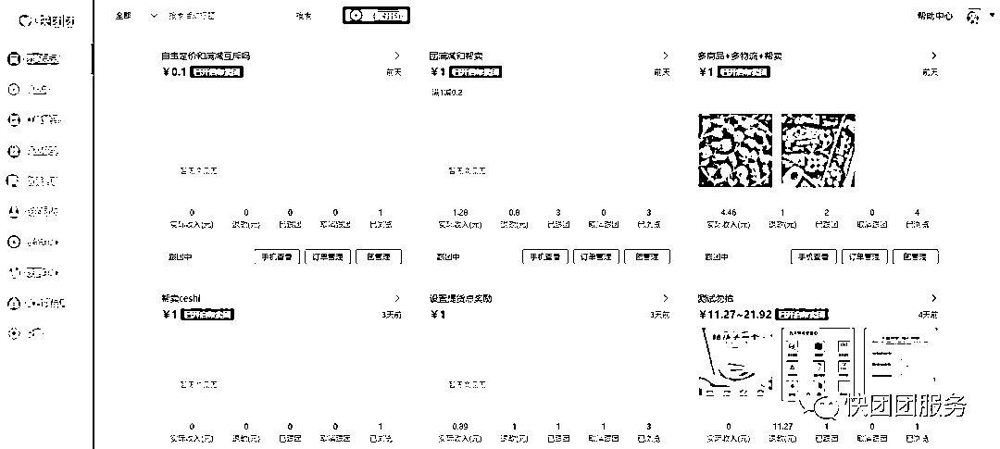
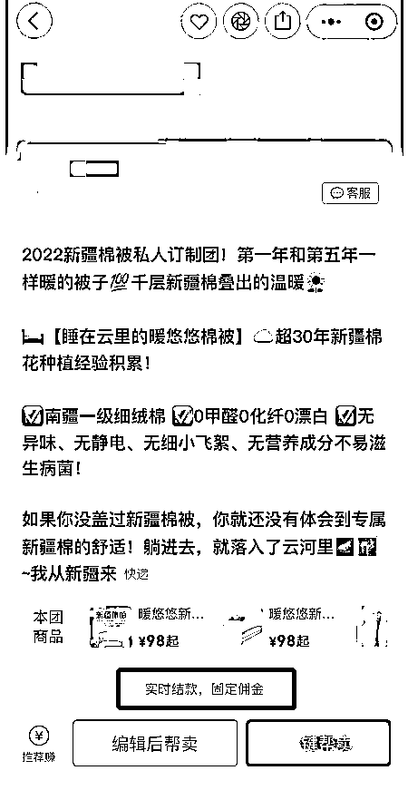

# 1.1 什么是快团团

快团团是拼多多旗下用于私域社群团购的工具小程序，可以做到快速发布团购、线上统计订单与收款。

具体点说，快团团以工具的能力为团长私域提供服务，连接商品和团员。没有入驻费用，支持一键开团，服务费较低，且能够提供订单管理系统。包含团购、报名、帮卖、直播、订单管理、店铺等特色功能，且入驻是免费的。

快团团就是将社群、私域的力量放大，在熟人经济里，每个团长都是一个小的意见领袖。

相对拼多多，某宝、某东的商家商业销售行为而言，快团团的团长更像是身边的好物推荐官。追求的是用户信任后的超长期粘性及复购率，属于在微信世界里的“直播间”。你的角色等同于公域直播间的“李佳琦”，为团员更好的选品、更好的服务，同时也让社群的经济价值最大化。

对于有私域流量沉淀的朋友们来说，快团团能实现高效利用私域流量，开团之后可以在朋友圈与微信群内传播分享。

•快团团的几类角色关系

在完整的快团团成交体系中，角色共分为 5 种：

以上关系，可以互相重叠，比如大团长，如果有消费用户，也可以像帮卖团长一样进行销售商品，本图只是为了区分各个角色关系，做的基础定义，「1.2 快团团体系里的 5 大角色」会有更全面的各个角色的关系介绍。

•如何找到快团团？

微信搜索【快团团】，选择【快团团小程序】，即可找到快团团，开团可点击【一键开团】-【创建普通团购】：

或者直接手机扫描下方小程序二维码进入「快团团」：

接下来，来认识一些快团团的基础规则。

•快团团需要注册吗？

快团团开团不需要额外注册，完成手机号授权即可开团。

•快团团收费吗？

快团团小程序所有功能「完全免费」提供给团长使用，无年费、无抽佣，但顾客在使用快团团做支付时，微信官方会收取交易额 0.6% 费用，该费用由供货大团长支付。

•快团团有网页版吗？

有，快团团网页版网址：[`ktt.pinduoduo.com/`](https://ktt.pinduoduo.com/)

在快团团电脑端，可以更高效的发布团购、创建新商品、导入和导出各种类型的订单、导入快递单号、打印电子面单完成快速发货。

PS. 作为帮卖团长用不用 PC 后台都没关系。

•顾客下单后，钱多久到达账户

帮卖团长卖出去的货物，佣金是直接到自己的账上吗？还是在供货团长那里，还是需要一定的周期才能到账呢？

这点需要看具体团的设置，有些团是大团长设置手动发放，如果不设置的话，默认是自动发放，佣金会自动到自己的快团团账户。

如果默认自动发放，顾客下单后，钱会立即到帮卖团长的快团团账户，帮卖团长即可提现，提现可至微信零钱和银行卡，提现不收费。

提现时间与限额：

•提现到微信零钱每天限额 3000 元，实时到账；

•提现到银行卡每天限额 5 万，每天 9:00-23:00，5 万以下银行卡提现秒到账，其他时间段 T+1 到账。

实时结算的货品会有如下图的提示：

