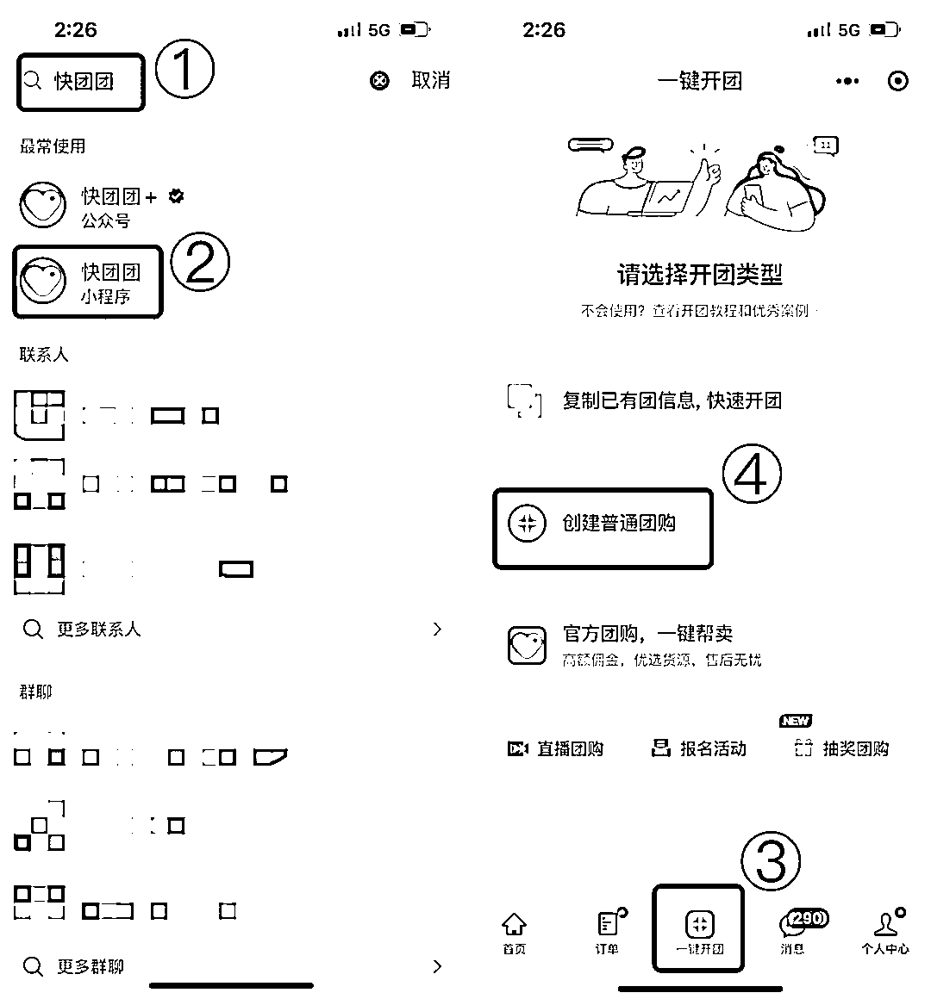
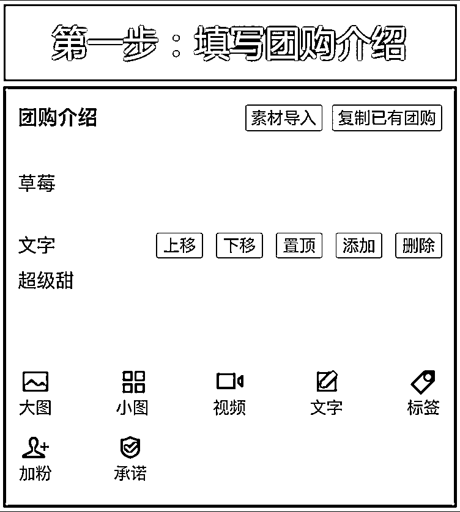
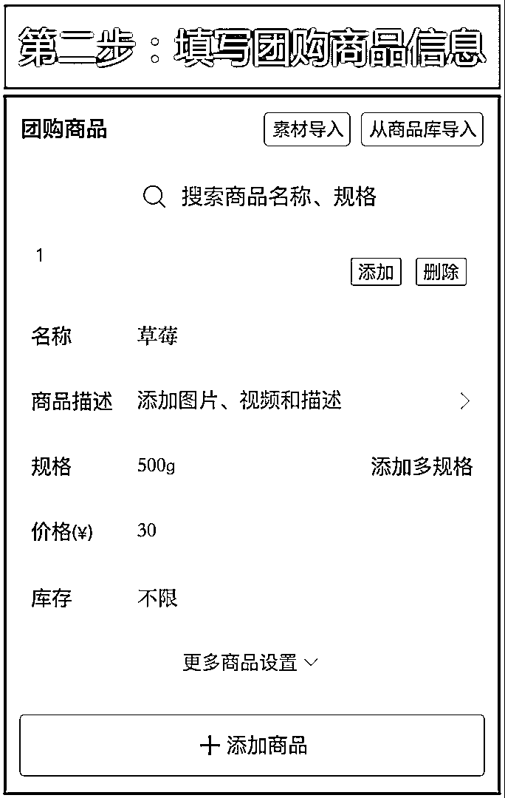
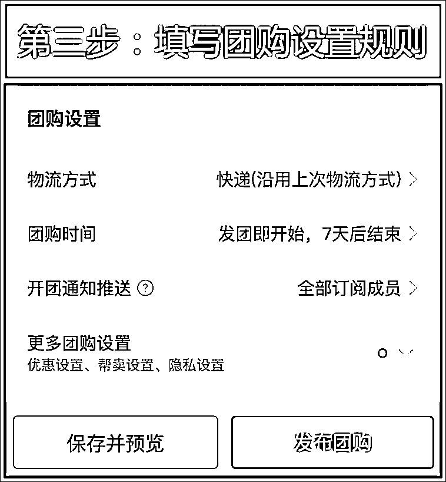

# 第一步：大团长发布团购，销售产品

团长可以通过发布团购销售自己的产品，可选择自提或快递模式，自提适合小区周边落地配，快递则可覆盖更多顾客群体。

开团操作步骤如下：

1）进入快团团小程序-【一键开团】-【创建普通团购】：

2）依次填写【团购介绍】-【团购商品】-【团购设置】-点击发布团购：

视频演示：[`mp.weixin.qq.com/s/fgcKbswY8JyDp_qISAtMxQ`](https://mp.weixin.qq.com/s/fgcKbswY8JyDp_qISAtMxQ)

