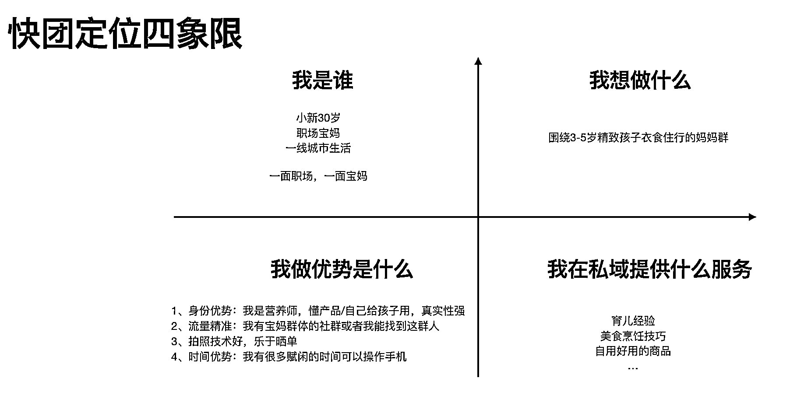

# 第一步：找准个人定位，完善基础配置 @星宇

流量决定你的快团团定位，定位决定了未来选品策略，社群运营策略。所以定位很重要，你要先考虑清楚你要做什么？

1\. 找定位

快团团核心强调的是私域运营下的用户复购。

•有些商品是属于高复购的商品，例如水果，生鲜肉类；

•有些商品属于品质刚需的商品，例如尿不湿、绘本，厨房湿巾；

•有些商品属于提升生活情趣需求商品，例如鲜花，好看的餐具，厨具。

一切的一切都围绕你手头拥有的用户的需求，以及你想要做的用户的需求是什么

切记越垂直越好，越精准越好。虽然前期开展带来的变现空间有限，但随时间沉淀，你会越来越有价值。比如你只做 3-5 岁妈妈群，卖的都是 3 - 5 岁刚需的商品，用户有需求就会很快找到你。同理，如果你是做水果群，那大家想吃水果，就会找到你。

以下是测定位的四象限，供大家思考：

2\. 完善基础配置

想清楚个人定位以后，需要把头像、昵称、简介、背景图进行完善。

例如你是宝妈，想要做母婴群。

【昵称】你可以叫「安妮妈妈」

【简介】可以是我是谁，我为什么做这个号来写：自己基础信息进行提炼，包括昵称、性别、年龄、生活状态、价值观等方面，越详细越好，内容越多，内容越丰富，越真实越好。（人设不等于本人）

【头像】可以是自己抱着孩子的照片，或者是用在线设计网站设计一个。