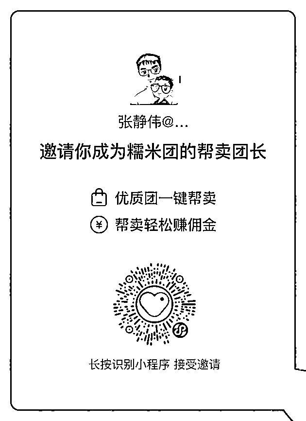

# 1）糯米团

•糯米团简介：

糯米团是千寻供应链衍生出来针对中小型团长的团，为帮卖团长提供食品、生鲜、百货、为主，小众其他品类为辅的供应链服务。经过一年多供应链的沉淀，目前已经设立上海仓、嘉兴仓、西安仓、安徽仓、等多品多类仓发货需求，联合战略品牌方厂家建仓稳定发货。

千寻供应链主要给快团团、群接龙的私域社群团长提供产品代发服务，是快团团、群接龙全国 P 妈、趣趣、海涛、樱花、77、骄傲等全国 Top 团长的核心服务商。（如果需要 Top20 开过的团品，千寻可以提供供应链服务。)

糯米团目前主要开团的品为能稳定输出品质有保证的品，例如自己仓发货、战略合作厂家为主。另外糯米团也承接了战略品牌方的全私域运营（包含私域平台、有好东西、万物心选、蜜桃、严寻等）

本期航海选品主要围绕自己仓发货的食品、产地直发生鲜水果、以及品牌方配合的福利品为主。例如溯源过的厂家的有出口资质的饮品枸杞原浆、产地直发应季新鲜水果、陕西甜瓜、新疆的哈密瓜、甘肃金银水果玉米、自由仓发的牛奶、食品，清仓福利产品。

•识别小程序二维码，成为其帮卖团长

