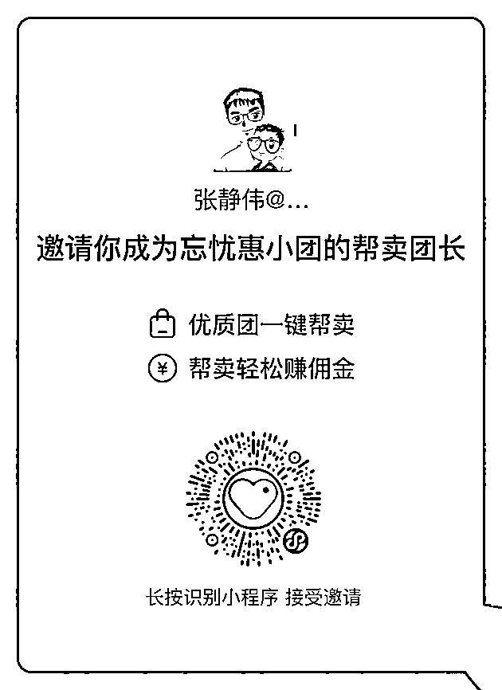

# 2）忘忧惠团

•忘忧惠团简介：

公司成立于 2019 年 6 月，总部位于青岛，采用分布式办公的运营形式，在北京、杭州、新疆、广州设有营销商务部，从 2020 年从事快团团供应链业务，主要代理包括联合利华在内多个品牌商家与蜜瓜，云爸，猫家等私域头中部大团长快速建联商品合作并完成销售目标，年社群团购销售 GMV 过亿。

2022 年 12 月以孵化+定向邀请模式创建快团团大团长账号-忘忧惠小团，经营类目包含食品、母婴、百货、宠物及护肤五大类，主打品牌直签，官仓发货，售后兜底。

主理人连续 3 期担任生财有术快团团航海教练，为生财圈友的商品保驾护航。

•识别小程序二维码，成为其帮卖团长、

