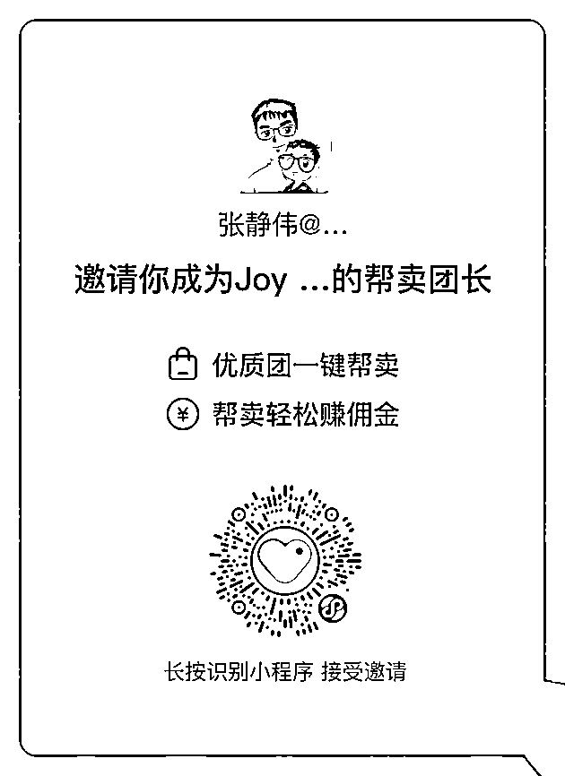

# 3）JoyMeat 团

•JoyMeat 团简介：

JoyMeat 是一家专注中高端牛肉的新零售品牌（其前身是赛鲜浦乐牧），主打美国黑安格斯和澳洲和牛产品。在供应链端，与美国澳洲的顶尖供应商都是深度合作十余年。深耕电商，并在淘宝，快团团等团购平台取得销售额 10 倍增长。疫情期间产品配送到上海上百个小区，和上海女神团等大团长都有深度合作。

产品供应上海多家日式烤肉以及西餐厅，产品线覆盖“全牛部位”，包括牛排，火锅寿喜烧，烤肉，牛肉饼，中式炖煮等。

•识别小程序二维码，成为其帮卖团长

