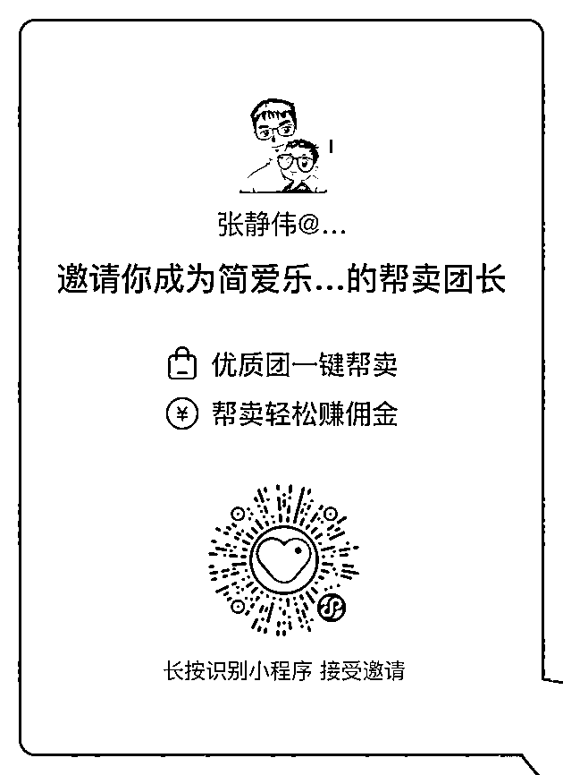

# 7）简爱乐选

•简爱乐选简介：

简爱乐选致力于“宝妈美好生活服务者”的定位，为帮卖团长主要提供丰富的母婴产品及围绕生活日常所需的食品，百货，家居等全品类选品。简爱具备自营仓超 1000 平方，具备超 30 人的选品、运营及客服团队，为三妈，小象，猫家等母婴全国 Top 团长提供服务。

在这次航海，主要为大家提供母婴夏季热卖品，包括防晒驱蚊，服装，零辅食，洗护，玩具等，主打大牌货平民价，同时具备超多流量款，为船员们开单赋能～

•识别小程序二维码，成为其帮卖团长

