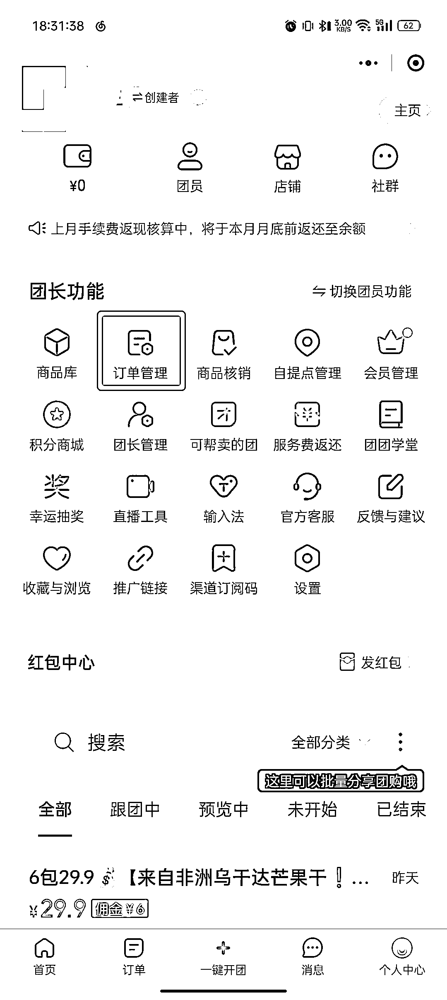
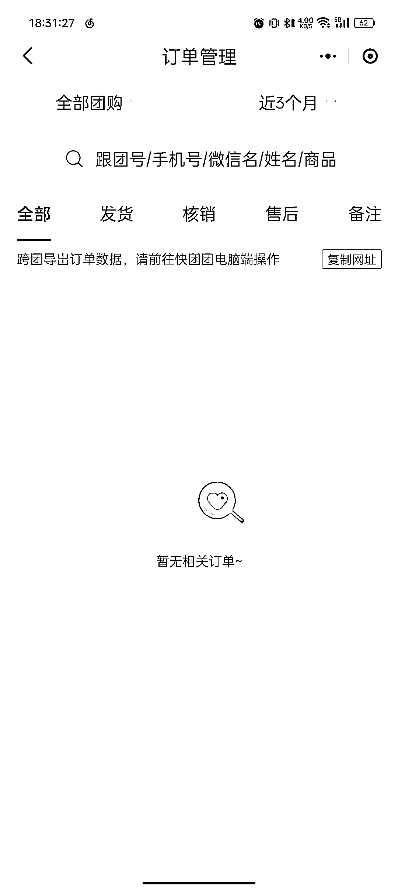

# 第三步：帮卖团长参与帮卖

1）点击快团团长转发的帮卖链接

2）点击「编辑后帮卖」，需要修改帮卖团的团购介绍信息，可以关闭「同步大团长内容」后，再进行修改。需要注意的是，关闭后，若大团长修改了团购介绍内容，无法同步至你的帮卖团哦。

3）商品上新：如果某个团上新了商品，你打开快团团小程序就能看到，或者关注大群中，领队转发来的消息即可。

4）可在个人中心的订单管理处，查看帮卖团带来的具体订单信息：

