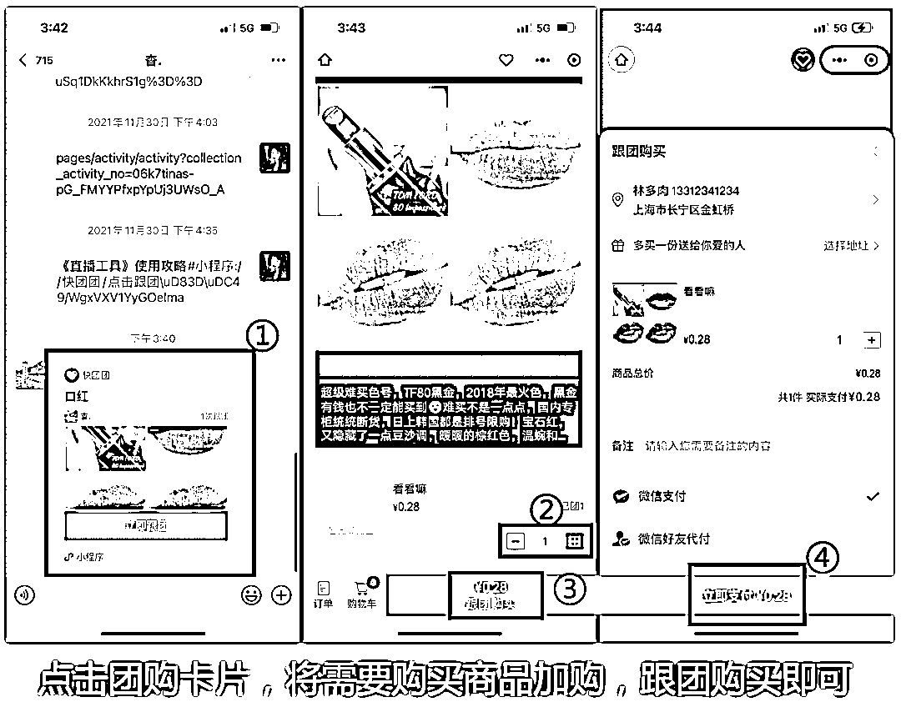
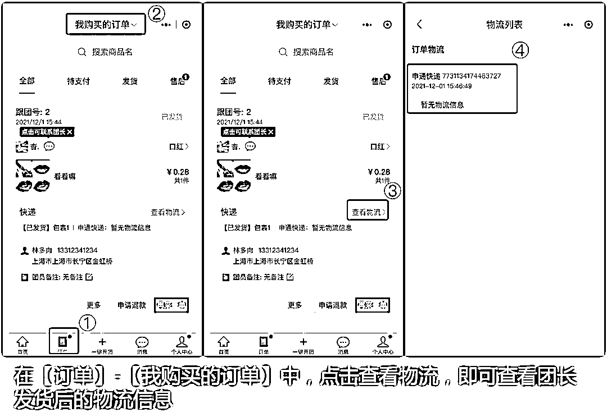
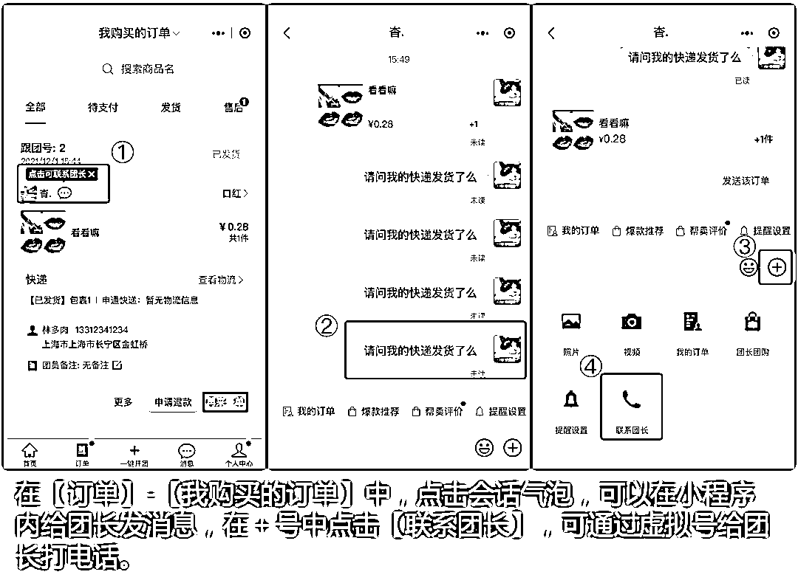

# 第四步：顾客下单与查询订单状态

发送「帮卖团购卡片」给顾客后，就会产生顾客订单。这里展示下单成交的流程。

需要注意，此处的「帮卖团购卡片」，是需要大家完成前一步的帮卖后，分享自己的团购卡片，不要把供货大团长的帮卖链接分享到群里，这样的话，自己就没有佣金。

1）顾客如何下单：

2）顾客如何查看自己购买的订单及物流信息：

3）顾客如何联系团长

一般来说，顾客下单后都会联系或添加团长的联系方式，在快团团小程序中，可以通过以下路径实现：

注：通过谁的团购卡片购买，这里就会联系到谁。比如顾客从帮卖团长（即你）的卡片完成下单，联系到的团长即为帮卖团长。如果帮卖团长无法解决问题，可以由帮卖团长再联系供货团长。

到这一步，顾客下单后，帮卖团长就已经完成售出任务，发货等事情都会由大团长解决。

