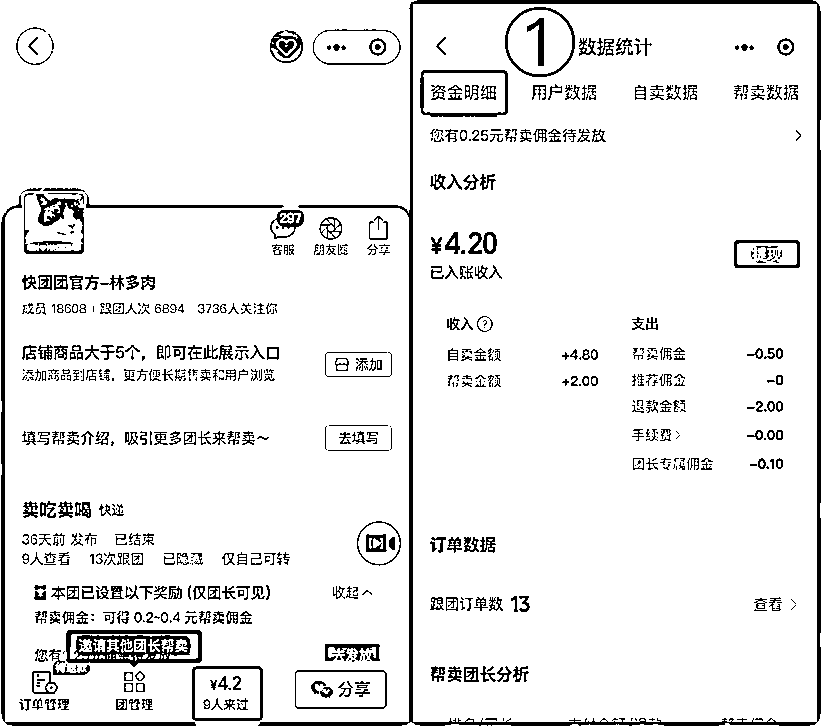
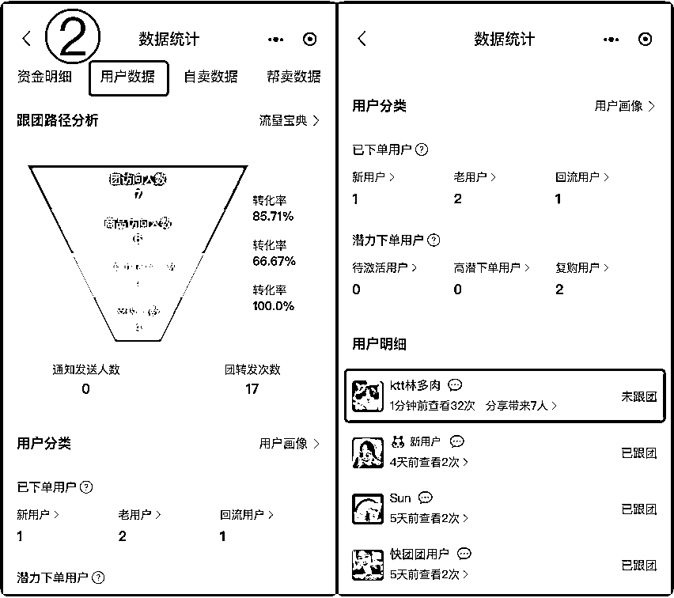
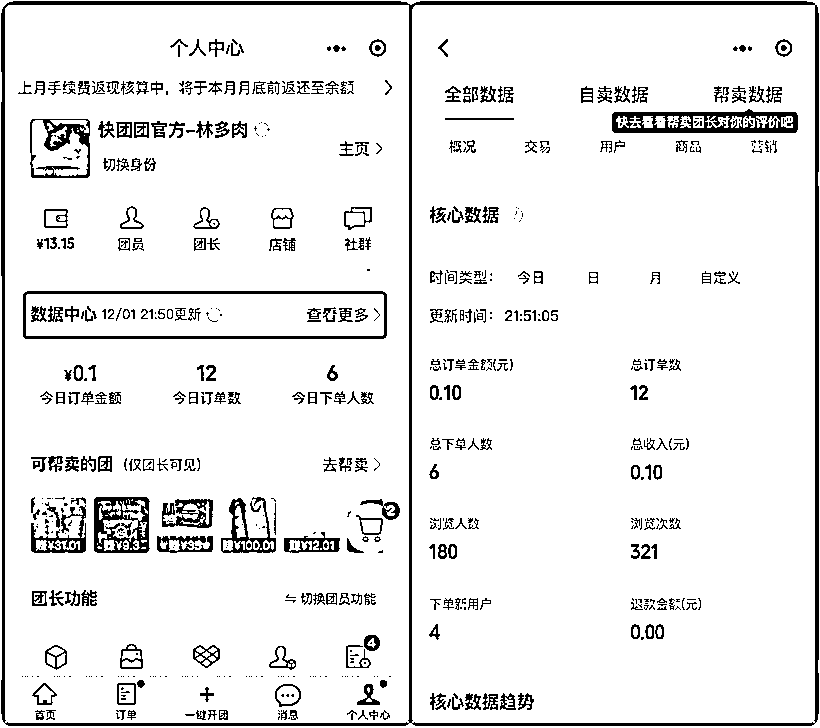
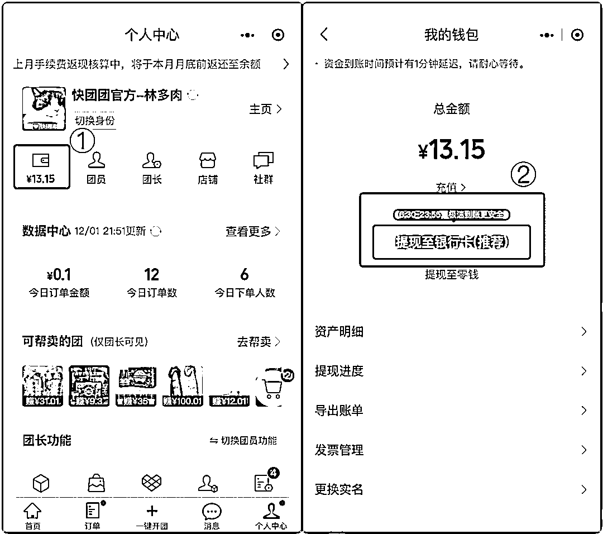
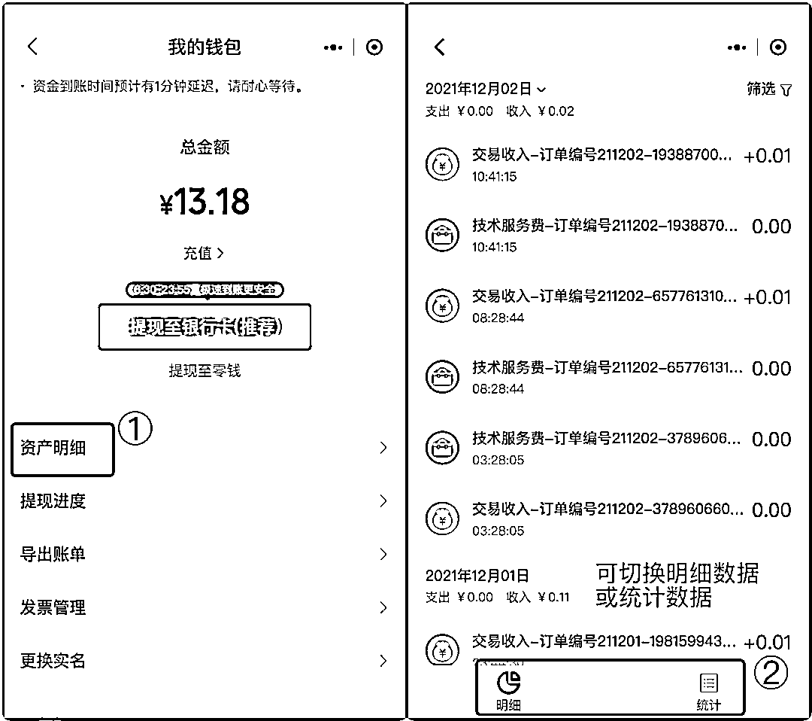
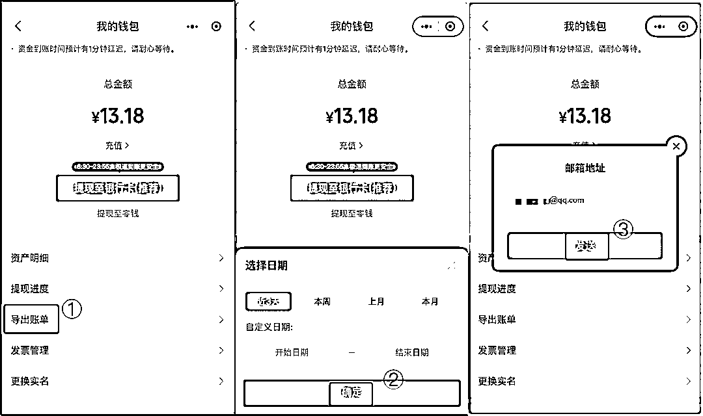

# 第五步：团长如何查看团购收入和提现（帮卖团长与供货大团长同操作）

1）团长如何查看团购收入：

进入团购详情页，点击左下角的金额，即可进入资金明细页面。在这里可以看到该团购的——

•资金明细

•用户数据：在用户数据中能看到团员的查看次数，分享带来的人数，是否新用户，以及是否跟团

•自卖数据

•帮卖数据：在帮卖数据中能看到帮卖团长的排行榜

2）团长如何查看全部数据：

在“个人中心”中进入“数据中心”，在这里能筛选时间、商品等等，看到全部的数据。

3）团长如何提现？

在“个人中心”中进入“我的钱包”，在这里可以将钱包里的钱提现。

如果供货大团长没有特殊设置，默认佣金自动发放，那么顾客下单后，钱会立即到你的快团团账户，提现可提现至微信零钱和银行卡，提现不收费。

提现时间与限额：

•微信零钱提现每天限额 3000 元，实时到账；

•银行卡提现每天限额 5 万，每天 9：00-23：00，5 万以下银行卡提现秒到账，其他时间段 T+1 到账。

4）如何查看资产明细：

在“个人中心”中进入“我的钱包”，点击“资产明细”。

在明细中可以看到相关的明细数据，在统计中可以按日/按月查看收入/支出数据。

5）团长如何导出账单：

在“个人中心”中进入“我的钱包”，点击“导出账单”，选择日期将账单导出到邮箱中，导出后大概 10 分钟，你的邮箱就会收到账单了。

