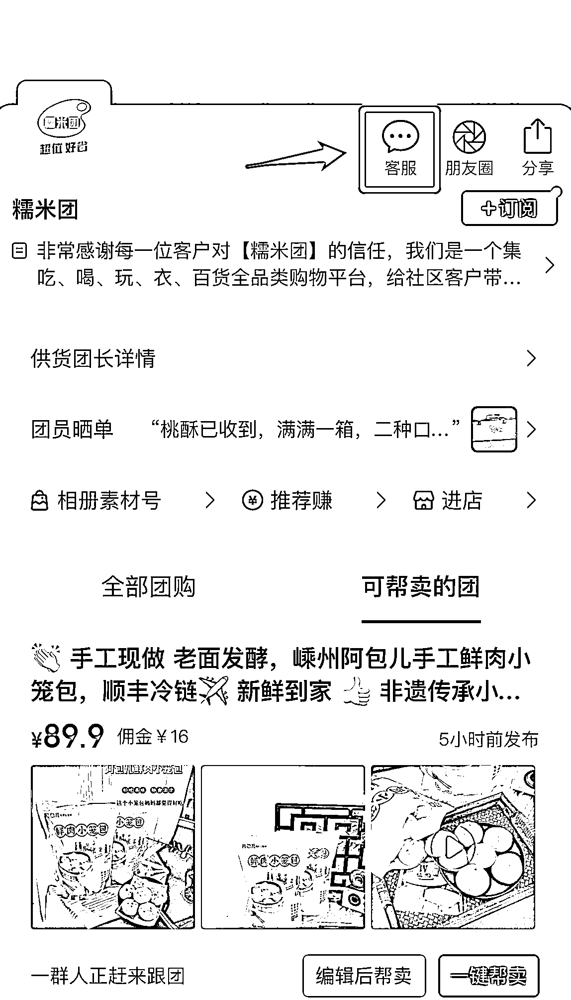
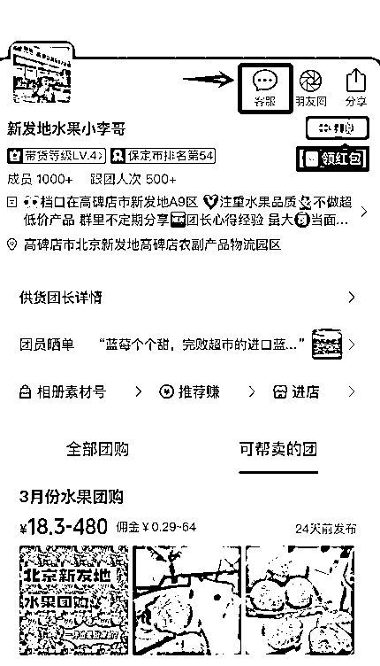

# 创港渔农生鲜

•产品：博贺港海鲜•发货地：茂名博贺•快递：顺丰冷链•快递时效：广东省内次日达，省外 2-3 天•保存方式：-18°C 冷冻保存
售后须知：1）请您一定留正确的地址和电话号码，快递一旦发出，恕不再更改地址哦；2）请一定及时查收快递，第一时间开箱检查。勿放快递柜，驿站等；3）产品运输过程中，真空袋个别会有漏气的情况，不影响海鲜品质，海鲜的真空只为缓解运输途中化冻时效；4）有任何问题请签收后 24 小时内凭【损坏产品+快递面单】 合照售后；5）快递为冷链汽运，请耐心等待收货，收货后产品有问题可按照上述正常流程申请理赔。
特殊时期，只要彼此多些理解与耐心，一定可以度过难关的，比心～

售后对接：

•各团的售后小伙伴会都会加入航海大群，大家可以在其中找到对应的售后解决问题

•或者在各团的帮卖主页，寻找该团客服，下图所示为举例

一定记住，你是中间的桥梁，要做好衔接工作。

如果遇到产品质量或产品瑕疵问题，有个处理原则，就是想办法超过客户预期，这种方式表面上看你付出了更多，但实际会帮助赢得更多的口碑，变危为机。比如：产品出现问题，需要给客户退货退款，你可以退款不退货，再追加给予下次的购买优惠。

