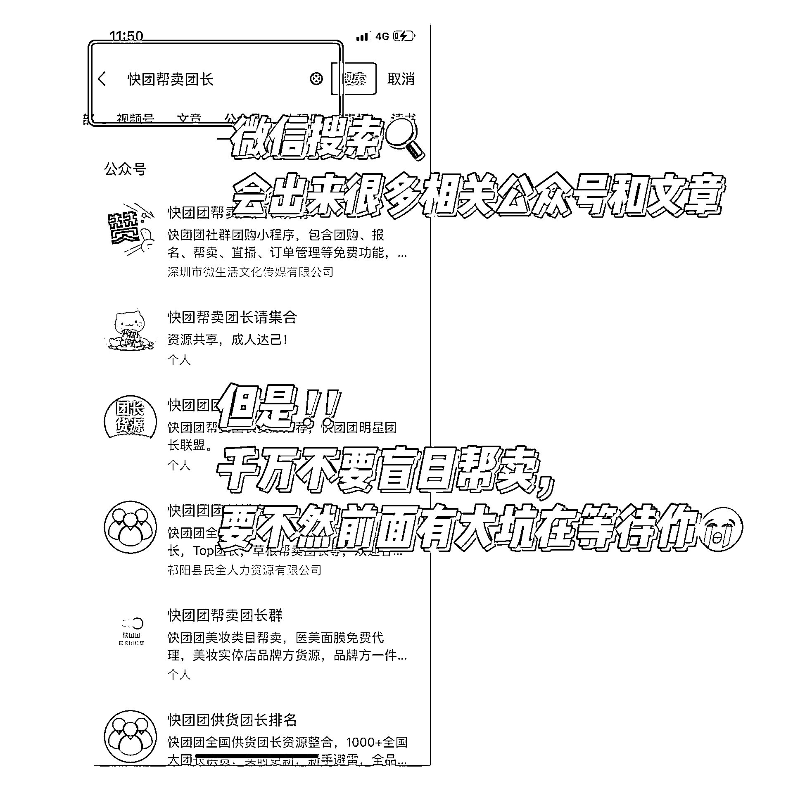
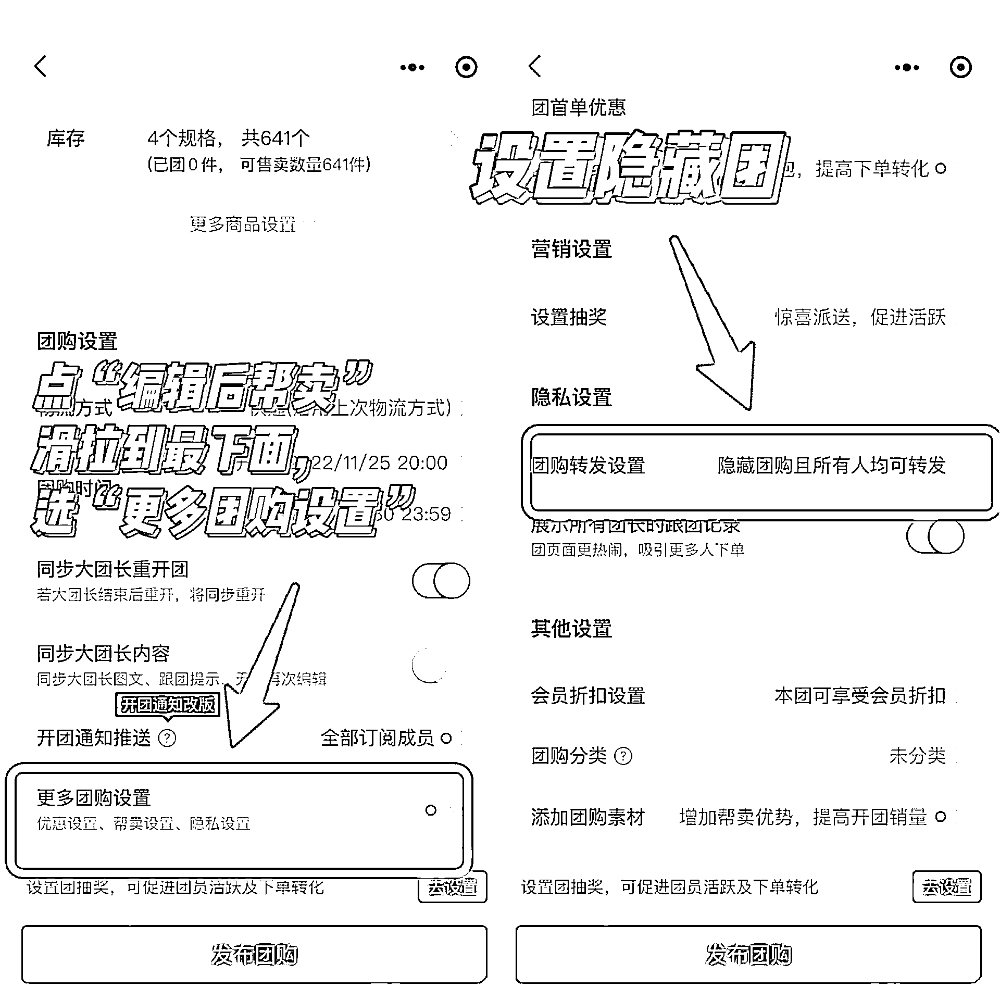
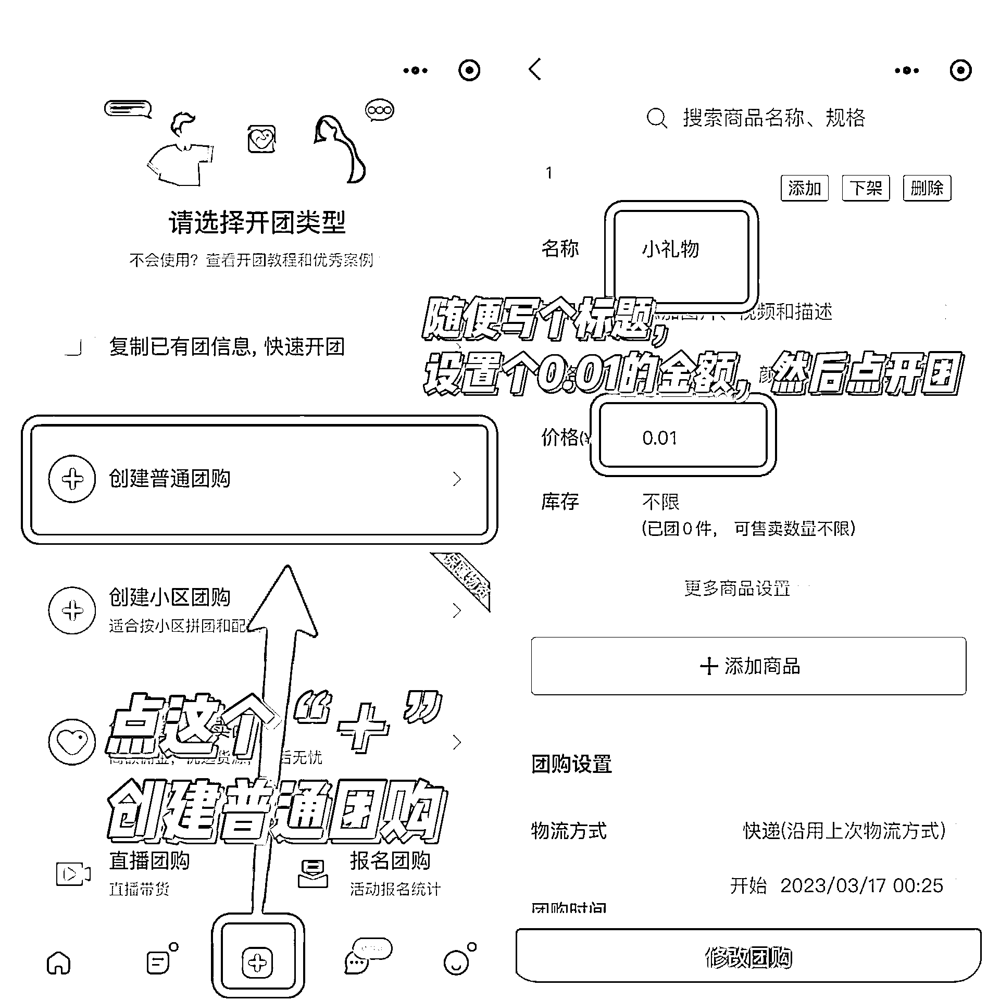

# 2.3 自己如何选择供货团长 @宝藏小鹿 @星宇

如果你需要更多的品类，也可以自己找供货团长，但是在这一步，更需要我们认真仔细的辨别供货团长的情况，避免踩坑，圈友@宝藏小鹿分享了一些寻找供货团长和辨别的方法供你参考：

1）寻找大团长的渠道之微信搜“快团帮卖团长”

寻找大团长的方式比较多，例如在闲鱼 \ 小红书 \ 微信 \ 抖音搜索：快团团、快团团大团长等关键词。也有很多相关公众号和文章在推荐团长，团长很好找，但是靠谱的团长非常少！！

千万不要盲目帮卖，找到团长不难，重点是找到靠谱的团长！

2）如何判断供货团长是否靠谱？

一些人鉴别团长是否靠谱，会去看这个团有多少团成员，团品销量，团品在快团团的级别排名，当然具备一定参考性，但也正是因为太过于“显性”的，所以不具备全部参考价值，是存在假数据的可能性。

⚠️不是团员人数越多，团的售后风险就越低，不存在正比关系。那么看什么才是鉴别大团长的试金石呢？并且鉴别什么？怎么鉴别？以下鉴别流程，请往下看👇

•基础判断 - 看商品

观察商品的销售价格与商品的关系。一般商品会分为 2 类，品牌商品与非品牌商品。

品牌商品是具有市场价格基础的，比如苹果手机，市场销售价格 8000 块，如果快团团内卖 7500，有可能，但如果卖 5000，你就要谨慎了，为什么便宜？如果这么便宜，是不是有坑呢？如果卖到 3000 块，你赶紧跑。

非品牌商品鉴别价格就有难度了，这里就做个区间参考即可。比如苹果，3 斤苹果水果店卖 30，快团团卖 20，可以理解，如果卖到 9.9 元 3 斤，就打破了价格带的关系了，收到的货品有坑的概率就一定大。

•判断售后 - 分场景压力测试

【场景 A】

添加大团长的售后客服微信 - 购买一单你想要带货的商品 - 未发货前立刻申请退货。需要小心的是，有些商品大团长会埋个坑，禁止退货。

鉴别目的：

检测大团长售后响应速度，查看退款效率。

【场景 B】添加大团长的售后客服微信 - 购买一单你想要带货的商品 - 发货签收后申请退货。也需要小心有些商品大团长会埋个坑，禁止退货。

鉴别目的：

a. 检测大团长售后响应速度，查看退款效率

b. 看看货品品质如何，商品是否有超预期感知

鉴别 Tips：自购的时候把团品设置为「隐藏团」，先不对外展示。

•进阶办法：比价佣金关系

这属于是高阶需求了，随着自身作为帮带团长的带货量逐渐增多，是可以去权衡不同团长同货源的佣金比例关系，这不展开，懂得都懂。

⚠️重点提醒一下：

快团上的化妆品一定要谨慎帮卖，假货太多！！即使这个团长的衣服鞋很好，但是化妆品不一定是靠谱的正规渠道，一定要慎重再慎重！

3）如何提升自己的团员人数和跟团人次

随着现在快团的发展，很多供货团长为了避免全民帮卖，设置的门槛越来越高，让新团长起步越来越困难。很多小伙伴在经营了一段时间后，想申请更多的团长，但是团员和跟团人次不够，可以通过以下两步来进行数据优化：

a. 闲鱼有刷团员数的（找到后先刷一点，判断是否靠谱）

b. 刷跟团人次，自己随便开一个 0.01 的链接，然后自己和朋友反复来拍，在一周内陆续买 1000 单

团员 1000，跟团人次 1000，可以申请的团长就很多啦！

内容来源：《新手团长快速“脱白”的几个步骤》

