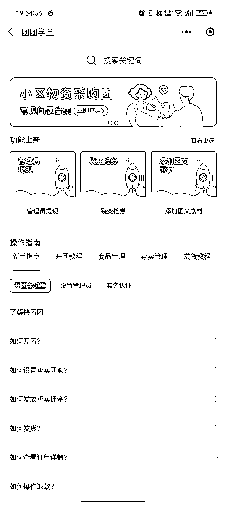
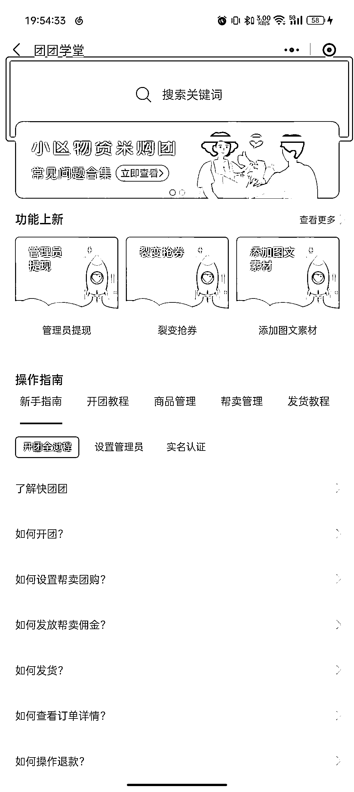

# 2.4 快团团其他功能讲解

「2.2 如何运用快团团进行帮卖 - 基础流程」中，我们主要对开团与帮卖的流程做了梳理。但在实际操作中，我们往往还会遇到一些更个性化的问题。

对官网的高频问答做了梳理后，我们整理了一个问答库，大家可以根据自己的实际情况，点击具体问题查询教程或答案→点击跳转（文末附录：快团团高频问答库）

更多问题解答，大家可以从手机端进入快团团小程序，找到团团学堂。需要注意的是，团团学堂中的部分解答可能过时，如果无法解决你的问题，可以在航海群中 #举手求助（本次航行期间）。

操作路径：快团团小程序-个人中心-官方客服-团团学堂

对于自己想问的问题，也可以直接检索关键词，寻找答案：

