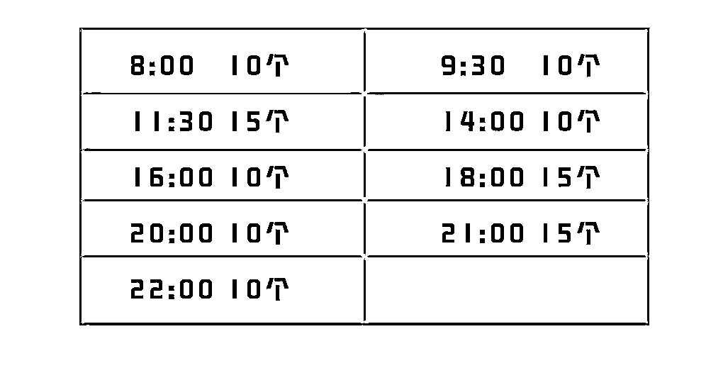

# 3.6 方法六：铺量上品让好的品自己跑出来 @五加皮

常见的一般有两种选品方式：

•有特别好的、精准选品直觉，一上一个准，上一个爆一个；这个是天赋的事情，我们不讨论，反正我是靠努力，但是我也负责任的告诉大家，努力就是有用。

•铺量上品让好的品自己跑出来（🌟这也是我的方式）

每天上 100 个品，是一个合适我们的数字。分哪几个时间段上很关键。

每天这 100 个品是哗啦啦一下上完吗？不是！下面是我们的一个上品时间（和发朋友圈的时间点类似）⬇️

选品+上品时间：

8:00 10 个 （🌟上班早高峰）

9:30 10 个

11:30 15 个 （🌟吃午饭休息）

14:00 10 个

16:00 10 个

18:00 15 个 （🌟下班时间）

20:00 10 个

21:00 15 个 （🌟晚上刷朋友圈高峰期）

22:00 10 个

还有一个关键点，这里存在一个工作日和周末的区别，尤其到了周五晚上开始，到周末，你只有在 22:00 前后上品效果明显，这一点要结合自己的用户群来做测试。

100 个品哪儿来？

•找大团长，盲上，好的马上拿货（自己测评，加推朋友圈）

•快团团官方商店（多多商品库还有对应的素材群）

•别的平台（拼多多、淘宝、抖音）卖得好的搬过来，做无货源（一般人我不告诉他）

内容来源：《私域如何转型做快团团？10 个月一千万，我做对了这 3 件事》

