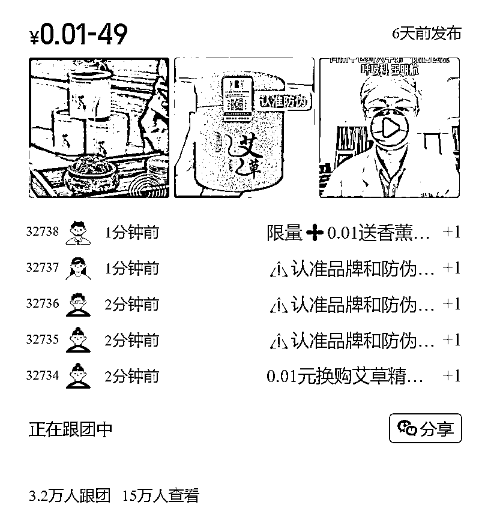
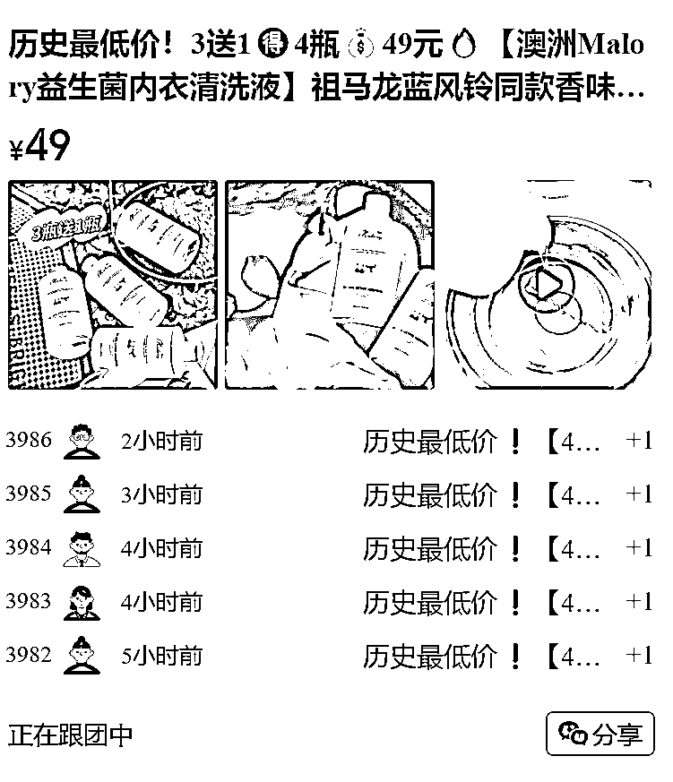
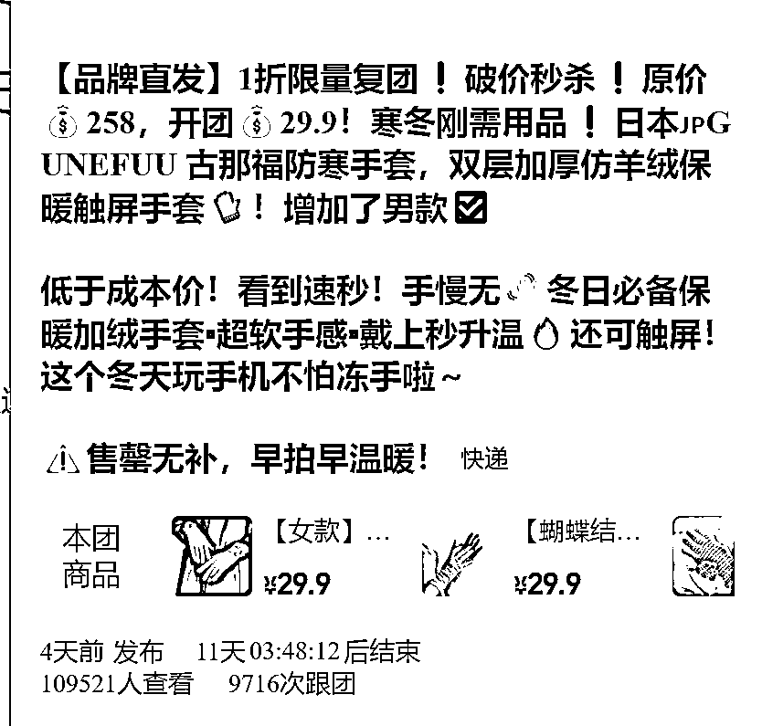

# 3.7 方法七：剖析用户+测品+筛选产品渠道+确认产品 @叶子

1）剖析自己的用户

大多数的帮卖团长，基本都是萌新开始的，兼职卖货，或者零散时间卖货，没用一个专业的团队，所以自己仅有的客户，怎么让其价值最大化很重要，我这里不说运营方法，只说产品。

剖析自己朋友圈的客户的消费水平，生活在几线城市、住在什么样的房子、开什么样的车、周边的商场等级，就足够去判断自己做什么调性的产品，判断主流是做常规品、新奇特品、小而美产品、品牌产品、进口产品等，这个过程中不会也不碍事，后续会说测品。

年龄层次和性别，这个特别重要，如果你的客户都是男性、年轻人，建议慎重考虑，因为快团里面的供货团长的产品，基本都是围绕 30 岁以上的女性，如果你的客户群体和快团供货团长产品不太搭配，就很少有产品适合给其帮卖。

2）测品

分析好自己的客户后，大多数都还是存在很迷茫的情况，这个时候，测品就非常重要，一定不要盲目的去选，会消耗掉自己客户信任度。

首次来你团买东西的客户，基本都是抱着尝试的态度，所以让客户试错成本越低的产品越容易成单，一旦成单了，后续的服务到位后，客户就容易发展成你的忠实粉丝，所以第一印象特别重要。

首先推荐大家做生活日用品，一开始测品的产品，一定不要选择什么服装、美妆啥的，一定要换位思考，选择大多数客户都熟悉的品类，生活居家日用品，是前期应该选择的方向。

然后是生鲜食品，这个品类也同样是初次尝试的客户乐于接受的品类，但是务必务必，一定不要选择售后多的生鲜产品（除非供货团长特别专业），一个差评毁了你 100 个好评，一个差评在群里炸锅，会无限放大不良评论。

选择客单低的产品，这同样是降低客户的试错成本，花一点小钱哪怕不满意，心里也不会太难受，同样也不太会影响你和客户的关系。

初次尝试的产品，一定要去比价，正常是淘宝或者线下商超，价格一定要便宜，客户讨厌被欺骗。

最后才尝试穿插一点客单价高、利润好、特别喜欢的产品，来测试你的客户的接受度，其中数据最好的价位产品是以后核心选品的类目、方向。

3）帮卖团长选品原则

经历了测品的环节，基本可以判断自己适合卖什么了。

帮卖团长，需要秉着 3 个普适基础原则：

•相同品质的产品，你的价格一定要比其他购物渠道低；

•售后率一定要低！售后率一定要低！售后率一定要低！重要的事说说三遍，售后服务占比了你卖货 60%的精力；

•利润好，卖货是一件苦逼的活，一定要让自己快速赚钱，不然很难去坚持；

当然，这是适合大多数帮卖团长的普适原则，前文提到的新奇特、稀缺性产品，如果有就更好，但是这种产品太少。

4）筛选产品渠道

A、选品先选择人

选择了合适靠谱的供货团长，才能安心的去卖其产品，在这里，我说下对于萌新的帮卖团长的一些很实用的策略：

•选择垂直领域的很专业的团长，现在快团的供货团长已经发展成专注于自己垂直领域的产品。

例如：渔乐专业做生鲜、小 Q 米洛等专业做服装等，因为他们这类供货团长服务的帮卖团长，比全国 TOP 供货团长服务的帮卖团长要少，精力相对够，同时垂直领域、产品不差、价格不错。

也就是说，他们能给你提供一个相对产品本身质量好、服务又好的产品。

如果你一个萌新团长上来就去帮卖全国 Top 的，你在他们几万个帮卖团长中得不到重视，产品再好服务不好都是对你的伤害。

明星团长也是相同逻辑，明星团长是处于发展阶段的供货团长，官方认可的团长，他们产品相对要求高，但是下面的帮卖团长不多，服务效率也跟得上。

•Top 团长

能成为 Top 团长，其产品价格基本没有问题，一定是最优的，但是其服务速度可能会有一定的延迟。

•权威推荐

有一些行业内相对权威的玩家，专门在私域里面玩，他们推荐的一些团长也是靠谱的，例如：生财。

B、供货团长怎么来？

•平台推荐

有一些行业公众号会推荐一些团长。例如：快团团团长推荐，呱呱爆品，其中呱呱爆品是我常用的快团团分析工具，上面很多团长排名、爆品数据，值得关注（Ps：部分内容收费）

•找专业快团服务团队咨询

5）确认产品

A、别人卖的好的产品（跟团数高、转化率高）

快团里面转化率高于 10% 的就算非常好的产品，常规产品转化率一般在 5% 。这类产品，有 2 个优点：

•能降低你的试错成本

•利用消费者的从众心理促进容易开单

例如：跟团数 3 万+ ，转化率 21% ，属于超级牛品，一个月可能快团就个位数。跟团数超过 1000 ，转化率大于 10% ，基本可以安心的去帮卖。

B、差价大，全网最低价，利润好的产品

这点就是我说的选品的普适原则，选择到这种品，可能不一定爆，但是一定不会让客户骂，是加深下单客户关系的产品。

一般来说，团长敢说全网最低价，基本来说是对标淘宝最低价，而且这种产品的数据相对都不错。

这种原价 XXX ，开团 XX ，一定是你需要重点选择的，这种产品，一般的客户都无法拒绝，这种产品一般是品牌清仓、或者临期的产品。

C、标题很牛逼的产品

这个特别重要，是帮卖团长，尤其萌新帮卖团长选品特别适用的技巧。

上面我截图的几个案例，就是标准标题特别牛逼的，这类产品，客户看了，基本都心动。常见的牛逼标题，客户很心动标题模式如下：

•原价 xxx，开团 xx；•几折清仓；•历史最低价；•0.01 或者 0.1 抢购；•山姆、ole、COSTCO 等同款（这类标题是突出产品背书，容易引起客户信任）等

一切让消费者看起来很劲爆、信任度高的产品标题，都是优先考虑的，一定需要减少客户下单的心理包袱。

D、链接内容，前面和尾部的内容很有诱惑力的产品

私域或者说快团本质还是电商，就必须遵守电商的基本逻辑，消费者下单大多数只在一个链接停留 3S ，如果前面的内容和后边内容不丰富，这个产品可以选择不卖了。

本着基础逻辑：快团本质还是电商，客户看不到实物，选择的产品链接内容，需要让用户感觉性价比特别高。

内容来源：《从供货团长的视角，来讲讲选品和售后》

