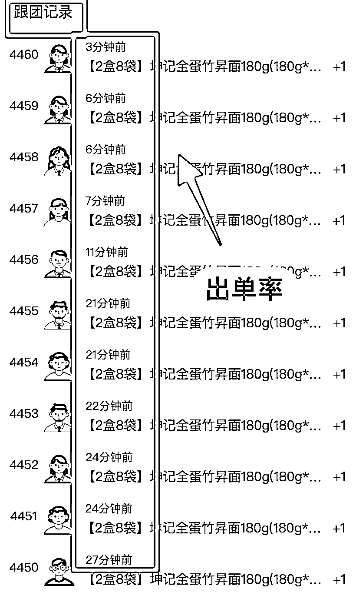

# 3.8 方法八：用数据来支撑选品和推品 @小白

首先是人群维度，对我们来讲最重要的 3 个维度是：

•用户性别

•年龄范围

•需求维度

比如用户是女性、30～50 岁妈妈/奶奶/外婆、比较关注孩子学习，所以选品会围绕 30～50 岁女性用户的教育需求、生活需求（打理家庭、变美等维度）展开。

然后就可以根据以下三个数据来进行选品

•转化率（查看数、订单数）

•出单率（最近订单时间排序）

•开团时间

对应的大家在开团的时候可以重点关注，基本上满足以上任意两点就会开团。

内容来源：《如何用数据来支撑选品和推品，提升用户体验和粘性？》

