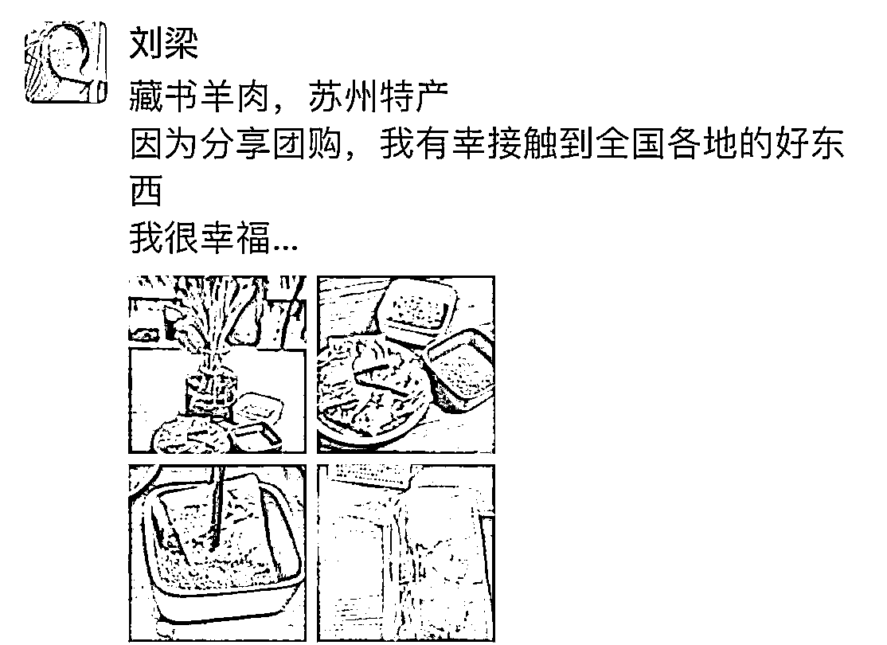

# 4.1 方法一：私域裂变+朋友圈打造，建立高信任度社群，完成冷启动 @刘梁

1\. 社群里的群友都是哪里来的？

1） 一开始是亲朋好友，身边熟悉的人。

2） 朋友圈分享美食好物后，有些人购买后，我就会去询问，要不要进群。

3） 群友们会自发拉一些亲朋好友进群，这一步裂变非常重要，因为她们都是精准粉丝。

2\. 朋友圈私域如何打造？

1） 在朋友圈里，每天早上我都会发诗歌和歌曲。

2） 分享每天团到的团品，当然是喜悦的，享受的气氛

3） 真实的生活分享，有时候也会吐槽一下。让大家看到一个有血有肉有灵魂幽默的我。

4） 朋友圈也会有鲜花啊，健身啊，旅游啊，这些情绪价值的东西，让大家看到一个积极的，热爱生活的我。

3\. 如何赢得群友的信任和认可？

1） 真诚，还是真诚，真诚分享，好的地方分享，不好的地方也都坦诚告诉大家。

2） 品质，永远还是品质，品质是社群的基石，离开了品质的团品，只能是灾难，所以，在选品和选供应链这块，严格谨慎，毕竟，不好的东西，很快就会在群里传开，臭名远扬了。

3） 责任心，是社群的保障，如果选品不小心踩雷了，一定要积极面对，改售后的售后，改补偿的补偿。譬如有的衣服，供应链不让退换，我就会让群友给我，自己留着穿或者送朋友，不能光想着赚钱对吧，也要拿出一部分做好保障的，让群友知道，即使我在你这里买到的东西不好，也是有人兜底的。

4\. 建立社群矩阵，加大社会联系触角

除了好物分享群，还可以建立其他社群，加大社会联系触角。

譬如我还有 1 个社群是分享学习的，有 1 个社群是断舍离群，还有 1 个社群是专门卖有机菜群的，这些社群矩阵都可以为团购群引流。在那些群里的无私公益付出，也是为我在好物分享群里做了背书，并且团购群里的人都是强链接的，很少有人退群。

内容来源：《一个转化率 40%的乌托邦式的社群团购是如何做到的》

