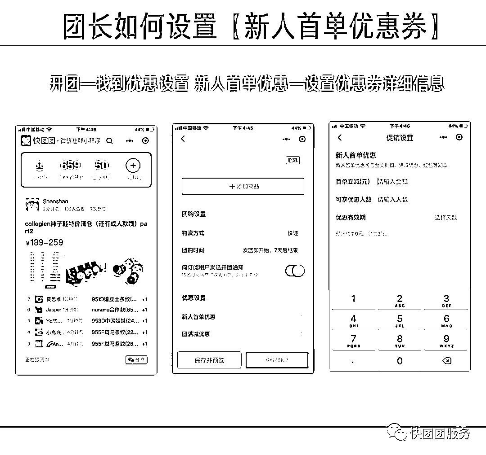
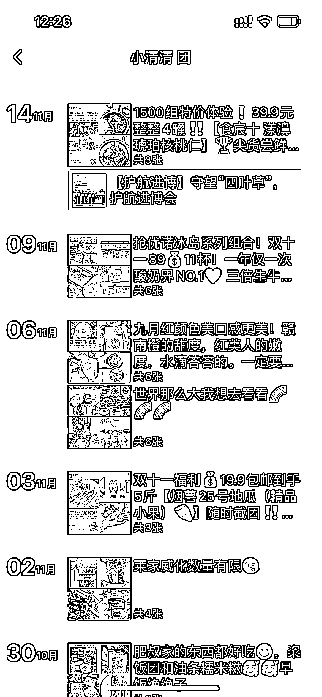
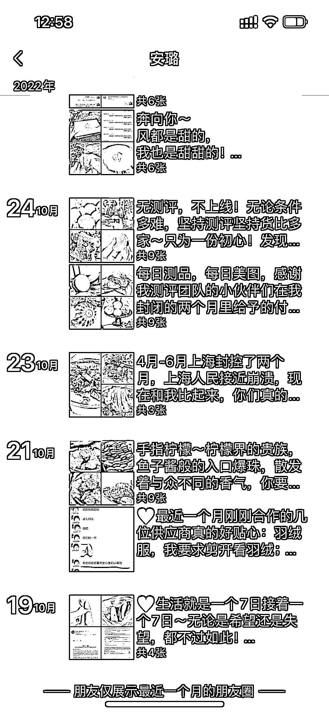

# 4.4 方法四：埋伏群「托」，定时激活社群，人情味形象更打动客户 @102℃De 月亮

冷启动比较推荐的方法，是让几个自己关系好的朋友先埋伏在你准备好的社群内部，同时制订好社群简介和群规则，在你正式拉人进来的时候可以帮你附和。

同样，你也可以利用提前埋伏在群内的“托”询问大家有什么想要的产品，通过“托”的嘴把你接下来要上架的产品推出来。

当然，也不能一直用这招，不然容易被发现。可以适当地征求下真实意见，或者去找供货大团长选一些他们最新反馈的需求。

同时，建议帮卖团长每天定时在群内抛一些话题激活群，同时用红包来收获一些真实的好评返图，大单也可以适当给一些返现奖励。

刚建的新群活跃度是最高的，所以我们可以利用快团团配套的工具玩法设置游戏，比如说首次下单有新人首单优惠等等让顾客下单，收货后再收集一波好评，第一波启动就没那么困难了。

•新人首单优惠教程：•#小程序：//快团团/DcrMj1Eikhio31u（复制该小程序文字到微信打开）•实操举例：团长欣欣最近通过自媒体，引流了一批新人进私域社群。但发现新团员多持观望态度，一进群便“休眠”，迟迟不产生订单。着急看到转化的欣欣，在群里设置发放了新人首单专属优惠券：首单立减 2 元，限制人数 120 人，有效期 3 天。又同步开团了几款低客单价商品，等于几元钱可以买十几块钱的东西，新人们纷纷下单。在一个 500 人群中产生了 109 单新人订单，转化神速。部分新人首次下单就订阅了欣欣，这样每次开团，他们都能收到通知。•【操作路径】：创建普通团购→更多团购设置→新人首单优惠•图片教程：

一定要发朋友圈，不要抗拒或者担心发了朋友圈以后会被拉黑，但是一定要控制好发朋友圈的频率，太多低质量朋友圈会拉低别人对你的期待，也不要纯带货，夹杂一些生活气息类的内容会更有人情味而不是一个没有感情的卖货机器：

