# 4.6 方法六：公域平台引流+朋友圈运营 @五加皮

1）公域平台引流

先说第一个问题，公域怎么导私域？

同样的方法，抖音、知乎、快手、微博、小红书。。。用我的方法，这些平台你一样可以倒过来，因为人性是一样的；当然了，也可以用这套方法把你朋友圈的用户导流到社群。

最常用的 5 个方法：

•送优惠券

•抽奖（我最常用）

•折扣

•送资源/资料

•免费的引流品（比如：送你 100 片面膜；承包你 3 个月的纸巾等）

接下来看案例⬇️

我用了 4 个奖品钩子来引流，分别是：抽奖送英文原版书、送价值 129 元的泰国 Ray（射线）面膜以及 20 元无门槛优惠券，还有英文原版杂志：

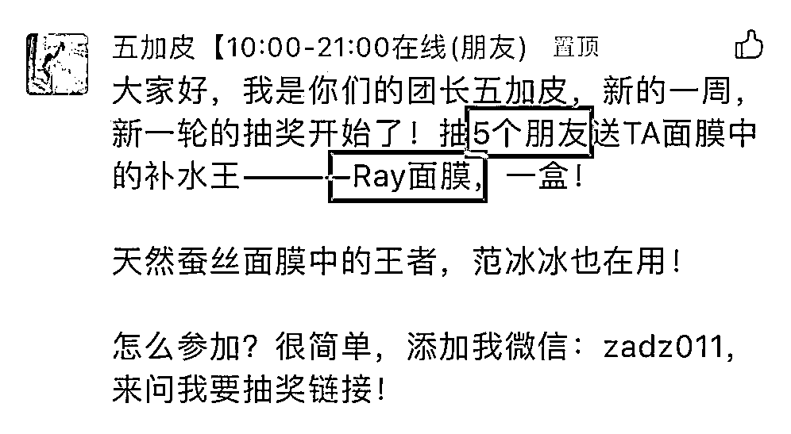

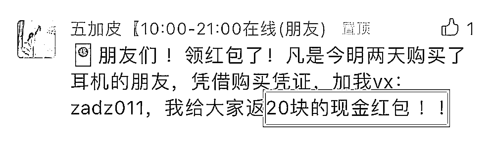

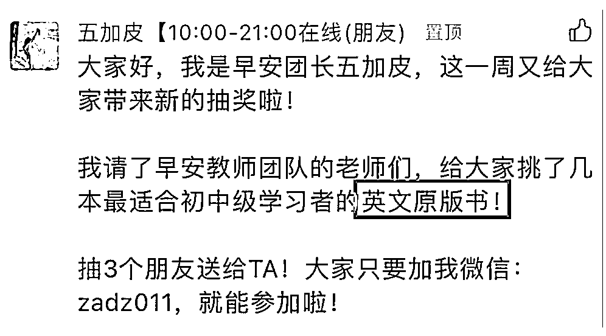

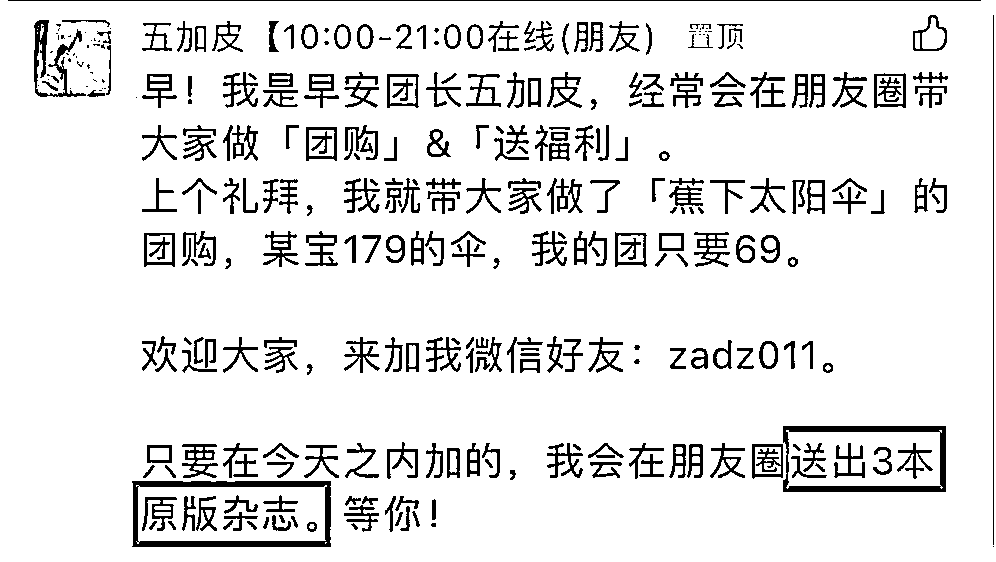

大家猜一猜：哪一个抽奖/引流效果最好？

经过我们数据验证过的：效果最好的就是英文原版杂志和英文原版书，因为我们的流量很精准。

这里我就不多拓展了，大家对自己的用户是最了解的，要强调的是——抽奖的奖品，选品非常重要，直接决定了你的导流效果。

我们目前的情况：每周开一次抽奖，平均每次抽奖可以带来 300-700 订阅，4-600+私人微信好友。

2）朋友圈怎么发

第二个问题，我知道也是生财里困扰很多新手朋友的问题——朋友圈怎么发？

大家来做一道填空题：

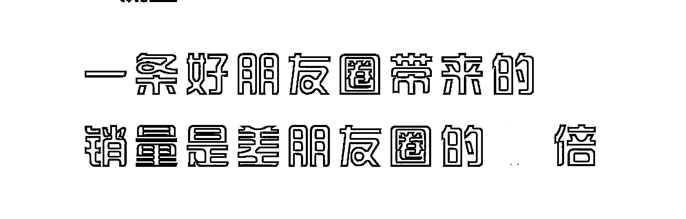

答案是 10-20 倍！

接下来我会从文案、配图和发圈时间来分享怎么发好朋友圈：

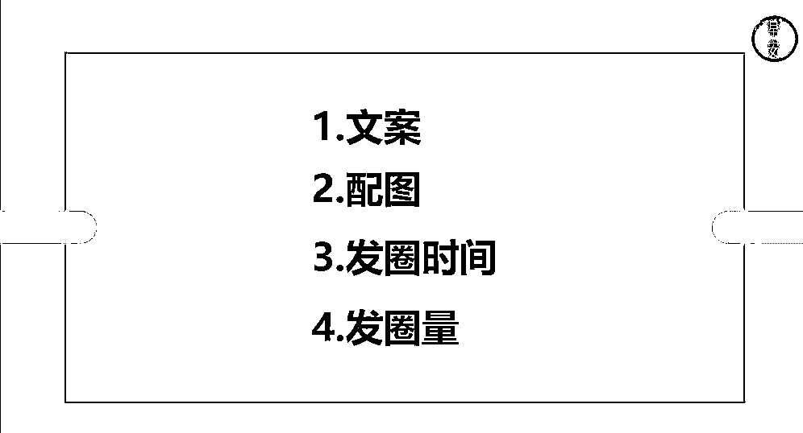

A、朋友圈文案

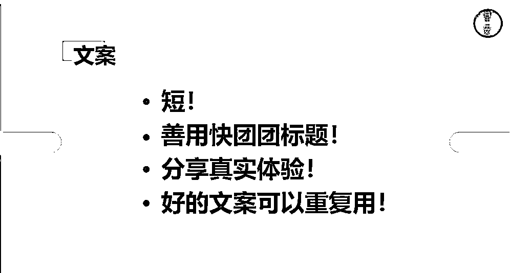

好的文案不需要太长，控制在 4 行，每行 16 个字以内，就不会被折叠，太长没人看，短不是要点，精炼才是。

不会写文案？每个人都有体验，比如你去包子店吃了一个包子，这个包子好吃还是不好吃，你是有感知的，把你的真实体验分享出来，就是最好的文案。

还是不会写怎么办？对于大团长来说，他们都是有专门的文案团队的，标题就是对这个品特点的最好概括。快团团标题复制修改，把重点信息摘出来，把文案变精炼。这一点我推荐大多数人，一是节省时间，二是真的有效，这是一个可以批量化生产的事情。

还有好的文案是可以重复用的，我们的文案都会不定期给文案复盘，做记录，到底哪些文案转化最好。

给大家举几个例子：

内裤的文案大家觉得可以怎么写？

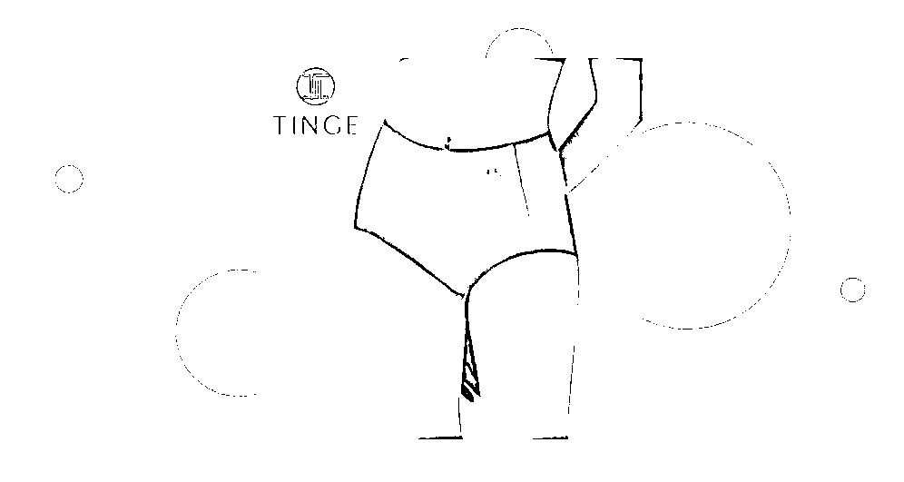

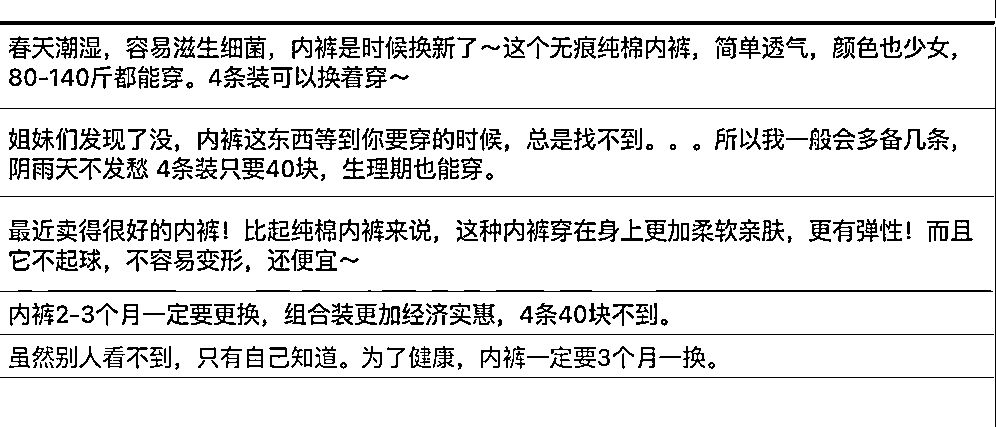

这条标红的关于内裤的圈，我印象很深刻，只要一发这条朋友圈，内裤订单 10+ 以上，而且我会不定期重复拿出来发，我都不需要说“哎我的内裤好啊，快来买吧买吧”，只要发这条文案，带上内裤二维码，就能哗哗出单。

接下来防晒衣，也是夏天的一个爆品：

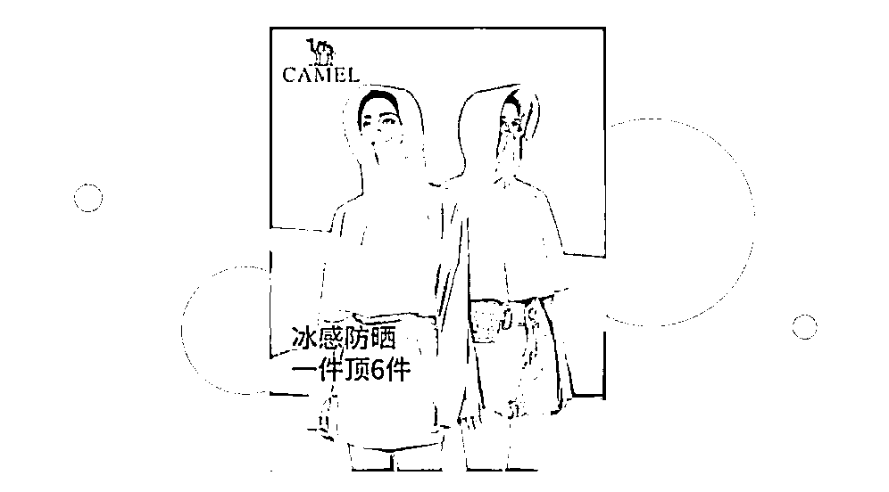

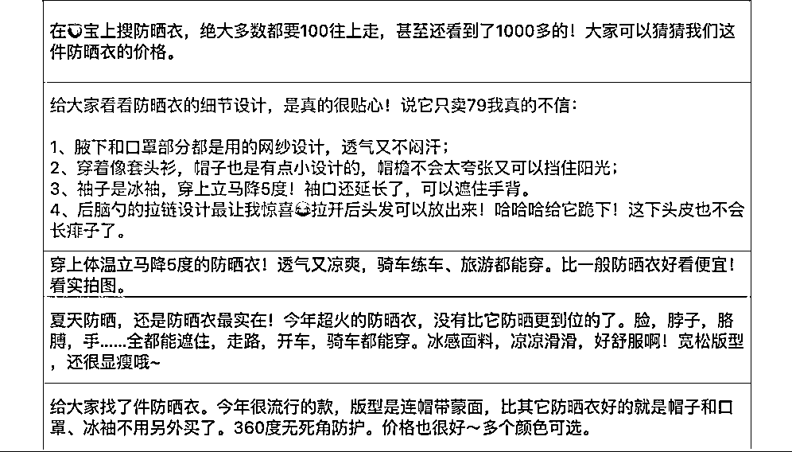

大家可以重点看下这条朋友圈，我圈红的，就是关于体验型文案最好的例子，虽然字多，但是排版上注意列了 1234，显得很有条理；而且它不是干巴巴的体验，它是有情绪的，比如“我真的不信”、给它跪下！

B、朋友圈配图

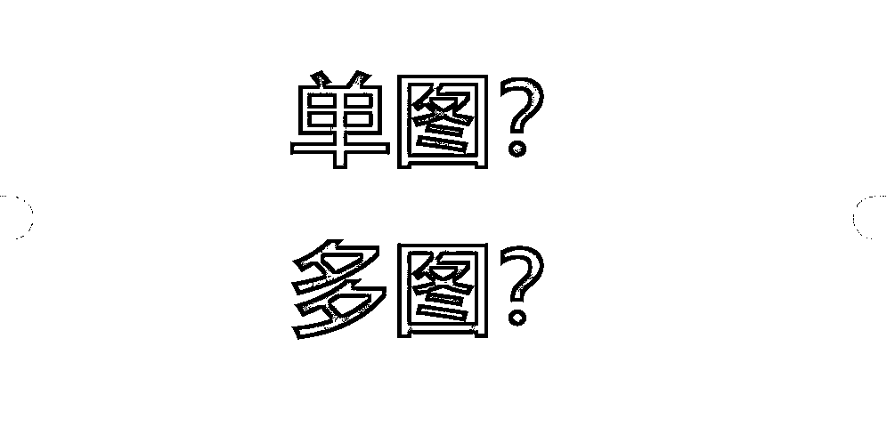

互动：你们觉得是多图好还是单图好？为什么？（大家都在说多图啊）

这里要分情况：

•食品类、服装、鞋类强烈建议发多图，而且是好看的模特图、实拍图（ 3-4 张）

•日用品类、引流款放单张图（引流款比如 9.9 的紫米面包，一箱，它的优势在价格，凸显价格就够了。)

这些方法都是可以用来批量化生产的，很好复制。

C、发圈时间

关于发朋友圈，大家都知道文案和图片很重要，很容易忽视发圈时间。

互动：你们觉得什么时候发圈好？

这 5 个重点时间段，是一定要发的：

•8:00-8:30 上班高峰期

•11:30-12:30 午饭休息时间

•16:00-16:30 肚子饿了，发吃的

•17:30-18:00 下班高峰期

•20:30-21:30 晚饭后睡觉前，所有人都在玩手机

下午四点和晚上我们会集中发食物（不是米粮油，是零食这些）淘宝有个数据，下午四点的时候是逛淘宝高峰期，其中零食又是这个时段搜索最高的关键词。

D、发圈数量

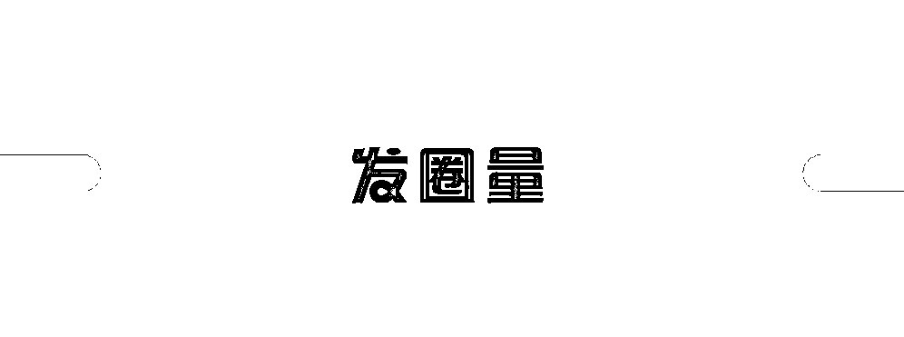

关于发圈量，我们是怎么做的？

我们早 8:00-23:30 ，每半小时 3 条圈，原则是每一个时间段均匀的出现在用户的朋友圈里，多做触达。

很多人怕发多了被删，收到一两个好友提醒就开始担心了，这样发不行啊。你加他是干嘛的？给你朋友圈点赞吗？你是卖货的！不在你这里花钱对你来说就是 0 价值用户，删了不用觉得可惜。

如果不知道是不是对，跟着我做就好了，一定有用，一定要多触达用户，他都看不到你的圈，怎么会在你这里花钱。

总结一下，怎么运营好私域呢？翻译下就是，我每天疯狂发圈，怎么让人不删我？

人设很重要！要利他、要真诚、要解决对方的问题。

我的朋友圈人设：就是一个喜欢抽奖送礼+带着你薅羊毛+性价比好物，会经常在朋友圈分享好看的照片、有趣生活，长得像泰国人的 90 后女生。

不管每天发多少条，别忘了每天保证 3 条私人圈！

内容来源：《私域如何转型做快团团？10 个月一千万，我做对了这 3 件事》

