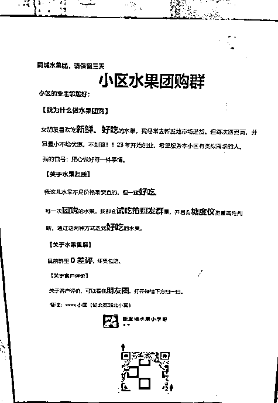

# 4.7 方法七：线下广告引流 @李晓飞

小区内做线下广告引流主要有两种办法：

一种是直接建水果群。简单直接精准。

另一种建「小区闲置群」，这是刚需，加群的转化很高。因为你是群主，后面和小号配合洗出购买群。另外闲置群有太多变现模式了（这儿不多说偏离主题，反正有用户需求的地方就有钱赚）。

这两种对于某个小区的宝妈来说都是比较合适的。

此外，你还可以和门店 / 快递点合作，北京费用在 100 元 / 月。

和老板利益绑定，作为自提点，按单量分成，这样拉人效率更高。通过多多驿站、美团自提点这种方式来找合作，因为本身他们就在搞自提，也希望赚钱，谈起来更容易。

还有个另辟蹊径的办法，但需要结合具体城市、具体小区的情况来判断是否能这么做。

如果你想引流的某个小区可以帖广告，那么以下是一些小技巧；

如果小区内不允许这个动作，那么是否尝试这个办法需要你自己判断，可以尝试贴在公示栏等地：

1.高层坐电梯上去，一层一层往下贴。低层贴单元楼门口（爬楼太累了），最好在有专门公示栏的地方贴。

2.时机：周五下午 4 点左右贴比较好•周六日大家有空出来转•夏天比冬天好，夏天暖和大家出来转悠；天黑的晚留存时间长。

3.用喷胶贴，一喷一贴，效率超级高。不要喷的太多，稍微沾上就行（用胶带啥的落伍了）

4.广告文案参考

内容来源：《新手做水果团购，首月交易额破 2 万，我是如何从 0 到 1 的？》

