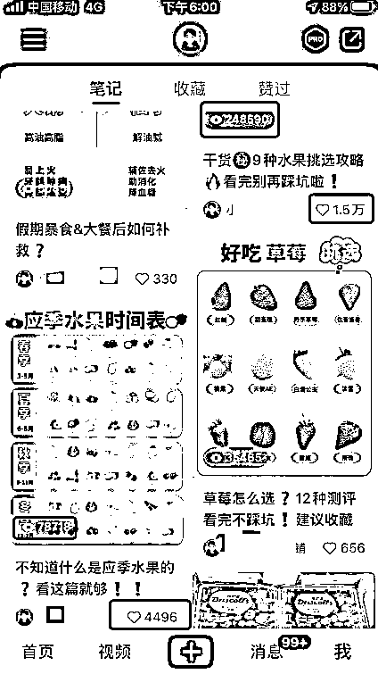
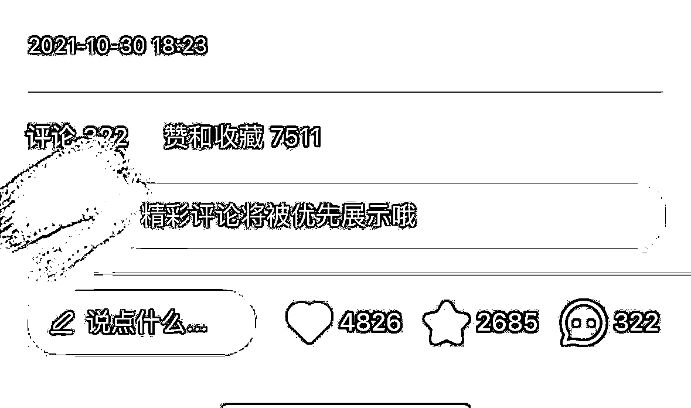
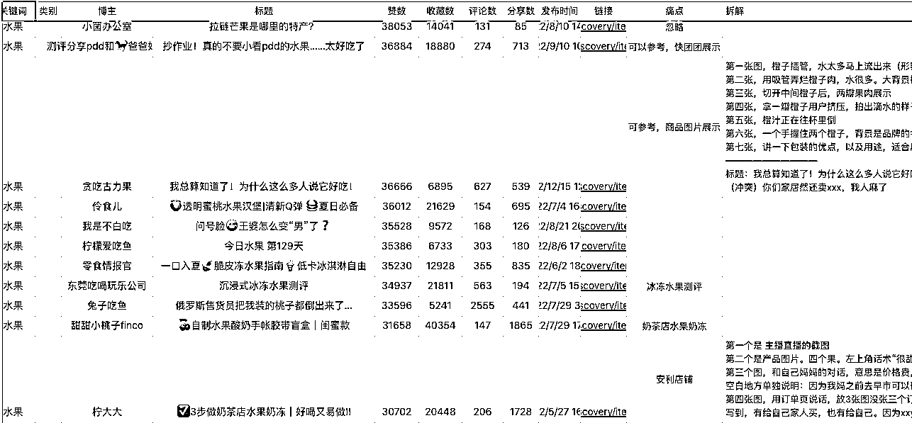

# 4.8.2 如何做笔记内容 @李晓飞

选题像电商选品一样重要。我的选题分为：干货类（挑水果小技巧）、产品素材类、稀缺内容类。

干货类：比如“挑水果小技巧”话题非常容易爆。我 0 粉账号做到了 1.5 万赞，但是下单人数很少，原因是相关性不大。优点是可以涨粉，粉丝用来背书，还可以提高账号权重。

•如何写干货内容？

参考小红书已有干货内容 + 加上搜集的资料 + 加上自己认知的加工

其中产品介绍类的内容素材，吸引到的用户足够精准。创作门槛低，靠量怼。可能每个播放 500，但一天发 10 个就是 5000。

•素材怎么来？

自己买产品实拍，最好是各个角度多拍几张，分开几天发布。

•稀缺内容类怎么做？

找平台稀缺的内容，能让你的笔记持续火爆。

举例：这篇笔记讲关于国外软件，一直有流量进来，因为平台可选择的内容不多或没有时，会推荐你的内容（数据截止到去年）

•怎么找稀缺内容/词（词代表着内容）

1）在 [`account.5118.com/`](https://account.5118.com/) 通过一个关键词找相关词、行业热词；通过小红书下拉框、推荐词等等方式找。

2）在小红书搜索对应的词，看他的笔记数量和阅读数，差异大的就是稀缺内容。

如果想要提高效率，我们就可以采用套模版的办法，找到好的模版一直持续发。

•如何找模版？

1\. 找到业务相关话题词，如水果、团购等

2\. 用后裔采集器爬前 500 条数据

3\. 从一条条数据里找到共性，选题、模版共性。重点看低粉高赞、低粉高评论的内容

4\. 按照模板 1:1 发（把对方图片放到软件上，图层放到最底下。然后在上面开始创作，模仿位置、字号、文案、颜色、图片等等）

5\. 持续发，不要停

如果你需要更系统的掌握小红书笔记内容如何制作，小红书账号如何运营，那么可以到「5 月航海｜小红书运营｜实战手册」进一步了解。

