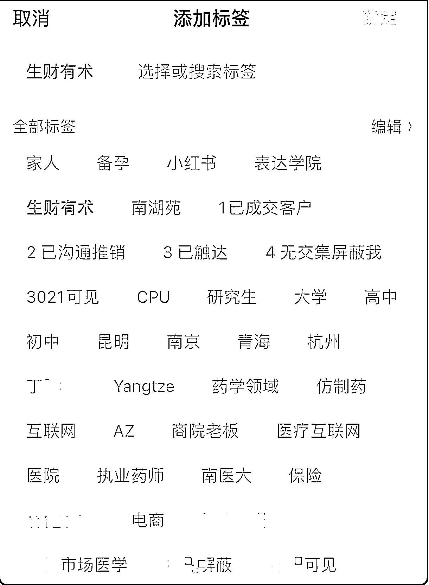
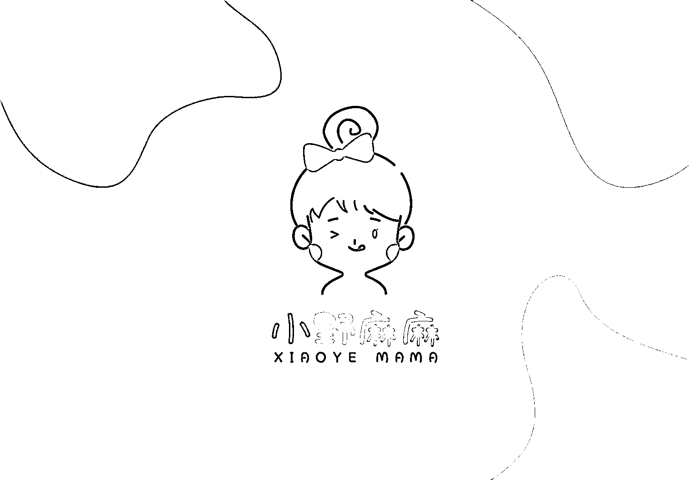
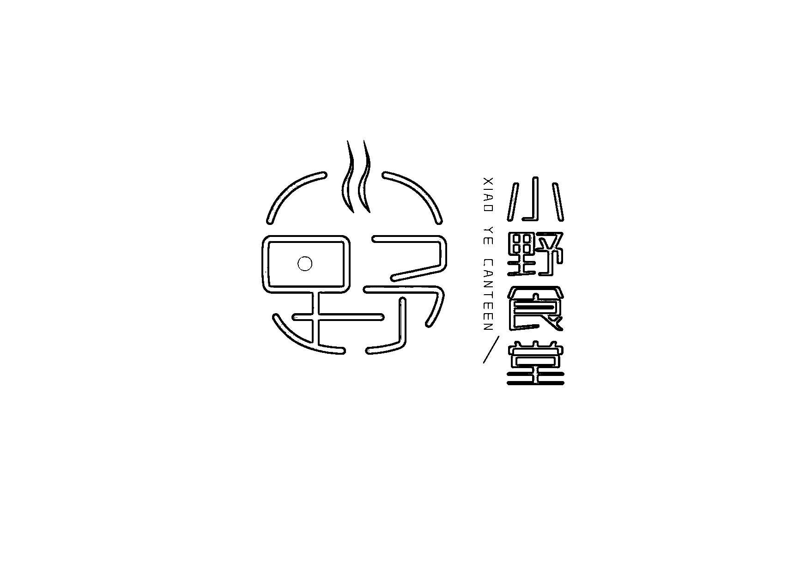
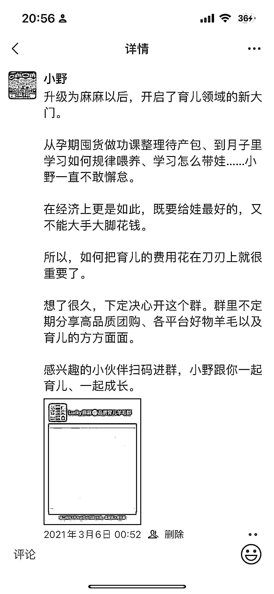
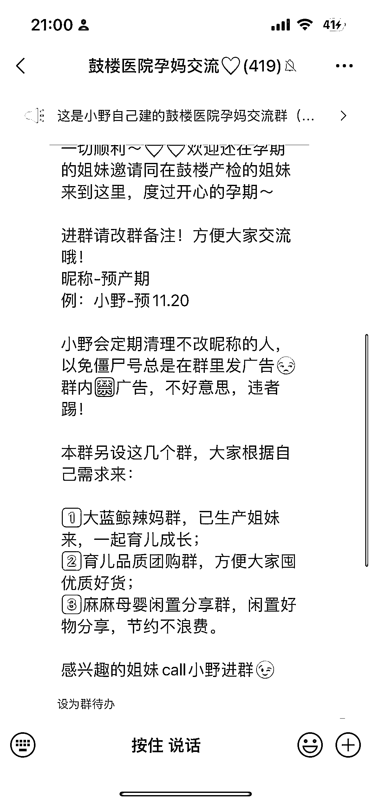

# 4.8.4 如何建群 @小野

（1）建群前准备

把引流的小红书姐妹正式转化到团购群之前，我做了几件事：

•第一，从引流开始，每个人微信我都打上了标签“小红书/备孕”，这为发朋友圈做基础；

•第二，转化之前，建好了群，写好群介绍、群规则等，甚至后来我还做了团购主页的品牌 logo，更有专业性；

•第三，写好群介绍和群邀请，不要随便一句话，发个二维码，一定要有态度、有温度、有共鸣，给别人进群的理由。

（2）群邀请：一对一沟通邀请、每个群都设置触达和转化的钩子

由于有很好的信任基础，我一对一发消息，跟对方说明，我也建立了一个团购群，如果对方感兴趣，可以来玩，大多数姐妹都是会进群的。

此外，因为我有好几个孕期交流群，就可以做群之间的转化。这样，我建立的几个社群都联动起来，不浪费。

（3）群裂变：真诚和口碑才是王道

团购群新建立时，大多数人会观望一段时间后才下单。

不过当有过好的团购体验后，姐妹们开始主动邀请她们自己在的其他育儿交流群的人进团购群。实际上，后来主动裂变的人数是超过前期的硬广拉新的。 因此，我的总结是，想要实现群更大的裂变和价值，真诚和口碑才是王道。

内容来源：《新手做水果团购，首月交易额破 2 万，我是如何从 0 到 1 的？》、《作为职场宝妈，我如何从小红书引流并做到百万营业额的？》

