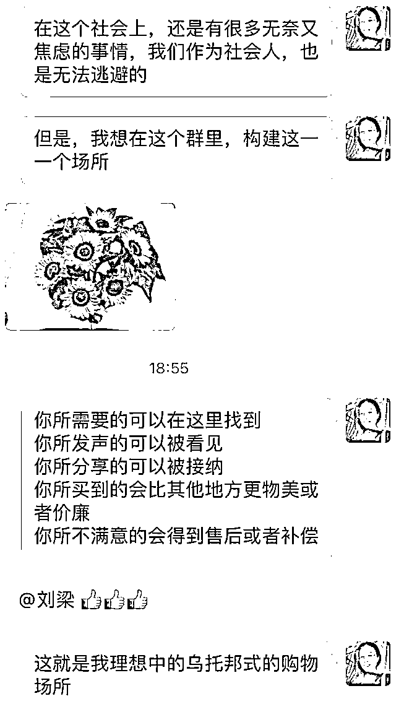

# 5.1 方法一：打造乌托邦式社群，转化率高达 40% @刘梁

我的理想是，建立一个乌托邦式的社群，在这个社群里，你所需要的好东西都可以找到，你所有的问题可以得到回应，你买到的任何东西都可以在群里和大家分享讨论，而且社群里的东西价格要比公域的价格更划算，任何东西不满意都可以得到妥善的售后。

社群团购天然就带有解决大部分购物痛点的属性，而我在这个基础上，为达到一个理想化的乌托邦式的购物场景，又做了一些改进和升华，具体我是这么做的：

1） 构建社群文化，每天早上，我会给大家发一首诗歌和音乐，和一幅绘画，让艺术滋养人心，人在世上，唯有爱和艺术是最美好的东西，我们要享受艺术，享受爱，人生意义不只是赚钱和奋斗，在爱和艺术的滋养下，我们的人生是兴致勃勃的，也是精神饱满的。

2） 每个人在群里的反馈都会得到回馈，无论是好评和差评，都有人回应，而且允许群友分享差评的东西，告诉其他人，这个东西不能买，真实的反馈，让每个人都得到了尊重。每个人在群里的精神是自由的，无忧无虑的。

3） 大部分团品我都自己亲测过和比较过，保证团品的品质。亲测的过程中发现了大量优质的，物美的东西，这样也有底气分享给群友了。

4） 群里每个人都可以分享自己的生活经历，健身心得，去过的好地方，吃过的好东西，在这个群里，大家都是朋友，亲人，强关联的关系。

5） 所有团品如果不满意，都可以得到售后，我也是很真实地告诉大家，做团购我是有一点利润的，我愿意把利润拿出来，给大家做好售后保障，所以，所有团品退货，是可以报销运费的。很多人退了货后，不收我的运费，我就会告诉她们，这是群规，大家都要遵守的。

6） 控制价格的竞争性，让大家感受到物超所值的喜悦感。

这样运营了一阵子，大家越来越喜欢我的社群，很多人买到好东西后，又自发地分享给身边的亲朋好友，或者拉她们进群。我心里非常感动于大伙儿对我的信任，于是又在群里执行了这样一个抽奖方法： 任何人邀请朋友进群，我们都会抽一个奖，来欢迎新朋友进群，手气最佳的，可以得到一份奖品，奖品选择在 30-40 元之间的爆品。

为什么不是直接给拉群的和进群的群友发奖品呢，我是出于这么考虑的：

•因为是乌托邦式的社群，我们崇尚顺其自然，要真的发自内心喜欢，才拉朋友进群，如果用奖品的鼓励，来鼓励人拉人，事实上是违背了初心了；

•抽奖让进群的人感受到一种仪式感，而且觉得自己很重要；

•群里热闹热闹，让大伙儿都喜欢新朋友进群，有机会抽到奖品。这种发自内心的欢迎气场很重要。

长此以往，群里的人越来越多，越来越多，从去年 10 月份一开始建群时候的 100 多人，到现在的 400 多人，大部分都是人拉人进来的，有时候，我也会清理一些群里的人出去，譬如从来不发言的，从来也不参团的，或者连红包都懒得抢的。

内容来源：《一个转化率 40%的乌托邦式的社群团购是如何做到的》

