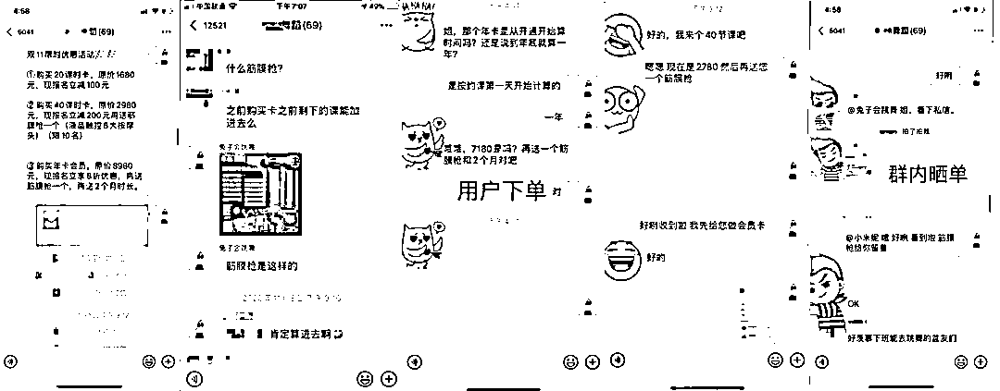

# 5.4 方法四：参考门店私域活动运营方法，烘托社群内团购氛围

1）活动预告

确定要做的活动后，可以在在朋友圈里、群里发布活动预告，告诉大家 xxx（几月几号几点）会有红包雨＋优惠活动。

2）红包雨＋烘托气氛

在距离活动开始之前的 10 分钟，开始陆续发红包，把大家的注意力引导到群里，防止有些用户把活动的事情给忘了。

等到了活动开始的时间，连续发 5 个红包，且每次的红包金额都是逐次递增。这里大家要注意，红包金额不要太小，且个数也不宜过多，确保能抢到的人有获得感，没抢到的人有期待感。

连续发 5 个红包后，开始用小号在社群里烘托气氛，比如发一些“群主也太好了吧”，或者“终于抢到了，第一次抢到这么大的红包”等等。

温馨提示：注意控制成本。

3）公布活动＋引导话题

当社群的气氛起来之后，你就可以公布你的活动或者团购商品了。

多数情况下，当活动公布之后，大部分用户其实是沉默的，用户都在观察，卖货社群就是这样，需要有人第一个站出来引导情绪。所以，小号这个时候就该出场了。

根据参与活动的人数，你可以用 2-3 个小号，或者更多，提出不同的问题，注意不要太刻意。而且，小号不能连续说话，A 提出问题后，可以稍等一会，看有没有其它用户咨询，如果没有，等群主回答问题后，B 再继续问。

这里要提醒大家，小号千万不要说出这些话，都属于太刻意：

•这个活动太好了吧，我赶紧购买一个。•这是真的吗？也太优惠了吧，比如之前看到的便宜不少。•我能多买几个吗？真的太便宜了。

以上这些话术，用户一看就是假的，瞬间就会对你的活动产生质疑和不好的感觉，也许就会退群或者大众在群里指出“有托”。

正确的做法是提问，提出一些针对此次活动流程，或者产品/服务的细节问题，我给大家几个话术模板。

•问下群主，xxx 在此次活动范围内吗？•如果我买 xx 份，在能在 xx 的基础上再打折吗？•截止日期后，我要是购买是什么价格？

4）实时解答＋订单接龙

当社群中有人提问时，一定要通过 @他的方式来回答，一个是让他时刻把注意力放在群里，另外一个是防止问题多了，大家不知道你在回答谁。

这时，如果有社群用户点击商品链接，鼓励他晒单并且接龙，以刺激其它用户的购买情绪。

怎么让用户晒单？可以额外给他一些福利，具体就看你的活动设置与成本控制了。

一般来说有以下几种办法：

•晒单再多送一个超值赠品•购买 x 个并晒单，可以在原有优惠基础上再打折•晒单赠送一个商品会员，未来购买其它商品还可以打折

5） 库存更新＋倒计时

最后要注意，你的活动一定要有限时和限量，否则你没办法在群里制造稀缺感，没有稀缺感，订单接龙这个动作就没意义了。

当订单接龙数量达到你的限量一半以上，或者活动时间距离结束还有一半以上，群主就可以说“还剩 XX 个名额了/举例活动结束还有 XX 小时，想要购买的朋友要抓紧了”。

6）小结

总结一下，你需要记住以下几个重点：

• 一定要提前预告，留出足够的时间去触达用户，引导进活动群。•快闪群里的小号，一定要准备好，如果快闪群用户较多，最好多准备几个用户话题引导，否则一旦冷场，很难挽回局面。•操作顺序：发红包→发布商品/活动→小号引导→用户下单→群接龙晒单→实时公布库存和活动时间 这个顺序要记牢。

内容来源：《门店私域运营｜小航海学习手册》

