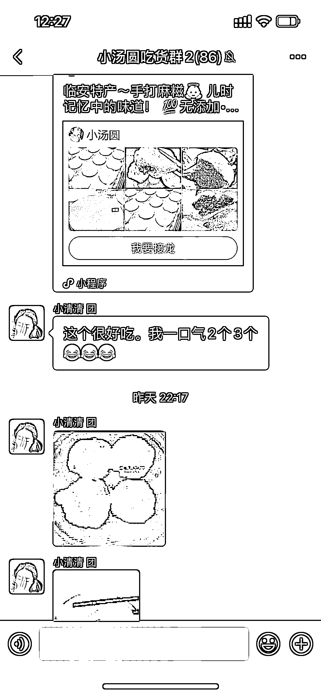

# 5.5 方法五：把握社群活跃时间，分享产品真实反馈，活跃社群事半功倍 @102℃De 月亮

每天上午十点半到一点半、晚上六点半到十点半是社群活跃时段，具体为什么？你可以想想你上班下班后这个时间段是不是摸鱼或者是最放松的时间。

在这个时间段内在群内分享产品、晒好评通常能够事半功倍。

群内分享自己对产品的真实感受会更加分，我一直强调社群团购是在私域中销售，绝对不是几个公域平台的商详图就能让顾客产生下单冲动的事情：

