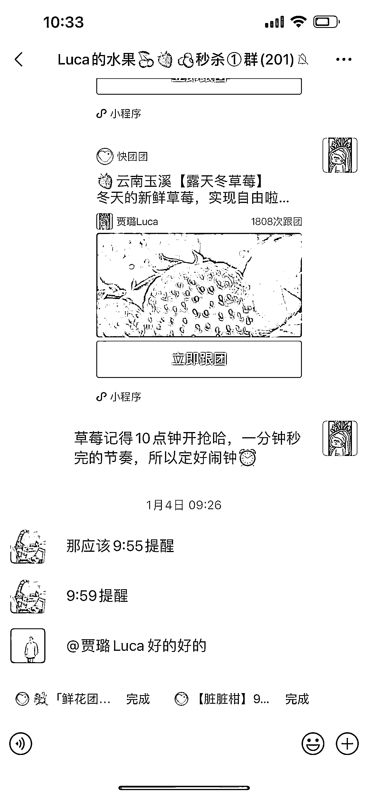

# 5.7 方法七：饥饿营销+刺激购买+同类对比 @贾璐 luca

1\. 饥饿营销：每天 10 点定时秒杀，限量 200 份，卖完即止。挺多用户设闹钟抢草莓。

2\. 刺激购买：抓住从众心理，让群里每天好评不断，刺激其他用户购买，注意：小部分用户是托儿。一定要有托儿，要不然很容易变死群。

3\. 同类对比：选品前提一定是性价比高，且品质有保障，在群里发一些知名的超市、水果店该水果的价格与品质照片。这样让用户觉得捡便宜了。

内容来源：《快团团新手如何帮卖月佣金达到 8 万》

