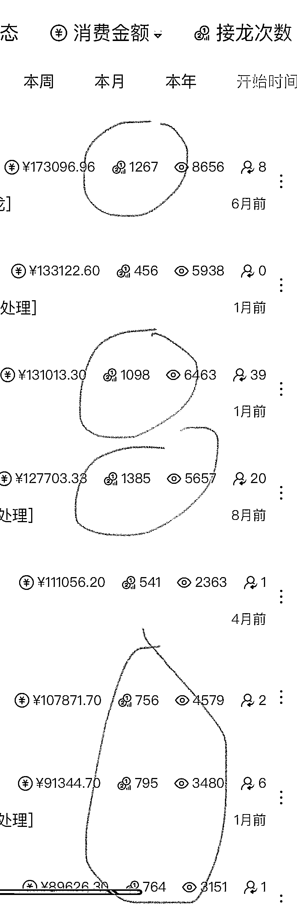

# 6.1 方法一：方法快速响应+态度要好+懂得让利+心胸宽广 @刘梁

社群团购社群团购，顾名思义，就是在社群这个场里面，通过人和人的链接，来销售各种各样的物。

快团团和群接龙就是为社群团购而生的。因为里面的商品都是一键代发，有海量的选品团长和团品供我们双向选择，而我们卖货团长，最主要的最基本的，就是要做好人和人的链接。

那么在卖货这个场景下，咱们和消费者，在哪个环节是最可能私聊的？最可能在交易过程中产生直接的链接？

对的，就是售后。

卖货的时候，她们会看朋友圈，也会看群，链接里，商品各种信息都很详细，大家都可以自己快速获取信息。

消费者最主动，最需要我们卖货团长是在哪个环节呢？就在她们收货后，发现货物不合适，发的货有问题，收到的货有品质问题，或者发错货了，这时候，就需要我们来解决了。

我们的沟通态度，我们反应速度，还有售后跟踪闭环，直接影响到消费者在我们这里的购物体验，直接影响到客户的复购，也直接影响到客户愿不愿意把朋友拉进群里来，影响我们社群的裂变。你视若珍宝，她会反馈你芬芳，当然，我还是骄傲的我，不卑微，也不求人。我们是有底气的，我们是美好商品和事物的分享者和提供者，但是我们也有责任要做好我们的售后

我的社群，从一开始的 100 多人，慢慢增加到现在的 700 多人，很多都是靠口口相传，朋友拉朋友进群的。

虽然比较缓慢，但是大部分都是有效客户，而且复购率非常高，毕竟我们社群团购看的就是复购率，最终目标就是要让一个人买 1000 次。

我看了一下，我的客户里面，还是有非常多都在几百上千次复购的。

那么具体落实到细节上是怎么做呢？我从下面几个方面和大家聊一聊：

1）快速响应

平时有空就多看看手机，看到有售后诉求，就快速响应，并且提交给选品团长也就是大团长。

•需要退换货的就要退换货地址。

•生鲜有品质问题就和大团长沟通退款。

•提交的售后如果大团长没有快速反应，后面还需要跟踪，让每一个售后形成闭环。

2）态度要好

在和消费者沟通的时候，在态度方面，我们还是报以认可，同理，解决问题出发，消费者没有对错，解决问题才是王道。

如果和消费者争论，即使赢了她又如何呢，她以后一气之下不跟你买了，损失的是团长自己，我们要时刻想着她是要跟我买 1000 次的。

3）懂得让利

我们做团购都是有利润的，要舍得提高团友们的售后福利。譬如，我给我们社群里的福利是：退换货的运费全部报销。

如果团友们不满意的东西，大团长不给退换或者售后，我就自己接了，把费用退给团友，大不了自己用或者送给朋友好了，让团友知道，每一次购物都是有团长兜底的。

只要团友购物舒适了，未来还会源源不断地复购的，或者不断帮你介绍朋友来社群。

4）心胸宽广

团长的心胸一定要宽大，要像山川一样大，配得上”团长肚里能撑船“。

举个例子：有一次，我有个团友跟我买了 37 码的鞋子，她说太小了，要退。于是安排退，报销运费。 她重新拍了 38 码，她又说太大了，还是要退。这时候，我还是二话不说给她退了，还是给她报销运费。

当这样的客户，在其他地方没有收到这种包容的服务，她就会成为我们的铁粉，连续不断复购，复购 1000 次以上。

内容来源：《讲讲社群团购里的重中之重-售后服务》

