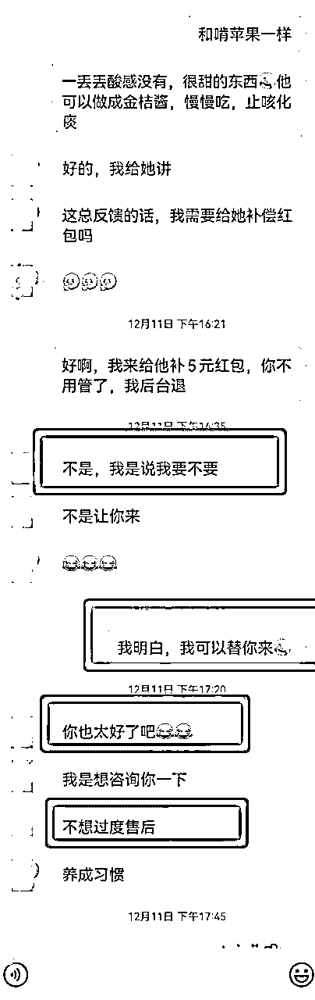
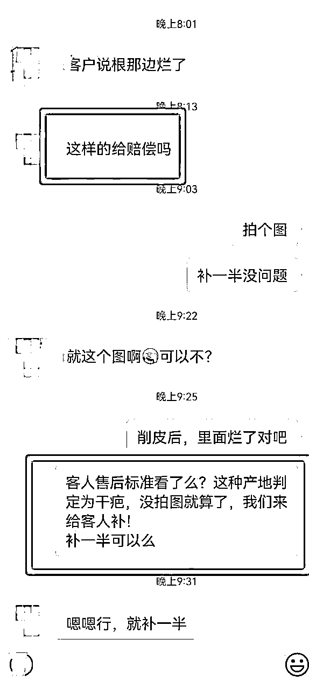
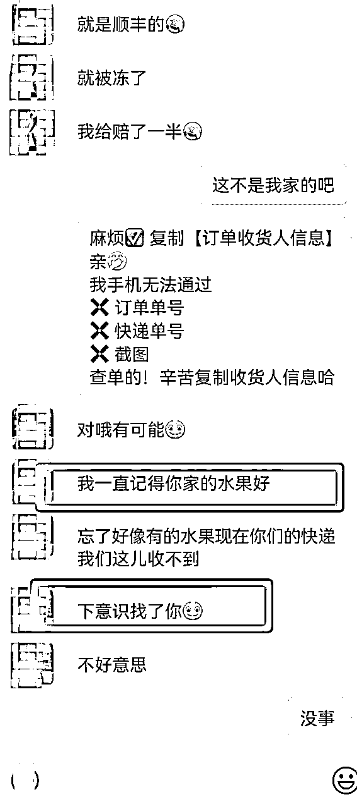
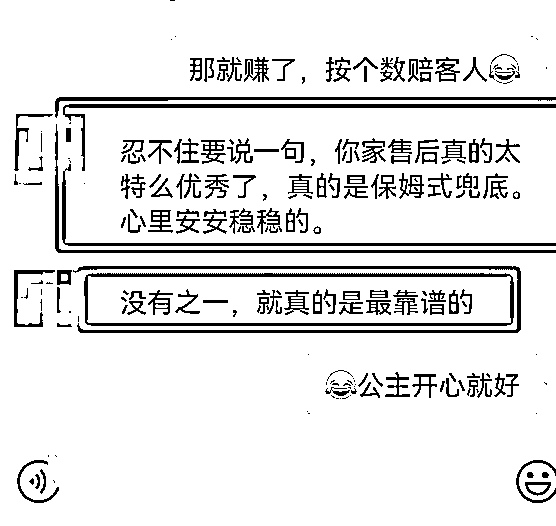
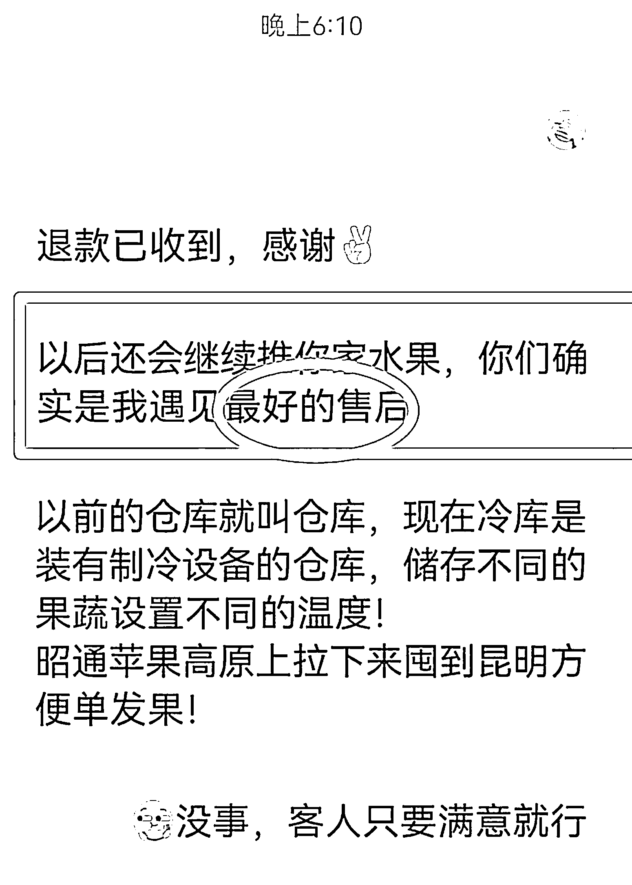

# 6.2 方法二：可度量售后+特殊售后+质疑类售后 @叶子

俗话说，常在江湖篇，哪能不挨刀，你选品再严格再小心，也必定遇到翻车的时候，翻车是一定出现的，只要你卖货，必然遇到售后。

所以遇到售后之后，首先需要心态平和，其次才是解决问题，所以怕麻烦的人做快团也会累。

我在这里提出遇到售后的看法：售后不要怕麻烦，而是区别于你和其他卖家不同的机会。客户也不是要你真正的怎样，而是需要你一个好的态度从而弥补其心理的不平衡。

我在这里说下常见的一些售后以及应对方法：

1）大多数售后是可度量的售后。

例如：催发货、快递卡件、产品质量破损补偿、退换货等。这里面最不好处理的是催发货，因为供货团长的货很多也不在自己的仓库，面对这种售后，需要和供货团长沟通清楚，延迟发货具体延迟多久。

如果延迟时间不确定，而且是不可抗拒因素造成的（灾害以及最近的疫情）直接出一个专业的说辞，让客户先退款，等发货稳定了，再让客户重新下单。

如果是商家自己原因，和商家沟通给延迟发货的客户补偿红包（基本没有客户不同意这个售后，如果有可能是红包金额不够）。至于产品质量破损补偿，灵活把控，看供货团长给的金额大小以及客户的重要性。

2）部分售后是特殊售后，主要是不按照我们的售后标准提供售后依据。

这类售后也是最头疼的。我们的做法是跟进客户的情况和态度来处理，如果客户很重要，态度好，我们会给出售后标准，然后会说下次还请提前准备售后依据，这次我补偿个红包（其实这类客户要的也是一个好的态度），这里我举一些案例：

有客户反馈，丑苹果没有果柄，是不是不新鲜？很多卖家会回复客人：生鲜运输过程中有水份流失很正常，除大面积磕碰和腐烂以外，没办法售后；这种回复，客户是不认可的，他就觉得找你买货，品质不好；而且很多人的评判标准是不同的，卖家觉的这个苹果又不皱皮怎么会不新鲜呢？

卖家就是认为，一定放很久了，不然果柄怎么都会掉呢？当你告诉客人：我们的丑苹果都是 15 年的老树果子，很多果树没有改良，所以采摘没办法剪果，都是扭下来，他当然就没有果柄啦！！很轻松的一句话，打消了客人所有的顾虑，找你买果，少了些猜疑和担心，多了份信任。

3）少量质疑类售后。

主要表现出是不好吃、不好用等，这类售后解决，在私域里面不要用电商的售后标准去解决（例如：千万不要说：口感问题不售后）。

这类售后一定需要秉着两个态度：专业知识+诚恳态度。

我这里举个例子，也是借用其他人的案例——

例如：当客户收到脆皮金桔时，有人觉的皮硬，他找你售后，会有部分团长会直接回复一句话：「因口感问题不售后」

我们可以这么回复：

「11 月中旬开始，国家级地标融安脆皮金桔开始采摘，给客户推荐的是金桔二代。
相对于原有的皮薄麻嘴、不甜有籽的一代金桔来说，二代金桔果香浓郁，甜度高，汁水多。
但是头茬果皮会稍微厚一些，不过很多客户是很容易接受的，金桔这个品种很神奇，一棵树上，他是要开三四次花，果子也是逐步成熟的，头茬果子就是皮个别会厚一些；
带皮吃营养更丰富，当然也可把皮啃掉再吃，做成金桔酱也是不错的选择，随时冲水喝，秋冬季化痰止咳必备神器；
不过，我们也没有重点把链接里的内容再介绍给您，所以可以这边补个小红包，略表诚意……」

这一套干货输出，再加上诚意表达，首先会让客户觉得你专业，或许有些客户听完后，反而还会觉得是自己太不懂行；这结果一目了然。

内容来源：《从供货团长的视角，来讲讲选品和售后》

