# 快团团** **合集

2023 年 6 月  最新的快团团优质资讯分享

整理日期：**230706**

懒人专属群的群友大家好。小懒继续给大家带来一份快团团  合集

本文档为懒人专属群内部分享，懒人手动整理。

生财风向标系列单独用在线文档分享，地址见专属群q群消息。

一些帖子跳转飞书查阅，如需破解复制权限，见这篇文章：

解除复制限制！

往期的生财周报合集（含在线版和离线版），见专属群Q群文件和群公告。

希望大家有收获~

标题加了(精华)的表示精华贴，前面为截至今日的点赞数。

# 公众号懒人找资源，懒人专属群分享

以下是目录，内容有些多。大家可以挑兴趣的内容阅读。

懒人专属群更新记录（点此跳转）

# 【目录】

快团团** **合集

【目录】

【项目认知】**3**篇

(精华帖)(574赞)老胡：快团团和淘客的对比

(精华帖)(183赞)回归到一个最朴素的赚钱方式：就是“卖货”

(89赞)亦仁：今天来说第二个，快团团社群团购

【从** 0 **到** 1**】**3**篇

(精华帖)(226赞)小红书资料引流+快团团社群团购，新手也能在 20 天赚回门票钱(精华帖)(185赞)新手在小红书上做水果团购项目，半年利润近 10W ，我是如何从0 到 1 的？

(精华帖)(94赞)快团团新手如何帮卖月佣金达到 8W

【具体类目】**4**篇

(精华帖)(179赞)0 成本实现三方共赢的权益年卡玩法：低价供货给快团团团长分销引流

(精华帖)(119赞)大厂离职做鲜花创业，从小区团购到小程序盈利每月 7 位数的经验分享

(107赞)新手小白做同城水果团购，单日最高交易额破 9000+

(精华帖)(65赞)新人如何从小项目里探索出新机会

【进阶玩法】**6**篇

(186赞)小红书做探源头工厂的账号，微信群已经满员好几个了

(精华帖)(173赞)二胎宝妈通过快团团推荐大团长赚佣金，每天躺赚 200+ 复盘(精华帖)(104赞)自营牛肉品牌如何运营团购平台？通过私域运营实现稳定营业额40-50w

(74赞)我是如何在半个月时间内借助快团团带货超四万的？

(精华帖)(76赞)如何通过小红书和快团团一年时间把品牌从零做到 1000W？

# 公众号懒人找资源，懒人专属群分享

(51赞)如何用数据来支撑选品和推品，提升用户体验和粘性？

【踩坑经验】**3**篇

(精华帖)(184赞)群买买生死启示录

(111赞)一个知识产权批量维权的“不厚道”玩法，快团团、无货源的要注意风险(45赞)做快团团 2 个月，我们经历了什么？

【圈友故事】**2**篇

(精华帖)(266赞)二胎全职妈妈如何在一个月成为快团团 GMV 7W+ 的团长(精华帖)(263赞)新手宝妈，职场副业两不误，跑通小红书引流和私域卖货，累计利润 30W+ 的经验复盘

# 【项目认知】**3**篇

# **# ****(**精华帖**)(574**赞**)**老胡：快团团和淘客的对比

作者：  老胡

日期：2023-04-22

聊聊快团团和淘客的对比

可能有很多人会觉得快团团是一个私域的电商平台，跟淘客有什么关系，有什么好对比的，根本就不是一回事。

其实目前快团团里的绝大部分团长都是帮卖团长，这个帮卖就是分销者，和我们之前的淘客、社交电商的团队长们都是一样的角色。

所以我才会把这两者放在一起对比下，顺便聊聊快团团还有哪些机会值得大家来关注。

# 公众号懒人找资源，懒人专属群分享

其实快团团在2021年就已经很火了，本来我当时有机会写一篇关于快团团的深度文章的。因为当时我还作为快团团的营销顾问，参与过一次长达2小时的电话会议，给他们产品和运营团队在产品设计上提过一些建议和指导，也深度和他们交流过这个产品的逻辑。

只不过那时候我在全力以赴做群买买业务，所以未能安排写出来。

我当时是想写一个拼多多三部曲的，一篇专门介绍群买买，一篇专门介绍快团团，一篇是两个产品的对比，想想还是有点可惜，现在群买买也关闭了。

另外我2021年12月在抖音上发布过一个讲快团团的视频，到现在每天都还有不少的流量，整体浏览量已经超过15万了，每天都有不少人来评论，算是我发布过所有的视频，热度持续最长的一个作品。

快团团之所以今年火起来，最主要原因是很多公众号自媒体和淘客们开始入局参与了，为什么大家开始从以前的卖广告和推广淘宝商品，突然转向改为推广快团团了呢？

很简单，那是因为现在广告真的不好卖了呀，地主家也没余粮了。

这段时间一些做第三方聚合支付的老板，还有一些做互动广告的老板，包括也有一些做公众号的老板都找我聊，问有没有什么合适的广告主推荐给他们，以前他们是不愁卖广告，广告主排着队来，只要后端变现模型能够跑的通，前端就会无限放量的run起来。

淘客这边也是一样的情况，现在就是王小二过年，一年不如一年。

我前几天在星球里也说了，现在电商渠道多样化，消费者的选择很多，以前只会在淘宝天猫买，而现在拼多多、京东、微信里，抖音、快手里都可以买东西，对淘宝的需求量变弱，而消费者大量转移以后商家在淘宝的营销预算也随之转移到其他的平台去，在淘宝这里的营销预算就会缩减。

这个缩减就主要体现在佣金比例上，最早淘宝客商品的平均佣金是在20%左右，2018-2019年平均在8%-12%这样的比例，到现在基本维持在5%左右的平均佣金了。

我这里讲的平均佣金比例是包含搜索和导购两部分，如果是纯导购部分会高很多，大概还是在15%以上，但是好的品就特别少。

为什么现在淘客推广当中，商家提供好的品越来越少，而以前为什么有那么多的好品呢？

# 公众号懒人找资源，懒人专属群分享

因为这和淘宝大盘的流量逻辑发生变化有关，以前商家的重心都在淘宝，消费者的购买主场也在淘宝，商家在淘内经营。如果想在淘外推广的话，只能用淘客这一个渠道，通过在淘客渠道亏本卖，包括给隐藏优惠券形式的降价，同时给高佣金的方式来进行推广，通过淘客推广产生大量的订单以后，该商品链接可以在淘宝站内获得搜索加权，这点我过往的文章里讲过无数遍了。

也就是说消费者后续通过淘宝搜索的话，商家通过淘客渠道推广的商品就会排在搜索的前列，从而能够获取淘内免费的搜索流量。

而现在淘宝的流量下滑很多，不少消费者都开始转移到其他平台里去购买了，同时淘宝自身也在做内容化，这个内容化的占比也越来越高，消费者就对搜索的使用下滑很多，从而也会导致以前的淘客玩法逐步失效。

所以在这种情况下，商家没有什么好的品给到淘客渠道，也是正常的现象。

那么淘客的流量都是从市场上高价买回来的，都是有固定的流量成本，如果商家的品不好，佣金给的不高，就会导致转化率会很低，买量回本周期长，这样下去淘客自然越来越难做，非常好理解。

所以这个时候切入快团团就是一个不错的选择，因为现在快团团的生态也已经逐步在起来了，那么快团团和我们以前的淘客相比到底有哪些优势呢？

1、微信内成交更丝滑：淘宝客的商品都是用户复制淘口令去淘宝下单购买的，实际上让用户复制口令是大大降低转化率的，除非商品是真的便宜到极致，用户才会这么麻烦的去复制口令进淘宝买。

而快团团的商品都是小程序的链接，丢到群里或者发到朋友圈，用户查看起来非常方便，成交也丝滑很多。

2、商品价格更便宜：商家在淘宝天猫开店是需要缴纳平台抽佣的，同时还需要买直通车等广告费用，所以商品的售价必须要把各种营销成本考虑进去，羊毛出在羊身上，最后还是消费者买单。

而这些商家在快团团上售卖，是不需要缴纳这些佣金和平台广告费的，所以可以让消费者可以用更便宜的价格购买到，这样消费者的成交转化也更容易，因为比淘宝都便宜呀。

3、推广佣金比例更高：由于快团团是纯私域的B2B2C平台，商家自己是无法从平台内购买广告来为店铺导流转化的，只能是依靠各种帮卖分销的推广。

# 公众号懒人找资源，懒人专属群分享

那么给到的推广佣金比例也会更高，基本可以在30%以上，这样的佣金比例对于下游的帮卖团长们来说非常香，哪怕是对于在外部投放广告买量拉群的淘客来说，回本周期也会比做淘客推广快很多。

4、到账快，没有账期：以前商家不管在哪个平台卖货  ，都是有账期存在的。

比如在京东是1-2个月，在有赞也是1个月这样，在各种社交电商平台也是1-2个月的回本周期，同时还有保证金这些成本，哪怕就在淘宝天猫也是有7-15天的账期和对应的押金，同时还受制于平台的各种政策强监管。

我们推广者端也一样，不管是在淘宝联盟还是京东联盟，或者在各大社交电商平台，我们从推广到拿到佣金，账期都是1-2个月这样。

但是在快团团这个生态里，他们平台没有中间担保支付，用户购买产品后，货款是直接到账的，商家是可以直接提现出来。而作为帮卖团长也一样，帮卖了供货团长的货品以后，佣金马上到账，马上就可以提现，这种没有0账期的快反馈真的太爽了，这点也非常关键，我当时就被这个点深深吸引了。

5、能吃到后续复购红利：以前做淘客都是直接把流量带到淘宝天猫的店铺里去成交，拿到这一笔订单的成交佣金，但是如果后续用户直接在店铺购买成交了我们作为淘客推广方是拿不到后续的佣金收益的，因为这个不长期绑定。

但是如果做快团团的话，这些帮卖们都会有自己的分销店铺，消费者就是在你的店铺里直接下单，只不过帮卖团长和供货团长之间店铺是打通的，帮卖这里出单了，供货那里就会出单，所有的销售记录供货团长和旗下的帮卖团长共享，也就是不管是哪个帮卖团长卖出的货，在你的产品销售记录里都会同步展示，给用户的感觉就是你这里卖出去的一样，看起来非常火爆，大大提高转化率。

最主要的是用户后续要是想继续购买这个产品，只能再次来到你的店铺购买，没有搜素没有其他入口找到别的店铺，作为淘客推广方是可以吃到后续的用户复购收益的，这个比淘客来说香多了。

6、强提醒能力：快团团还有个很重要的能力就是对用户端的强提醒能力，因为用户基本都会关注快团团的官方服务号，也可以订阅团长的店铺，不管是供货团长还是帮卖团长的店铺，他们都可以进行订阅，这个时候如果你上架了新的产品，在用户端是可以收到相关提醒的。

而这个提醒就可以起到强推送的效果，让用户可以有机会点进来看你又上架了什么新的产品，如果感兴趣他们就会继续购买。

# 公众号懒人找资源，懒人专属群分享

我自己的快团团这两年都是玩票一样的在测试，也有好几千的用户订阅了，我现在偶尔上架个什么商品，不发微信群，不发朋友圈，就靠这种强提醒，一天也能卖个几百块甚至上千块，基本算是躺赚来的。

7、文案更有特色：传统货架电商淘宝、京东、拼多多等，都是那种说明书一样的商品详情页介绍，非常的枯燥乏味，而快团团的商品详情页基本都是清一色的小红书式的种草笔记，包括文案、图片、视频都是很有趣的，非常具有可读性，这一点在用户的购买转化上也会大大提升。

8、支持团长自由定价：这点非常重要，以前做淘客或者做社交电商平台的代理团长，分销端都是没有定价权的，也就是商家卖什么价格我们也只能卖什么价格，定价权在平台或者商家手里。

但是快团团是支持团长自由定价的，比如你的供货团长给你的商品10块钱零售价，30%的佣金，常规情况下你不加价，也按照10元来卖，那么可以赚3块钱的佣金。

但是你如果零售端定价为12元，那么你就可以赚取加价的2元和佣金部分的3元，一共能赚到5块钱，这个利润就很香了，只要你的渠道购买用户合适，你就能够有自由加价的空间，让分销者的利润最大化。

以上8点是我目前能看到的快团团相比我们以前的货架电商以及淘客来说的优点，当然快团团相比社交电商平台和有赞这种电商SAAS来说也有很多优点。

比如社交电商平台作为中间方，他们自己也需要赚钱的，找供货商那边要30-40%的抽佣，但是放出来给推广者的也就是20%左右，剩余的一些10-20个点他们平台要自己留着，因为他们也需要赚钱，也需要利润呀，养那么多的人员，成本也是很高的，还有一个也是我上面提到的账期问题，到账都是比较慢的，商家在这些平台供货也是需要保证金的。

相对于有赞这种电商SAAS系统来说，快团团对商家是免费的，而有赞们是收费的，同时也存在我上面讲的那些账期问题，由于快团团这种平台出现，现在有赞的商家续费挑战非常大，因为很多商家都在用快团团这种平台来卖货了，所以有赞也推出了一个类似快团团的产品，叫“群团团“，不过这种我个人持保留看法。

不管是去年京东推出的东咚团，还是腾讯推出的鹅享团，还是现在有赞推出的群团团，新的平台想做起来和快团团竞争还是蛮难的。

因为快团团的整个生态已经建立，而这个生态建立以后，其他平台想超越那是极难的。

# 公众号懒人找资源，懒人专属群分享

现在也就群接龙现在还能做做，不过他是纯私域的平台，和快团团的定位不一样，这两者区别暂时就不说了，说起来又是一大段，后面有空再和大家聊。

接下来我讲讲快团团这种生态里可能会有哪些机会吧。

1、供货团长：如果你是擅长于组织货品的，有供应链资源的，完全可以在快团团做一个供货团长，然后找到对应的帮卖团长去帮你分销就行了。

这个时候只需要做好货品的组织、上架、文案、售后部分，其他的都是帮卖团长去干，不过做供货团长利润会比较薄，因为大头的利润都是被下游的帮卖拿走了，除非你的货品非常有独特性，有核心竞争力，这时候就能取得话语权。

2、帮卖团长：如果你擅长选品和卖货，有搞流量的能力，这个时候就去做个帮卖团长就行，拉群发单或者发发朋友圈就能出单赚佣金，不过相对于以前的淘客业务来说会重一点，虽然供货团长可以做到一件代发，但是售前和售后还是要帮卖团长自己去弄。

3、文案服务商：上面提到了快团团的文案都是小红书的种草文案，那么商家很多是搞不来的，这个时候如果你擅长写文案、拍图片、拍视频，就可以去接这些供货团长的写文案服务，作为一个文案服务商是非常轻的，也还很赚钱。

4、工具服务商：快团团是一个完全私域的电商平台，这里面到底有多少商家，每个商家每天卖出多少销售额，什么产品最好卖等等这些数据都是没有的，不像在其他的公域电商平台，你搜一下都全部出来了，所以这里面就可以产生一些工具服务商的机会，给团长们查看其他家的数据服务。

这个市场上现在已经有人做了，我感觉这里面还会有很多新的机会可以挖掘，感兴趣的可以关注下。

5、刷单服务商：快团团也一样需要刷单服务，因为成交记录越多，越能促进帮卖团长来参与分销，也能促进消费者的购买，这个就不细说了，懂得都懂，机会有。

6、撮合服务商，由于快团团是纯私域平台，那么这里面大量的供应商需要对接大量的帮卖分销团长，这里面也会存在各种社群和撮合的机会，所以最近市面上各种关于快团团对接的展会呀，社群呀都很火，这里面也有机会，感兴趣的可以关注下。

7、代运营服务商：因为很多传统的商家和品牌，他们根本不知道快团团这套逻辑怎么玩，去哪里找帮卖团长，所以这里面也存在这种代运营的机会，帮助这些商家做快团团，代运营从中间收取固定服务费和交易抽佣即可。

# 公众号懒人找资源，懒人专属群分享

这篇文章说了快团团和淘客的对比，优点确实不少，但也不是没有缺点，比如假货多、商家售后差、税务问题、平台可能随时会调整政策等等问题也会有的，大家在入局前最好也多了解了解，看看以什么角色进去最适合。

好了，到这里也有5000来字了，我基本上把我了解的都毫无保留的分享了，我自己最近也在看这块的机会，也在尝试，看看有没有适合的点能切入进去的，有新的想法了再和大家分享，祝大家一起生财有术。

评论区：

王巍 : 老胡就是老胡，不服不行[爱心][爱心]

老胡 : [拥抱]

周彦充 : 今年重点搞快团团，冲阿，兄弟们

阿黛 : 我就是从微店转到快团团来卖，主要是费用低到账快，确实丝滑。

海星代清货中支持花 : 我是以帮卖为主，写文案实在不太行。说到小红书，似乎有点启发

段冬 : 学习

飞龙 : 学习了，非常好的一篇解惑文！

攀子 : 帮卖不是供货商已经把文案产品图，编辑好了嘛！

# **# ****(**精华帖**)(183**赞**)**回归到一个最朴素的赚钱方

# 式：就是**“**卖货**”**

作者：  刘大猫

日期：2023-03-21

每年至少要在生财发言一次。上一次发言分享已经是近一年之前了，那一次的分享主题是“AIGC”，我想我应该是在这个社区里第一个分享相关内容的作者吧。没想一年以后AIGC、GPT、chatgpt尽然变成了这么大的全民话题。但今天分享的主题，不是什么AI赚钱。

# 公众号懒人找资源，懒人专属群分享

因为现在经济下行，钱我个人感觉真不太好赚，所以也没有太多精力去研究那些，先把自己个人的智能发挥好，再去人工智能吧[流泪]我近一年来最关注的事情，已经回归到一个最朴素的赚钱方式：就是“卖货”。

我发现宇宙的尽头还是要“卖货”。以前很多人说什么消费升级，但我却要抓住“消费降级”的机会。经济不好，消费必然降级。

中国的制造业真的挺牛逼的，大多数东西都能低价造出来。习惯了在拼多多和快团团上买东西以后，很多日常用的东西我真不想在jd 天猫买了，因为真的是便宜，质量也大差不差。

是的，我说到了快团团，这个真是个好东西，我身边最好的一个兄弟，我每天都在跟他琢磨这个事儿，我毫不夸张，他目前净利润已数千万以上，我们还将在这个体系里深玩儿。

快团团这套系统的设计是我见过的国内最聪明的系统之一，产品端看似完全只是很克制的工具，滴水不漏的避免过度中心化；所有生长在其中的供应链、团长生态都在众多体外社群运行，生态完整。产品机制、帮卖逻辑也非常牛，是一种范式转换，过往的社区团购、s2b2c模式都是它的子集。

快团团上适合100元客单价以内的低价、快消商品。快团团整体GMV已数千亿。你有货，可以在这个生态里找人帮你卖。你有流量，更是贼容易变现，比淘宝客好太多了。

但你若啥都没有，那….那我就不知道了。

起步的话，建议想尽一切办法多加几个快团团的团长群、供货群等。加了这些群以后，你自然会看到这些群里的人是在如何做生意、做贸易。你自然会对这件事更具体了解一些，不再以为它只是个普通的工具了。

其它我真不能说多少，因为这里面的多数大团长不希望在外部渠道分享太多，分享了要被骂的。我只能说，有兴趣的、有资源的朋友可以深度去研究一下这个系统、和它的生态结构。不是看它的表面，而是真正花点时间深入到它的精髓里面去看看。

我只做本整体分享、抛砖引玉，很多事情自己摸索、深度研究才会有真知，我无法回答任何具体问题以及私信的问题，目前也无法带任何人玩儿，见谅

（配图第二张是我们每天收到的样品）

——————

（完）

链接微信：damaobtc

# 公众号懒人找资源，懒人专属群分享

——————

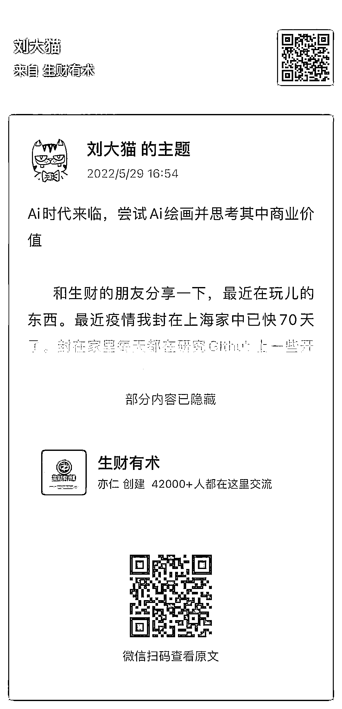

# 公众号懒人找资源，懒人专属群分享

# 公众号懒人找资源，懒人专属群分享

# 公众号懒人找资源，懒人专属群分享

评论区：

简淡 : 大佬，小白适合入局不～

Dreamland : 感觉只要是卖货都挣钱[偷笑]

刘大猫 : 小白是指三无吗（没钱、没流量、没货）那我就不太了解了

小怪兽 : 弟弟想问，大佬的货可以给帮卖吗

halon : 谢谢团长送书《价值森林》

红薯 : 大佬都不方便说太多，那如果想了解并且有兴趣深耕快团团的话，请问通过什么渠道呢？

贾季 : 去参加沸点会，知道团长和群接龙的能力

元璋 : 大佬的《增量价值》写得真好，组织公司人集体学习，并做读书笔记，大家都说收获很大[玫瑰][玫瑰][玫瑰]

# **# ****(89**赞**)**亦仁：今天来说第二个，快团团社群团

# 购

作者：  亦仁

# 公众号懒人找资源，懒人专属群分享

日期：2022-11-16

今天来说第二个。

快团团社群团购。

这个航海选题之所以被我提出来，是因为我发现，我老婆在刷小红书的时候，她很自然地加了一个博主的微信号，很自然地进入了她的微信群，很自然地上了她们的快团团车，很自然地持续跟着上车。

所以，你懂的。

三种路径：

**1. ** 如果你已经有流量，甚至你只有一个朋友圈，可以考虑把快团团做为供应链或者变现方式之一，学习如何把一个小小的微信群经营好；

**2. ** 如果你还没有流量，也不知道要做什么，那么，通过这次航海，去研究快团团什么货好卖，想清楚自己要卖什么货，倒推出在各种内容平台（比如小红书）做什么内容，然后持续引流到私域；

**3. ** 更发散一点思考，可以聚焦在  （小红书 + 快团团）这条  （内容 - 流量 - 产品 - 变现）的小闭环上，去大量的分析拆解哪些品类已经在小红书跑通，模仿并逐步超越，矩阵化规模化的来做。

如果做的人多，后面应该还有一些快团团服务商的机会，我也希望能够选出一些靠谱的圈友来深度服务好大家。

评论区：

白巧克力 : 我要冲这个🐛

喜燕|Vivian : 发现一个问题，熟人反而不那么好去买，因为涉及到填地址的事儿，卖给陌生人好像更容易些。

那么引流就是个问题了…[撇嘴]

张梦才 : 好思路，干起来

波叔 : 这个可以干

锋 : 有没有好的供应链圈友

词宝嘟嘟 : 谢谢🙏

# 公众号懒人找资源，懒人专属群分享

Ting : 快团团需要投入的资金多吗

亦仁 : 不多

# 【从** 0 **到** 1**】**3**篇

# **# ****(**精华帖**)(226**赞**)**小红书资料引流**+**快团团社群

# 团购，新手也能在** 20 **天赚回门票钱

作者：  郑州房产·文豪

日期：2022-11-22

大家好，我是田文豪，一个在郑州卖房的传统老中介。

本文将给大家分享保姆级“小红书引流+快团团社群团购”全攻略，小白也能全复制的教程，真正的新手也能在20天赚回门票！

以下是我实操过程的经历及技巧，也希望能够帮助疫情下正处于迷茫的生财圈友们。

还没报名航海的圈友且正处于迷茫的圈友或已经报名航海的圈友都可以看看：

详情移步飞书：

https://vum29y732t.feishu.cn/docs/doccnrlUADmevx3fqhOef6oYwob公众号懒人找资源，懒人专属群分享

评论区：

Yuri : 链接点不动呀

郑州房产·文豪 : 现在可以了

凡灵逸尘 : 优秀，新的开始，新的突破！

郑州房产·文豪 : 感恩凡灵逸尘[咖啡]

Yuri : 优秀

Hope : 兄弟文学水平点赞👍

Kim : 写得真的很好！我现在是独立老师，想往这个方向做流量上的突破，能加个微信交流一下吗

妙妙妙 : 没有加入快团团之前，只有小红书引流，赚了多少呢

# **# ****(**精华帖**)(185**赞**)**新手在小红书上做水果团购

# 项目，半年利润近** 10W **，我是如何从** 0 **到** 1 **

# 的？

作者：  许老师

日期：2022-07-27

多听盗坤老师言，新手也能赚到钱。

这个项目缘起是盗坤老师去年11月份在生财里提到的一个蓝海项目 ----批发市场水果团购项目，链接：https://articles.zsxq.com/id_rsdp0lrfz4mp.html，这个项目0投入，易模仿，很适合我这种之前还没从工作之外赚到钱的新手。

实战到现在，半年多总营收40多万，利润近10万，其中5月份营业额16万，项目开始变成一个稳定的副业。成绩和大佬没法比，但好歹新手跌跌撞撞迈出了赚钱的第一步。

# 公众号懒人找资源，懒人专属群分享

# 公众号懒人找资源，懒人专属群分享

快团团只能截取3个月范围的数据

下面我会花8000字，大概15分钟的时间，分享这个项目的启动，0-1的过程，坑点，还有我后续方向上的一些困惑。

# 公众号懒人找资源，懒人专属群分享

如果你是项目新手，我的经历可能会给你一点参照，你在实践一个项目的时候可能也会碰到和我一样的  艰难起步、调整、小成就、纠结困惑，也欢迎你在其他城市（尽量不要在北京）实践这个项目，大家一起交流；如果你是经验丰富的大佬，很期待能不吝赐教，针对我最后的困惑给我一些建议。

背景

先做个自我介绍，我是一个在少儿编程行业做了6年的教育人，经历了少儿编程行业从一个概念变成一个细分市场，陪伴了一个创业公司从20人规模做到年营收近10亿的行业头部，我自己也旁观了创业0-1，收获了很多职场上的回报。

可惜21年双减后，教育行业的前景就很不乐观了，公司还能维持但增长极其困难，我自己开始探索下一步路要怎么走。从加入生财以来，我就一直在留意是否有可以尝试的副业，以及如果幸运的话，最好有一个小业务能让我赚到钱，并去逐步做大。

# 公众号懒人找资源，懒人专属群分享

在生财看了很多帖子，中间也短暂实践过知乎好物，想过尝试小红书IP，但都不了了之。

看到盗坤老师的帖子后，说实话很激动，素人0门槛起步，蓝海项目，很快能变现，太适合我这种新手了，尤其帖子下面的评论区也有很多建设性的讨论，把项目关键点也点出来了。

我正好在北京，有亚洲最大的批发市场~新发地，做这个事情是不是可行？我开始一边调研一边跑批发市场，动起来再说。

【项目调研阶段】

我在小红书搜索“新发地”“批发市场”“草莓”（11月的当季水果）“车厘子”等关键词，有很多卖水果的号粉丝不多，但帖子互动数据很不错，点进去一看，评论区一溜的“怎么买”“求团购群”这样的评论，这一来说明需求很强劲，二来从小红书导流是个靠谱的途径。

# 公众号懒人找资源，懒人专属群分享

# 公众号懒人找资源，懒人专属群分享

在这些号里面，很多都留了微信号，我看到就加，发现其中一个人从20年4月份就开始做（新发地出疫情之后），到现在每天开团，每次开团稳定100单以上，预估每单平均客单价100元，一个月营业额二三十万，而且她的私域量不大，就3000人就支撑起这个营业额了，既然有人做起来了，那更靠谱了，而且有了抄作业的对象。

# 公众号懒人找资源，懒人专属群分享

在网上调研的同时，我开始跑新发地批发市场。11月中下旬的时候，丹东99红颜草莓刚上市，新发地48元一斤，同期水果店或抖音普遍80多一斤，这个价差有利润空间。

而且由于草莓很娇嫩的特性，网上不好买，而水果店又太贵，小红书上想买草莓的呼声很高，所以它很适合做批发市场的团购，就这样经过一个礼拜的调研，我决定从团购草莓开始这个项目。

# 公众号懒人找资源，懒人专属群分享

在调研阶段，我更加确认这个项目的可行性，找到了可对标的优秀同行，也选定了草莓作为批发市场水果团的第一个品。

# 公众号懒人找资源，懒人专属群分享

【项目起步阶段】

准备开始搞了，流量从哪来，这是首要碰到的问题。

按照原帖里的讨论，一定不能只有朋友、邻居那点可怜的小流量，所以一定要从外部引流，我直接放弃了社区里宣传的方式，另外由于我不熟悉视频剪辑，同时也有主业，没时间做直播，所以把抖音pass掉了。

在调研时发现小红书上问水果的很多，所以我很快选择了用小红书引流私域来获取流量。

关于小红书上怎么发帖，造人设，取标题，找对标，打造爆款等等技巧，生财里相关精华帖很多，我自己把大部分文章都看完了，然后就是每天刷小红书，浏览水果相关帖子，模仿着发帖，到现在我还是很入门的水平，这里就不班门弄斧了。

很幸运的是，在我发到第三篇帖子的时候，那篇帖子有了1万的观看，第一次99+，前前后后加了  两三百个微信，建了第一个群，而且那篇帖子非常直接，内容是我要从批发市场团购草莓，想要跟团的快上车，所以来的流量很精准，都是想买草莓的。

# 公众号懒人找资源，懒人专属群分享

有了这第一个群，我就开始发布团购，这里也吸取了帖子下面的讨论，要把水果尽量卖成标品，不给客户选择的机会。

所以我们第一次开团就卖 2斤装的丹东99红颜草莓，标价120元（进价48一斤）。第一次团购就有50单，流量到购买的转化率20%左右，营业额7000，毛利润1000，很兴奋，从流量到转化，走出了一大步。

# 公众号懒人找资源，懒人专属群分享

# 公众号懒人找资源，懒人专属群分享

但团完发完货很快麻烦也来了，碰到水果生意最常见的问题了 —— 售后。

草莓太娇嫩了，有快递完后草莓磕碰坏掉一部分的，也有说缺斤短两要补差价的（批发市场算毛重2斤，我们没特别标注，顾客要按照净重2斤算），还有的直接整盒草莓被暴力快递摔全坏的，总之我们本着做回头生意的原则，都赔到位了，最后这1000的利润赔了一半。

这是第一次我们感受到水果行业的不容易。

副业就这么开始了，一周开1-2次草莓团，然后隔天去批发市场发货，第一个月卖了300多盒草莓，4万的营业额，利润7千块左右，小红书引流的私域四五百人，快团团的转化率也稳定在10%左右。

# 公众号懒人找资源，懒人专属群分享

# 公众号懒人找资源，懒人专属群分享

团了好几次后，客户问有没有其他水果，蓝莓车厘子啥的，当时我们对新发地还很不熟悉，对水果行情也完全蒙圈，哪些水果什么时候应季，怎么和批发商打交道，一点经验没有，批发商看我们面生且外行，询价时把我们当散客对待，报出来的水果价格和零售价价差并不高，导致我们迟迟上不了其他水果，品类太单一，顾客开始流失。

屋漏偏逢连夜雨，在品类太单一的情况下，我的小红书由于引流的时候回复私信直接问客户微信号，可能触发了小红书的审核机制，或者被竞品举报，直接被限流了一个月，最后在12月中旬到1月底期间，一方面老客户流失，另一方面没有新客户来源，我们的经营非常惨淡，营业额才一万多，基本没利润，转化率也明显下降，这一度让我想放弃。

# 公众号懒人找资源，懒人专属群分享

# 公众号懒人找资源，懒人专属群分享

【调整阶段】

但确实当时手上也没有什么其他项目，同时这个项目还没整明白，如果放弃了下次再搞其他项目，还是会碰到波折，总不能每次都浅尝辄止。

所以过年期间痛定思痛，开始想着怎么调整。

主要问题就2个，一端是后端的供应链，我们还没搞好，供应商资源太少，品类太单一；另一端是流量端，需要持续地，有更多新流量进来。

货源方面，我们仔细研究了其他同行的快团团链接，然后根据他们上架的品“反编译”，去批发市场对应的找供货商，既然同行上了这个品，证明提供这个/些品的商家对社群/社区团购的这种模式是比较认可的，想通了这个我们找货源就比较有的放矢了，不再是无头苍蝇，一家家问有什么货，价格多少；而是拿着这个货去找到对应的商家，然后问她怎么供货。

打交道的过程中我发现有个小窍门能避免被当成散客，我去了会直接问老板“有没有快团团链接”，一般听懂这句话的老板就知道你是团长，直接拉群甩链接看货，订货也是快团团下单。

如果没有链接但是供货，就让老板拉入群。这相当于是一句暗号，让老板知道你是拿货的而不是散客来问价，省了很多口舌。

就这样，经过一个月密集的跑，我们把货源整得差不多了，基本上同行有的我们也都有。当然，这里面有一些供货商比较坑，后面再说说怎么避坑。

# 公众号懒人找资源，懒人专属群分享

另一端就是流量，前面说到我们的坑就是引流的时候被小红书关禁闭，所以不能再私信了，一定要在主页上放联系方式。

后面我采用了置顶笔记放微信号的方式（这种方式从1月份用到了6月份），中间有几次被关7天禁闭但影响不大，但前段时间这篇置顶帖子被小红书判定违规被隐藏了。

# 公众号懒人找资源，懒人专属群分享

所以小红书要引流私域，怎么有更安全可靠的办法，我还在探索，这次参加了小红书航海，里面提到了 11种方法，我还会再尝试，但这个注定是在和小红书平台打游击，方法需要常换常新。

# 公众号懒人找资源，懒人专属群分享

# 公众号懒人找资源，懒人专属群分享

引流的方式稍微安全点了，剩下的就是怎么发帖搞到更多流量了，这里我感觉自己没发过质量太高的笔记，都是简单直接粗暴，告诉大家我从新发地给大家团水果，后面的帖子最多的时候1万多的小眼睛，几百个互动，陆陆续续发了十几篇帖子，总体浏览量加起来可能在5万左右，引流了 1500个新流量到私域，不过就是这2000个的私域流量，由于我们定价还比较实在，售后也比较靠谱，所以复购还可以，营业额逐渐上升，5月份做了16万的营业额。

所以小红书的流量一来很精准，都是冲着买水果来的，另一方面消费能力确实很不错。

# 公众号懒人找资源，懒人专属群分享

小红书引流私域，实话说我还是很初阶，虽然把关于小红书的精华帖都看了，但纸上得来终觉浅，还需要在实战中积累更多经验，这里就不多说了。

# 公众号懒人找资源，懒人专属群分享

这里我想提的一点是，坚持发，根据反馈去调整发帖方向，一定会有突破的，如果还是没有提升，那把小红书精华帖再看一遍照着做。

另外算是一个好消息，我自己是稀里糊涂的有了一些流量，而且是本地同城的精准流量，帖子质量也不咋高，但就是有人加你，可能说明这个路子还是有一定对的地方，我一直相信的就是  在你觉得还没怎么做好就有成效的情况下，说明路子走对了，如果你已经做得很优秀但是还不来流量，那可能这个方向就不太对。

流量和货源一前一后两个环节调整完了，最后讲讲中间的转化环节，这里面我们的经验不多，因为我们在这里花的精力和做的工作最少，副业毕竟精力有限，我们的大头工作都花在了流量、选品和交付上。

我们目前在转化方面做的工作就是  每次开团时在群里面营造一种大家都在跟团的氛围，开团第二天引导晒图发好评，然后日常发一下朋友圈，包含新品预告，我们吃的好的水果安利，客户好评等，这些工作在这个项目花的精力还不到 5%。

可能和我认为当前这个阶段我们这个环节不宜过重有关，我认为如果选品不好，质量把关不严，售后不行，大家买完一次后就不会再跟团了，即使你的运营做得再出色。

这里值得一提的是，一定要怼住一个优秀竞品抄她的各种运营细节，比如什么时间点开团，群里发什么内容，怎么发朋友圈，选品选什么，包括用什么快递，水果都是怎么包装的；只要自己能做到的先抄，这个我们也是踩了坑的，前面自己做了很多所谓“探索”，最后发现竞品的才是最优解，做到后面动作又和竞品保持一致了。

# 公众号懒人找资源，懒人专属群分享

我认为这个项目前期启动的核心一个是流量，一定要有找流量的能力；另一个是交付，一定要把售后率降下来，一定要能找到好水果，要能做好交付，这样自然而然会有好的复购，即使有些客户一开始不下单，后面看大家持续在买，看你越做越好，他也会慢慢对你产生信任，去下单尝试一下。

目前我们的转化率大概在10%左右，应该存在不小的提升空间。但在此之前，我们会持续优化交付环节。

【交付的几个坑点】

下面花比较大篇幅讲讲交付，因为这个项目和其他生财里的轻量化项目不太一样，其他项目只要解决了流量和转化，基本就跑通了，而水果团购的项目是一个后端交付很重的项目，又累又难标准化，各环节都有坑点。

交付环节有很多琐碎的日常运营，包括经常跑批发市场，找更多货源，每天关注价格行情，把控好选品，和客户售后等等，但就是这些琐碎，构成了客户是否复购的关键因素。

而水果这个生意，复购极其高，留住一个流量，比去找一个流量要重要得多，只要留存做得好，几千个私域也可以活得很滋润。

这里说一说在这些日常运营中最容易碰到的坑吧，而且每个坑踩到了都是得用钱去填。

水果这个行业看着毛利润高，但不咋赚钱，最大的问题是损耗和售后。

# 公众号懒人找资源，懒人专属群分享

损耗这块，一旦有库存就有损耗，所以我们坚持预订制，客户先下单再去找批发商订货，这也是很多团长价格能优于水果店的原因，毕竟店租和损耗这两个成本大头没了；

除此之外，我们目前只做整箱发货，不做分装，虽然这样会劝退一些客户（那些水果消耗量小的小女生基本都被pass掉了），但由于我们是副业，所以必须作取舍。

这样做一方面减轻我们发货环节的流程，另一方面也能减少损耗，毕竟批发市场都是整件拿货，如果你拆开卖，总会有一些零的被剩下，要么自己吃要么就得有地方保存。

目前我们的损耗率可以忽略不计，这里不多提。主要说说售后。

做水果生意，售后真是心累啊，这里感叹一句，什么样的客户都会碰到，什么样的售后也都会碰到，尤其我们一开始做经验不足，售后概率更大（下面是大量细节，不感兴趣可以跳过，不影响阅读）。

第一种售后最致命，拿到了烂货，也就是拿货的时候水果品质就不行。你可能会好奇，为啥会拿到烂货，检查不出来吗？

批发市场里面有一句话，就是没有卖不出去的水果，只有卖不出去的价格。什么意思呢，就是再烂的货只要价格够低，都能卖出去。

比如怡科莓蓝莓限量版，大家平时买三四十元一盒，批发市场正常货的价格是一箱12盒  240元（3-5月），有些大团长的供货价是一箱150元，觉得捡到便宜了是吧，其实这个货品质不行，很多时候是蓝莓放久了有部分已经发霉了，然后大团长低价收回去，找几个工人把发霉坏果挑出来，然后把好的重新整合成一箱当着好货接着卖，这个从外表不太容易看出来坏，但是客户吃的时候会觉得硬度不够或者新鲜度不够。

# 公众号懒人找资源，懒人专属群分享

新团长经验不足，也分辨不出好货坏货，一看这价格拿回去卖，然后一些注重品质的客户可能就找来售后了，即使你售后到位，这个客户大概率也流失了，因为你的水果没达到她想要的品质标准。

上面还是轻一点的拿到烂货，毕竟很多客户也吃不出来好坏，只有经常买该种水果的才能对比出来。

还有另一种情况就是本身水果已经快到腐烂临界点了，批发商直接低价倾销，由于水果都是整箱封好的，拿货的时候我们只能抽检，正好抽检出的那几箱是好的，我们就直接把货发出去了。

但是这些快坏掉的水果经过快递在常温下一折腾，到客户手上都烂了，这种情况我们发生了一两次，售后全赔的同时，还流失了很多口碑。

这种情况一定要尽量避免，那怎么做呢？

1\. 对水果行情一定要很熟悉，对便宜货本身就抱有警惕，一分钱一分货在批发市场是非常硬的道理，这里一定要多加几家供货商，对同一货源的价格多方对比，一般来讲差不多品质的货，几个大团长的供货价不会差太多（5%以内），如果明显低价尽量避开；

2\. 对出烂货的批发商坚决剔除，因为出了一次后还会再出，他不会只卖一次烂货，我售后频繁的几次，都是在同一个大团长那边，但由于那个大团长水果品类非常全，价格也比其他家低一点，所以是我初期很重要的拿货渠道，出了烂货的售后后，没下定决心换掉，后面果然又出了事情。

# 公众号懒人找资源，懒人专属群分享

这里关键点也是要有多家供货商，只有手上有足够可替代的供货商，你把她剔除的时候才不会犹  豫，不然没有足够的货源，剔除一个供货商可能很多水果就得下架了。另外就是看平时的售后态  度，如果售后推诿的，一般出问题概率也大，要多加留心。

3\. 最后就是一定要检查了，即使再熟悉的批发商，也一定要当他面检查水果，尤其是对新鲜度要求高的水果，比如樱桃蓝莓，都是每天新到货，一定当面检查看看新鲜度，如果货不好宁愿退款给客户也不要拿，这样磨合下来批发商也知道你要什么样的货。

第二种售后就是运损，发出时是好的，客户收到时是坏的。这种售后只有像我们做同城快递发货的才会碰到，那些做社区团购模式的不存在这个问题。

目前的生鲜快递运输还是很初级的阶段，没有冷链，快递员也很少轻拿轻放。很多水果是很娇嫩的，不适合快递运输，比如草莓、蓝莓、桃子、葡萄，运输过程的磕碰、晃动，很容易导致水果受伤；另外就是快递配送延迟导致的水果腐烂。

要避免这个问题，一定在选品的时候就考虑是否适合快递运输，或者能不能通过包装改进让他适配快递运输，如果不行坚决不要上，不然最后客户收到一堆被摔烂的水果，后果还是得你承担，而且这个成本大多数只能自己扛，因为快递只看外包装是否破损去定是否售后，很多时候是表面包装很完整，但里面被摔得稀烂。

这里我以自己的惨痛经验劝告大家，不要对快递抱有侥幸心理，一定要想象他们拿着这箱水果是各种扔，看看你的包装能不能扛得住。

还是以怡科莓蓝莓举例，它本身的包装是不适合快递运输的，我们前期抱有侥幸心理，只在上面加盖纸壳就发出了，没出大问题。

# 公众号懒人找资源，懒人专属群分享

但有一次做活动，正赶上北京疫情爆发快递爆单，由于包装不到位，我们发出去的60箱蓝莓最后35盒蓝莓都有不同程度的损伤，有的全被摔烂，有的烂的加起来2-3盒。

总之那次光售后赔了 3000多块，把我们的利润全赔进去了，还对我们的口碑和信心打击很大，差点emo了，你想想一天30几个人来找你售后，语气都不会太好，真的很考验心态。

# 公众号懒人找资源，懒人专属群分享

这里的解法也很简单，改进包装，把怡科莓里面的每一小盒蓝莓都垫上海绵垫，让蓝莓在小盒里面不要来回动；然后把这12箱蓝莓从原包装拿出来，放到泡沫箱里面再发货，这样能避免蓝莓受到外部的挤压。

举这个例子只是和大家说明，拿货的时候一定要考虑怎么发货，要么本身水果适合发快递，要么想办法改进包装，不然这个水果宁可不上。

第三种售后就是  缺货发不出货。

由于我们是预订制，客户先下单我们再去找批发商订货，所以很难避免缺货情况。

大部分批发商以批发为主，很多时候走货很快，上午这货还有下午就没了。

还有批发商给很多团长供货，有些批发商库存管理不行，货经常卖出超量的，然后先到先得，后面的就退款处理，批发商是100%保险了，但团长就尴尬了，得和客户解释为什么又缺货了，还有安排退款。

这个问题我们到现在还没完全解决，只能说一下我们怎么做，一来我们开团时会再和各个供货商重新确认一遍库存，尽量选库存多的上架；二来我们的团购页面会写清楚，如遇个别缺货会默认退款，让客户也有心理预期，三者如果是缺货量比较大，我们也会安排下次补发，然后给客户补偿一次运费，这样下次客户如果跟团可以省一点运费，心理稍微好受一点。

第四种情况也不算售后，但是也提一下，就是快递时效问题，一般快递的话，上午12点前你把货装车，北京五环内可以当天到，这样能保证水果的新鲜度，如果超过12点，就要第二天到了。

# 公众号懒人找资源，懒人专属群分享

所以如果大家发货流程还没捋顺，尽量控制一下流量，不要一下子爆单，那不是什么好事，爆单了但是后端发货跟不上，各种售后都会出来。

所以当你能在规定时效内发出50单的时候，就匹配差不多的流量；当你能发出100单的时候，可以在流量上再更进一步。

上面啰里吧嗦说了这么多，其实影响复购的因素都在这些细节里面了，你想想现在买水果的渠道这么多，如果你连基本的交付都做不好，老出  烂货/运损/缺货  这样的问题，即使价格有优势，客户的留存一定不好，那再多的流量也留不住。

所以这个项目的交付环节是比较重的，这也是花这么大篇幅去讲的原因，一定对售后做好心理准备，一定要能够忍受这些琐碎。

【总结】

最后我总结一下这个项目，也说出我的纠结困惑。

我个人感觉这个项目比较适合一二线城市做，价差比较大的基本都是精品水果，也才存在批发市场团购的基础，客户要么奔着相同的水果价格更低，要么奔着买水果店买不着的水果来找你，这都偏精品水果消费的逻辑。

从项目特点上来看，水果刚需，高频，复购强，决策成本低，所以服务好一些流量就能有稳定变现。

# 公众号懒人找资源，懒人专属群分享

不用一直焦虑去找新流量，这是优点；缺点是利润低，交付环节很重，很消耗精力，如果想有好的体验，需要对各个环节都有把控，还要忍受各种售后，不能玻璃心，本身门槛低，谁都可以做，规模化难度也高。

这里也顺便提一下模式相近的另外两种模式，一种是社区团购；另一种是一件代发（产地或者批发市场）。

社区团购，也是去批发市场拿货，不同的是客户去小区自提，省去了快递方面的运损，不用考虑怎么包装发货，交付环节简单很多，可以上架的水果选择也多，也能很快地拓展其他相关品类（蔬菜，海鲜，零食等），但是服务范围有限，一般只能服务附近几个小区，扩展性差。

批发市场有很多团长都是这个模式，反而像我们发同城快递的团长并不多。

另一种一件代发，要么联系产地做一件代发，要么做大团长的帮卖团长，只需要做引流和转化的工作，所有发货售后交由批发老板/产地负责，优点是  交付很轻，占用精力少；缺点是利润相对更低，对后端基本无把控，很难避免踩坑。

最后说一下我的困惑点。

在做这个项目的时候，有很多难受的点，因为它交付太重，会挤占主业的很多精力，还要应对各种售后，实话说幸福感挺差的，非常能体会水果行业的不容易。

我记得有一次我在评论区提到我在实践这个项目作为练手，盗坤老师回复说，等练得差不多了，尽早换项目，太累了。所以这也是我很纠结的地方。

# 公众号懒人找资源，懒人专属群分享

我明显感觉，作为副业，我们只能做到把项目勉强跑起来，没有精力做很多提升改进，把这个项目再放大。

比如，我们能不能做小红书矩阵号，大批量的获取同城流量，能不能开拓小红书之外的流量渠道，比如探索视频号/抖音直播；流量如果跑起来了，我们的后端交付怎么能规模化，不再是一次只能应付100单，而是能支撑流量快速扩张；货源方面能不能拿到更有优势的价格。能不能做更精细的私域运营，把转化率从10%提升到20%以上。

这些问题都只停留在想法方面，一直没有精力去落地。

但是让我现阶段放弃主业完全投入这个项目我又有点信心不足，一来我的主业收入还比较高；二来这个项目门槛低，谁都能做，我的差异化优势在哪里，项目能不能做大，比如做到10倍规模，还有比较大的不确定性。

虽然我的主业没有增长空间了，但我也担心这个项目最后做不大，最后收入可能和我主业差不多，但辛苦程度是至少好几倍，那就得不偿失了。

所以把这个项目分享出来，一来是秉承生财“真诚利他”的原则，二来我也想听听各位大佬的建议。

这个项目未来有规模化的潜力吗（做到一个月100万营业额），我下一步该在哪个点发力，我感觉现在放弃主业去做应该不是个好的选择，那在什么样的情况下，是可以放弃主业去投入这个项目？如果想做大，需要攻克哪些方面的难关？

# 公众号懒人找资源，懒人专属群分享

还是说，这个项目只是适合练手，长期来看不是好项目，因为我眼界受限所以目前还只能做这样的项目，那我是该调整模式，改成更轻量化的模式，比如一件代发；还是该在某个时间点去尝试其他项目，比如小红书带货，带其他标准化程度高的货，而不是水果这种非标品。

最近确实是在这两种状态中反复横跳，一会雄心壮志，想着扩大10倍比打工强太多了，一会又想太累门槛太低了，是不是该趁早试试其他项目。

所以很希望听到大家的建议，就像盗坤老师当初的那篇帖子，评论区和帖子一样精彩。

感谢大家看到最后！

————————————————

帖子写于6月中旬，所以文章中主要放了到5月份的营业额，现在更新一下六七月份的营业额。

6月份由于北京天堂酒吧疫情，我们公司有一例确诊，我变成了密接，在家隔离了14天，没办法去市场选品发货，严重影响了我这个水果副业，半个月没开张，最后营业额只有5万多，还好我们基本是零成本副业，不然在家干坐的14天心态肯定受影响。

7月份开始了水果人最难熬的淡季，听批发老板说，基本上从6月底到9月中旬前都是水果淡季，这几个月天气热，水果容易坏，所以不敢多进货。

另外夏天水果种类很单一，主要就是瓜、桃，单价高的水果比如蓝莓草莓、樱桃、各种进口水果基本都没了，大家吃瓜最多，瓜才几块钱一斤，严重影响了对其他水果的需求。

# 公众号懒人找资源，懒人专属群分享

所以这阶段主要靠熬，我们的营业额也很明显的下降了，之前开团时平均一次100单，现在只有四五十单，营业额也降到了一个月6万左右，看了一下同行的快团团链接，还有和快递小哥交流，基本上大家的单量都明显下滑了，以前新发地直播基地一天三五千单，现在只剩一两千单了；另一个做得好的同行以前一天1000单，现在500多单。

所以这两三个月只能靠熬过去，淡季时你不在，旺季时赚钱就没你份了。

补充这个信息，一个是让大家有更全面的信息，这个副业的营业额并不是一直不断增长，二是提醒大家如果你想起步做这个项目，这两三个月不一定是好时机，有可能一上来没啥正反馈，缺乏一个特别好能快速启动的品类（除非你敢做榴莲，劝你不要，很容易亏），反而去年冬天那个时间点，我误打误撞的赶上了草莓这个品类和项目起步比较好的时间点。

评论区：

万里 : 很真实的经历

许老师 : 文章里提出了我自己的困惑，是副业更进一步加大投入，想办法发展成主业，还是到某个时间点换个交付轻一点的项目，希望各位大佬不吝赐教

亦仁 : 主要是与主业相比，看副业的空间和机会。副业空间大、机会大、可以发展成主业，那是可以考虑更多投入。

许老师 : 主业教育行业没有增长空间了，但现在收入还行，不过有可能哪天被裁员。

副业水果目前来看转化和复购还不错，只要把流量做到一定的量，按现在淡季的情况，需要把流量扩大5倍就能和我主业收入差不多；如果到了旺季，大概两三倍流量就行；但我担心这个项目门槛低，非标属性比较强，不清楚是不是能规模化运作，所以这是比较矛盾的点。

现在是主业还不是很忙，所以还能兼顾，但也只是维持副业，还缺少精力去想办法扩大。

高建中-扬州-婚礼庆* : 有个问题要问球友：你这发货是自己拖回家发货还是批发商代发？

# 公众号懒人找资源，懒人专属群分享

盗坤的提议：个人觉得这个比较难以放大，交付和售后方面太重。个人建议做到一定程度，有固定客源可以作为引流，做一些其它产品。

你说的社区团购，我们以前做过，当时利润还可以，有平台供货，后来美团等入场后，做的都是客单价比较低的，而且都是一斤两斤卖，太累人利润还低就不做了。

一件代发的也做，也是平台供货，因为价格比较高，在三四线做的不太好。

石头头 : 方便留个v交流吗

许老师 : 目前还是在批发市场自己直接当场发货，所以比较重

Tony : 我做食品行业深有体会，水果这个品，复购率很高，只要好吃会一直买。就是售后非常难，还要有一个非常强大的团队支撑，不然一个人售后会哭。

# **# ****(**精华帖**)(94**赞**)**快团团新手如何帮卖月佣金达

# 到** 8W**

作者：  贾璐Luca

日期：2023-04-11

（篇文章来自于3月8日在大航海的快团团经验分享）

我现在的主要线上营收是无人直播电商，大家都知道抖音、快手的直播规则瞬息万变，且用户群体没有复购。钱是赚了不少，但压力很大，且对未来迷茫。

但快团团不一样，它是基于社群运营，有着超强的黏性的复购。所以我从去年12月慢慢测试，权当是“一个人的副业”快团团实验成绩吧。

# 公众号懒人找资源，懒人专属群分享

# 成就

“一个人的副业”快团团实验成绩

1、一个月时间，达到全国排名1797

2、单月帮卖佣金达到8万

3、疫情期间，小区开团卖面包，净利润2万

# 公众号懒人找资源，懒人专属群分享

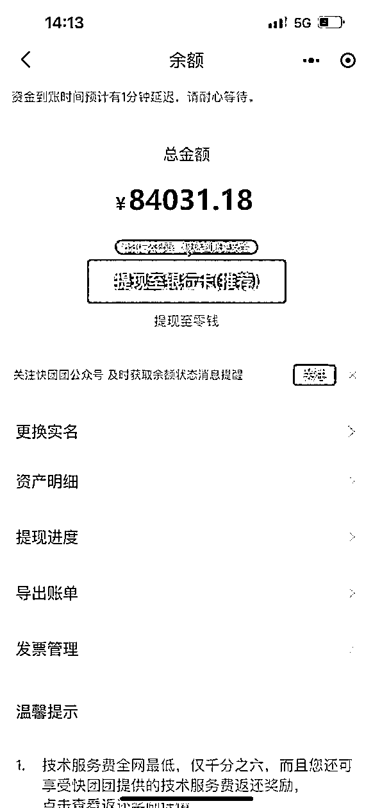

# 公众号懒人找资源，懒人专属群分享

# 卖的什么

# **# **** **

# **# **帮卖类

# （一）帮卖的类目

快团团帮卖，我主打的三种类目：

1、时令水果类：草莓、橙子、枇杷、芒果……

2、卖生活方式：鲜花、香薰蜡烛……

3、预制菜：凉皮、鸭掌煲、螺蛳粉……

至于为什么主打这三个类目，我理解的在快团团的“人货场”，货和人的需求，对人的理解是匹配和一致的，卖货先要理解人，基于人的需求，选择对应的货，才能大卖，具体的后面会再讲到。

# 公众号懒人找资源，懒人专属群分享

# （二）重点打爆款单品

重点讲一下帮卖爆款单品—草莓，只是草莓一个月赚了3万多，一单平均佣金是11元，卖了2800多单，复购率40%以上。

为什么选择草莓作为爆款原因：

1、应季水果，一年只有3个月当季，大家期待已久，

2、口味酸甜，小朋友们尤其喜欢，家长会为小朋友持续买单

3、草莓客单价高，利润高。线下水果店价格普遍偏高，电商价格有一定优势

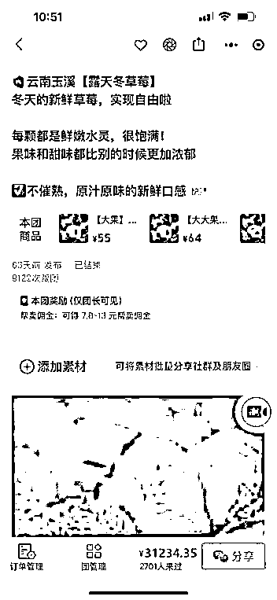

# 公众号懒人找资源，懒人专属群分享

具体详细内容查看飞书

https://r7weuqivm5.feishu.cn/docx/SYkqdYJ4FoEXOlxQpitcWY8Rnqg?from=from_copylink

评论区：

林家少爷 : 密码是多少啊，想拜读拜读不了o(╥﹏╥)o

成为精锐 : 密码呀，姐姐

贾璐Luca : 现在应该可以正常打开，不用密码了吧

蛋  总 : 同在广州，方便加留个v

张乐乐 : 团品您那边如何解决配送问题呢？

星漫🍊 : 很受用，真厉害

贾璐Luca : 快递

贾璐Luca : 我私聊您哈！不方便对外发

# 【具体类目】**4**篇

# **# ****(**精华帖**)(179**赞**)0 **成本实现三方共赢的权益年

# 卡玩法：低价供货给快团团团长分销引流

作者：  曾俊杰

日期：2023-03-10

# 公众号懒人找资源，懒人专属群分享

以肯德基为例，商家为了吸引顾客到店消费会发放大量优惠券，我们把优惠券整合以低价供给快团团分销商去推广，一整个链路下来顾客可以买到 8 折的肯德基，分销商可以获得推广的利润，而我们就可以拿到顾客点餐后的分成

那这种通过低价权益年卡实现共赢的玩法具体怎么玩？

前几年，很多产品权益卡都是在公众号等分销系统售卖，用户需要关注公众号才能进行购买，快团团兴起后用户购买方式更加便捷，加上我们在做的就是把单个产品权益组合成多个产品结合的全家桶形式。

以这样的形式售卖，受众范围广，接受度更高，同时把利润完全让利给分销的人，无需处理任何售后，还能快速拉起订单量和跟团人数，也给自己增加了 0 成本的引流发动机。

在这，顺便问问大家，平常你是怎么点肯德基 / 星巴克的呢？

柜台 / 扫码 / 官方 APP？

如果你知道通过一个公众号下单可以享受 5-8 折不等的折扣，是否会改变你的下单方式呢？

# 公众号懒人找资源，懒人专属群分享

# 公众号懒人找资源，懒人专属群分享

# 公众号懒人找资源，懒人专属群分享

# 公众号懒人找资源，懒人专属群分享

如果让你花 8.8 元，就可以长期不限次数的享受全国肯德基、麦当劳、星巴克等 5-8 折优惠折扣，你是否会心动呢？

对于很多用户来说，这是相当具有吸引力的，毕竟点一两次就回本了，以后都可以享受优惠点餐，确实省钱了！

受众广，单价低，这就为团购奠定了基础。

如果花了这 8.8 元，还可以叠加更多不同品牌的优惠折扣，是否会更有吸引力呢？

这就是我要说的——权益年卡！

一、权益年卡是什么？

所谓权益年卡，其实就是集合了多种大型连锁餐厅优惠点餐的一份权益，因为售卖它的人经常赋予它 1 年~ 2 年的有效期，所以又称年卡。（实际可以做到一次激活，终身优惠）

优惠点餐的大型连锁餐厅包括且不限于以下几种（可以自主添加）

# 公众号懒人找资源，懒人专属群分享

肯德基、必胜客、麦当劳、汉堡王、星巴克、瑞幸咖啡、喜茶、奈雪的茶

购买它的人，可以以门店价 5-8 折的折扣去点餐，消费者确确实实得到优惠，而年卡的价格一般都不高，卖 3.8 ~ 12.9 的都有，基本上消费者点一两次就回本了，所以受众范围广，接受度高，对于快团团的人来说，利润可以，无需物流发货，无售后退货，能快速拉起订单量和跟团人数。

二、为什么成本接近于零？

# 公众号懒人找资源，懒人专属群分享

这些优惠点餐的 CPS 链接其实基本可以免费获得，有的公众号甚至会直接把它们放到自己的自定义菜单上，然后免费开放，但这个世界永远存在着信息差，你以为路人皆知的事还有 90% 的人一点都不知道。

我们所做的，就是把这些优惠点餐的链接打包封装起来，需要一个激活码才能去激活使用，然后去售卖这个激活码。

我们的利润主要来源于用户点餐后的返利，所以几乎没什么成本。

顺便说一句，通过这种方式获得的客户质量最高，之前我们也通过抽奖活动，公众号广告投放等方式去获客，

这样就可以去售卖了，把售卖的利润完全让利给分销的人，这就为自己的引流增加了一个 0 成本的发动机。

而且这是多方受益的，所以可以长久。

消费者获得了多个大型连锁餐厅的点餐优惠，分销者获得了推广利润，而我们获得了点餐分成。

三、流量从哪里来

# 公众号懒人找资源，懒人专属群分享

前几年，主要是以单个产品权益年卡在各个旅游分销平台去售卖，比如肯德基权益年卡，星巴克权益年卡，模式基本是平台自己留 1~2 元利润，给分销商 6~7 元利润。

这里的平台主要指一些地方性的旅游公众号，他们一般使用自我游、标点云等分销系统，他们卖这个产品主要也是为了吸粉，因为 C 端通过扫码分销商的海报，会先关注公众号，再跳出购买链接。

# 公众号懒人找资源，懒人专属群分享

# 公众号懒人找资源，懒人专属群分享

后来做的人越来越多了，就开始卷了，大家把两三个权益放在一起，到现在，就成全家桶了

# 公众号懒人找资源，懒人专属群分享

# 公众号懒人找资源，懒人专属群分享

20 年疫情开始，快团团应运而生，并迅速发展壮大，它不用下载 APP 或者关注公众号，通过小程序和微信朋友圈，就可以触及大量用户，非常的方便。

以前在旅游分销平台的玩法，就搬运到快团团这个新的平台去玩。

我主要是通过闲鱼搜索快团团，然后就可以找到一些人在兜售团长资源，因为他们可以由此获得返利。

# 公众号懒人找资源，懒人专属群分享

# 公众号懒人找资源，懒人专属群分享

购买之后，一个个的订阅团长，很多团长都会在快团团的主页留商务合作的微信，然后一个个的私聊，一个优秀的团长能给你带来成百上千的用户，而且是付费用户，这意味着这是一个精准的高质量粉丝，多少人为了获得精准用户而绞尽脑汁，费尽钱财。

而你的时间成本仅仅是微信上的几句沟通，金钱成本几乎为 0 。

四、如何成交

# 公众号懒人找资源，懒人专属群分享

对于用户来说，6.6 / 8.8 元的客单价，随便消费一单就可以回本，成交难度低对于团长来说，0.1 元的供货价，利润率和订单量让她有足够的动力去推广五、过程中的经验分享

分享一下我自己接触的快团团长经历，我当时接触到一个上海的团长，也是一个因疫情被困在家的宝妈，不过她很有想法，我们很快达成共识，一星期她就卖出去 700 多份~公众号懒人找资源，懒人专属群分享

我仔细看了她的数据，居然有 70 多个团长在帮她卖，原来她是一个大团长，主要想通过这个产品来增加自己产品的供给，她还把自己的利润拿一部分出来设置了龙虎榜，从而让她底下的团长更有动力。

# 公众号懒人找资源，懒人专属群分享

还有一些团长，就是一直每次 100 个的订

# 公众号懒人找资源，懒人专属群分享

# 公众号懒人找资源，懒人专属群分享

# 公众号懒人找资源，懒人专属群分享

# 公众号懒人找资源，懒人专属群分享

六、团长的顾虑

# 公众号懒人找资源，懒人专属群分享

团长最担心的应该是售后问题了，比如你的激活码有没有及时发放，会不会有的不能激活，点餐会不会要等很久才能出取餐号，会不会出现点餐失败的情况？

在这一点上，我们采用的方法是直接把激活码给团长，让他自己发货，如果有不能激活的，直接补发。

而在点餐使用环节上，主要是凭借在市场的长久摸索，寻找到靠谱的合作伙伴。

提供这种连锁餐厅 CPS 链接的，其实也有很多服务商，跟他们合作，主要衡量出餐速度、出餐成功的稳定性，还有利润率。

这方面我们以前就吃过一个亏，对方提供的服务，居然是靠人工撮合的方式，出餐速度要 7-15 分钟，有时用餐高峰期更是长达半小时，甚至还会出餐失败，给用户的体验非常糟糕。

自从踩过这个坑后，在往后的服务商选择上，就一直把出餐速度和稳定性优先排在前面，后面的路就走得比较顺畅了，售后非常少。

评论区：

Mr.老吴 : 权益卡玩法知道，快团团也知道，但是把两者结合没想到，学习了[强][抱拳] Mr.老吴 : 卖卡的利润都给团长？自己只赚cps佣金吗？

曾俊杰 : 是的

Mr.老吴 : 这些佣金率好像都挺低吧

曾俊杰 : 6%左右

亦仁 : 感谢分享，已加精华。

王小蒙 : 靠谱的权益卡资源不好找吧[撇嘴]

曾俊杰 : 对，慢慢积累优质资源，排除掉一些出餐慢，系统不稳定的，现在合作的就很省心了

# 公众号懒人找资源，懒人专属群分享

# **# ****(**精华帖**)(119**赞**)**大厂离职做鲜花创业，从小

# 区团购到小程序盈利每月** 7 **位数的经验分享

作者：  小也

日期：2022-10-17

大家好，我是近2年（2020.08-2022.05）离职创业的，从0开始做鲜花业务，先后主导了找货源（搭建供应链规则）—找开发者（拓展用户来源）—算利润（组建团队和优化投入产出）等过程，业务越来越数字化，在退出创业团队前，精力是集中到了数字化这部分。

我们在成都和昆明都有办公室，月利润已达7位数（不过是1字头），每个月的销量，平均每天约5k单。

今天在星球小范围分享一下我的创业经验，大家有其他想了解的欢迎在评论区提出~分享目录：

-为什么要做鲜花赛道？如何迭代商品模式？

-从0-1过程中，买花用户从哪里来？

-鲜花供应链、博主投放和用户留存经验分享

一、好的货源如何保障，运营如何迭代

# 公众号懒人找资源，懒人专属群分享

**1.**批发** - **分发的模式

我之前是在大厂做人工智能的程序媛一枚，然后由于时间无法顾及家庭，所以就离职，并且打算网上进货&在小区里卖卖花。

后来在做的过程中，逐步发展迭代成了一个专门卖花、花束和花周边的平台。

选择做鲜花，是因为自己爱买花，但是很难买到价格合适的鲜花，自己知道的性价比高的路径，也只是先批发，然后分发。

所以，一开始就从这个模式开始，先收集小区里的人的需求，然后，根据需求统一从昆明批发商批发，批发商是网络上找的。

批发到家后，整理花材，根据之前搜集的需求，配送到家。

但是由于客人要的规格和实际批发的规格不一致，比如，实际批发时候玫瑰是20支一扎，但是客人一般只需要10支一扎，那么，就会多出10支，这种一般叫做损耗。

对于这种多出的损耗，我们是将其包装成“随机花束”便宜卖掉。

**2.**一件代发模式

# 公众号懒人找资源，懒人专属群分享

后来发现，批发 - 分发的模式，对于人力消耗过大，每次花到了以后，是自己进行人工配送的，于是就去找有没有供货商直接无痕发货，而我们赚取差价的（也就是常说的一件代发）。

于是就继续在网上找可以一件代发供应商。确实是有，一开始质量还行，但是到后面，质量开始越发不稳定（后来知道，在夏天的时候，鲜花品控的把控，是要比天气凉快的时候，更难把握些），逐渐流失客户。

然后就觉得这样不是办法，于是就去昆明看看是什么情况，看这样的质量问题是由于鲜花本身问题、还是供货商的问题。

同时，也在网上找了好几家批发商，准备在看完供货商的质量后，也去其它家看看，以便更清楚地了解鲜花这个行业的情况。

**3.**自己的供应链模式

在进行实地考察后，确认了是供货商的问题，同时也发现了，在昆明没有在保证质量的情况下，性价比比较高的一件代发的供货商。

这个行业是处于一种比较蛮荒的情况，当时的花点、花加还在做花束，对于单品花的C端诉求，也没有公司去满足，而这也是代表了商机。

于是，就决定自己做，做一家保证质量、服务和性价比的面对C端的单品鲜花平台。

做平台需要两件事：1\. 做自己的供应链 2\. 做自己的小程序。

# 公众号懒人找资源，懒人专属群分享

那么，对于做自己的供应链的来说，最早期，是需要有更懂花的人帮卖采购、然后找人一起打包的。

一开始的时候，是在昆明花市，和人套近乎，找到有愿意合作采购的人。我方对于对方采购的花材，每扎支付相应的酬劳，然后，在发货给到客户的时候，也会同步发货给自己，检查到货的情况、进一步提出打包改进的地方并沉淀打包要点，直到发来的货的打包质量被评估成ok，然后，开始进行客源的拓展。

在客源拓展的同时，发现之前定下的采购人和招聘来的临时打包工人，无法hold住增长的订单量，于是开始找仓库、找工人，同时通过控制售卖量来控制订单量，以平衡仓库人力和订单的关系，保证一定程度不爆仓。

找到仓库后，开始搭建鲜花的供应链，比如：搭建冷库、招聘各个部门的工人（理花工人、打包工人、玫瑰采购、草花采购、质检、库管  等等）、采买需要的设备和工具。

由于是先卖后买的模式，所以在一开始的时候，几乎不太会有库存。后来品类越来越多后，对于一些稀缺品种（比如我卖的时候可能市场有货、等卖完货去采买的时候，市场没货了）会需要进行囤货，同步供应链深度叠加上库存管理事宜。

三、初始用户从哪里来？** & **用户如何从**1-10 **？

**1.**初始用户，其实是大厂同事

初始的时候，是在本小区的各个群里（我们小区比较大，有超市群、买菜群、业主群  等）发我要做鲜花了，新业开张，进群我的鲜花群可以免费领一束鲜花，这样把人拉到我的私域里。

# 公众号懒人找资源，懒人专属群分享

然后，在私域里进行常规售卖，同步的在小区楼道、旁边的小区里，张贴小广告，小广告也是一样的意思，表示自己做鲜花了，新人福利是进群免费领一束花。

一开始是大家可以选花，后来是新人随机送花。开始在小区里发的时候，还在职。

后来，离职的时候，在大厂内BBS发了广告，大厂其实很多年轻女性，都非常喜欢花，自己也会在花加或者花点上买花，同事的背景关系有信任背书+同事创业也会想要支持一下+本身也有买花需求，这一波，也增加了不少流量。

**2.**代理积累用户

在创业的时候，做一件代发的微信代理还是有比较多的。其实一开始做的小区生意，也是代理生意，所以，就积攒了不少代理群。

当时机成熟时，同步在代理群里拉人，由于昆明供货商普遍做的不好，要么供货价格偏高导致一般代理利润比较薄，要么质量不稳定导致售后较多，所以比较能触动代理的点，主要意思说我们知道某某地方可以做一件代发还不错，需要的话可以拉，就这样，也拉了不少代理。

一个代理相当于至少3个c端客户的量，那么，起步阶段的时候，是有比较足够的量来给到我们去进行进一步全国范围内的发货质量测试了。

同时由于代理相对散客稍微懂花，有些代理本身就是开花店的，那么，在直接对接他们唠嗑儿的时候，也积累了不少鲜花知识和客服经验。

# 公众号懒人找资源，懒人专属群分享

**3.**小程序**-**用户的扩量时代

待到小程序V1.0版本开发测试完毕后，有了可以直接搜索到的平台，那么，就开始找博主打广告了。

20年的时候，小红书博主还没现在这么卷，找到一个有粉丝量和阅读量的博主晒单，还是能够有不少流量的，所以从21年年初小程序上线后，就一直主要通过小红书博主引流（小红书和我们的鲜花的调性比较契合）。

这部分大家可能会关心关于怎么找合适的博主，找博主的其实比较简单，一开始就看谁分享过鲜花&粉丝量记录下来倒叙排序&鲜花文章或者视频的量（点赞量、收藏量）记录下来倒叙排序，然后从上到下逐一去聊。

在聊之前，先想好能承受的价格、指标和文案要求。有个需要注意的地方，一开始，如果之前没有做过，那么一定是摸这个小红书博主的行情。

第一次接触的时候，不暴露自己的前面想好的指标，先问报价、以及对方之前合作的时候合作方的要求，多聊几个（这次其实相当于初步摸一下行情，所以排序靠前、靠中），对于行情摸地七七八八了，根据行情调整和自己的情况，去做自己这一方的需求调整。

调整之后，发现找中部或者有潜力的博主对当时的自己来说性价比最高，所以，开始找这部分博主发力，同时也会同步找一些中上部的去谈。

一开始是要求点赞量满到一定量给钱，但是博主这一块水也比较深，博主圈子会互相点赞，所以后面做了一些相对比较复杂的算法策略去和博主定付款规则。

# 公众号懒人找资源，懒人专属群分享

在接触了一些博主，并进行付费后，我们这边有博主需求的事情，就在博主圈子里流传了，后面逐渐有博主主动加过来寻求合作。

再来就是，无论是之前在用快团团还是后来的的平台，都设计了裂变。

快团团用的是*人成团价的设置进行裂变；小程序是设置了，如果邀请了一个新人，新人下单并且到货后，双方都有一个月的会员（当时为了一些资金和用户粘性的考虑，设置了会员费，一个月的会员费是5元，商品的会员价要比零售价低）。

在这个时候，市面上单品类花束&性价比高（每一个商品，几乎是按照成本价格算，自己的人力成本全部算为0）&服务好的鲜花平台，靠着这个，也自来水裂变了一大批。

这些所有来的用户，统一拉到私域，后来也在小程序上贴了私域二维码，用户可以直接进去。

这样，几方作用下，私域流量急速增长。在我离开的时候，一年半的时间，已经有了三位数的群，并且群人数全是大于200的。

需要提一点的是，小程序特地设计了一个纯分享花的模块，通过这个模块进去，别人分享的内容会关联商品。

这样，如果想要买对应的商品的话，直接买即可，这个非常短的转换链路，也是当时市面没有的，所以在小程序刚推出&低价时间，每个月的复购率，是70%以上。

四、整个项目过程中的经验分享

# 公众号懒人找资源，懒人专属群分享

**1.**供应链的经验：

① 负责人找本地人，尤其是供应链的所处地区是地域性特别强的地方的时候，尤其要找熟悉当地情况的常驻在本地人。

② 从小到大一点点迭代，不要一下子步子跨太大。之前的设想是5k单/天，最终是达到目标了，  但是在5k单之前，量是一步步上去的，在发现超出供应链的承受范围的时候，立刻控制单量、以保证稳住供应链优先。

**2.**博主投放的经验：** **

① 制定适合自己的付费规则。小红书博主有自己的圈子，他们会互相水数据，所以，需要找到适合自己的算法，让自己付出去的钱效益最大化。

② 确定自己的品牌调性，并对博主的文案进行把关，看是否围绕这些品牌调性来。比如，我们的鲜花品牌，品牌基调是希望可以让大家在有需要鲜花场景的时候，能想到我们；对于质量有要求的时候，能想到我们；对于性价比有需求的时候，能想到我们。

那么，你的文案，无论是视频还是图文，都是围绕这些去展开，去这样渗透用户心智，而不是给到博主去自由发挥。

**3.**用户留存的经验：** **

① 服务好种子用户，得到的一定会比付出多。当你服务到位后，种子用户会给到你非常多的特别棒的视角和建议，能弥补自己的思考盲区。

# 公众号懒人找资源，懒人专属群分享

② 社群中，规则先约定好。

③ 服务好，响应及时。

评论区：

孙彤 : 我觉得对我卖家具也有帮助

小也 : 能对您有帮助可太开心了🥳

孙彤 : 谢谢你[呲牙]

ahuaa : 请问是哪个平台呀

小也 : 自己做的小程序

许义 : 谢谢分享。

椰子壳 : 感谢分享

金池 : 能否留个微信呀

# **# ****(107**赞**)**新手小白做同城水果团购，单日最高

# 交易额破** 9000+**

作者：  水果小李哥

日期：2023-03-21

飞书阅读链接：https://rd78y95zlu.feishu.cn/docx/RhH5dDOsfozdCbxpmmychDM6nad我是小李哥，山西人在北京。干了快**10**年产品经理，大专毕业从创业公司一步步跳槽到大厂。

曾一年打击超百万盗版内容，现替生财、优联荟、盗坤、痴海、猫不斩等大佬打击盗版。

我哥在批发市场开档口，我自己做了多年线上，加上喜欢吃水果，今年决定开始做水果同城团购。

# 公众号懒人找资源，懒人专属群分享

这次分享一个刚接触快团团的新人，如何做到单日交易额破**9000+**

其实事情不难，找到正确的模式、方法，普通人也可以。比如我朋友媳妇宝妈一枚，按下面模式通过小红书引流，一周时间建立起一个微信群。

# 一、实操**40+**天成绩

1）单日最高交易额破9000+

2）40天从0到1建立起3个水果团购群

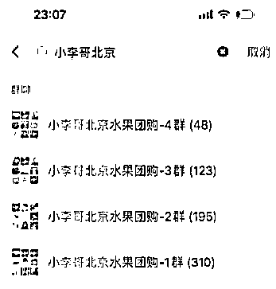

# 公众号懒人找资源，懒人专属群分享

3）最快一天建立一个200人群，当天出了5单

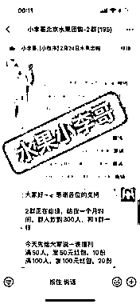 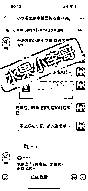 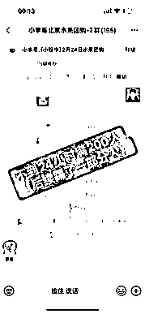

4）手把手教朋友建立一个300人群

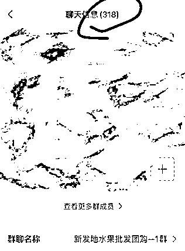

5）收获N多好评

（好评太多了，在最近10天里挑一些展示。以上评价绝对真实，不少生财圈友在里边）公众号懒人找资源，懒人专属群分享

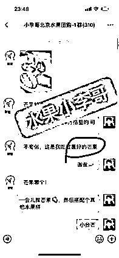 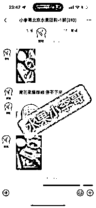 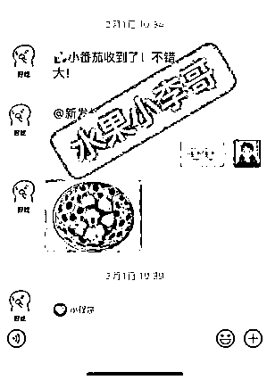  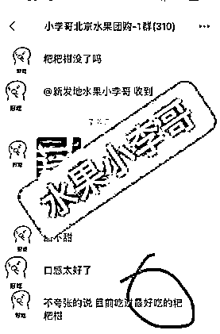

6）有幸给本期小航海做了一次分享，并作为快团团水果的供应链

# 公众号懒人找资源，懒人专属群分享

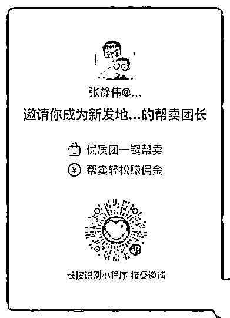

# 二、为什么做水果团购

（一）毛利更高

水果店的毛利高能达到**30%-50%**左右，而我们从一级批发市场直发，省去中间商环节。并且没有水果店的成本，毛利更高！

（二）刚需、高频、复购强

1）水果刚需，每个人都要吃。

2）水果品类多，不断有新的应季水果上线，用户选择多购买频次自然高。

3）水果消耗快，只要好吃用户复购非常强。现在非水果旺季，用户月复购率仍在**38%**。

（实际复购率更高，因为这个数据没有考虑近一周新拓客户下单，他们水果未吃完，短时间内不会复购情况）

# 公众号懒人找资源，懒人专属群分享

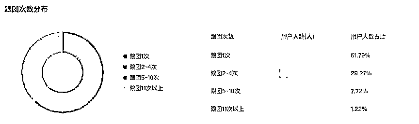

（三）因为有积累、有复利

积累的群、好友会随着时间越来越多，收入也将稳定提升。拓展并维系好一个客户后面会带来源源不断的收入。

（四）供应链有优势

我哥在全国最大的农产品一级批发市场，高碑店新发地（首衡）开水果档口，在供应链方面有足够的优势。

# 三、为什么做**“**同城水果团购**”**

**1. ** 同城水果团购是通过在 公域平台发布内容 （特别是小红书），引流到微信内售卖。

**2. ** 相比微商团购 起步更容易 ，微信好友数少也可以做。

**3. ** 相比小区团购 没有区域的限制 ，这种想象空间更高，做的范围也更广。

（一）启动简单

微商式团购：

# 公众号懒人找资源，懒人专属群分享

**1. ** 启动难 。前期需要一定数量的好友，好友数少很难赚到钱。用户从看到、实际下单有非常大的转化漏斗。

**2. ** 熟人购买 ，好友关系上加了一层利益，影响原先的朋友关系。

同城水果团购：

**1. ** 对 好友数没有要求 ，更多的是从“小红书”公域平台引流好友。

**2. ** 吸引陌生人购买，通过打造IP方式、晒单等等获取他们信任。

（二）投入成本低

**1. ** 固定成本 ：前期无需租场地、装修店面等，只需要手机、WIFI就可以。

**2. ** 时间成本 ：前期新手每天5-6小时，碎片化时间即可。

**3. ** 做了之后发现，宝妈做更有优势，不论是拍照引流、微信群运营等等，比男同胞有太多优势。

（三）微信私域是大趋势

**1. ** 微信有非常多 触达用户方式 ，在微信里做水果团购，复购真的非常好。

**2. ** 用户养成习惯后，很多是 静默下单 ，因为有信任不需要你再次去销售。

**3. ** 随着时间越长 积累 的好友、群越多，利润也将不断提升。

# 四、如何实操

吸引用户后通过运营手段卖品质好易复购的产品。这件事情有三个关键点：流量、产品、转化。

（一）关于流量

**1. **为什么先从小红书开始做流量，小红书目前属于非常大的红利期：

# 公众号懒人找资源，懒人专属群分享

**1. ** 越来越多人用小红书 ：小红书从 1 亿月活到将近 3 亿月活，只用了不到两年时间。用户增长非常快，但写内容的人还没那么多，平台会给新手很多流量扶持。

**1. ** 天然的种草平台 ：用户看到相关内容更容易去消费。而且有能力去消费，50%来自一二线城市。

案例：这篇内容讲的是水果市场情况，没有任何难度。评论区引爆，都是问怎么购买、进群之类的。一个300人微信群一周建立起来。

**1. ** 小白快速上手 ：图文形式的创造，创作门槛低，对文字没有字数要求，重要是好看的图**2. ** 平台对中小创作者友好，就算 0粉丝 也有机会做 爆款 。

下面是我0粉账号做到了1.5万赞。还在持续涨粉中。

# 公众号懒人找资源，懒人专属群分享

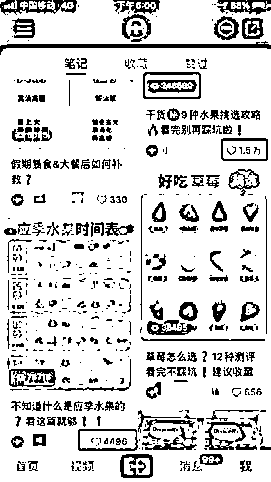

**2. **小红书上卖水果的优势

**1. ** 女性人群。吸引的是年轻女性，与买水果的人群非常契合，大部分有意向消费**2. ** 高消费群体。只要商品好能持续满足她们需求便会持续复购，有能力消费**3. ** 颜值即正义。水果能摆拍出非常好看的照片，吸引小红书用户，引起冲动消费**3. **实操小红书关键点：选题和引流

**3.1 **如何选题？

通过爬虫快速筛选出最新、有效的模版/选题，然后去模仿超越。用这种方式我爆了非常多的内容，拿两个案例说明下：

模版一：应季水果

# 公众号懒人找资源，懒人专属群分享

 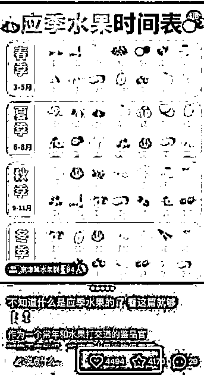

模版二：挑水果小技巧

# 公众号懒人找资源，懒人专属群分享

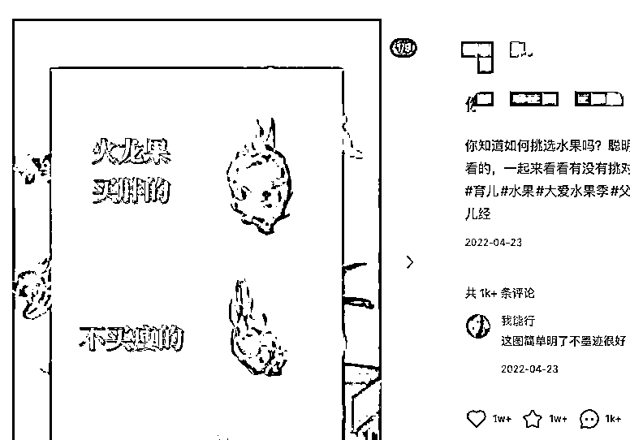 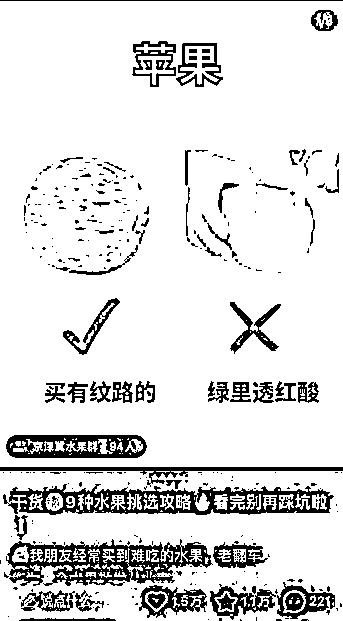

**3.2 **有选题**/**模版后，具体怎么做？

1）找到业务相关话题词，如水果、团购等

2）用后裔采集器爬前500条数据（不想自己爬的小伙伴私我，我给你现成的数据）3）从一条条数据里找到共性，选题、模版共性。重点看低粉高赞、低粉高评论的内容4）按照模板1:1发（把对方图片放到软件上，图层放到最底下。然后在上面开始创作，模仿位置、字号、文案、颜色、图片等等）

# 公众号懒人找资源，懒人专属群分享

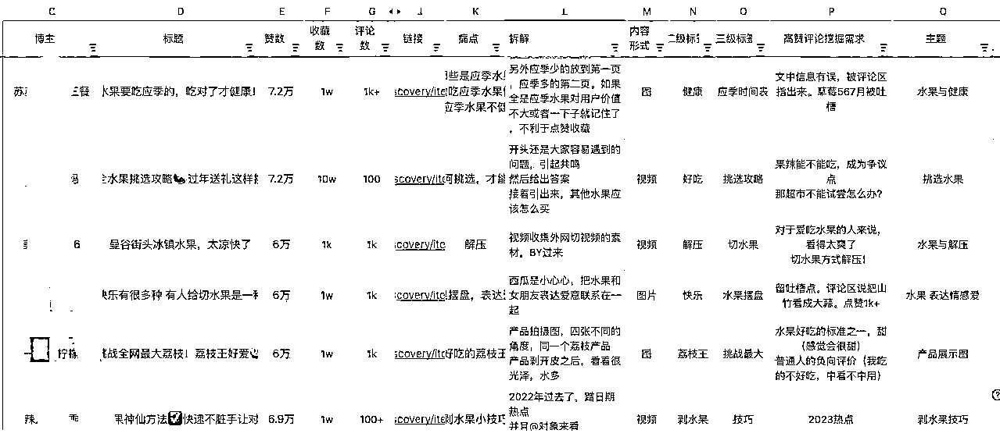

**  **这些爬虫数据可以免费分享

**3.3 **如何引流私域？

1）建小红书群->>笔记下边挂群->>群里拿小号定时发微信

2）个人主页@小号->>小号主页简介引导“看第一个笔记”->>第一个笔记中留联系方式3）  对于在评论的流量->>私信对方->>让对方先发自己的联系方式（注意不要一个话术重复使用）

**4. **其他引流方式

线下广告、同群引流、快递店合作等等，以后有机会再讲。

（二）关于产品

我对产品宁缺毋滥，宁可不卖，也不会卖出质量差的水果。当有好货时立马上狂推，货不好时坚决不卖。

**1**）关于选品方面

# 公众号懒人找资源，懒人专属群分享

选品很关键，但更重要的选好品要找到好货！！

**1. ** 好的水果需要抢

我们每天6点多到市场，发现好吃的水果，我们会先买下来。然后发起团购卖出去，如果起的晚一点货很容易没有。

**1. ** 低价引流水果

引流款水果，我们自己打包来压缩成本，这样价格更有优势。（比如贝贝南瓜去定制包装、自己打包）

**1. ** 上架时机

有的应季水果不是到季节就上，而是应季水果好吃了再上。比如现在是沃柑季节，不一定要立马上品，要等市场有好货时再上。什么时候有好货，就需要每天去转市场来定。

**1. ** 价格实时变动

价格变动是一级市场传导到二级市场、三级市场，再到水果店。我们每天会跑一级市场询问价格，根据市场情况随时调整售卖价格。极端情况出现进价比售价高，也有用户薅羊毛的情况（这40天碰到过2、3次）

**2**）关于水果的套路

我哥自己开档口，对卖水果套路非常了解，可以避免踩很多坑。

比如阿克苏苹果行业潜规则，两层礼盒第一层放好果（又大又好吃），第二层次果（品相口感一般）。但在市场上也有上下一致的，价格差距也不大，就看你能不能找到。

类似的这种坑只能靠时间经验去积累沉淀，而我哥的这种经验我可以直接用。

# 公众号懒人找资源，懒人专属群分享

**3**）关于品质售后

**1. ** 挑好水果

在挑水果方面有很多年的积累，知道什么水果怎么挑、新鲜度如何

已筛选出多家靠谱供应商，但水果一批货与一批货口感略微有差异，所以每次发团前都会试吃，品质满意再发货，不满意不发货

**1. ** 水果新鲜

用户昨天下单，今天采集最新鲜的货，当天发出。

京东快递在京津冀隔日送达。杭州南昌今天发货，后天可送到。

**1. ** 售后有保障

水果非常容易售后，拆分原因解决：

采货质量把控。对我来说好解决。我们自己在一级市场现采，把控品质从源头杜绝坏果。也杜绝对存放时间久、质量不好的果，防止在快递途中腐烂。

快递途中破损。我们在包装上摸索出一套规律。什么水果多包几层、什么水果垫纸片、什么水果放冰袋。

其他原因破损。发快团团红包。尽可能降低占用的时间成本，还能吸引客户再次下单。

我无法保证以后不会踩坑，但是踩坑有售后，且踩坑次数一定不多。

**4**）关于价格方面

# 公众号懒人找资源，懒人专属群分享

我们价格平均比水果店至少低**20%**左右。因为从一级市场拿货，省去中间商赚差价。另外成本低，线上流量获取和维护，没有店面、员工等成本；

案例：

粑粑柑（我们7.6元/斤，水果店12元/斤，连锁超市9.68元/斤）

# 公众号懒人找资源，懒人专属群分享

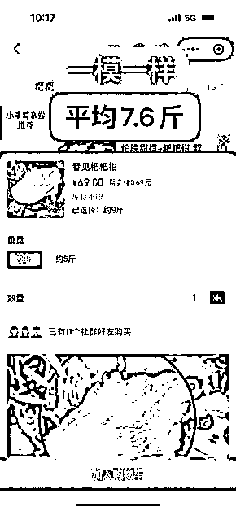 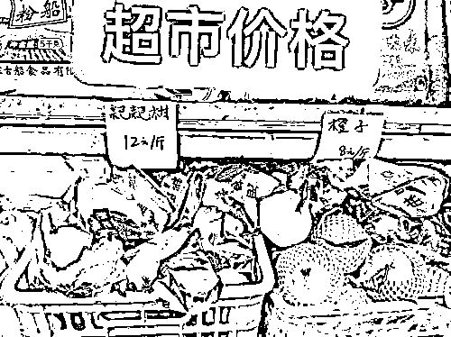 

小台芒（我们价格9.7元/斤，超市11.68元/斤。每次发的小台芒都现采货，需要提前找商家预定，保证新鲜）

# 公众号懒人找资源，懒人专属群分享

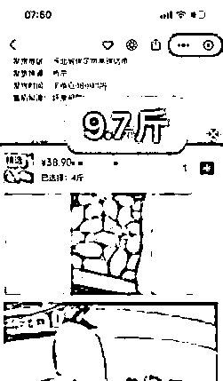 

伦晚（我们6.65元/斤，超市9.98元/斤）

 

（三）社群转化

我性格内向，不善于活跃气氛、引发话题。但我现在的社群氛围还不错。我认为两点：真诚（无套路）、靠产品（水果）打动人心。这两个是道，其他都是技巧。

**1. ** 真诚

真诚的目的是什么？为了获取信任。如何快速获取信任？「移木建信」

通过一个小的承诺，并快速实现承诺，让大家觉得你是言而有信之人。

成员达到xx人发xxx红包，建立新群时我习惯用这种方式，真诚、没有套路，简单粗暴、大家都喜欢。

# 公众号懒人找资源，懒人专属群分享

小提示：千万不能在宣传时以红包为目的吸引进群，比如这群里有红包大家来领之类的话。另外还要把拉人抢红包的人都踢出去。

类似体现真诚的技巧还有很多。

**1. ** 产品质量好，用户自发通过 口碑拉人

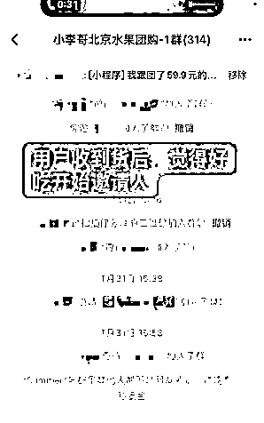

**1. ** 其他小技巧

1）购买后引导将下单小程序分享群里

2）收货后引导晒图

3）加好友后，发一段互动的话（增加联系）、之前群聊晒单记录、下单链接、送一张优惠券4）通过活动来做转化：猜价格活动，猜对可获得商品。且其他人能以这个价格购买。突出商品的优惠力度

**1. ** 未来

现在群运营马上**SOP**流程化了，每个群发布同样的话术即可。以后每次上品我会编辑好文案、实拍水果图发布到群内。大家按照格式转发即可。

# 公众号懒人找资源，懒人专属群分享

# 五、结尾

**1. ** 我为什么做B端？

供应链量大后价格才能更有优势，前期主要靠刷脸拿低价（不可持久）。但C端起量是个漫长的过程。起量快速的办法是找B端团长，所以后面我会专心做好供应链。

**1. ** 为什么要先做C端再做B端？

做C端目的是为了知道团长是怎么干的，才能更好服务他们。同时以后会保留1-3个C端群，方便拿到用户第一时间对水果的反馈

**1. ** 如何合作共赢？

我把控供应链，做好文案、卖点、素材，而你只需要负责引流、积累自己的私域、维护自己的客户。

感谢生财。加入生财后，我收获太多了！如果不是生财，我人生可能是另外一个方向。

加入TikTok训练营，第一次有了十几万粉丝的帐号，而且不止一个账号

通过亦仁，Clubhouse一天引流百人好友

通过生财精华帖找龙珠圈友请教，实操线下拉新，从中获得一个小反馈，被曹大加精。水果团购技能点又能用上【https://articles.zsxq.com/id_c783tpjgr725.html】加入淘宝蓝海，日常躺赚几百

加入小红书航海，一个月变现上万

通过风向标，ChatGPT一周变现小1万【https://articles.zsxq.com/id_f0qr7mv3bt2z.html】通过生财，给我介绍的维权客户

# 公众号懒人找资源，懒人专属群分享

收获太多太多了！！

最后一句话结尾：用心做好每一件事情。

评论区：

念十一｜房产交易 : 这个四五线小城市是不是需求不太行

枝懿 : 里面水果是不是略显贵了些。

Annia Shaw* : 请问怎么拿到你手上那个爬虫数据 [微笑]谢谢  徐来 : 方便加 v 吗？想接一下资源

水果小李哥 : 私

水果小李哥 : 私我发你

水果小李哥 : 没一二线好做

重生Break : IT人转行做水果单日破9000 给你点赞。。。

# **# ****(**精华帖**)(65**赞**)**新人如何从小项目里探索出新

# 机会

作者：  马克图布

日期：2023-04-13

卖快团团团长查查也能日入过百，新人如何从小项目里探索出新机会。

这个文档重点看思路，里面其实有很多玩法，目前我只用来卖团长查查，很可惜的。

希望看到我文章的圈友可以多留言，共享更多的点子，探索更多可能性。#快团团  https://qirenjiangxin.feishu.cn/docx/RBo6dSQZnoLZkaxn7eGch1fWnMh评论区：

# 公众号懒人找资源，懒人专属群分享

小猪 : 目前在小红书引流建群  类似方法  可以交流交流  抖快  快团团  群接龙都有  亦仁 : 卖联系方式的表达建议换一下，听上去吓人

亦仁 : 实际上叫：  团长查查

马克图布 : 好，我改一下

胖胖的梦想 : 6呀

马克图布 : 抖音也有人在弄，我只弄了小红书就已经炸了[色]

徐子然｜子然随笔 : 感谢分享

小猪 : 抖音白嫖较多[擦汗]

# 【进阶玩法】**6**篇

# **# ****(186**赞**)**小红书做探源头工厂的账号，微信群

# 已经满员好几个了

作者：  田新一

日期：2023-05-11

# 公众号懒人找资源，懒人专属群分享

小红书做探源头工厂的账号，微信群已经满员好几个了。以探源头工厂为切入点，做快团团，信任度非常高。

 

# 公众号懒人找资源，懒人专属群分享

评论区：

亦仁 : 中标，术值+1。

在上方专栏点击 #中标，可查看所有中标风向标。

快乐的哈哈   : 想做这个

悦佬 : [强][强][强]

爱拼才会赢 : 这个具体的教程有吗

田新一 : 没有，看下对标账号，自己摸索下

爱拼才会赢 : 好的，谢谢

# **# ****(**精华帖**)(173**赞**)**二胎宝妈通过快团团推荐大

# 团长赚佣金，每天躺赚** 200+ **复盘

作者：  云端

日期：2023-05-04

主题：《二胎宝妈通过快团团推荐大团长赚佣金，每天躺赚200+复盘》

大家好，我是云端，一名生财新人。

大家都知道快团团是微信群带货使用最多的工具，生财连续做快团团的航海项目，也预示着参于微信带货的团长会迎来爆发式增长。大家都去淘金子，我们站在路口送铲子，实现双赢。淘金子的人越多，铲子越容易送。

快团团大团长推荐赚佣金就是我说的铲子，下面我详细介绍一下这个项目流程，非常适合没时间做副业的上班族和宝妈。

请点下方链接移步飞书：

https://xmd2v9p6q1.feishu.cn/docx/HUSAdLZRCoBXiMxK0kFc99Qkndg评论区：

# 公众号懒人找资源，懒人专属群分享

刘小6 : 好厉害！！

爬爬 : 厉害👍

曜 : 超棒！

芷蓝 : 团购真的是太适合宝妈变现的产品了，厉害！

牧清影 : 太厉害了[强]一顿操作猛如虎，每天只赚“25”这句话真押韵[偷笑] 王芮淇 : 这个思路赞👍

Daisy : 介绍的很详细，可操作性很强，真棒👍

愚蠢的大猩猩😎 : 学习了，不知道上班族可以搞吗？

# **# ****(**精华帖**)(104**赞**)**自营牛肉品牌如何运营团购

# 平台？通过私域运营实现稳定营业额** 40-50w**

作者：  深藏blue（chu*

日期：2023-03-06

通过这篇分享，尝试帮助想在私域卖货的大家解决以下4个问题：

1.怎么了解客户需求？

2.怎么围绕自己的客户群，寻找合适销售的产品？

3.怎么和供应链合作，怎么选择靠谱的供应链？

4.怎么拉新？怎么提高复购率？

# 公众号懒人找资源，懒人专属群分享

我是一个 10 多年的英国海归，回国后在一家 500 强企业做 IT 项目主管，一次偶然的计划，进入了牛肉进出口行业，负责 C 端零售渠道，目前通过私域运营自营牛肉品牌，实现疫情期间月销 60-70w，日常稳定在40-50w 。

在短短的 1 年的时间，我们从零开始打造品牌，建立天猫旗舰店和私域有赞商城，布局抖音和视频号，并且快速入局拼多多的团购渠道。

在半年时间销售就差不多做到 1000 万，其中快团团社区团购方面，我们在月销单团做到了 50W+

加入生财已经差不多 2 年多了，最近有幸做了快团团大航海的教练，也借此机会，在这里给大家分享一下社区团购和私域运营这两个方向的经验。

因为今天生财很多同学都在尝试参与“快团团”这种类型的团购，所以我想从怎么做好团购的方向来告诉大家。

本来我想给大家分享的是站在品牌方的角度，一个新零售品牌负责人怎么来入局团购以及通过社群运营实现销售额的快速的增长？

# 公众号懒人找资源，懒人专属群分享

但是因为很多生财同学是以个体团长的形式来参与团购的，所以我想还是从几个对大家做团长有帮助的角度来结合实战来讲讲我的快团团运营经验。

全文分为上下两个部分，上半部分侧重于定位，通过自我定位和客户定位来寻找匹配的大团长，以及设计和寻找和自己客户匹配的产品，

下半部分侧重于社群运营，讲一讲怎么做好自己客户的私域运营，主要就是微信群的运营，包括拉新，活跃社群以及复购。

上篇：定位

（1）自我定位 - 我的优势是什么？

（2）团长定位 - 我能给客户提供什么？

（3）产品定位 - 怎么寻找或设计差异化的产品

下篇：私域运营

（4）拉新 - 怎么拉新找到新用户

（5）微信群 - 怎么让群变得有价值提高客户活跃度

（6）复购 - 怎么让用户买买买

# 公众号懒人找资源，懒人专属群分享

读完这篇文章，你能收获什么？

怎么对自己的客户定位？了解客户需求？

怎么围绕自己的客户群，寻找合适销售的产品？

了解怎么和供应链合作？怎么选择靠谱的供应链？

怎么拉新？怎么提高复购率？

上篇：定位

# **# **（**1**）自我定位

先讲讲第一个问题，如何对自己的客户定位？真正了解自己的客户要什么？

# 公众号懒人找资源，懒人专属群分享

首先对每一个想做快团团的朋友来说，我觉得在做客户定位之前，先要做一个自我定位。

如果你是一个个人团长，你首先要了解你的优势是什么？并且你能给你的客户提供什么价值。

是以一个美食家的身份为客户提供美食选品建议，还是以时尚买手的角色给大家提供服装穿搭选择，或者以一个妈妈的角色，提供各种优质母婴产品的经验选择。

但不论你选择什么方向，要记住有两点：

① 尽可能结合自己的优势

② 寻找垂直的领域和方向

如果你是一个品牌方来说，你要对自己的品牌有个清晰的定位，了解自己的精准客户，并对自己的客户有精准画像。

举个例子，我们的牛肉是以美国谷饲中高端大厂的进口产品为主，客单价一般都在 200 元以上。依据我们的目标消费者画像来看，我们的客户群是：

No1 : 30 岁以上有家庭的女性群体为主，

No2 : 喜欢自己烹饪的

# 公众号懒人找资源，懒人专属群分享

No3 : 文化水平较高，对牛肉尤其是牛排有一定认知，

No4 : 经济收入可观，生鲜产品的购买支出每月可以 2-3 次，每次支出金额在 300-500 之间。

# **# **（**2**）团长定位

有了自己的清晰定位以后，就可以思考寻找怎样的供应链和大团长，为客户提供匹配的产品服务了。

这里我要结合我们品牌方的思路，来看看如何寻找合作的团长了。这里主要有两个步骤：

第一个是在哪些渠道找？

第二个是怎么筛选？

找团长和找对象一样，不能光看颜值看长相，其实走到最后你会发现“门当户对”其实最重要。

先说渠道，和我们做电商一样，我分为线上渠道线下渠道，线上渠道我是去找一些供应链公众号，他们会定期公布一些团长的排名，帮你建立一个认知。

# 公众号懒人找资源，懒人专属群分享

比如说下面这个公众号：快团帮  https://mp.weixin.qq.com/s/2xnSwbH53-0AAbMF_MlnKA

他们会定期公布一些团长卖货的数据，然后还有一些团长销售排名。

# 公众号懒人找资源，懒人专属群分享

# 公众号懒人找资源，懒人专属群分享

上面这是 2021 年的数据，新数据的话，魔都 P 妈早就是稳坐第一名了同时，你也能找到这些团长的二维码，有了二维码你才能有机会联系到团长。

# 公众号懒人找资源，懒人专属群分享

# 公众号懒人找资源，懒人专属群分享

通过扫描二维码，你就能找到这些团长在快团团上的首页链接了，这样你就能够看到详细的团长信息，包括他们的联系方式，帮卖要求，以及最近团购活动等等。

# 公众号懒人找资源，懒人专属群分享

# 公众号懒人找资源，懒人专属群分享

这个就是目前一直都稳居全国团长头牌的“魔都 P 妈”，据了解，目前每月流水就差不多  2 个亿，着实让人感叹团购市场的巨大。

大家看到，这里就有 P 妈的微信号和品牌联系方式了，不过说到这里，这个加微信可不是简单的活，我可以分享一些经验给大家，也是一些有趣的内容啦。

因为大家知道，这些大团长的商务，其实是非常忙，每天大大小小各种品牌方和供应链都会去联系他们和加他们的微信，繁忙的时候，他们其实根本看不过来，

所以为了能加上微信，大家是想尽各种方法，用上各种话术，据说最夸张一个案例，加了 100 次才通过，

最后他加上微信的话术是： “姐，我从冬天加您到夏天，再不通过，  一年就过去了”，结果这一次大概是商务被他感动了，终于通过了。

# 公众号懒人找资源，懒人专属群分享

不过实际的情况，我必须说，几乎 90% 以上都不会通过的。

首先越大的团长他们的供应链其实很全的，而且他们已经有固定的供应链合作方，供应链定期给他们推品就可以，新品牌如果不是很有特色有差异性的，基本都不会理你了。

说到这里，我必须要说说我们后来的策略，之前我讲过，越是头部的团长，其实你的成功概率越低，  （如果你不是很有品牌知名度的大厂商或者拥有当前最火的产品资源，能引起他们关注是非常难的）。

如果按照我的“门当户对”理论，就是说，你要么自己是“大户人家”，你要么是个让人一见钟情的“绝代佳人”，否则就不要想着高攀什么“大户人家”了。

所以后来我们基本的方向就是中腰部的优质团长了，为了让这个寻找团长更有效率，当时我安排了几个同事，专门对市场上的团长做了人物画像以及数据化的分析，下面给大家讲讲我的经验：

先看一张表，这张表我们把团长的开团数据做了几个维度的重点分析：

# 公众号懒人找资源，懒人专属群分享

【团长个人 IP 】

其实每个团长因为个人的背景情况，其 IP 形象是有差异的，其中比较多的是宝妈形象，还有小资女性，电器达人，装修达人等等。

因为牛排的背景和高客单价，在宝妈这个大目标方向下，我们会更细分关注：高知女性（高学历），喜欢烹饪。

【成员数量和跟团次数】

成员数量和跟团次数主要反映的是规模，数量越多，次数越多，规模越大。

【优势品类】

品类方面，我主要看团长的选品喜好，团长是否有卖过生鲜食品类，是否卖过满足同目标类型客户的产品。

① 是否有同类产品，如牛肉牛排海鲜类等生鲜肉品

② 所开团产品是否有母婴类（如儿童玩具，读物，服饰等）、健身类（运动器材，运动衣等）、厨房用品等所属目标客户群体一致的产品。

【近 30 天销量最好的产品】

帮助我们了解目前团长最近推的品的销售情况和趋势

# 公众号懒人找资源，懒人专属群分享

【是否有过牛肉产品销售】

如果有过牛肉产品的销售，我们要看销售的产品是否和我们有重叠，我们有没有差异化的东西。

【开团频次】

开团频次主要是每天开团的频率，一般从 1 次到十几次不等，越大的团开团频次越高。

但是我们要找少而精，如果开团频次很高，但是人气和转换率一般的团长，并不是我们追求的。

我们一般的标准是：开团频次每天至少 10 个以内优质开团链接，跟团人气高（大于  100 次），销量较好（转化率在 2% 以上）

结合上面的数据，我们按照这样的条件进行来了筛选：

客户群体比较精准符合我们的画像，

团长对品质有一定要求，

团长的客单价比较高

# 公众号懒人找资源，懒人专属群分享

团长的最近开团人气度高，转化率符合要求

最后，我们筛选出来差不多二十几个团长：

上海女神团/小荷才露尖尖角 /miu 家万能团 /Winky/ 等等十几个团长公众号懒人找资源，懒人专属群分享

# 公众号懒人找资源，懒人专属群分享

接下来就是沟通，寄样以及再沟通这样的繁琐过程。

这个过程非常重要的一点，就是双方的认知和价值观是否能一致，整个标准就和我说的谈恋爱是一样的，双方需要有个相互熟悉和磨合的过程。

# **# **（**3**）产品定位

社区团购的渠道有其差异性，追求商品的极致性价比是所有团长的需求点，所以很多品牌商都被要求在这个渠道提供更具性价比的商品。

我们其实也面临这样的挑战，我们当时已经开设有天猫这个渠道，当时我们天猫的最火爆的寿喜烧产品因为我们的高品质要求，整个毛利并不是很高。

如果要按照这个品的价格给更低的优惠，在社区团购来推的话，我们应该要给很高的补贴，其实大家知道，商业行为如果没有利润，依靠补贴是很难持续的。

所以后来我们产品团队对整个社区团购的商品，做了差异化的设计，具体做了下面几个方向的调整：

① 在保留寿喜烧套餐的核心品种的同时，我们更换了 2 个产品，也就是换上了 2 个重新设计的新品，新品的毛利更高，这样我们也能提供出更低的价格给到团长。

# 公众号懒人找资源，懒人专属群分享

② 新品的设计上我们调整两个思路，一个是场景的设计，一个是规格的重新设计。

场景的设计，我们当时我们观察到一个趋势，牛肉消费人群中追求低脂健身人群很多，针对这种需求，我们推出了低脂牛肉套餐。

然后在规格的设计上，我们推出了一款小包装产品（ 100g 独自美丽包）。

小包装产品可以让客户从心理上感觉到，花同样的价格买到的盒数更多，所以当时我们推了一款 99 元 10 盒的限时福利抢购。

# 公众号懒人找资源，懒人专属群分享

# 公众号懒人找资源，懒人专属群分享

③ 和牛产品引导高端客户，当时我们在社区团购比较早的推出了和牛产品，而且我们一开始就主打最高等级的和牛产品（ M9 等级），直接吸引了很多高端客户的注意力。

# 公众号懒人找资源，懒人专属群分享

大家可以看到下面我们开团的效果，在女神团，我们的产品非常短的时间获得消费者的好评。

# 公众号懒人找资源，懒人专属群分享

在第三次开团的时候，我们的产品总共卖出 2000 多个订单，有点小小爆了，当时在女神团开团的食品类目中，我们排到了前三名。

按照我们客单价 200 元来计算的话，2000 个订单，也就是 40W 左右的销售额。

总结一下，我一直认为在社区渠道如果能为社区团购定制化差异化的新品是最好不过的。

# 公众号懒人找资源，懒人专属群分享

差异化的产品包含很多个方向的思路，差异化的品类，差异化的产品规格，以及差异化的场景，这些都能让你避免同样的一类产品在不同渠道被反复进行比价。

下篇：私域运营

在我们社群团购中，除了和团长合作以外，我们也设立了自己的私域团购渠道，也就是品牌方以团长的身份直接销售产品给终端客户，并且取得了很好的增长效果。

私域运营中最重要的 2 个环节是拉新和复购，简单来说，就是两句话，如何用低成本找到新用户，然后持续地让客户买买买。

# **# **（**4**）活动拉新

寻找新的客户，以及源源不断寻找新的客户永远是私域运营最重要的部分。

拉新的方法有很多种，熟人介绍，朋友圈拉群，活动拉群，以及小红书等其他公域引流都是很好的方法。

# 公众号懒人找资源，懒人专属群分享

因为很多线上的方法在生财都有介绍，我就重点讲一下不一样的，也是我们做的比较多的方式 —— “线下活动”拉新。

做食品类的产品，其中有个很大的逻辑就是如何低成本让客户去尝试，因为只要你的东西够好，客户尝试以后，就会很容易发展成为你的客户。

因为我们的产品价格偏中高端，考虑到要寻找精准的客户，我们经过很多次的测试，最后定位于针对一些目标社群的活动。

这里要解释一下我们的目标社群，我们的目标社群主要是指集中聚集我们的目标客户的社群，主要包含以下社群活动：

① 青少年体育俱乐部活动

② 企业工会组织的活动

③ 中高端社区活动

④ 其他活动

大家知道，线下活动要投入不少人力和物力，还有时间成本，所以找到精准客户，提高转化率非常重要。

但是找到客户只是第一步，后期的转化和留存也非常重要。

# 公众号懒人找资源，懒人专属群分享

最早的时候，我们是让客户关注我们的公众号，然后推送我们的产品优惠券，但后来发现，这个路径太长了。

因为客户关注了公众号，但是后期你很难持续跟踪客户，从而导致客户流失。

后来我们的改进策略是：客户试吃满意后，我们用个人微信（企业微信）加客户，然后直接推送优惠券给客户，同时对客户做好分类标签，后续就能做个性化的推荐和跟踪。

这里同时我们会对客户做邀请加入微信群的动作，为后面的持续运营做好准备。

# **# **（**5**）微信群运营

虽然大家都有意识把自己的客户拉到自己的群里，但是实际上微信群的运营是个非常复杂的工作。

考验微信群运营的好坏，我觉得只有两个指标：客户互动率和客户下单转化率。

这两个指标是相互关联的，只有做好了客户互动，才谈的上下单转化率。

客户互动率是考察微信群活跃度最重要的指标，其实就是看客户对你的群的信息的关注情况，你发的消息或链接的点击进入率有多少，试想一下，你在群里发的消息都没有人看的话，你还有什么奢望客户能在你的群里下单呢？

# 公众号懒人找资源，懒人专属群分享

在做这些之前，我觉得首先要思考一个定位问题，也就是你的群对客户的价值是什么？

大家知道，现在是信息爆炸时代，过多的群的，过多的信息，导致的结果就是客户只能有精力关注自己喜欢的东西，如果你的群的价值不够，最后的结果就是慢慢变成死群。

经过思考，我们对于我们的微信群做了以下的规划：

① 围绕牛肉定期发布一些有价值的内容，包括美食分享，烹饪经验，购买小知识等等。

高价值的内容永远是吸引客户的关键要素，所以找到客户的兴趣点，发布一些对客户有价值的内容永远是关键。

所以自己不断整理有价值的内容，然后分享到群里，制造话题，引发大家的讨论，是提高客户活跃度的重要手段。

所以我们重点做了两件事情：

第一，每周都会发布一些有意思的话题，同时带动大家讨论，  到目前为止，我们引发大家参与比较有意思，互动率比较高的话题包括：

Top1 : 你最喜欢的火锅蘸料是什么？自己怎么制作的。

Top2 : 到底牛肉是否可以反复解冻？

Top3 : 低温慢煮怎么操作，有什么低成本的低温慢煮的方法？

# 公众号懒人找资源，懒人专属群分享

我放了一些我们互动做的比较好的话题的讨论的截图，大家可以参考了解，看一下我们怎么来激发客户参与的热情。

# 公众号懒人找资源，懒人专属群分享

可以看到，只有客户对你的群的内容感兴趣，才会更加关注群里的信息，参与群里的互动，也才能提供互动率。

② 定期只有在群里才能够享受的优惠。

其实客户加入群，肯定有一个目的就是希望能够在群里享受到专享的福利。

这个福利本质上就是一种特权，因为这也是让客户觉得加入群的“价值”。对于这种群内的福利，我们做了这样的设计：

每周发布一次群内专享折扣福利

不定期做一些有趣的互动活动福利，包括新品试吃福利，抽奖福利等等

这里我需要强调的一点是，福利很重要，但是发布福利的形式也很重要，大家记住有趣好玩，还能有便宜才是最好的福利活动方式。

我们在群里设计的比较成功的福利活动包括以下两种：

【半价拍卖活动】- 选择一个产品，在群里做零元起拍卖，在 1 分钟内，最后一个出价最高者获得，最高出价可以规定为正常销售价格的半价，保证客户的权益。

# 公众号懒人找资源，懒人专属群分享

【现金券膨胀活动】- 规定一个时间，客户出 10 元购买抵扣券，第一名购买者，可以  10 元当 50 元使用，第 2-5 名购买者，可以 10 元当 30 元使用.，第 6-20 名购买者，可以 10 元当 20 元使用。

以上两种活动可以让福利变得不确定，从而利用大家“博一博”的心理，提高参与度，对群的活跃度有很大的帮助。

# **# **（**6**）复购转化

提高了客户的参与度，那么就可以在复购转化上下文章了，但是在这里我特别想强调的是，提高复购转化，绝对不是一天到晚不断给客户推送下单的链接，其实这一点我是觉得不合适的，给客户推送产品信息是要讲究两个方面的：

① 推送的时间节点

大家要意识到，产品的推送时间绝对不是越多越好，而是要结合客户的消费频次，最好的节奏是在客户上次购买的产品差不多消耗完了，才推送你的产品。

举例子我们的牛肉产品，一般客户购买牛肉的频次周期大约为一个月 2 次。这样的话，最好推送产品信息的节奏是 1 周 1 次，最多不超过 3 次。

② 推送的内容

# 公众号懒人找资源，懒人专属群分享

推送的内容大家一定不要简单做群发，结合客户的实际情况做定制化的产品推送是效果最好的。

举个例子，我一般的做法是先询问客户之前的产品感觉如何，有没有什么反馈信息，然后了解客户的要求和想法之后，再来做精准的推荐。

比如客户反馈说想吃瘦一点的牛肉，然后你就可以推荐后腿牛肉，客户说下周要请朋友吃火锅，然后你就推荐火锅套餐。

大家一定要记住，越是精准的推荐，成功率才会越高。

完结篇：最后想说的话

结合上面这两点，我想再总结一下，社区团购要做的好的话，离不开两个核心要素：

一个产品选的好，满足客户的要求，价格有竞争力

第二个是拉新和复购做的好，保证源源不断有新用户，并且不断买买买。

做好了这两个，销售额增长就是时间问题。

# 公众号懒人找资源，懒人专属群分享

不过如果反思当时我们的发展过程，我们在三个月内能够快速增长，其实还有一个很客观因素就是疫情，疫情期间让团购变得非常火爆。

但是当时，我们却要面临一个最大的挑战就是配送问题，我记得当时顺丰的配送也遇到很大问题，很多网点没有办法配送，我们的产品被顺丰退回。

当时我们没有坐以待毖，而是做了一个现在看来非常难而正确的决定，这个决定在我看来，对于我们后来品牌销售增长起到了很大的作用。

所以在文章的最后一部分，我想和大家分享一下我们当时怎么在极端困难的情况下，完成服务和履约。

因为在我看来，给客户提供超过他预期的，别人做不到的服务，也是一个核心的竞争力。

当时我们面临配送的巨大困难，每天大概有 150-200 多个订单，其中顺丰能完成 50% 不到的订单，我还记得在临近上海封城的后面几天，每天情况是变得越来越难。

有一天我们积压了几乎 150 个订单。当时我和我的小伙伴说，如果这些订单我们无法配送导致客户退款，我们就浪费了好不容易积累的巨大流量，这对后期我们品牌是非常不利的。

于是，我们下定决心，要不惜一切代价，把订单履约完成。

为了履约，我们做了三套方案：

# 公众号懒人找资源，懒人专属群分享

① 货拉拉配送

② 骑手配送

③ 私家车配送（也就是我自己开车去送）

我们按照上海的区域，把宝山杨浦虹口分为一个配送区域，黄埔静安徐汇作为一个区域，长宁闵行一个区域，浦东一个区域，松江一个区域，每个区域我们再去找相应的货拉拉和骑手来配送。

# 公众号懒人找资源，懒人专属群分享

# 公众号懒人找资源，懒人专属群分享

# 公众号懒人找资源，懒人专属群分享

因为当时有很多小区有疫情，要无接触送货，对于每一个司机和骑手，为了确保他们能保质量送到客户手里，我们要求他们拍照留底。

# 公众号懒人找资源，懒人专属群分享

# 公众号懒人找资源，懒人专属群分享

就这样，我们当时一天最高完成自己配送 150 个订单的最高纪录，当然我们也付出了很大的配送成本，平均每一个订单的配送成本在 30 元左右，比日常的物流配送高出 1 倍。

不过也正是因为，我们当时不计成本的投入保证配送履约，让我们赢得了团长和客户的认可，当时有很多竞品是无法配送到客户手里的，所以这也让我们在后来疫情后面的销售额做到了飞速增长。

回头来看，无论团购是怎样的变化，还是要回归到商业的本质。

借用最近很火的刘强东的话，你不要跟我扯那些乱七八糟的，你们这些管理层不要跟我说那么多花的、新理念的、新词，别跟我说这些，你们要回归常识，回归到商业本质的5个要素（产品、价格、服务、成本、效率）。

# 公众号懒人找资源，懒人专属群分享

与大家共勉！

评论区：

Unstoppabl* : 福利活动的设计真心不错

许锐 : 特别精准的人群规划和复购提升，学到了~

深藏blue（chu* : 哈哈  还有很多实用招数有机会给大家分享

安神 : 共勉

亦仁 : 感谢分享，已加精华。

倪大胖 : 借用最近很火的刘强东的话，你不要跟我扯那些乱七八糟的，你们这些管理层不要跟我说那么多花的、新理念的、新词，别跟我说这些，你们要回归常识，回归到商业本质的5个要素（产品、价格、服务、成本、效率）。

光子郎 : 你这个产品的毛利率大概多少区间

芷蓝 : 这篇好详细，太厉害了

# **# ****(74**赞**)**我是如何在半个月时间内借助快团团带

# 货超四万的？

作者：  小可

日期：2023-03-29

大家好，我是小可

首先介绍一下我今年一月份半个月时间用快团团完成了近四万销售业绩的过程，然后再给大家分享一下我这些年微信端运营的一些技巧。

请大家查看全文

全文阅读：https://i.shengcaiyoushu.com/docx/TD6FdV3Eeo2IZvxepP9cZQ3inPb评论区：

# 公众号懒人找资源，懒人专属群分享

HRJ : 怎么打不开呢

蕃茄 : 打不开

念念无住 : 这个链接只能在微信里打开😂

小可 : 稍等我看一下哈

小可 : 我这边点击可以打开，再试试看呢

蕃茄 : 可以看了  谢谢分享

张静伟@生财有术 : 麻烦更新一下知识星球APP，再打开看看呢

HRJ : 我刚试让微信端打开。

# **# ****(**精华帖**)(76**赞**)**如何通过小红书和快团团一年

# 时间把品牌从零做到** 1000W**？

作者：  任衍政

日期：2022-12-09

看到最近小航海新增小红书和快团团赛道，也看到亦仁最近也在关注小红书平台，感觉大家对小红书和快团团越来越重视，因为身边有朋友通过做小红书半年在杭州全款买房，自己也是这两个平台的收益者，所以想简单和大家分享下我的历程和踩过的一些坑，如果你的客户群体也是宝妈，女性消费群体，那么通过今天分享希望对大家有帮助和启发。

这篇文章将和大家分享我是如何通过小红书从零打造品牌，通过种草品牌，招募淘宝天猫，快团团分销代理，开通天猫旗舰店，最终实现销售额目标，全文4000字，大约需要6分钟时间。

大家好我是九楼，2020年4月加入生财，定居杭州滨江的山东人，公司在钱塘区，欢迎链接交流～

# 公众号懒人找资源，懒人专属群分享

https://c7yevpcq25.feishu.cn/docx/Rrp5dxRXDo4Xn1xi3pGcBDcanjd?from=from_copylink

评论区：

黄天 : 太干了，正是我需要的，感谢分享

任衍政 : 感谢认可[玫瑰]

巧巧 : 太牛了，想在快团团上帮卖

任衍政 : 约起来[机智]

安神 : 品牌-控价，1、产品朔源码（品牌方购买后，可以追查是哪个渠道的，这个时候要定一个销售规则，撕码不予售后，比如把质保码和溯源码做到一起）  。 2、线上投诉，属效率最快的，比如阿里巴巴、抖音快手、PDD、JD知识产权保护平台投诉乱价产品，现在很多微商产品都是这个手段。3、工商12315平台，针对没有知识产权的  平台，处理效率慢一点。

任衍政 : 优秀～[呲牙] 是这么个方式，还有就是年度返款，违反控价扣钱等等[偷笑] 安神 : 如果品牌方有商标或者专利，自己就能操作。

哥，留个v，还想和你取取经，关于博主筛选。

任衍政 : 兄弟你看下我足迹有联系方式哈～ [呲牙]

# **# ****(51**赞**)**如何用数据来支撑选品和推品，提升用

# 户体验和粘性？

作者：  小白- 厦门

日期：2023-03-29

大家好，我是小白，现在在做快团团私域电商业务，花了一年时间零售端月销突破200万，这篇分享是在快团团航海期间整理的【关于团队成长和对快团业务的思考】，请大家查看全文

全文阅读：https://i.shengcaiyoushu.com/docx/X3IZd7zVMoGRlExHHHHcOA07njf评论区：

# 公众号懒人找资源，懒人专属群分享

lydia : 感谢分享！月销200w，求问利润率能有多少？

小白- 厦门 : 团购整体利润率不高，20 个点左右

许老师 : 太厉害了，我也在做快团团，不过做的是同城水果团购。您这个月销200万，私域规模大概多大啊？

小白- 厦门 : 本地生活是快团今年的重点，除了水果外可以多拓展品类，也可以多跟官方聊聊资源

我们目前私域用户体量10 多万。

许老师 : 太厉害了，向您学习，我现在私域规模才几千。和官方聊资源是指找快团团官方吗？

阿宝 : 小果甄选团吗[强]

小白- 厦门 : 这是另外一个业务[呲牙]

芷蓝 : 如果是宝妈，在做快团团的时候，建议开一个小红书或者抖音账号把自己操作的过程记录下来，未来团购赚到钱了，你还能做知识付费。

# 【踩坑经验】**3**篇

# **# ****(**精华帖**)(184**赞**)**群买买生死启示录

作者：  老胡

日期：2023-04-13

群买买生死启示录

好久没来生财分享了，今天下午写了一篇总结，希望能给做社交电商的创业者和参与者们一些参考。

4月4号那天群买买公众号发布了一则公告，具体内容就是逐步停止群买买相关的运营服务，到这个阶段就算正式官宣这个项目寿终正寝了。

# 公众号懒人找资源，懒人专属群分享

实际上从3月22号开始起，拼多多要把这个项目关闭的消息已经开始在小圈子里在传播了，只不过群买买官方没有正式跟我说这个事情，所以我也就没对外说起。

在这期间所有来问我的团队长和朋友们，我都统一回复“等待官方通知，具体情况我不知道”。

一直到3月26号那天上午，群买买官方运营人员来到杭州，跟我当面说了这个项目即将关停的事情。实话说我个人感觉到并不意外，只不过对于旗下的团队长们来说确实有点来得太突然了，让大家猝不及防。

从头开始算起我入局群买买这个项目到今天也快2年的时间了，在这2年中我们团队一共做了1.5亿的GMV，给旗下团队长发放了超过2400万的佣金，而我们自己在这个项目中也就赚到了几百万而已（远远低于我当初的预期）。

虽然明面上是接近730万的收益，不过还有些大的团队长的收入是我们代发的（占70%以上），再去掉各种税务成本和人力成本，所以我们自己的实际利润也并没有多少。

在这两年里真的是发生了太多的事情，正好借着这个机会复盘总结一下，也算是对过去的2年有一个交代。也希望这篇文章能给正在做社交电商平台的创业者们，以及正在参与社交电商相关的团队长们做一个参考，大家以后少踩坑。

废话少说，直入主题，特别说明下，本文完全从陈述事实的角度客观角度来写，没有带任何的情绪化和抹黑行为。

2021年的5月份我们当时内部在做一些新项目的测试，这个时候我测试了2个平台，一个是快团团，一个是群买买，其实这两个都是拼多多推出的产品。

我先测试的是快团团，当时我从朋友那边拿了一个无线耳机产品作为测试，产品上架后，我发布了一条朋友圈，居然卖出了1.7万元，毛利接近7000元，初步感觉还是很香的，但是快团团这个玩意吧，需要我们自己处理售后，这个就有点麻烦了。

过去这么多年我们虽然是做电商相关的事情，但是也仅限于给淘宝、京东这些大平台带去导购流量。但是对于卖货，对接供应链，处理售后这些是没有搞过的，所以感觉还是有点重，于是就没继续深入下去。

时间来到2021年6月份，当时群买买的负责人找到我，希望我能帮助他们推广下群买买这个产品，跟我讲了拼多多对于这个产品的规划和期望，我听完后也进行了一次测试，从群买买里面挑选了一款女士手表，然后发到朋友圈，同样也是一条朋友圈卖了1.5万元，有近5000元的佣金收益，且不需要我们处理售后。

# 公众号懒人找资源，懒人专属群分享

两者对比下来，我还是觉得群买买这个产品的参与度会更轻一些，也更加适合我们以前做电商导购的这批人，为此我还专门去上海拼多多总部找他们深入聊过几次。本来刚开始谈的是帮他们推广，他们支付我广告费的逻辑。

后面我测试完了以后，也深入了解过这里面运营逻辑，最终决定不做单次的广告推广，还是深度参与到这个项目当中去。

2021年7月份，我没有任何的推广，只是通过朋友圈招募一些团队长，自己也卖一卖，第一个月就做到了500万的GMV，同时我也写了一篇公众号文章推荐下这个项目，我估计老粉丝们都看过“群买买，拼多多的社交电商野心有多大？”

当时这篇文章被28家自媒体转载过，在全网有超过30万的浏览量，瞬间传播开来，那段时间“群买买”在微信里的搜索热度超过了其他几家社交电商平台的总和。

借着这股东风，我们旗下的代理店主数量也达到了35万之多，我们团队的业绩也从500万每月飙升到2021年11月份1800万/月，增长势头非常良好，正在朝着我当初设定的目标，每月一个亿的GMV奔跑中。

可是天有不测风云，在2021年11月29号的时候，我突然接到群买买官方的通知，他们说从12月1日开始起，代理政策要变动，这个来的实在太突然了，只给我们2天的时间向下传达，就是这个代理政策的突然改变，直接导致了我们整体的崩盘。

那到底是改了什么政策呢，主要还是代理分佣政策，之前群买买规定的是店主加入平台后，只要达到了298元的销售额，就可以长期拿旗下一级店主15%的佣金抽成。达到了1000元，就可以长期拿旗下一级店主25%的佣金抽成。

但是12月1号以后就改成了每月动态清零，也就是每个月必须要卖到298元的销售额才能拿旗下一级店主15%的佣金抽成，每月必须卖到3000元，才能拿旗下一级店主25%的佣金抽成，而且每月都是从0开始计算。

就是这样的一个政策改动，导致了我们整个店主团队60%以上的流失，那段时间分销店主们都在大骂拼夕夕这个公司野蛮粗暴，随意改动，先骗大家过来做，做起来以后马上收割。言而无信，毫无诚意可言，所谓的本分就是扯淡……

所以经过2021年12月的那次大改动后，基本上业绩从1800万/月，直接腰斩到1000万/月，后面经历了过年，到2022年初，基本回落到了800万/月，相比之前的高峰期直接下滑了50%以上。

# 公众号懒人找资源，懒人专属群分享

尽管这样，出于对团队的负责，我们还是坚持继续合作，月会、周会照样开，带着团队继续冲，但是2022年4月发生另外一件事情，就是这个事情让我彻底从那之后不再重点推群买买这个项目了。

到底是个啥事呢，那就是在和群买买达成合作之初，在我们的约定中，每月从总GMV当中拿出1%作为我们服务商的额外奖励，之前几个月都是正常的在发放，比如1800万每月的时候，我们可以拿到18万的额外奖励。

但是到2022年4月份的时候，群买买在没有给我们任何沟通的前提下，直接把这个1%变更为0.1%，可以说几乎给砍掉了。

我知道后特别恼火，找他们沟通，他们给的回答是，当时说这个1%每月可能会有浮动的，你们说浮动我能理解，1%浮动到0.8%、0.9%甚至是0.7%我都能接受，前提是你要跟我们提前沟通呀，但是你们说都不说直接浮动到0.1%，这让我每个月支付给第三方的手续费都不够，甚至还要自己去贴钱。

在我找他们沟通的过程中，他们官方总是非常强硬，实在讲不过了就是那万年不变的一句话“领导要这样调整的，我们也没办法，只能执行”，我听后实在是无语之极，有种人为刀俎，我为鱼肉的感觉。

面对这样的情况，我直接告诉他们官方，我不会再重点做这个项目了，因为精力的投入非常不值得，你们说收割就收割。他们官方的人也是非常恶心，觉得我们要不做了，就赶紧联系我们下面的团队长，开始让我们团队内部形成斗争，让下面的团队长从我们团队脱离出去。

这真是一个至今让我想起来都非常恶心至极的操作，那么他们到底是怎么做的呢？

本来这段我不想说，但是很多团长不明真相，也一直很不解，去年很多人问过我，我都没有说这个情况，那么今天这个项目结束了，我的气也早都消了，现在可以心平气和的跟大家说下这个事情的来龙去脉。

当时他们官方找我们合作，我们作为经销商的身份参与到这个项目当中去，会根据每月的总销售额给我们1.5-3%之间的经销商返点，也就是说这个是给我们公司的利润，他们要求的是严格保密，不允许对任何外部第三者透露，所以我们也遵从这个原则。

但是2021年4月以后，他们觉得我们不想继续参与这个项目了，就开始通过一些不为人知的方法传达给我们下面的人，说我们每月有拿到经销商返点这个事情。

# 公众号懒人找资源，懒人专属群分享

后面果不其然一个偶然的契机，下面的团队长就借机开始闹事，闹事的目的就是让我们把每月的经销商返点也分给她们，其实在此之前我们每月都给旗下的团队长制定业绩标准，然后根据业绩完成度再进行想要的额外奖励，但是这次她们要求的是不考核业绩了，直接按照比例进行分配，这样后续的团队运营管理实在没办法弄了。

如果我们不同意这种要求，官方就会安排让旗下团队长脱离我们独立出去，这种事情是我绝对不能同意的，社交电商的核心就是关系链的绑定，如果官方随意因为某些事情或者刻意安排，就能让团队进行脱离，那以后谁还敢做这个平台。

当时这个事情闹得还挺大，反正在2022年4-5月期间，我因为群买买平台的这种骚操作，痛苦了2个多月，感觉被平台坑了，被平台欺骗和恶心了。从此以后我就没怎么推广过这个平台了，只是放在那里，安排个同事常规维护着，所有的不爽就自己默默承受了，也从未对外公开说过。

对于当初闹独立的团队长们，我们最终也达成了约定，每月分一部分经销商返点给她们，至于她们是否往下分配，怎么分配我们一概不管，一直到现在都是如此，只要每月能拿到经销商返点我们都会准时打给她们。

所以自从去年那件事发生以后，我的精力就没在群买买这个项目上了，我也没关心他们发展的怎么样，和他们官方的沟通也几乎很少，一直到3月底他们决定把这个平台关闭，我也就在这个事情上算是真正的退出了。

最后再说下群买买的善后工作吧，他们官方安排的是把群买买的运营团队合并到快团团那边去，把我们旗下的所有用户都迁移到快团团，可是这是两个不同的产品类型，真的很难进行迁移的，快团团只有2级帮卖分销，而群买买是属于社交电商的多级分销模型，靠团队裂变赚钱的，所以这种合并迁移注定是没有任何效果的。

现在我们团队旗下的一些人愿意做新平台的，我们已经介绍他们去做别的社交电商平台了，当然还有很多都已经流失了。

通过参与群买买这个项目近两年的时间中，我自己也有很多的总结和启示。

1、社交电商平台从启盘那一刻开始就要想清楚你的整个代理分销机制，千万别为了短期的业绩疯狂补贴，接着后面觉得亏大了，不可持续就要调整，这样是损害很多团队长的利益的，一定会引起巨大的反弹，甚至都是有崩盘的风险。很多平台搞不下去了，都是这个问题导致的。

2、大公司尤其是上市公司，还是不要搞这种社交电商项目为好，无数的例子都证明了这个事实。

# 公众号懒人找资源，懒人专属群分享

因为这里面牵涉到很多的法律法规问题，大公司的那些操盘者都是打工的，他们自己根本不愿意也不敢承担这种责任，谁愿意为了一份工作把自己送进去？

创业公司之所以能搞，那是因为CEO自己在承担着最大的风险，所有的人员包括法务财务都是会围绕着CEO的目标来想办法配合，而大公司内部这种互相掣肘，导致项目根本无法推进，最终会流产。

3、项目的操盘团队一定要是成熟稳重的久经沙场老兵为好，他们的经历足够多，了解足够深，不会轻易的为了短期的绩效胡来。

而很多年轻的操盘手，经验不足，自认为了解这套体系，就能操盘一个社交电商平台，在打法和节奏上毫无章法可言，随意更改。

最后葬送了整个项目，他自己拍拍屁股走人了，公司给他交了大量的学费，而最终受伤的还是当初相信他们的那些团队长及合作伙伴，因为他们所有的努力都会付诸东流，很多人还是靠这个生活的。

4、在运营社交电商平台中，就算是需要调整，也要按计划的逐步实施，不要一会猛给激励，觉得不行又停止激励，这样政策反复是绝对不行的，所有人都没有安全感，对平台信任度不够。在这个过程中一定要及时跟合作伙伴传达和沟通，并留出足够的调整时间来逐步消化进行，而不是从宣布到调整就给几天的时间，这种就是胡来。

5、就算平台停止运营了，也要妥善的处理这个善后工作，不要短时间内强行关闭，也要给旗下团队长们一个可靠的新出口，如果愿意做其他平台的最好也要支持关系链的平移，格局一定要够大，不要认为你们自己不做了，也需要这波团队长们陪葬，在江湖上留下一个好的口碑比什么都重要，也许未来有一天你还需要这些合作伙伴。

6、官方操盘手和运营团队要能听得进去合作伙伴的建议，不要一味的坐在办公室里拍脑袋做决策，最后把一盘好棋打得稀巴烂。在这个过程中最好发动自己的家人也参与体验起来，这样你接收到的信息会更加客观公正，因为团队长们反映的问题你可能只认为他们站在自己角度来想的。

7、团队长们选择社交电商平台的时候也要多擦亮眼睛，多了解这个平台的背景和操盘手创始人，最好不要轻易参与那种看起来是大公司搞的社交电商项目，因为他们的主业不是这个，只是想测试下。

最终关闭的可能性非常之高，咱们进去陪太子读书，时间精力付出和收获完全不匹配，最后啥也没获得，什么沉淀也没有，团队也会在一波波的转移中不断流失。

# 公众号懒人找资源，懒人专属群分享

如果你实在拿不准哪个平台靠谱不靠谱，可以问我，我一定会把我知道的毫无保留告诉你。

8、不要轻易进入社交电商的坑，一入深似海，进去容易出来难，尤其是这种多级代理分销平台，没进去之前你是爷，你进去之后就是孙子，团队进去了你很难带出来，平台想怎么调整就怎么调整，想怎么割你就怎么割你，作为团队长而言毫无话语权，要做好人为刀俎，我为鱼肉的心理准备。

好了，关于群买买这个项目的总结，我就写到这里吧，第一是对我自己过去2年有个复盘，第二是希望给正在做和即将准备做社交电商的朋友们一个参考。

评论区：

温州土老板 : 写的很好啊，很有收获。我光羡慕你当初做群买买的超前眼光了。没有想到背后有那么多，心酸的故事。

老胡 : 还有很多我真的没写出来，给他们留了面子

铁头梁 : 老胡太辛苦了，分享的到位。

老胡 : [拥抱]

修 : 好多年前有个生鲜社交电商每日一淘，本来也是做得好好的，公司换了一批很年轻的操盘团队，乱改政策，然后，，，就没有然后了。

亦仁 : 再一次证明，躺赚的只有制定规则的人，咱们做题家不要幻想躺赚，赶紧起来搬砖。

IDO老徐 : 赞同这句「在江湖上留下一个好的口碑比什么都重要」。

老胡 : 确实如此，还是要有自己的根据地才靠谱。

# **# ****(111**赞**)**一个知识产权批量维权的**“**不厚道**”**玩

# 法，快团团、无货源的要注意风险

作者：  蓝海游龙

日期：2023-05-09

一个知识产权批量维权的“不厚道”玩法，快团团、无货源的要注意风险  案例分享  思路分享

# 公众号懒人找资源，懒人专属群分享

1，作为极少发帖的老圈友，今天小郁闷了一下，不过很快释然。去年底的“兔圆圆”商标，才注意被央视旗下公司申请撤销使用权，人家自己重新申请，不会从我这里买。

（我是备用而已，不是专门注册买卖商标的），这个算不上损失，吸取教训，以后做好使用证明记录，可以轻松应对。

2，不过这事一刺激，想起知识产权的的一些玩法，有些长期主义。有些杀鸡取卵，别的地方说不合适，在这里说一个“不厚道”的吧。做快团团和无货源的要留心踩坑。

（1）你发现一个貌似很靠谱的低价正品货源，门槛也不高，或者少量可拿，甚至一件代发，挂上后推广成本也不大，很好出单。也不管你是不是乱价……

（2）过个半年一年甚至更久，这个品可能热度下去，可能更卷了，不怎么卖了。甚至都下架了。

这时候，传票来了。比如可能就卖个几千几万，赚个小几千吧，但是被索赔几十万甚至更多。怕了、慌了，没辙，因为真就是假货。

而且你发现有一个你的买家，买完之后就做好了各种“存证”，你没法狡辩。

而且你的销售记录平台方是可以透露给别人的。

所以认栽吧，后续态度良好，好好求情啥的，一般不用你赔十倍了，赔付几万块钱吧，按销售额的3倍。

（3）因为一开始这个供货源头，有的是品牌方早就知道的，也有通过几层手套安排好的，人家故意不理不睬。等你长肥了（销量很好查）再杀，你以为占了小便宜，后面还是吃大亏。

（4）换一个角度，品牌方用这个玩法，和维权团队合作，都是极低成本（品牌方授权即可；维权方买产品+取证的人力投入）。

每成一个，都有对应分账。

这个团队每个品都是等时机成熟再收网，当然不止做一个品，也有别的品和别的业务。

而且啊，这还是阳光合法的。谁敢售假了还电话里或法庭上硬气，怕是要罚更多、让人家赚更多哦。

（5）把这个套路说出来，是想让一些做快团团和其他平台无货源的圈友留心，比如美妆护肤领域，选好上游源头，不要一时贪小便宜。

（6）这种“下套”的方式，对团队其实要求不高，低投入大产出。可让人感觉很不地道，我是做不来的……谁要做我拦不住，也不要问我更多细节和注意事项啥的，→_→公众号懒人找资源，懒人专属群分享

评论区：

良辰美 : 亚马逊卖家的跨境侵赔，一整套产业线了，还有培训费软件费服务商。。。

BLUE : 抖音精选联盟存在这个问题吗？

Luke王子 : 推荐你了解一个法律术语“避风港原则”

Luke王子 : 创业道德感不要太强，但是法律标准要拉满到顶格。[握手] BLUE : 好嘞

BLUE : 有道理

亦仁 : 中标，术值+1。

在上方专栏点击 #中标，可查看所有中标风向标。

布衣 : 一直有人这样干，钓鱼🎣的，这两年特别多

# **# ****(45**赞**)**做快团团** 2 **个月，我们经历了什么？

作者：  韩丹

日期：2023-03-28

做快团团 2 个月，我们经历了什么？给想从事社交电商的小伙伴，做一个简单的分享。

不知不觉通过“快团团”做社交电商已经快2个月了，虽然只有短短的两个月，但对于【妈妈助理】来说经历了太多太多，这期间我们踩了很多坑，而也正是因为这些坑，才促使我们成长了许多。

首先说说我们为什么要创业？为什么要做社交电商？

凡尔赛一下：我们创业最主要的目的是希望为别人带去价值的同时也能够丰富我们自己的生活，因为我们本来也不怎么缺钱。而且：人生的意义跟钱没有太直接的关系。

我们认为人生的意义就是体验这世界并为这世界带来体验，而创业正好可以满足，那就做呗。

创业：我们不赞同蛮干～这是一种很低效的事情；创业，最重要的是选择，那么如何选择呢？肯定是选择符合趋势的且自己擅长事情，如果再有一些喜欢那就更棒了。那么目前有哪些趋势呢？而哪些趋势是适合我们普通人的呢？

# 公众号懒人找资源，懒人专属群分享

第一：人工智能、元宇宙是趋势，但需要硬核的技术+资源整合能力。（不适合普通人，但需要持续关注。）

第二：抖音、小红书、各大电商等公域流量平台。（普通人要做，但它是一门技能，需要一定时间的积累。这个要用起来，但肯定不会立马有效果。）

第三：用以“快团团”为首的私域工具在朋友圈和社群卖货。（适合普通人，操作简单，且有累积效应。）

我来说说第三点的机会和趋势在什么地方？

网上购物几乎占据了整个中国，只要有智能手机的人，都形成了网上购物的习惯，包括我们自己就算是去店里吃饭也会先把“饭票”买好。

由于抖音的出现，使得人们从原来的购物一定会去大的品牌（例如淘宝、京东等），转变成为愿意为一些信得过的博主或者周边的人购买产品。

由于“快团团”的出现，使得在微信里下单购物变得异常方便，而且人们打开微信的频率毫无疑问是占有所有软件中的第一名。

流量免费：不管是在抖音，美团，淘宝上卖东西，都要给或多或少的平台费（抽成）；

线下店房租成本更高。而在微信里通过“快团团向已有的客户”卖东西，几乎没有任何流量费用，对客户来说，可以买的更便宜了，很友好。

好了，既然选定了方向～【做快团团在微信里卖货】，那就开干吧。当然，任何一件事情，过程中都会遇到很多坑，我们也是。

首先就是产品：我们对接了大量的工厂也有一些大团长，这其中很多供货商都说自己的产品多好，物流售后多么的有保障，于是基于我们以为的“信任”，就把一些看着不错的产品推给了客户。

这里，坑就要来了：

第一：有的供货商物流发的很慢，我们很急，就天天联系供货商，但就是干急的联系不上供货商，然后每天给客户道歉。

第二：售后问题：有些供货商产品有问题但就是不给退，为了给客户好的体验，我们就会自行给客户赔付。

# 公众号懒人找资源，懒人专属群分享

第三：被骗～有时候发货太慢，客户不想要了，我们跟供货商一交涉，供货商立马就会发一个空的单号，说是已经发了。这时候我们也会自己掏钱给客户退钱，然后货如果发过去了就当是给客户的礼品。

不过，经过以上的种种，现在我们已经筛选出了一些不错的供货商，而且对于新的供货厂家，我们一般都会先在他们那里购买三款产品，体验一下供货商的物流和售后。另外我们上的每一款产品都要亲测～无亲测，不推荐。

微信电商，是一个熟人高频复购的生意，一定是要建立信任的，而好产品是信任的第一步。

除了提供好产品，我们还要做的就是服务好客户，服务好客户就一个点～真心实意地对客户好。我们想了很多好的点子，一些在实施了，也有一些慢慢计划当中。比如：会员日的福利、读书会等、一些专业咨询的无偿服务等等的。

当然还有客户资源：这是我们最近要准备做的，就是将我们好的产品逐步分享到小红书、抖音等等的公域平台，这一块需要持续的做，因为做抖音等就是一门技能，得经常使用，经常研究才可以掌握（我说的是作为我们普通人）。

最近有很多小伙伴也想做社群团购。我想说：

首先这不是一个可以暴富的项目。但只要真心换真心，就是一件可以细水长流，且可以持续积累下去的项目。

如果基于以上这个点，大家有什么需要了解的，我们多多交流。因为随着科技的进一步发展，普通人如果仅仅靠打工，将会越来越难。

目前我们一个 100 人的群，一个月大概有 3000 的利润，后期在信任基础之上，我们会再逐步增加一些好的高利润产品，到时候再跟大家分享。

评论区：

吾爱诗词 : 做的品有哪些啊

韩丹 : 目前生活家居  美食居多些

攀子 : 厂家一般都是如何对接的呀！

韩丹 : 各大平台找，1688 比较多。还有很多包装产品信息上就有厂家联系方式  冯驰 : 康宁餐具品牌方寻求合作，应该符合贵司的人群调性，利润可观。

韩丹 : 好的，已私

# 公众号懒人找资源，懒人专属群分享

芷蓝 : 快团团的场景就是：认真生活，体验生活为主，赚钱是顺带哈哈哈

韩丹 : 懂[嘿哈]

# 【圈友故事】**2**篇

# **# ****(**精华帖**)(266**赞**)**二胎全职妈妈如何在一个月

# 成为快团团** GMV 7W+ **的团长

作者： Mmeichen;

日期：2023-04-17

大家好，我是老金，现在是二胎全职妈妈，热衷搞钱。我从 2 月底开始接触快团团，登上了 3 月的航海，在朋友与各位教练船友的帮助与鼓励下，第一个月就做到了 GMV 7W+，进入了北京前 1000 位团长的排名之中。

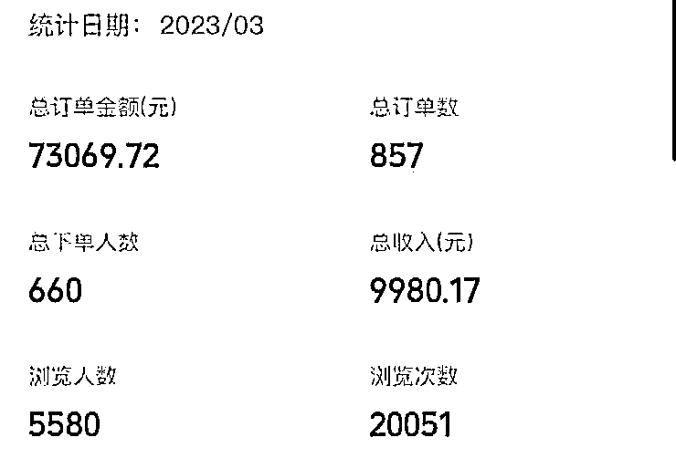

# 公众号懒人找资源，懒人专属群分享

今天就想和大家分享一下我做快团团的从 0 到 1 的过程，和大家聊聊我是怎么冷启动的，以及售前、中、后都遇到了哪些问题，又是怎么应对解决的。

# 我为什么选择做快团团这个平台？

年初刚生完二胎的我，被好朋友雪姨 "按头" 推荐了快团团这个平台，她说这简直太适合我了。为什么她会这么说呢，先来给大家盘一盘我之前的工作以及累积的资源。

由于语言优势，我从大学毕业后一直从事与韩国业务有关的工作，这份工作需要出差，我经常在国内和韩国往返，这就让我有了第一份副业——代购。在这两三年时间里，我累积了一个 400 多人的代购群，而且客户粘性非常强，转化率很高。

随着副业渐渐做的好起来，19 年初我辞去了月薪过万的工作，加入了紫菜团队，做一些倒爷撸货的项目，便开始接触社群、私域、引流等等领域。一年下来，我的 2 个微信号积累了 8000+ 的微信好友。而跟我发生过金钱交易的人，不到一千也有大几百了。

微信好友这一参数对于刚起步的快团团帮卖团长是非常重要的，直接影响着起号的难易程度。再加上我在别人眼中是 "代购"、"爱剁手"、“爱搞钱” 这类人设，让我卖货变得顺理成章，也更加有说服力。

# 如何进行快团团社群的冷启动？

# 公众号懒人找资源，懒人专属群分享

起初我并没有选择在朋友圈做推广，或是建立一个新的快团团卖货群，而是直接重启了被疫情搁置了 3 年的 400 人代购群。

当时是这么做的：我简单介绍了接下来要在群里做的事情，试图用一些福利将大家留下来，比如免费的体检、美容等。

但是试运营一周后，我发现这个 400 人的大群犹如一个死群，发的链接浏览不过个位数，说一句话半天也没人回应，甚至发出一个红包，第二天都会被退款。

这个时候正好读到了社群运营航海手册中，条形马老师的一段话：被运营死掉的社群，并没有什么一招激活术。重新激活社群，也是一个伪概念。

这让我彻底斩断了对 400 人这个大基数社群最后的留恋，选择了一键解散，解散前留下了新群的二维码，希望群里还 “活着” 的人能继续跟着我。

最终从老群中迁移过来不到 200 人。虽然人数减半，但迁移的大动作还是让群得到了更多的关注，链接浏览量的增加非常明显。群里“活人”多了，群也就活起来了，互动也有所增加。

# 公众号懒人找资源，懒人专属群分享

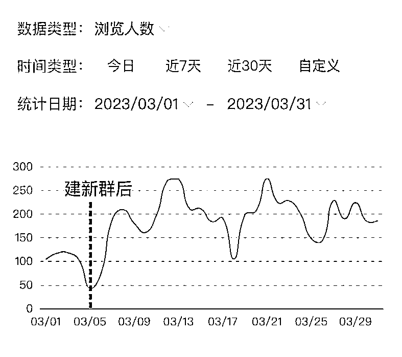

# 售前：有关选品的启发

生意三要素人、货、场中，人和场已经有了，搭建好一个正确的社群后，我便遇上了第二个难题——选品。

最开始的时候，我一口气加了 100 多个无门槛的大团长，产品挑的眼花缭乱，看什么都觉得稀奇，像是发现了新大陆一样。我也没有给自己设立一个选品的逻辑或原则，只要看到好玩儿的、便宜的产品，都会激情转发。

也不知道是不是因为大家对一个新的购物平台感到新鲜，刚开始这么“粗放”的选品模式下，出单也很快，每天能有三十多的跟团量。

# 公众号懒人找资源，懒人专属群分享

但好景不长，两周左右，这种模式就出现了瓶颈，不管我发什么，反响都不是很理想。

而且商品质量的良莠不齐，导致了售后问题接踵而至，客户开始怀疑我的选品能力，有流失老客户的倾向。

在一系列复盘后整理了往后的选品的方向和思路：

**1**、把自己的数据做好，筛选优质大团长

刚上手的小白没有甄别商品好坏的经验，只能依靠快团的官方数据作参考，比如根据团员数、跟团人次，我们可以看到大团长的带货能力、范围以及人均复购次数，再加上官方认证的口碑等级，可以迅速筛选出 “成绩” 好的大团长。

大家也知道有些优质的团长是有帮卖门槛的，迅速提高自己的团员数和跟团数可以让自己获得更优的资源。有一个相对好的方法就是帮卖大团长们的 1 分钱抽奖活动，1 分钱的考虑成本是很低的，面对高额奖品的诱惑大家还是很乐意参与抽奖。

再就是我的好友雪姨创新出来的 9 块 9 盲盒玩法，也很容易出单，这样跟团数就比较容易做上来。

我还发现了一个初期可以使用的增加团员数的方法：把你想要分享的东西整合到一个快团链接里，并设置**0.01**的价格，再在页面设置**1**元无门槛红包，这一步非常重要，领了红包的人很有可能会被转化。比如前两天分享了最近很火的长月烬明的屏保(因为卖票积累了一些粉丝)，大家可以根据自己来做内容，比如学习资料分享、羊毛合集等等等等。

# 公众号懒人找资源，懒人专属群分享

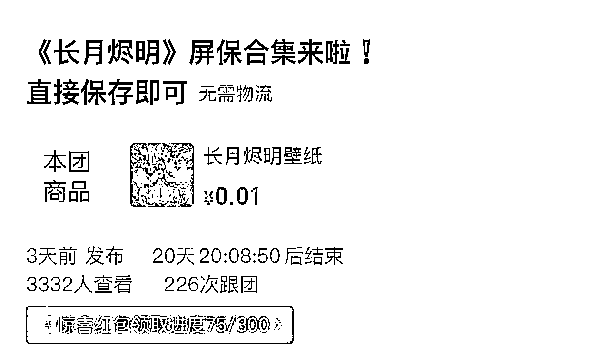

**2**、给社群一个定位，只卖符合社群定位的商品

做快团团卖货离不开社群运营，这次我很多的运营决定和方向，都很得益于条形马老师的航海手册。

我一直认为买卖不仅仅是简单的商品交易，也是买卖你的生活方式以及附加的情绪价值。目前我群里的客户基本都是从代购时期就建立交易的，并且大多数人的经济条件都还算得上小康。所以我后来定的选品的方向，就是以高质量+高性价比为主，高质量+为情绪价值付出溢价为辅。

社群的定位越清晰，社群里的人才不至于失去焦点，进入到社群的人才会更加垂直，社群的活跃度更高流失率更低。就像我的群所吸引的是有消费能力且追求高质量生活的人，群里很少再出现 9 块 9 的水杯、19 块 9 的床单了。

**3**、自己测过的品，才更有底气推广

# 公众号懒人找资源，懒人专属群分享

如何判断一个东西好不好，最直接的方法就是自己去试一试。你敢信吗，我和我老公 3 月一整月在快团团消费了 8000，真正实现了“快团赚钱快团花，一分都别带回家”。

我亲自用过的吃过的，我都很有底气去推荐给别人，我的晒图也更能获得客户们的信任，而且这类产品一般出单情况都比较好。而且那些已经被市场拷打过的品牌产品，有品牌自身和许多大博主的信任背书，大多数可以直接开卖。

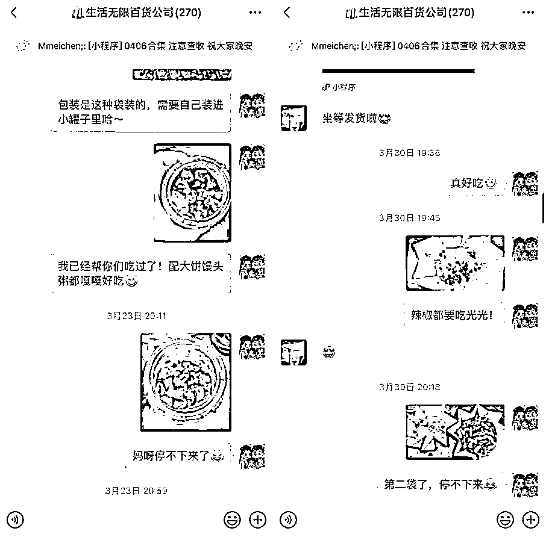

（主打的就是一个停不下来）

# 公众号懒人找资源，懒人专属群分享

**4**、建立品质信任，也要建立价格信任

所有帮卖团长们都有可能遇到过价格尴尬，就是在没有比价的前提下就一件帮卖了某产品，导致客户反馈比某宝卖的还贵或者跟某宝价格一样。

第一次碰到这个问题时，我及时在页面添加了红包，并且和他们解释领红包就便宜了，以此化解尴尬。在此之后我也思考了很久关于价格的问题，比如：价格不够低会不会让被种草的客户流向了其他平台下单，价格太低自己会不会白忙活一场。

现在我认为：对于顾客来说，快团团是一种新的购物平台，想要改变大家的购物习惯，不是一朝一夕的事情。在运营前期，我还是会与淘宝的主流店铺（官旗或是月销较高的店铺）做价格对比，给足价格优势。再慢慢转变客户的购物习惯。等基础信任搭建起来后，后续就算没有绝对的价格优势，客户其实也更愿意与你达成交易。

**5**、分析客户喜好，找到爆品

我每天都会花时间去看看当天产品链接的浏览情况，以此来找到可能的爆品。

有一次我发现 200 元以内的包包和衣服浏览会偏高一些，于是我开始找又便宜，质量又好的 T 恤来卖。我在不同团长那里买回来四件不一样的样品来测试，最后选择了两款克重高、刺绣喷印工艺都不错的卡通 T 恤来主推，一共卖出了 17 件。

# 公众号懒人找资源，懒人专属群分享

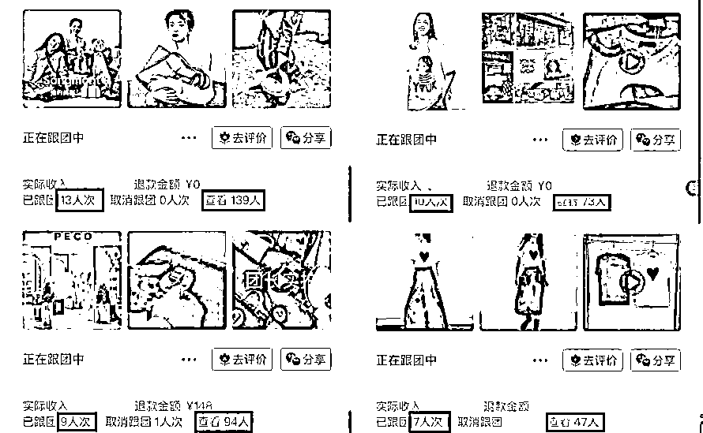

后来又按这个方式，选了两款 100-200 之间价位、做工较好的包买回来测试，全部拍实拍发到群里，最后一共卖出 21 件。前期可以全品类都尝试着去发一发，分析出客户群体的偏好后，有倾向性的去推荐就会事半功倍。

# 公众号懒人找资源，懒人专属群分享

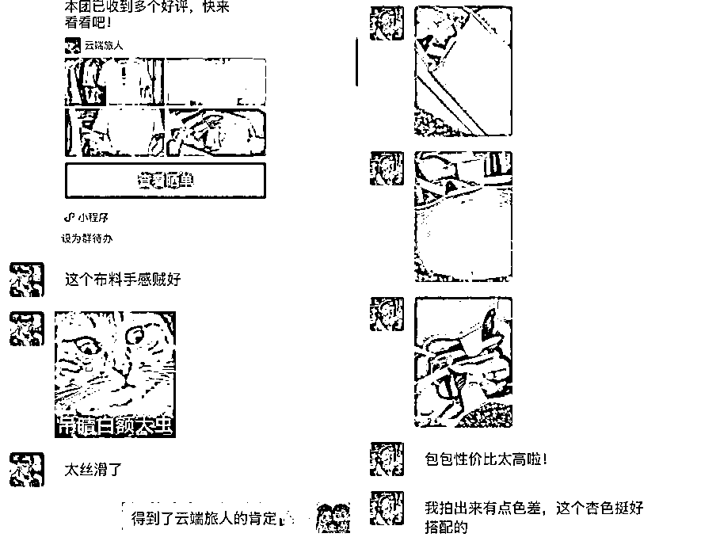

（每次群里有好评就再发一次🔗，会有意外收获）

# 售中：不要让社群变成纯卖货工具

为了不让我的群成为一个只会发产品信息的卖货工具，我在如何让群活跃起来、让群里一直有话题也下了一些功夫，也请教了同在做快团团的朋友雪姨，整理了几点亲测有效的激活群的方法：

**1**、为群友们提供附加价值

我有一个母婴群，起初完全没有人说话，再加上群内的人群不同（有孕妇、有新生儿妈妈、学龄前儿童妈妈），选品的范围太广了，导致转化率一直不高。

# 公众号懒人找资源，懒人专属群分享

但一件事让我得到了意外的正反馈：由于我本人也刚产后不久，会跟着抖音直播练习凯格尔运动（一项有助于产后恢复的练习），想着群里还有一些孕产妇也用得上，就分享到群里和大家一起练习。结果第一次有这么多人出来说话，群里也热起来了。

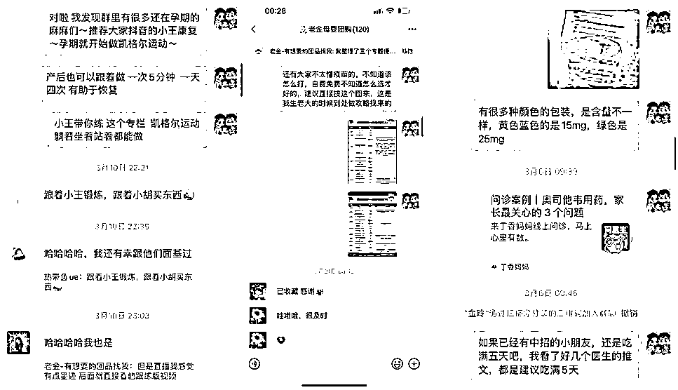

后面我也陆陆续续跟大家分享了婴幼儿打疫苗攻略、儿童补剂如何选择，甲流时期也为大家分享了我看过的用药指南。后来大家也逐渐愿意来问我推荐一些产品。虽然有一些我推荐的东西并没有在卖，但被人需要和信任的感觉，真的比赚佣金来的开心。

# 公众号懒人找资源，懒人专属群分享

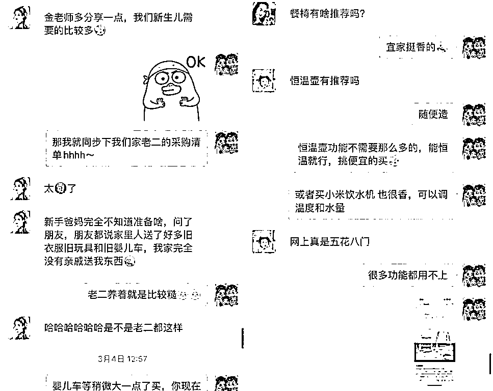

（被人需要的感觉真的太棒啦！)

一个普通的卖货群被替代的成本是非常低的，如果能为他附加一些价值，比如母婴群附加育儿经验、新手闭坑，代购群附加美妆穿搭技巧，用户的黏性就会增加。

**2**、建立会员机制，鼓励晒单

快团团自带的积分商城版块是非常好用的，团员订阅、消费、分享下单链接、收货后晒单都可以获得积分，累积的积分可以兑换相应的奖品（团长可以自行设置）。

# 公众号懒人找资源，懒人专属群分享

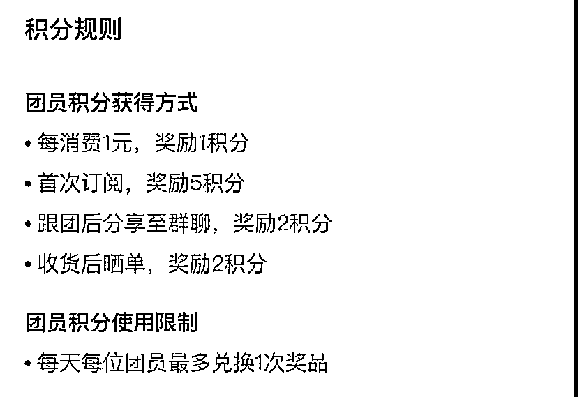

我原来也没觉得大家会为了几个积分晒单或是分享下单链接到群里，但是尝试过后发现效果意外的好。跟团链接在某种程度上会刺激其他团员的消费行为，还会增加链接的浏览量，如果有个跟团链接出现在群里，你会不会也好奇“他买了啥好东西”？然后点开看一看呢。

目前我的积分商城里只设置了两档：300 积分换 5 元无门槛，500 积分兑换 10 元无门槛，兑换率也是比较高的。

**3**、从客户角度出发，提供方便

最简单的做法，就是每晚做个上新合集的链接来结束这一天。面对一个一天消息几百的群，逐一爬楼找商品的时间成本是很大的，每日合集可以为没有时间实时关注群消息的人提供方便，一下就看到今天上了什么好东西。

# 公众号懒人找资源，懒人专属群分享

再者，每有一位新朋友进群，我都会提醒他设置群消息免打扰和置顶群消息，有空的时候进来随便看一看，也是从不要打扰到他人的角度出发。

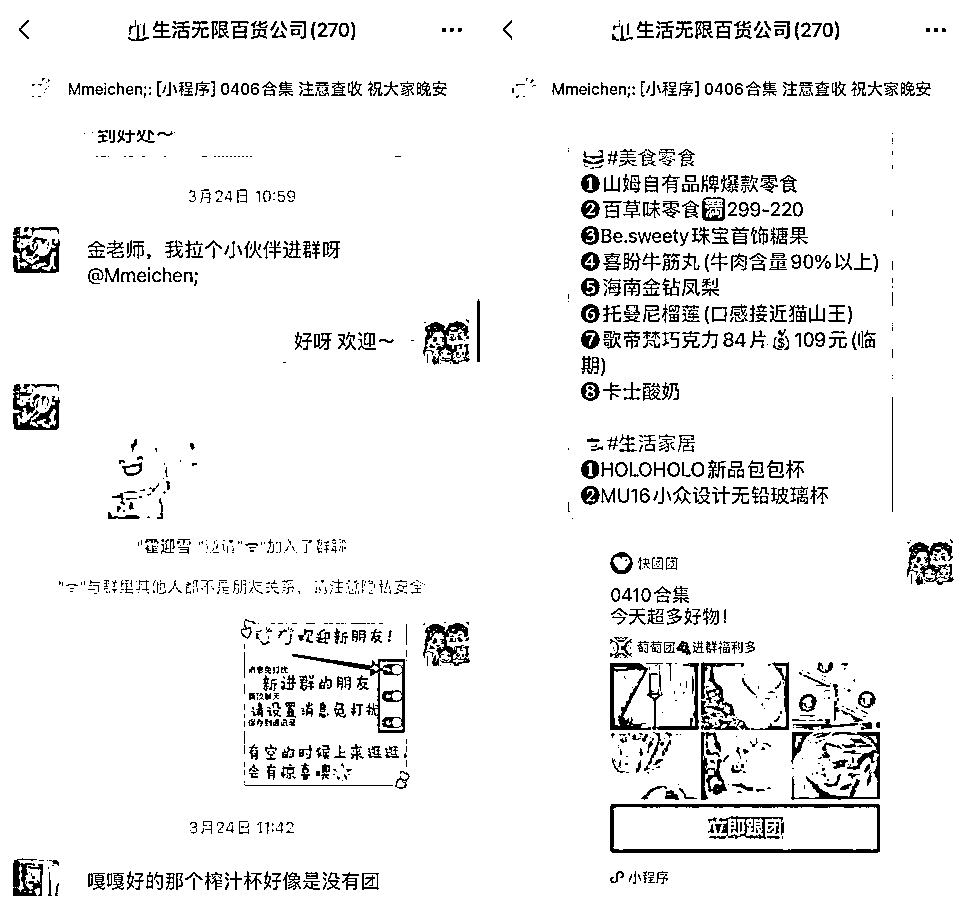

# 售后：最有可能流失客户的环节

不同于淘宝客，虽然都是发链接赚佣金，但快团团的团长是需要为客户提供售前咨询、售后处理等一整套服务的。

# 公众号懒人找资源，懒人专属群分享

在做快团团的圈友可能都会有一个感受，尽管选品时再用心，当碰到售后服务不那么完善的大团长时，售后问题一定是我们被结结实实要上的一课。如大团长设置的“退货需扣除发货运费、发货周期慢、不支持无理由退换”等等，都是可能会碰到的坑。

第一个直接可以避免棘手售后的方法，就是不卖不支持无理由退换货的商品。因为那些不支持无理由退换的产品，即使买的时候强调了不退不换，还是会有无理的买家强制要求。

所以如果想从根源上解决，我们在与大团长的沟通中还是要多多为顾客行方便，多为顾客争取权益。当退款事件发生时，也尽量减少与客户拉扯的回合，在权衡好利弊后，直接给出自己能承担的最大的售后条件。

比如我一位经常下单的客户同时申请了两件不可退换货商品的退货申请。两件商品总价  70 元，如果商品实在是不满意，我可以让他退给我，我自己来消化这个货品，但如果进行一些补偿可以避免退货也是一个很好的办法。

# 公众号懒人找资源，懒人专属群分享

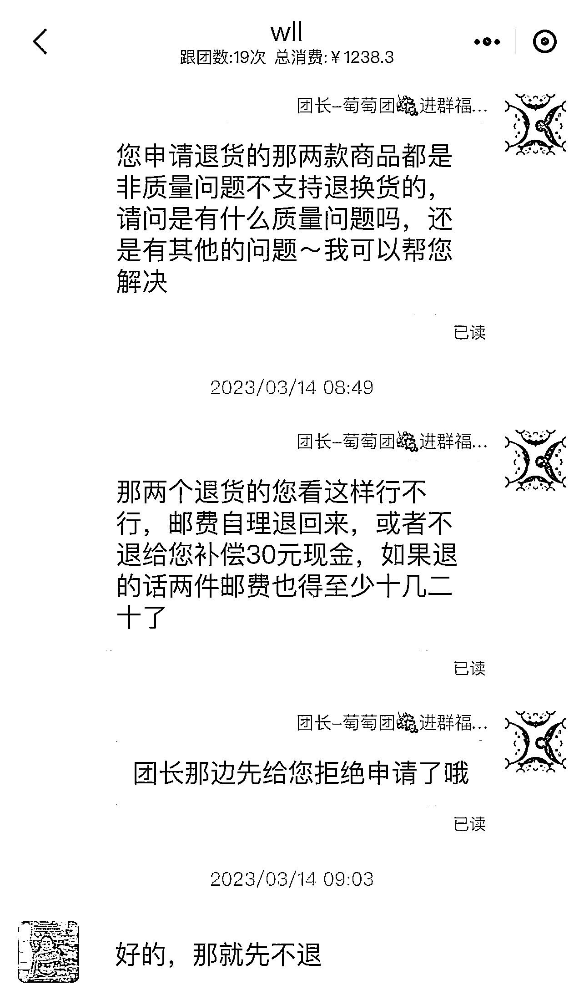

# 公众号懒人找资源，懒人专属群分享

放弃佣金后再作出一些补偿，让客户看到售后的诚意。这个售后单我亏了 20 元钱，但换来的是客户的信任和复购，截止到今天这位客户已经下了 19 单，金额有 1200 元。如果当时售后没有做好，我得到了 10 元的佣金却有可能失去一个长期的客户。在此之后我也很少卖不可退换的商品了。

不要留恋暂时的小利益，你所放弃的长时间看来一定会像滚雪球一样加倍的像你投来。有一次我在后台收到一条差评，起因是客户买的 9 块 9 盲盒让他感到不值当。于是我第一时间联系到他为他退了款。这件事情金额虽小，但如果不及时处理，可能就会产生嫌隙。

我也会经常鼓励大家多多给我反馈，不要觉得不好意思开口，不要连帮你解决问题的机会都不给我。

# 公众号懒人找资源，懒人专属群分享

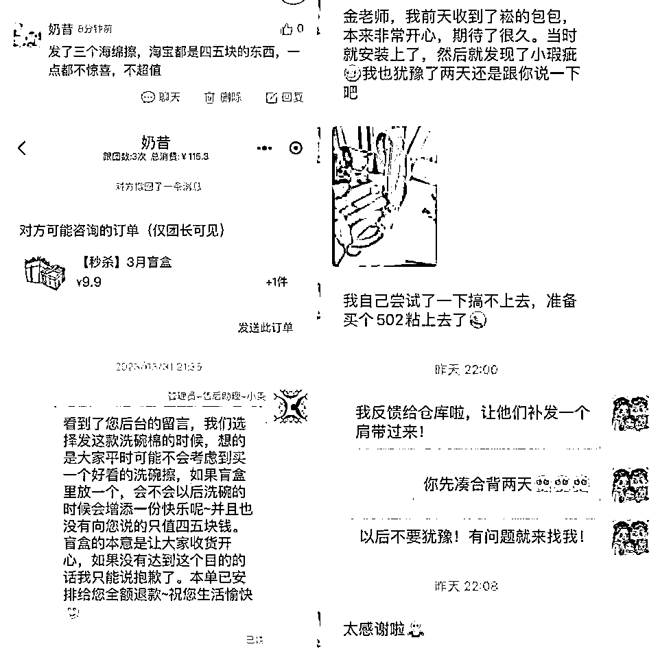

还有一点，就是要做到事事有回应。客户催发货，如果能及时做到有效反馈——不是单单的“我去催一下”，而是“我催过仓库了，因为什么原因导致发货慢，预计什么时候可以发出”，客户满意度会更高的。

快团与其他平台的不同就是，我们做的是私域的生意，不同于冰冷的客服，我们的服务是有温度的。我们吃点小亏，勤快一点，让别人满意了生意才会持久。

# 公众号懒人找资源，懒人专属群分享

# 信誉危机**——“**老金是个卖假货的**”**

话说车速有多快翻车就多猛。在我整理好一切思路和方法，社群有序地运转了两周，还沉浸在自己的小成绩里时，惨遭滑铁卢。

有一天我收到客户的退货申请，退货理由写着**“**这是假包，团长以后好好选选你的供货商吧**”**，这句话犹如重拳一击，我第一反应是这绝不可能啊！客户购买的是一只 299 元的 MLB 腋下包，供货团长是拥有 12 万团员，139 万跟团次，黑金口碑商家。

我一遍又一遍的看商品链接，上面明确标注 100%正品，产品和天猫旗舰店同源，且有品牌授权。怎么看都不像是假货。于是我我私下联系了这位顾客（是曾经和我有过商业合作的人），她表示这只包从各项鉴定点看来都不过关，连高仿都算不上。

我刚开始还以为对方是“肉眼鉴定大师”，还阴阳怪气了一番。但后来慢慢地我被对方说的越来越心虚，好在她也是体面人，没有过多纠缠，打算退货了事。可我是不允许别人诋毁我的，一定要把这件事情说清楚，就让她把包包同城快递给我，由于官网已经没有这款包了，我就在得物上买了一只用来做对比。

第二天两只包都到了，我一打开，就彻底傻了眼，什么叫 “一眼假” 被表现的淋漓尽致。

于是我第一时间找到了大团长的售后，拍了对比图，让对方确认一下是不是发货出了什么问题，为什么会发出一个假包。没想到对方根本不关心我提出的问题，一直以有授权来搪塞我，态度强硬还质疑我调换了包包。

# 公众号懒人找资源，懒人专属群分享

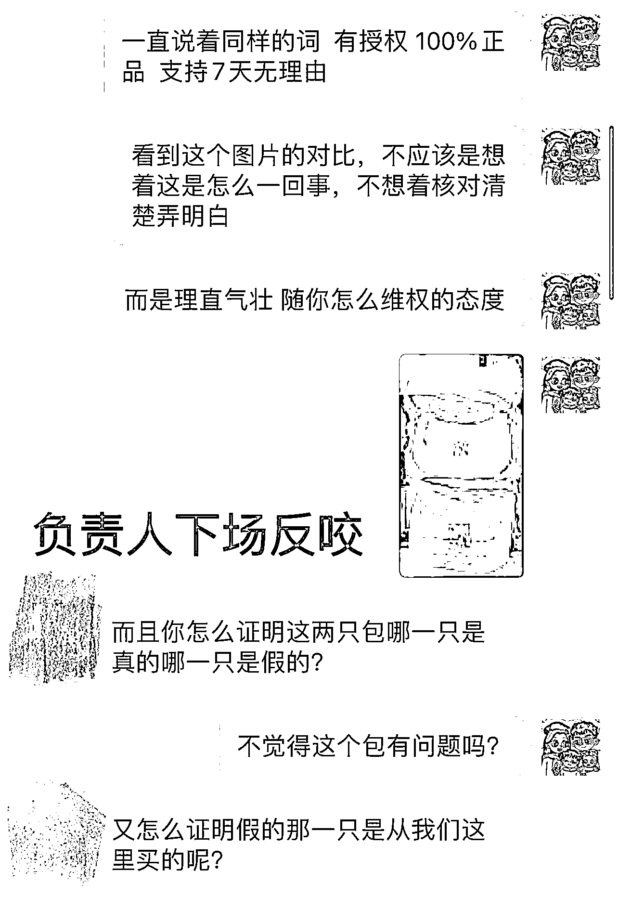

# 公众号懒人找资源，懒人专属群分享

刚刚起步遭遇了这么一件事情，一个人要去对抗这么大一个团队，无疑对我是一种打击。更糟糕的是我帮卖的这个品牌单量有** 20+**，涉及金额也有** 1w **了。我真的害怕自己多年积累的口碑毁于一旦。

当时我的态度就是“硬刚到底，绝对维权”。我先给这个客户退了款道了歉承诺一定给她个结果。下架了该团长所有的帮卖，并且让大团长召回退款了所有在途的订单。表明了我的态度和我接下来的维权计划。

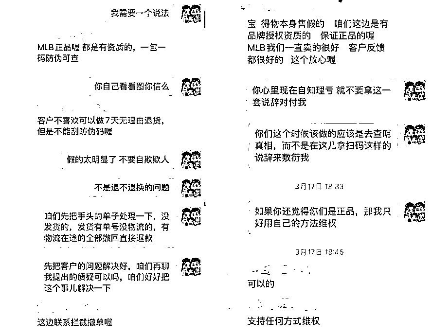

第二天他们估计也是发现了异常，自知理亏，以库房不小心把别人退回去的假包发出来为由主动来找我道歉，承诺给我三倍的赔偿。可此时我对他们的信任早已降到冰点，我无法确认其他客户已经收到货中是否还有假货，甚至是否都是假货。

最后我提出假一赔三，其他所有已签收的该品牌订单，在后台直接全额退款，对方也同意了。这个事情也让大家看到了我的态度。

# 公众号懒人找资源，懒人专属群分享

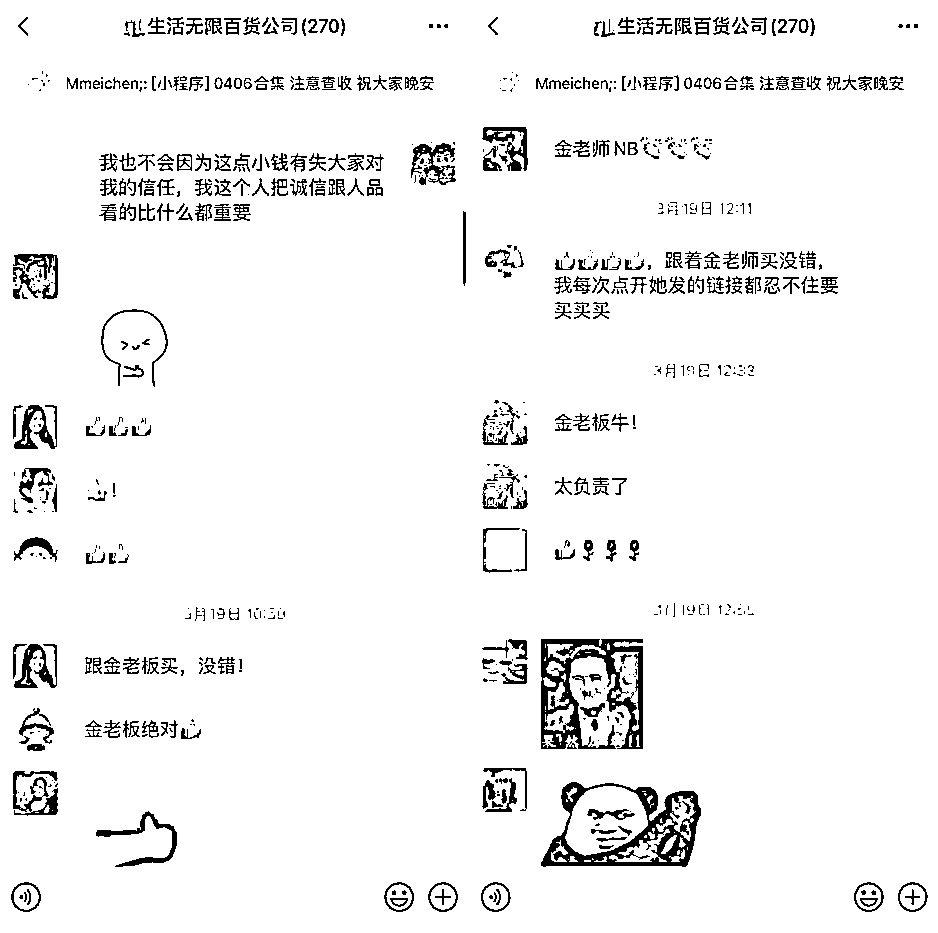

我有种被狠狠上了一课的感觉，这件事发酵的那几天每天都睡不着，是真的怕了。

太过于相信依赖别人，真真假假真的不是靠数据就能甄别的。

经过这件事情，对我的选品方向也有了影响。所有带有品牌价值的鞋服类基本都划到了我的雷区。像化妆品也是假货的重灾区，各种供货渠道说的天花乱坠的，拥有三年化妆品代购经验的我都无法辨别，一旦卖出后有客户提出质疑，你自己是心虚的，因为你也不敢保证自己卖的不是假货。所以也建议其他刚起步的团长谨慎选择。

# 公众号懒人找资源，懒人专属群分享

我以为假货风波就此也就过去了，有趣的是两周后相似的事情再次上演，只不过这次是我故意踏入陷阱。我看到另一位大团长（数据同样是非常的好，成员 16 万，跟团人次  168 万，黑金口碑，快团官方讲师）也开了 MLB 包包的链接，价格只要 100 上下，天猫官旗可是七八百在售的。承诺 100%正品，有品牌授权（我这辈子都不信授权这种鬼话了）。

我怀着 99%假货，1%走了狗屎运 1 折买到正品的心情激情下了单，到手果不其然又是个假货。此时再看链接跟团数已经快 500 了。找到售后，给我的回复如出一辙 “库房不小心把别人退回去的假货又发出去了”。

我心里产生了两个疑问：

第一，这些团长好不容易把团队做到这么大，真的至于卖假货消耗自己的口碑吗？

第二：如果真的是意外，那这两起事件也太过于相似了。所以真相是怎样的留给大家思考...

# 这一个月做快团团以来的感受

虽然才开始做快团团一个月的时间，也算是经历了起起落落。四个字总结了一下能做好做久的方法：爱惜羽毛。

爱惜自己的羽毛，珍惜每个出于信任而下单的人，私域卖货可能多了一份人与人之间的联系，不是打一时的鸡血就能做好的，细水长流脚踏实地。

之前读过一篇泳仪分享的文章，如何运营他的母婴群，如何跟客户成为好朋友，儿童节母亲节为顾客制造惊喜，感触颇深，这就叫“真诚永远是必杀技”吧。

# 公众号懒人找资源，懒人专属群分享

我目前也收获了首批忠实的“粉丝们”，最高已经消费了 4000 多，跟团 30 多次了！我打算每个月让出一点利在群里做回馈的活动，也计划着下个月的母亲节、520 节日里给消费金额高的 VIP 客户们准备惊喜。

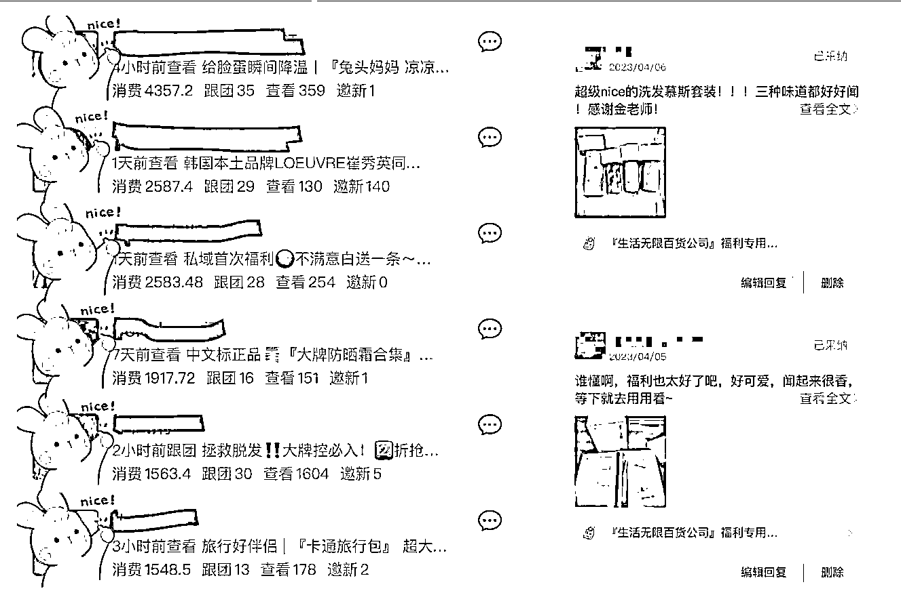

4 月已经过去三分之一，这个月因为家里的事情，并没有积极上架新品，但每天都能有老链接出单，越来越多的客户有了进主页"逛街"的习惯，看看都卖些什么东西。

这个时候我转换了心态，把快团团当成自己的小店，用心打理。把主页背景做的漂亮一些，及时清理已结束的团购，根据季节需求做不同的专题……把所有能服务于客户的细节都考虑到，这样他们在预览主页的时候，也许会更舒适～

以上就是我的分享，希望可以给同样准备起步或是刚刚起步的团长们一些帮助～公众号懒人找资源，懒人专属群分享

评论区：

肉松 : 真诚是永远的必杀技

兽医李 : 好强！

102℃De月亮 : 金老师很厉害！

陈雪🦉碎碎念 : 厉害了金老师！

Mmeichen; : 谢谢雪姨的帮助与陪伴，接下来我们继续一起努力。(0.5元一条，括号里的删了)

Mmeichen; : 第一篇输出感谢肉松的指导～

Mmeichen; : 想子谦虚了😙

Mmeichen; : 月亮也超厉害的！

# **# ****(**精华帖**)(263**赞**)**新手宝妈，职场副业两不

# 误，跑通小红书引流和私域卖货，累计利润** **

# **30W+ **的经验复盘

作者：  小野

日期：2023-02-08

大家好，我是小野，终于鼓起勇气（不再偷懒），来生财分享下我生完娃以后 2 年的副业经历。

首先自我介绍下，我就职于一家医药企业，负责互联网医疗运营业务，曾在医疗互联网公司做过运营和产品经理，同时我还是一个新手妈妈，有一个 2 岁的可爱宝宝。我自  2020 年底生完娃以后，以为自己会忙于工作和育儿，但没想到自己利用业余时间跑通了小红书引流和微信私域卖货，累计利润额大概有 30 万+。

# 公众号懒人找资源，懒人专属群分享

 

我知道这个利润额在生财有术的大牛里不算什么，但对于一部分人来说，这相当于一个人力全职工作一年的收入了。能拿到结果，一定是因为自己做对了什么吧，那么做对的部分值得沉淀下来。一是为了在生财有术里可以贡献一些可以被复制的实操方法，二也是为了给自己一个记录和复盘。

一、互联网启蒙期：深受互联网大牛的启蒙和影响

我毕业后第一份工作是在一家互联网医疗公司做产品经理和运营，从那时候开始，“流量积累-流量运营-流量变现”就深深植入在我思维里。只不过那时候是为了公司业务来积累流量，每周给业务相关的公众号写行业分析报告、追热点，以此吸引行业流量，为自己做的互联网产品的 B 端销售变现做基础。

# 公众号懒人找资源，懒人专属群分享

除此之外，更受启蒙和影响的是，那时候已经有了「个人 IP」的概念。在此要感谢生财有术的嘉宾—大辉和二爷，给了我很多启蒙。很多年前，就看着大辉做「小道消息」、二爷做「二爷鉴书」，于是我8年前也开始做「小野食堂」，本想着好好做内容，但后来因为工作太忙（借口），从月更变成年更然后断更…

没关系，公众号虽然没有做起来，但微信好友我一直在积累。

二、私域引流期：让引流这件事成为日常

**1**、泛流量：不要错过任何一个加微信好友的机会

在2021年正式开始做微信私域变现之前，我有 4000 左右微信好友。我一直清醒地知道，未来微信私域是一定可以变现的，虽然不知道是什么时候，但我一定要持续地加很多很多微信好友，不放过工作里任何一个增加好友的机会。

我曾做过医药医疗行业投资经理的工作，每次出差都需要主动去认识很多行业里的人，少不了主动加微信。刚开始很不习惯，后来我想到未来很多年微信里的好友一定可以为私域变现打好基础，我就大胆放手去干。

从那时开始直到到现在，我微信好友是不设置验证的，这样加好友速度才快。后来验证泛流量这个思路是没错的，那时候加的行业里认识的人，现在有人成为了我的代理、有人成为了我的 VIP 客户。

# 公众号懒人找资源，懒人专属群分享

**2**、精准流量：有相同经历的人，是最同频、最精准的流量

相信每一个妈妈都经历过备孕、怀孕的日子，那期间的很多迷茫和疑问，第一反应就是去小红书上搜一搜、问一问。在我起初加入过一个备孕群以后，我想到，我也可以自己建群成为群主啊。

于是我开始试着在小红书上记录跟备孕怀孕的一切，这几乎不需要刻意选题和准备内容，就在真实记录自己怀孕生子的生活同时，把内容用心加工成为输出对别人有价值的内容就可以。从备孕到怀孕到生孩子，虽然小红书只有 600 多粉丝，但引流到微信好友的妈妈应该有 1000～2000，这部分流量也是我目前副业的主要客户来源。

值得一提的是，我在南京鼓楼医院生产，但产检期间发现这个医院竟然没有官方孕妈交流群！后来我就建了一个群，可是从哪里引流？在生产之前，我发了一篇小红书笔记「南京鼓楼医院助产士才会告诉你的待产注意事项」，就这一篇帖子，帮我建了一个近  500 人的鼓楼医院孕妈交流群，而实际上这篇帖子的内容就是助产士门诊都会给到的一份注意事项，我只不过做了整理和编辑的工作。

# 公众号懒人找资源，懒人专属群分享

有相同经历的人，是最同频、最精准的流量。这放在任何一个领域都适用。

**3**、微信标签：所谓私域精准推送，就是手动打上标签

这几年听太多精准推送了，而微信私域里的精准，其实最原始也最有效的，就是手动打标签，包括分组标签和名字备注标签。

分组标签：分组本质上是为了方便发朋友圈。

我根据微信好友工作单位、城市、职能、认识来源等维度来进行分组，这样未来发朋友圈时，可以筛选合适的标签来发，除了屏蔽的作用，还有精准发圈的作用。比如我刚开始发布母婴社群招募时，不想打扰到其他好友，就在做了分组发圈，然后快速引流到  100 人入群。

# 公众号懒人找资源，懒人专属群分享

名字备注标签：本质上是为了群发（必要时），以及触达同一类别的客户。

（1）把好友/客户大致分为 4 类：

已成交（用 1 表示，后面加上成交类别，美食/母婴/减脂）

已沟通咨询但还未成交（用 2 表示，后面加上咨询类别）

未沟通触达但未来有机会（用 3 表示）

未沟通触达但朋友圈屏蔽了我（用 4 表示）

# 公众号懒人找资源，懒人专属群分享

（2）备注好友基本情况：身高体重、认识来源、孩子性别及生日等，如果信息再多，就放在微信好友的描述里。对客户信息进行记录，应该是一个销售的基础功了。微信本质上是一个强大的 CRM 库，用好它，私域变现事半功倍。

三、零售定位及变现期：产假不只是奶娃，而是有大把可以赚钱的时间啊

妈妈们都知道，生孩子休产假并不意味着放假休息，从孩子呱呱落地开始，意味着要开始学习做妈妈，要在短时间内学会关于人类幼崽的一切知识，意味着从此失去了完整的一夜睡眠，只有漫漫黑夜里没有预兆的随时醒来喂奶、换尿布以及深夜哄，意味着产假里只有很少的基本工资，而房贷、生活等开销仍然在转动甚至更多。

因此，在休了 2 个月产假后，我意识到，该做副业了，生活里多一个收入进项总是好的。在成为妈妈后，虽然没法做到每一样给都娃最好的，但我不希望因为经济压力，每一样好东西都只能看看而已，却要为孩子找平替。

回头来看，很有成就感，可能别人的产假都是无止境地奶娃，我的产假成为了微信私域变现的窗口期。

**1**、作为吃货，从美食经济起步

# 公众号懒人找资源，懒人专属群分享

在这个阶段，我的思路很简单：有啥卖啥、喜欢啥卖啥，好吃的谁不爱呢？

虽然前面我引流了不少妈妈流量，但开始卖货时，我没有母婴类产品货源，所以我先选择的是自己最有热情的领域——美食。

我是云南昆明人，超级热爱家乡美食，8 年前我就开始做「小野食堂」美食公众号，这也一直是我的热情所在。恰好闺蜜有云南包浆豆腐的货源，云南人都知道这个小吃很有特色、很好吃，虽然利润不高，但就产品力而言很能打。于是我建立了「小野食堂」美食群，注册了快团团，也开始了第一条卖货朋友圈。

<第一条卖货朋友圈>

我之选择快团团作为工具，是因为自己一直在小区团购群买买买，自己使用体验觉得快团团这个小程序很好用，同时有了解到快团团是 2021 年才兴起的一个工具，也是拼多多旗下的，凭借拼多多实力，这个小平台应该也会很好吧。没想到，误打误撞，快团团后来成为了私域里发展很迅速的工具之一。

# 公众号懒人找资源，懒人专属群分享

有了这个工具，除了包浆豆腐，我开始用自己家乡云南的资源到处找货源，大家知道的《去有风的地方》里很火的鲜花饼、米线、乳扇，以及沃柑、普洱茶、云南咖啡、版纳小玉米、饵丝……总之就是围绕云南美食的一切。当时恰逢过年前，加上好朋友们的支持，第一个月利润仔细核算后有 7000+，很开心。

这段时间，我自己找货源、自己编辑团购文案/图片、自己导订单/发货/上传单号以及处理售后，其实很累很辛苦，每天就连上传物流单号都是抱着 2 个月的娃哄睡以后完成的，经常因为抱着娃睡觉，就连操作电脑是手脚并用（哈哈哈哈又心酸又好笑）。

后来有一段时间我执着于自己找货源、自己开团，非常费时间，效率不高。我仔细反思后得到结论，供应链并不是我的强项（议价能力不强/利润不高，作为副业我时间有限），于是我决定扩大界限，不仅做云南美食也做全国美食，不仅自己开团，也可以在快团里帮卖。

当然作为美食类产品，做好品控是第一位，至于如何选品是另外一个话题了。

**2**、作为妈妈，必选母婴经济

# 公众号懒人找资源，懒人专属群分享

做了 2 个月美食团购后，我的产假只剩不到一个月了，看着自己群里的宝妈，开始在其他团购里买买买，我很焦虑。于是，想办法找到母婴货源后，我下定决心新注册一个母婴团购号，也新建了一个母婴好物团购群。

<根据微信标签分组发的朋友圈>

由于母婴产品是刚需，不用卷很多文案来创造需求，尤其在 0～1 岁这个阶段，只要把孩子吃喝玩乐货源找齐，价格有一定优势，社群姐妹有信任，服务做好，就有订单。运营一年时间后，母婴社群人数将近 500 人，母婴团购月利润也有大幅增长，也是我目前每月利润的主要来源之一。

**3**、瘦了** 20 **斤，选择了变美经济

# 公众号懒人找资源，懒人专属群分享

为什么会选择「营养私教减脂和大健康」这个板块？

从我个人角度，因为生完孩子胖了 20 斤，而自己花 2 万多上了半年多瑜伽课但丝毫瘦不下来……实在忍无可忍，抓住最后一根稻草想要试试。从我药学硕士+执业药师的医药专业背景出发，我是不接受节食、代餐等减肥方法的，所以选择了一个科学的大健康营养私教方案。而且一边减肥一边分享，也遵循了“自用-分享-成交”的生意底层逻辑。

<瘦了20斤，是我做梦都想的事>

从客户需求角度思考，我既然做了母婴社群，大多数客户都是妈妈，大部分人应该都跟我有同样的减肥烦恼和需求吧？我既可以满足妈妈给孩子买东西的需求，也要满足妈妈本身的变美需求啊。我真心觉得，每个妈妈都值得好好瘦一次。后来的 8 个月时间，我服务了 30 多个客户成功减肥。很开心，我做到了初心、也交付了结果。

从利润角度，做大健康和服务交付类产品，利润也更高。做了 8 个月，每月利润都在 1 万元以上，营业额最高的一个月在 6 万+。

# 公众号懒人找资源，懒人专属群分享

四、私域进阶期：发好朋友圈、做个「好销售」、成为好榜样

**1**、发好朋友圈：做朋友圈里的高级货架，不只是卖货，还有精彩的自己

做私域的基本功之一，就是发好朋友圈。

那么，什么是发好朋友圈？我简单总结了这 3 点：

（**1**）每天更新。

跟做自媒体一样，每天不断更是基本要求。不管是 1 条还是 10 条，一定要冒泡，否则客户会认为你三天打鱼两天晒网或者不做这门生意了，从而失去信任。

（**2**）有卖货，还要有精彩的自己。

我们每一个选择的产品、能够提供的服务，都代表了我们自己所认可的价值观和生活方式。所以，朋友圈不能只是卖货，还要有精彩的自己，有情绪、有价值、有态度。

（**3**）无自用不推荐、无体验不推广

大多数团购美食我都会自己买来吃一吃、尝一尝，并且自己拍照，为此我还买了一个比较贵的镜头。在育儿过程里，我自己大多数需要用到的东西也都会在团购里下单，然后在社群里分享。减肥我也是自己体验瘦了 20 斤，才去分享和推荐。我相信，最好的零售生意方式是，通过自己体验过的、思考过的、且擅长的方式来满足客户需求，同时创造价值。

**2**、做个好销售：没有人可以被别人说服，只自己能够说服自己

# 公众号懒人找资源，懒人专属群分享

当我开始做变美经济，我发现营养私教减脂和大健康这一类服务类产品，并不像团购那样，随意聊 2 句就能成交。后来我慢慢学会，怎么洞察和挖掘客户需求。原来销售是一件以人中心的事，满足客户本身存在的需求，而不是以产品为中心，只会一味介绍产品。

有句话我很喜欢：没有人可以被别人说服，好销售就是点燃客户自己心里的小火苗。

除了满足客户需求，好销售还必须要学会的一件事就是如何跟客户保持粘性。我们在服务客户过程中，其实在有很多话题和触点可以持续跟客户产生链接，挖掘更多需求，从而达成更多生意机会。

做私域，一个客户的信任累计和持续复购，是非常宝贵的。

**3**、成为好榜样：做别人赚钱的推土机也很快乐

在我还没有正式加入生财有术时，就发圈吸引了 2 个微信好友想要加入生财（后来都加入了哈哈哈）。

在我加入生财参加了小红书航海后，我跟闺蜜聊到小红书，并且不厌其烦做她赚钱的推土机，推了很久，就在今晚，她成功引流了十几个好友并且成交了 5 单。

# 公众号懒人找资源，懒人专属群分享

<闺蜜报喜 10 分钟后  成交了 5 单>

在我跑通小红书引流和私域卖货后，也有不少同样是新手妈妈的好友来问我如何做副业。我发现原来大家是一样的境遇，一样在有孩子后想要给孩子更好的生活、一样不甘于自己现有状态，想通过副业实现经济增项和自我价值。不少人对我说，小野你的朋友圈很有力量，小野我要跟着你赚钱。于是我开始做她们赚钱的推土机，分享生财有术、分享赚钱思路，她们也都陆续取得的实战第一步的小成绩。

# 公众号懒人找资源，懒人专属群分享

<今天又收到了一个新手妈妈的开单报喜，走出了第一步>

原来，我也可以做一个带给别人力量的人，做别人赚钱的推土机也很快乐啊。

五、未来怎么走？平衡好生活工作，以及真诚是永远的必杀技

**1**、如何做到育儿、主业、副业三不误？

我问过自己，一边上班、一边带娃还要一边做副业，累不累？说不累是假的，做副业意味着做好本职工作、做好妈妈的同时，要投入更多的时间和精力。大多数晚上，我都是在给孩子哄睡后，拿起手机继续盘副业。如何提高效率就成了必修课。我自己总结了一些做副业提高效率、平衡生活的小分享。

# 公众号懒人找资源，懒人专属群分享

（**1**）**   **善用工具。工具本身是用来提高效率的。比如「讯飞输入法」可以把通用话术或产品介绍都整理好，跟客户聊天效率很高；比如团购产品素材很多时，做好相册夹的图片分类，就不怕找不到实拍图、好评反馈图，快速取用…

（**2**）**   **善用人。当利润有一定积累，招个助理吧。我是在去年 5 月份招了一个大学生助理，负责管理团购素财、售后沟通、和需要花时间的素材整理工作。这样极大地解放了我的碎片时间，让我有更多时间拓展客户或者思考生意如何优化。

**2**、真诚是永远的必杀技

当懂得很多销售技巧、运营技巧、文案技巧以后，我仍然吃了一些亏，经历过一个退款后拉黑删除的客户，也经历过一个高复购客户退群的窘境。然后我悟了，只有真诚才是永远的必杀技。于是，我在 2022 年底，给 50 多个客户手写了新年卡片、寄了礼物，在这个时代，手写信息弥足珍贵。相信客户会感受到我的真诚，只有真诚，副业和生意才能走得更远。

# 公众号懒人找资源，懒人专属群分享

 

# 公众号懒人找资源，懒人专属群分享

  

写在最后

# 公众号懒人找资源，懒人专属群分享

这是我副业的经验复盘和总结，很庆幸自己一直在努力往前走，即使会有点累，但看着孩子一天天长大，这两年通过自己努力给孩子提供了更好的生活条件，育儿主业副业都没耽误，自认为这份投入非常值得。孩子从来不是阻碍我们追求梦想的阻碍，相反，我认为作为妈妈，恰恰是有这个努力的状态，一定可以给孩子更多的正向鼓励，成为孩子的榜样。

如果真要说做对了什么，可能就一件事，那就是亦仁说的，要做实战的高手。在可以出发的日子就动身吧，在心动的时候就放手干吧，不要让自己想要的，只停留在梦里。

最后的最后，感谢生财有术相遇的朋友们，感谢生财圈友梁靠谱、张亚萨的改稿意见，感谢亦仁助理鱼丸不厌其烦地也做了我的“推土机”，感谢那么多精华帖的启发和思路，感谢亦仁大大！

大家一起生财有术啊！:D

# 公众号懒人找资源，懒人专属群分享

评论区：

子子 : 太厉害啦！

凡人阁刘海成 : 认真看完，想添加一下好友

攀子 : 牛啊牛啊

小野 : 感谢阅读完[愉快]微信号muyexy

青青 : 好棒哦

小野 : 谢谢认可[愉快]你也是生物医药方向的吗？

小野 : 谢谢小攀师兄[呲牙]

小野 : 我也想开个ChatGPT账号[可怜]

# 公众号懒人找资源，懒人专属群分享