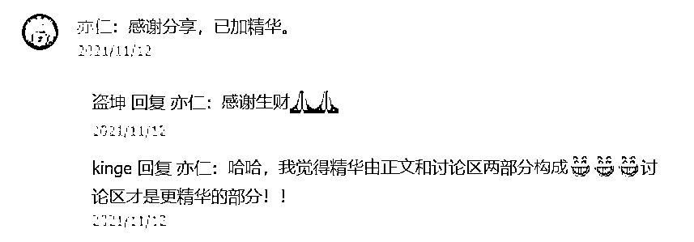
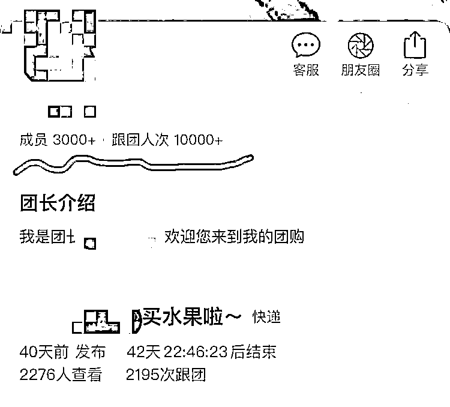
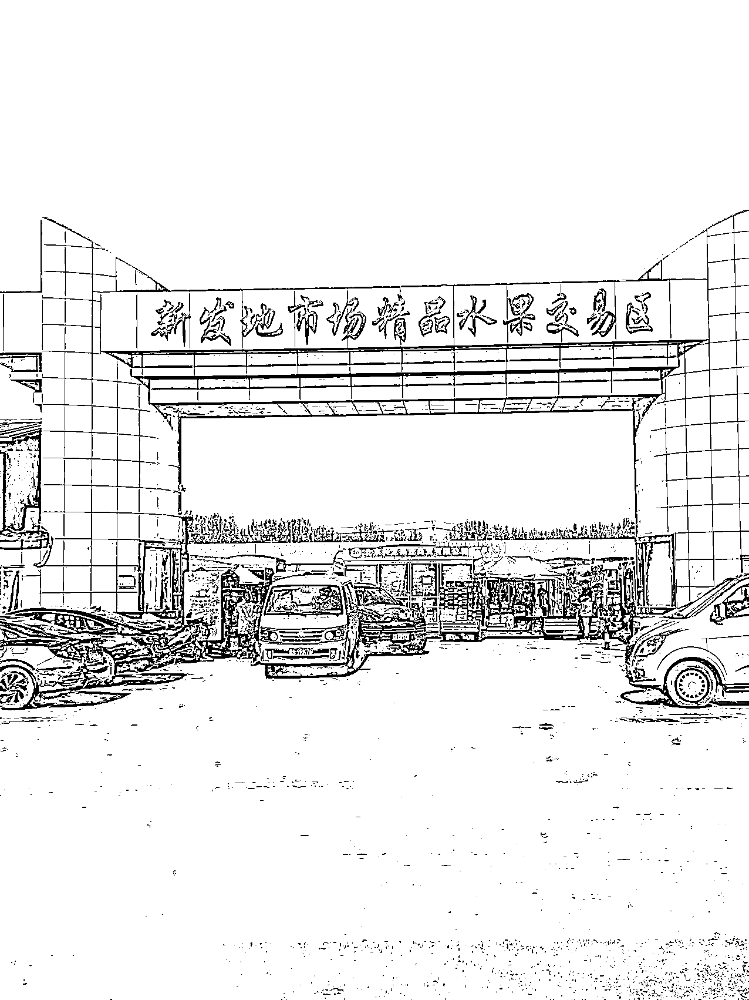
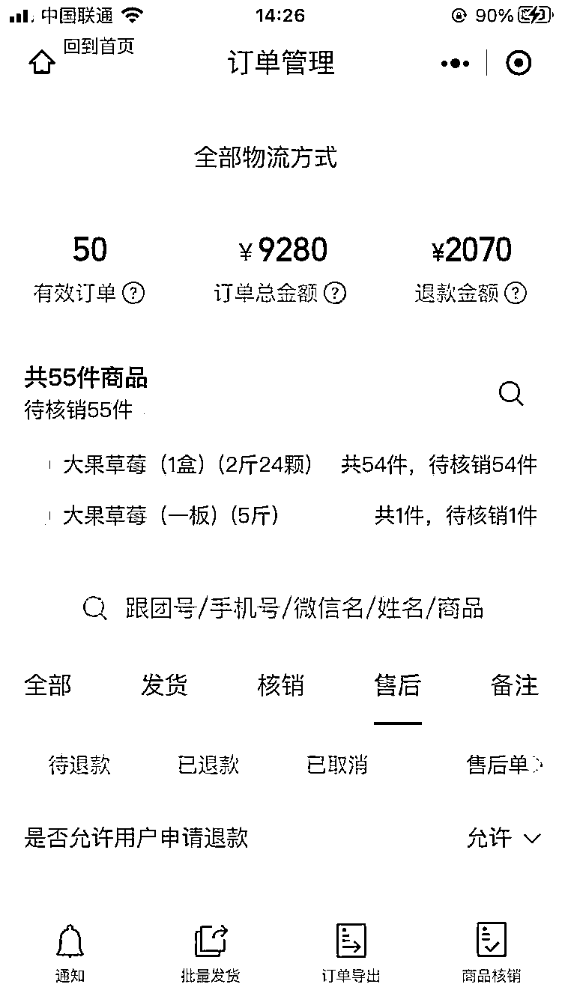
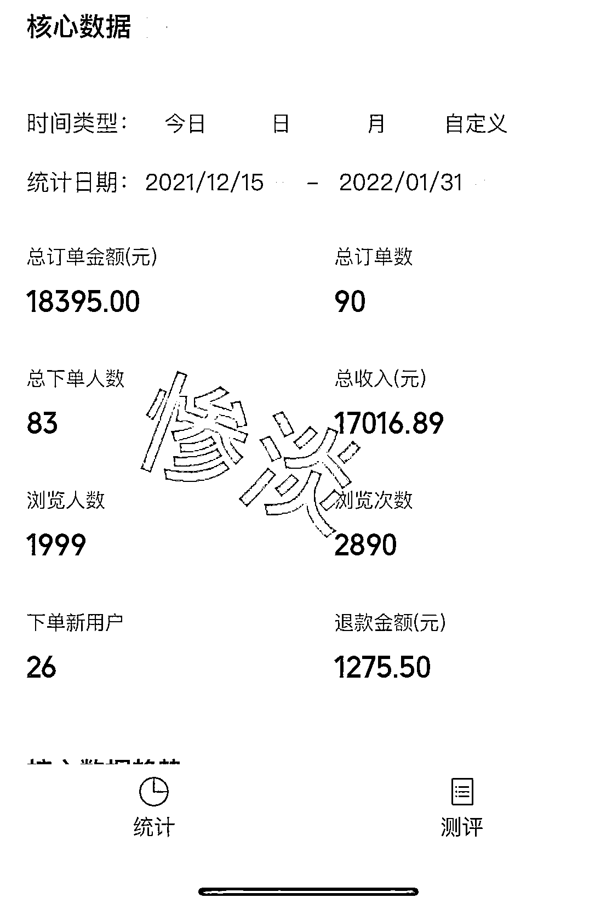

# (精华帖)(185 赞)新手在小红书上做水果团购项目，半年利润近 10W ，我是如何从 0 到 1 的？

作者：  许老师

日期：2022-07-27

多听盗坤老师言，新手也能赚到钱。

这个项目缘起是盗坤老师去年 11 月份在生财里提到的一个蓝海项目 ----批发市场水果团购项目，链接：https://articles.zsxq.com/id_rsdp0lrfz4mp.html，这个项目 0 投入，易模仿，很适合我这种之前还没从工作之外赚到钱的新手。

实战到现在，半年多总营收 40 多万，利润近 10 万，其中 5 月份营业额 16 万，项目开始变成一个稳定的副业。成绩和大佬没法比，但好歹新手跌跌撞撞迈出了赚钱的第一步。

快团团只能截取 3 个月范围的数据

下面我会花 8000 字，大概 15 分钟的时间，分享这个项目的启动，0-1 的过程，坑点，还有我后续方向上的一些困惑。

如果你是项目新手，我的经历可能会给你一点参照，你在实践一个项目的时候可能也会碰到和我一样的  艰难起步、调整、小成就、纠结困惑，也欢迎你在其他城市（尽量不要在北京）实践这个项目，大家一起交流；如果你是经验丰富的大佬，很期待能不吝赐教，针对我最后的困惑给我一些建议。

背景

先做个自我介绍，我是一个在少儿编程行业做了 6 年的教育人，经历了少儿编程行业从一个概念变成一个细分市场，陪伴了一个创业公司从 20 人规模做到年营收近 10 亿的行业头部，我自己也旁观了创业 0-1，收获了很多职场上的回报。

可惜 21 年双减后，教育行业的前景就很不乐观了，公司还能维持但增长极其困难，我自己开始探索下一步路要怎么走。从加入生财以来，我就一直在留意是否有可以尝试的副业，以及如果幸运的话，最好有一个小业务能让我赚到钱，并去逐步做大。

在生财看了很多帖子，中间也短暂实践过知乎好物，想过尝试小红书 IP，但都不了了之。

看到盗坤老师的帖子后，说实话很激动，素人 0 门槛起步，蓝海项目，很快能变现，太适合我这种新手了，尤其帖子下面的评论区也有很多建设性的讨论，把项目关键点也点出来了。

我正好在北京，有亚洲最大的批发市场~新发地，做这个事情是不是可行？我开始一边调研一边跑批发市场，动起来再说。

【项目调研阶段】

我在小红书搜索“新发地”“批发市场”“草莓”（11 月的当季水果）“车厘子”等关键词，有很多卖水果的号粉丝不多，但帖子互动数据很不错，点进去一看，评论区一溜的“怎么买”“求团购群”这样的评论，这一来说明需求很强劲，二来从小红书导流是个靠谱的途径。

在这些号里面，很多都留了微信号，我看到就加，发现其中一个人从 20 年 4 月份就开始做（新发地出疫情之后），到现在每天开团，每次开团稳定 100 单以上，预估每单平均客单价 100 元，一个月营业额二三十万，而且她的私域量不大，就 3000 人就支撑起这个营业额了，既然有人做起来了，那更靠谱了，而且有了抄作业的对象。

在网上调研的同时，我开始跑新发地批发市场。11 月中下旬的时候，丹东 99 红颜草莓刚上市，新发地 48 元一斤，同期水果店或抖音普遍 80 多一斤，这个价差有利润空间。

而且由于草莓很娇嫩的特性，网上不好买，而水果店又太贵，小红书上想买草莓的呼声很高，所以它很适合做批发市场的团购，就这样经过一个礼拜的调研，我决定从团购草莓开始这个项目。

在调研阶段，我更加确认这个项目的可行性，找到了可对标的优秀同行，也选定了草莓作为批发市场水果团的第一个品。

【项目起步阶段】

准备开始搞了，流量从哪来，这是首要碰到的问题。

按照原帖里的讨论，一定不能只有朋友、邻居那点可怜的小流量，所以一定要从外部引流，我直接放弃了社区里宣传的方式，另外由于我不熟悉视频剪辑，同时也有主业，没时间做直播，所以把抖音 pass 掉了。

在调研时发现小红书上问水果的很多，所以我很快选择了用小红书引流私域来获取流量。

关于小红书上怎么发帖，造人设，取标题，找对标，打造爆款等等技巧，生财里相关精华帖很多，我自己把大部分文章都看完了，然后就是每天刷小红书，浏览水果相关帖子，模仿着发帖，到现在我还是很入门的水平，这里就不班门弄斧了。

很幸运的是，在我发到第三篇帖子的时候，那篇帖子有了 1 万的观看，第一次 99+，前前后后加了  两三百个微信，建了第一个群，而且那篇帖子非常直接，内容是我要从批发市场团购草莓，想要跟团的快上车，所以来的流量很精准，都是想买草莓的。

有了这第一个群，我就开始发布团购，这里也吸取了帖子下面的讨论，要把水果尽量卖成标品，不给客户选择的机会。

所以我们第一次开团就卖 2 斤装的丹东 99 红颜草莓，标价 120 元（进价 48 一斤）。第一次团购就有 50 单，流量到购买的转化率 20%左右，营业额 7000，毛利润 1000，很兴奋，从流量到转化，走出了一大步。

但团完发完货很快麻烦也来了，碰到水果生意最常见的问题了 —— 售后。

草莓太娇嫩了，有快递完后草莓磕碰坏掉一部分的，也有说缺斤短两要补差价的（批发市场算毛重 2 斤，我们没特别标注，顾客要按照净重 2 斤算），还有的直接整盒草莓被暴力快递摔全坏的，总之我们本着做回头生意的原则，都赔到位了，最后这 1000 的利润赔了一半。

这是第一次我们感受到水果行业的不容易。

副业就这么开始了，一周开 1-2 次草莓团，然后隔天去批发市场发货，第一个月卖了 300 多盒草莓，4 万的营业额，利润 7 千块左右，小红书引流的私域四五百人，快团团的转化率也稳定在 10%左右。

团了好几次后，客户问有没有其他水果，蓝莓车厘子啥的，当时我们对新发地还很不熟悉，对水果行情也完全蒙圈，哪些水果什么时候应季，怎么和批发商打交道，一点经验没有，批发商看我们面生且外行，询价时把我们当散客对待，报出来的水果价格和零售价价差并不高，导致我们迟迟上不了其他水果，品类太单一，顾客开始流失。

屋漏偏逢连夜雨，在品类太单一的情况下，我的小红书由于引流的时候回复私信直接问客户微信号，可能触发了小红书的审核机制，或者被竞品举报，直接被限流了一个月，最后在 12 月中旬到 1 月底期间，一方面老客户流失，另一方面没有新客户来源，我们的经营非常惨淡，营业额才一万多，基本没利润，转化率也明显下降，这一度让我想放弃。

【调整阶段】

但确实当时手上也没有什么其他项目，同时这个项目还没整明白，如果放弃了下次再搞其他项目，还是会碰到波折，总不能每次都浅尝辄止。

所以过年期间痛定思痛，开始想着怎么调整。

主要问题就 2 个，一端是后端的供应链，我们还没搞好，供应商资源太少，品类太单一；另一端是流量端，需要持续地，有更多新流量进来。

货源方面，我们仔细研究了其他同行的快团团链接，然后根据他们上架的品“反编译”，去批发市场对应的找供货商，既然同行上了这个品，证明提供这个/些品的商家对社群/社区团购的这种模式是比较认可的，想通了这个我们找货源就比较有的放矢了，不再是无头苍蝇，一家家问有什么货，价格多少；而是拿着这个货去找到对应的商家，然后问她怎么供货。

打交道的过程中我发现有个小窍门能避免被当成散客，我去了会直接问老板“有没有快团团链接”，一般听懂这句话的老板就知道你是团长，直接拉群甩链接看货，订货也是快团团下单。

如果没有链接但是供货，就让老板拉入群。这相当于是一句暗号，让老板知道你是拿货的而不是散客来问价，省了很多口舌。

就这样，经过一个月密集的跑，我们把货源整得差不多了，基本上同行有的我们也都有。当然，这里面有一些供货商比较坑，后面再说说怎么避坑。

另一端就是流量，前面说到我们的坑就是引流的时候被小红书关禁闭，所以不能再私信了，一定要在主页上放联系方式。

后面我采用了置顶笔记放微信号的方式（这种方式从 1 月份用到了 6 月份），中间有几次被关 7 天禁闭但影响不大，但前段时间这篇置顶帖子被小红书判定违规被隐藏了。

所以小红书要引流私域，怎么有更安全可靠的办法，我还在探索，这次参加了小红书航海，里面提到了 11 种方法，我还会再尝试，但这个注定是在和小红书平台打游击，方法需要常换常新。

引流的方式稍微安全点了，剩下的就是怎么发帖搞到更多流量了，这里我感觉自己没发过质量太高的笔记，都是简单直接粗暴，告诉大家我从新发地给大家团水果，后面的帖子最多的时候 1 万多的小眼睛，几百个互动，陆陆续续发了十几篇帖子，总体浏览量加起来可能在 5 万左右，引流了 1500 个新流量到私域，不过就是这 2000 个的私域流量，由于我们定价还比较实在，售后也比较靠谱，所以复购还可以，营业额逐渐上升，5 月份做了 16 万的营业额。

所以小红书的流量一来很精准，都是冲着买水果来的，另一方面消费能力确实很不错。

小红书引流私域，实话说我还是很初阶，虽然把关于小红书的精华帖都看了，但纸上得来终觉浅，还需要在实战中积累更多经验，这里就不多说了。

这里我想提的一点是，坚持发，根据反馈去调整发帖方向，一定会有突破的，如果还是没有提升，那把小红书精华帖再看一遍照着做。

另外算是一个好消息，我自己是稀里糊涂的有了一些流量，而且是本地同城的精准流量，帖子质量也不咋高，但就是有人加你，可能说明这个路子还是有一定对的地方，我一直相信的就是  在你觉得还没怎么做好就有成效的情况下，说明路子走对了，如果你已经做得很优秀但是还不来流量，那可能这个方向就不太对。

流量和货源一前一后两个环节调整完了，最后讲讲中间的转化环节，这里面我们的经验不多，因为我们在这里花的精力和做的工作最少，副业毕竟精力有限，我们的大头工作都花在了流量、选品和交付上。

我们目前在转化方面做的工作就是  每次开团时在群里面营造一种大家都在跟团的氛围，开团第二天引导晒图发好评，然后日常发一下朋友圈，包含新品预告，我们吃的好的水果安利，客户好评等，这些工作在这个项目花的精力还不到 5%。

可能和我认为当前这个阶段我们这个环节不宜过重有关，我认为如果选品不好，质量把关不严，售后不行，大家买完一次后就不会再跟团了，即使你的运营做得再出色。

这里值得一提的是，一定要怼住一个优秀竞品抄她的各种运营细节，比如什么时间点开团，群里发什么内容，怎么发朋友圈，选品选什么，包括用什么快递，水果都是怎么包装的；只要自己能做到的先抄，这个我们也是踩了坑的，前面自己做了很多所谓“探索”，最后发现竞品的才是最优解，做到后面动作又和竞品保持一致了。

我认为这个项目前期启动的核心一个是流量，一定要有找流量的能力；另一个是交付，一定要把售后率降下来，一定要能找到好水果，要能做好交付，这样自然而然会有好的复购，即使有些客户一开始不下单，后面看大家持续在买，看你越做越好，他也会慢慢对你产生信任，去下单尝试一下。

目前我们的转化率大概在 10%左右，应该存在不小的提升空间。但在此之前，我们会持续优化交付环节。

【交付的几个坑点】

下面花比较大篇幅讲讲交付，因为这个项目和其他生财里的轻量化项目不太一样，其他项目只要解决了流量和转化，基本就跑通了，而水果团购的项目是一个后端交付很重的项目，又累又难标准化，各环节都有坑点。

交付环节有很多琐碎的日常运营，包括经常跑批发市场，找更多货源，每天关注价格行情，把控好选品，和客户售后等等，但就是这些琐碎，构成了客户是否复购的关键因素。

而水果这个生意，复购极其高，留住一个流量，比去找一个流量要重要得多，只要留存做得好，几千个私域也可以活得很滋润。

这里说一说在这些日常运营中最容易碰到的坑吧，而且每个坑踩到了都是得用钱去填。

水果这个行业看着毛利润高，但不咋赚钱，最大的问题是损耗和售后。

损耗这块，一旦有库存就有损耗，所以我们坚持预订制，客户先下单再去找批发商订货，这也是很多团长价格能优于水果店的原因，毕竟店租和损耗这两个成本大头没了；

除此之外，我们目前只做整箱发货，不做分装，虽然这样会劝退一些客户（那些水果消耗量小的小女生基本都被 pass 掉了），但由于我们是副业，所以必须作取舍。

这样做一方面减轻我们发货环节的流程，另一方面也能减少损耗，毕竟批发市场都是整件拿货，如果你拆开卖，总会有一些零的被剩下，要么自己吃要么就得有地方保存。

目前我们的损耗率可以忽略不计，这里不多提。主要说说售后。

做水果生意，售后真是心累啊，这里感叹一句，什么样的客户都会碰到，什么样的售后也都会碰到，尤其我们一开始做经验不足，售后概率更大（下面是大量细节，不感兴趣可以跳过，不影响阅读）。

第一种售后最致命，拿到了烂货，也就是拿货的时候水果品质就不行。你可能会好奇，为啥会拿到烂货，检查不出来吗？

批发市场里面有一句话，就是没有卖不出去的水果，只有卖不出去的价格。什么意思呢，就是再烂的货只要价格够低，都能卖出去。

比如怡科莓蓝莓限量版，大家平时买三四十元一盒，批发市场正常货的价格是一箱 12 盒  240 元（3-5 月），有些大团长的供货价是一箱 150 元，觉得捡到便宜了是吧，其实这个货品质不行，很多时候是蓝莓放久了有部分已经发霉了，然后大团长低价收回去，找几个工人把发霉坏果挑出来，然后把好的重新整合成一箱当着好货接着卖，这个从外表不太容易看出来坏，但是客户吃的时候会觉得硬度不够或者新鲜度不够。

新团长经验不足，也分辨不出好货坏货，一看这价格拿回去卖，然后一些注重品质的客户可能就找来售后了，即使你售后到位，这个客户大概率也流失了，因为你的水果没达到她想要的品质标准。

上面还是轻一点的拿到烂货，毕竟很多客户也吃不出来好坏，只有经常买该种水果的才能对比出来。

还有另一种情况就是本身水果已经快到腐烂临界点了，批发商直接低价倾销，由于水果都是整箱封好的，拿货的时候我们只能抽检，正好抽检出的那几箱是好的，我们就直接把货发出去了。

但是这些快坏掉的水果经过快递在常温下一折腾，到客户手上都烂了，这种情况我们发生了一两次，售后全赔的同时，还流失了很多口碑。

这种情况一定要尽量避免，那怎么做呢？

1\. 对水果行情一定要很熟悉，对便宜货本身就抱有警惕，一分钱一分货在批发市场是非常硬的道理，这里一定要多加几家供货商，对同一货源的价格多方对比，一般来讲差不多品质的货，几个大团长的供货价不会差太多（5%以内），如果明显低价尽量避开；

2\. 对出烂货的批发商坚决剔除，因为出了一次后还会再出，他不会只卖一次烂货，我售后频繁的几次，都是在同一个大团长那边，但由于那个大团长水果品类非常全，价格也比其他家低一点，所以是我初期很重要的拿货渠道，出了烂货的售后后，没下定决心换掉，后面果然又出了事情。

这里关键点也是要有多家供货商，只有手上有足够可替代的供货商，你把她剔除的时候才不会犹  豫，不然没有足够的货源，剔除一个供货商可能很多水果就得下架了。另外就是看平时的售后态  度，如果售后推诿的，一般出问题概率也大，要多加留心。

3\. 最后就是一定要检查了，即使再熟悉的批发商，也一定要当他面检查水果，尤其是对新鲜度要求高的水果，比如樱桃蓝莓，都是每天新到货，一定当面检查看看新鲜度，如果货不好宁愿退款给客户也不要拿，这样磨合下来批发商也知道你要什么样的货。

第二种售后就是运损，发出时是好的，客户收到时是坏的。这种售后只有像我们做同城快递发货的才会碰到，那些做社区团购模式的不存在这个问题。

目前的生鲜快递运输还是很初级的阶段，没有冷链，快递员也很少轻拿轻放。很多水果是很娇嫩的，不适合快递运输，比如草莓、蓝莓、桃子、葡萄，运输过程的磕碰、晃动，很容易导致水果受伤；另外就是快递配送延迟导致的水果腐烂。

要避免这个问题，一定在选品的时候就考虑是否适合快递运输，或者能不能通过包装改进让他适配快递运输，如果不行坚决不要上，不然最后客户收到一堆被摔烂的水果，后果还是得你承担，而且这个成本大多数只能自己扛，因为快递只看外包装是否破损去定是否售后，很多时候是表面包装很完整，但里面被摔得稀烂。

这里我以自己的惨痛经验劝告大家，不要对快递抱有侥幸心理，一定要想象他们拿着这箱水果是各种扔，看看你的包装能不能扛得住。

还是以怡科莓蓝莓举例，它本身的包装是不适合快递运输的，我们前期抱有侥幸心理，只在上面加盖纸壳就发出了，没出大问题。

但有一次做活动，正赶上北京疫情爆发快递爆单，由于包装不到位，我们发出去的 60 箱蓝莓最后 35 盒蓝莓都有不同程度的损伤，有的全被摔烂，有的烂的加起来 2-3 盒。

总之那次光售后赔了 3000 多块，把我们的利润全赔进去了，还对我们的口碑和信心打击很大，差点 emo 了，你想想一天 30 几个人来找你售后，语气都不会太好，真的很考验心态。

这里的解法也很简单，改进包装，把怡科莓里面的每一小盒蓝莓都垫上海绵垫，让蓝莓在小盒里面不要来回动；然后把这 12 箱蓝莓从原包装拿出来，放到泡沫箱里面再发货，这样能避免蓝莓受到外部的挤压。

举这个例子只是和大家说明，拿货的时候一定要考虑怎么发货，要么本身水果适合发快递，要么想办法改进包装，不然这个水果宁可不上。

第三种售后就是  缺货发不出货。

由于我们是预订制，客户先下单我们再去找批发商订货，所以很难避免缺货情况。

大部分批发商以批发为主，很多时候走货很快，上午这货还有下午就没了。

还有批发商给很多团长供货，有些批发商库存管理不行，货经常卖出超量的，然后先到先得，后面的就退款处理，批发商是 100%保险了，但团长就尴尬了，得和客户解释为什么又缺货了，还有安排退款。

这个问题我们到现在还没完全解决，只能说一下我们怎么做，一来我们开团时会再和各个供货商重新确认一遍库存，尽量选库存多的上架；二来我们的团购页面会写清楚，如遇个别缺货会默认退款，让客户也有心理预期，三者如果是缺货量比较大，我们也会安排下次补发，然后给客户补偿一次运费，这样下次客户如果跟团可以省一点运费，心理稍微好受一点。

第四种情况也不算售后，但是也提一下，就是快递时效问题，一般快递的话，上午 12 点前你把货装车，北京五环内可以当天到，这样能保证水果的新鲜度，如果超过 12 点，就要第二天到了。

所以如果大家发货流程还没捋顺，尽量控制一下流量，不要一下子爆单，那不是什么好事，爆单了但是后端发货跟不上，各种售后都会出来。

所以当你能在规定时效内发出 50 单的时候，就匹配差不多的流量；当你能发出 100 单的时候，可以在流量上再更进一步。

上面啰里吧嗦说了这么多，其实影响复购的因素都在这些细节里面了，你想想现在买水果的渠道这么多，如果你连基本的交付都做不好，老出  烂货/运损/缺货  这样的问题，即使价格有优势，客户的留存一定不好，那再多的流量也留不住。

所以这个项目的交付环节是比较重的，这也是花这么大篇幅去讲的原因，一定对售后做好心理准备，一定要能够忍受这些琐碎。

【总结】

最后我总结一下这个项目，也说出我的纠结困惑。

我个人感觉这个项目比较适合一二线城市做，价差比较大的基本都是精品水果，也才存在批发市场团购的基础，客户要么奔着相同的水果价格更低，要么奔着买水果店买不着的水果来找你，这都偏精品水果消费的逻辑。

从项目特点上来看，水果刚需，高频，复购强，决策成本低，所以服务好一些流量就能有稳定变现。

不用一直焦虑去找新流量，这是优点；缺点是利润低，交付环节很重，很消耗精力，如果想有好的体验，需要对各个环节都有把控，还要忍受各种售后，不能玻璃心，本身门槛低，谁都可以做，规模化难度也高。

这里也顺便提一下模式相近的另外两种模式，一种是社区团购；另一种是一件代发（产地或者批发市场）。

社区团购，也是去批发市场拿货，不同的是客户去小区自提，省去了快递方面的运损，不用考虑怎么包装发货，交付环节简单很多，可以上架的水果选择也多，也能很快地拓展其他相关品类（蔬菜，海鲜，零食等），但是服务范围有限，一般只能服务附近几个小区，扩展性差。

批发市场有很多团长都是这个模式，反而像我们发同城快递的团长并不多。

另一种一件代发，要么联系产地做一件代发，要么做大团长的帮卖团长，只需要做引流和转化的工作，所有发货售后交由批发老板/产地负责，优点是  交付很轻，占用精力少；缺点是利润相对更低，对后端基本无把控，很难避免踩坑。

最后说一下我的困惑点。

在做这个项目的时候，有很多难受的点，因为它交付太重，会挤占主业的很多精力，还要应对各种售后，实话说幸福感挺差的，非常能体会水果行业的不容易。

我记得有一次我在评论区提到我在实践这个项目作为练手，盗坤老师回复说，等练得差不多了，尽早换项目，太累了。所以这也是我很纠结的地方。

我明显感觉，作为副业，我们只能做到把项目勉强跑起来，没有精力做很多提升改进，把这个项目再放大。

比如，我们能不能做小红书矩阵号，大批量的获取同城流量，能不能开拓小红书之外的流量渠道，比如探索视频号/抖音直播；流量如果跑起来了，我们的后端交付怎么能规模化，不再是一次只能应付 100 单，而是能支撑流量快速扩张；货源方面能不能拿到更有优势的价格。能不能做更精细的私域运营，把转化率从 10%提升到 20%以上。

这些问题都只停留在想法方面，一直没有精力去落地。

但是让我现阶段放弃主业完全投入这个项目我又有点信心不足，一来我的主业收入还比较高；二来这个项目门槛低，谁都能做，我的差异化优势在哪里，项目能不能做大，比如做到 10 倍规模，还有比较大的不确定性。

虽然我的主业没有增长空间了，但我也担心这个项目最后做不大，最后收入可能和我主业差不多，但辛苦程度是至少好几倍，那就得不偿失了。

所以把这个项目分享出来，一来是秉承生财“真诚利他”的原则，二来我也想听听各位大佬的建议。

这个项目未来有规模化的潜力吗（做到一个月 100 万营业额），我下一步该在哪个点发力，我感觉现在放弃主业去做应该不是个好的选择，那在什么样的情况下，是可以放弃主业去投入这个项目？如果想做大，需要攻克哪些方面的难关？

还是说，这个项目只是适合练手，长期来看不是好项目，因为我眼界受限所以目前还只能做这样的项目，那我是该调整模式，改成更轻量化的模式，比如一件代发；还是该在某个时间点去尝试其他项目，比如小红书带货，带其他标准化程度高的货，而不是水果这种非标品。

最近确实是在这两种状态中反复横跳，一会雄心壮志，想着扩大 10 倍比打工强太多了，一会又想太累门槛太低了，是不是该趁早试试其他项目。

所以很希望听到大家的建议，就像盗坤老师当初的那篇帖子，评论区和帖子一样精彩。

感谢大家看到最后！

————————————————

帖子写于 6 月中旬，所以文章中主要放了到 5 月份的营业额，现在更新一下六七月份的营业额。

6 月份由于北京天堂酒吧疫情，我们公司有一例确诊，我变成了密接，在家隔离了 14 天，没办法去市场选品发货，严重影响了我这个水果副业，半个月没开张，最后营业额只有 5 万多，还好我们基本是零成本副业，不然在家干坐的 14 天心态肯定受影响。

7 月份开始了水果人最难熬的淡季，听批发老板说，基本上从 6 月底到 9 月中旬前都是水果淡季，这几个月天气热，水果容易坏，所以不敢多进货。

另外夏天水果种类很单一，主要就是瓜、桃，单价高的水果比如蓝莓草莓、樱桃、各种进口水果基本都没了，大家吃瓜最多，瓜才几块钱一斤，严重影响了对其他水果的需求。

所以这阶段主要靠熬，我们的营业额也很明显的下降了，之前开团时平均一次 100 单，现在只有四五十单，营业额也降到了一个月 6 万左右，看了一下同行的快团团链接，还有和快递小哥交流，基本上大家的单量都明显下滑了，以前新发地直播基地一天三五千单，现在只剩一两千单了；另一个做得好的同行以前一天 1000 单，现在 500 多单。

所以这两三个月只能靠熬过去，淡季时你不在，旺季时赚钱就没你份了。

补充这个信息，一个是让大家有更全面的信息，这个副业的营业额并不是一直不断增长，二是提醒大家如果你想起步做这个项目，这两三个月不一定是好时机，有可能一上来没啥正反馈，缺乏一个特别好能快速启动的品类（除非你敢做榴莲，劝你不要，很容易亏），反而去年冬天那个时间点，我误打误撞的赶上了草莓这个品类和项目起步比较好的时间点。

评论区：

万里 : 很真实的经历

许老师 : 文章里提出了我自己的困惑，是副业更进一步加大投入，想办法发展成主业，还是到某个时间点换个交付轻一点的项目，希望各位大佬不吝赐教

亦仁 : 主要是与主业相比，看副业的空间和机会。副业空间大、机会大、可以发展成主业，那是可以考虑更多投入。

许老师 : 主业教育行业没有增长空间了，但现在收入还行，不过有可能哪天被裁员。

副业水果目前来看转化和复购还不错，只要把流量做到一定的量，按现在淡季的情况，需要把流量扩大 5 倍就能和我主业收入差不多；如果到了旺季，大概两三倍流量就行；但我担心这个项目门槛低，非标属性比较强，不清楚是不是能规模化运作，所以这是比较矛盾的点。

现在是主业还不是很忙，所以还能兼顾，但也只是维持副业，还缺少精力去想办法扩大。

高建中-扬州-婚礼庆* : 有个问题要问球友：你这发货是自己拖回家发货还是批发商代发？

盗坤的提议：个人觉得这个比较难以放大，交付和售后方面太重。个人建议做到一定程度，有固定客源可以作为引流，做一些其它产品。

你说的社区团购，我们以前做过，当时利润还可以，有平台供货，后来美团等入场后，做的都是客单价比较低的，而且都是一斤两斤卖，太累人利润还低就不做了。

一件代发的也做，也是平台供货，因为价格比较高，在三四线做的不太好。

石头头 : 方便留个 v 交流吗

许老师 : 目前还是在批发市场自己直接当场发货，所以比较重

Tony : 我做食品行业深有体会，水果这个品，复购率很高，只要好吃会一直买。就是售后非常难，还要有一个非常强大的团队支撑，不然一个人售后会哭。
