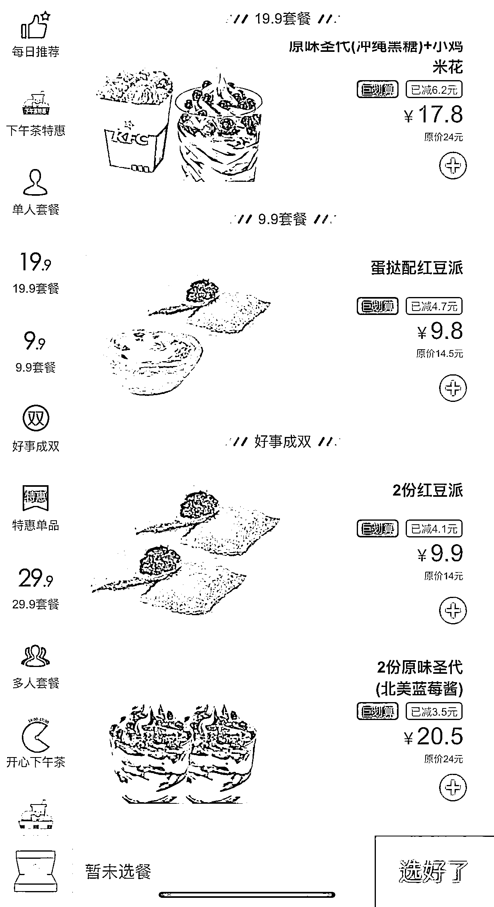
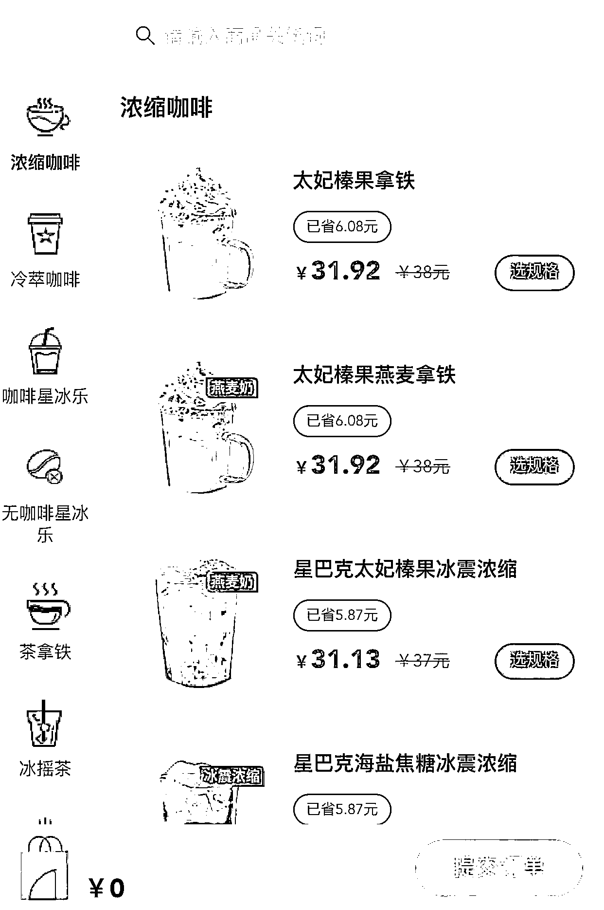
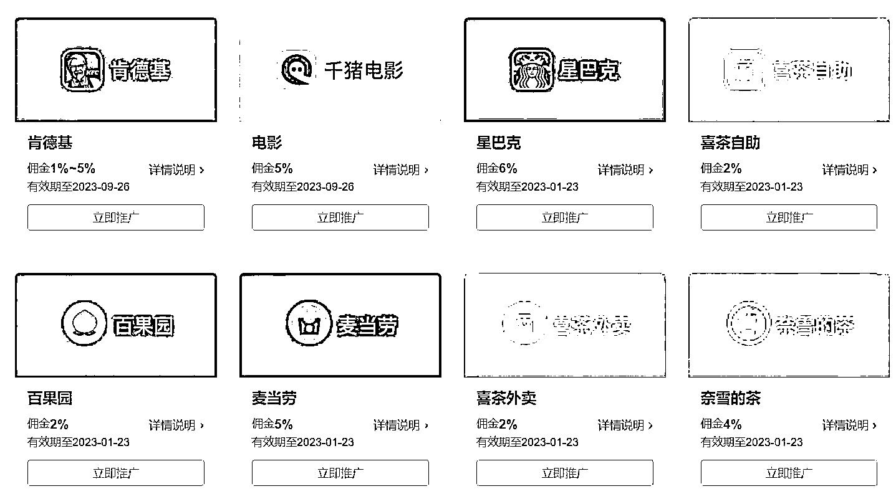
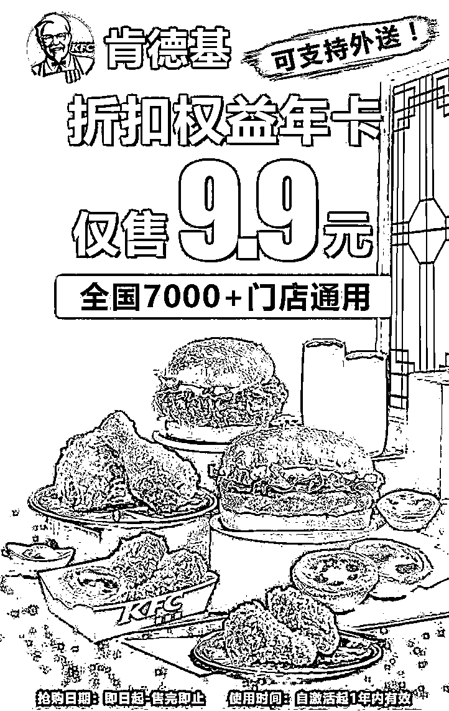
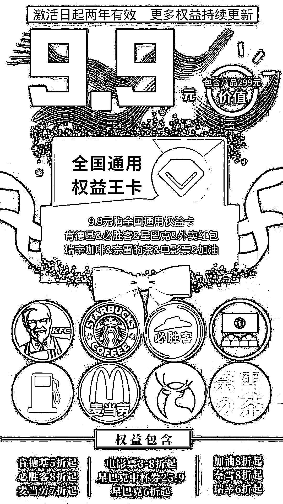
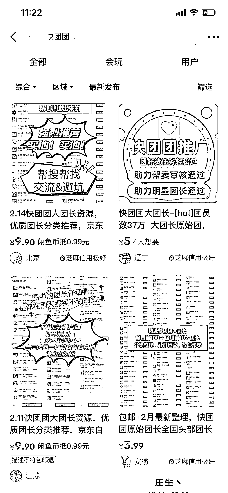
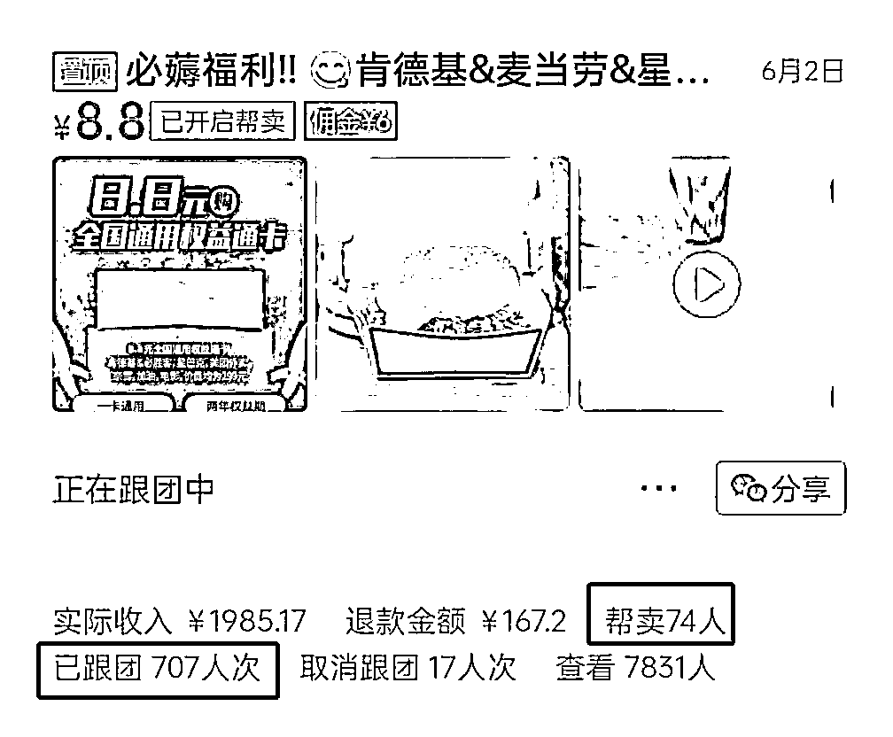
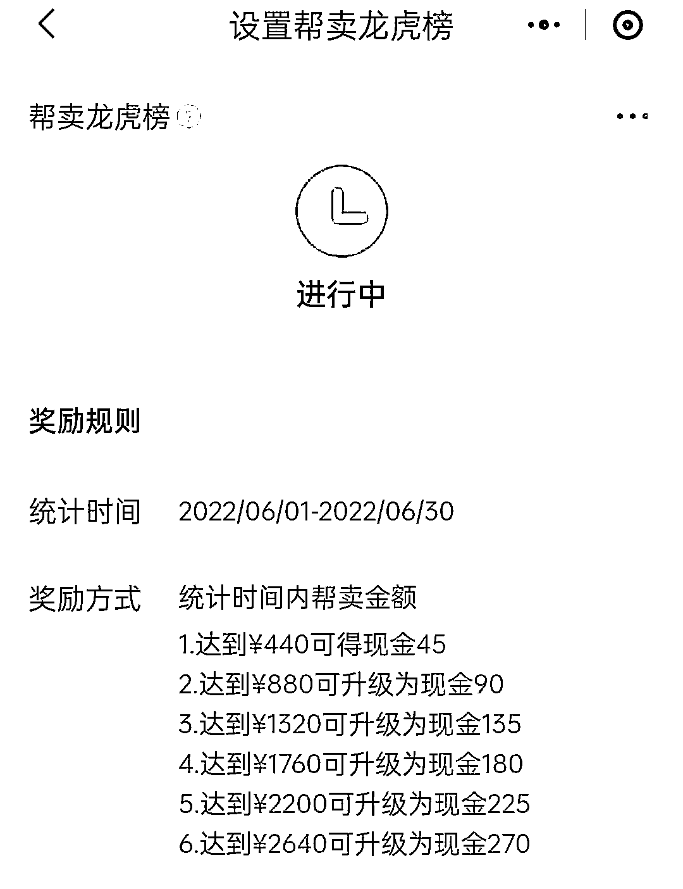
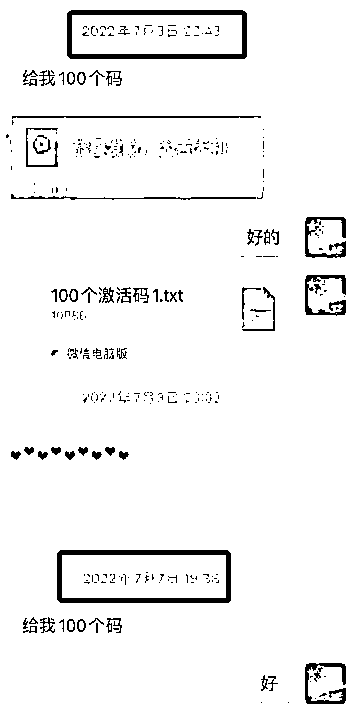
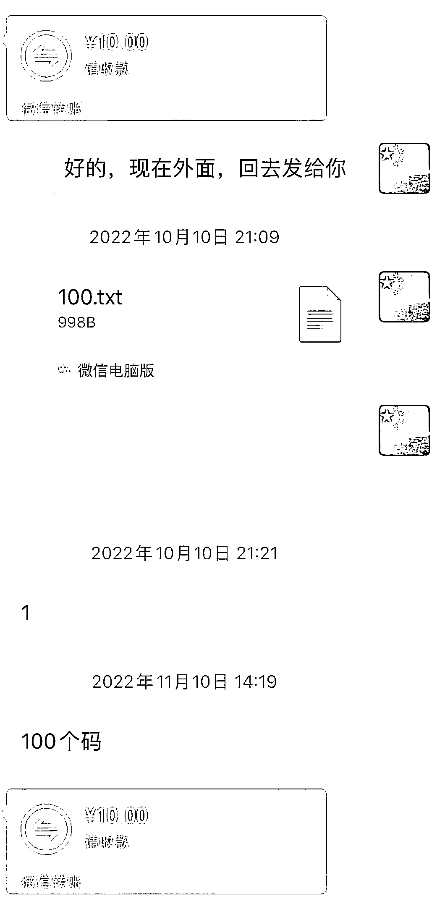

# (精华帖)(179 赞)0 成本实现三方共赢的权益年卡玩法：低价供货给快团团团长分销引流

作者：  曾俊杰

日期：2023-03-10

以肯德基为例，商家为了吸引顾客到店消费会发放大量优惠券，我们把优惠券整合以低价供给快团团分销商去推广，一整个链路下来顾客可以买到 8 折的肯德基，分销商可以获得推广的利润，而我们就可以拿到顾客点餐后的分成

那这种通过低价权益年卡实现共赢的玩法具体怎么玩？

前几年，很多产品权益卡都是在公众号等分销系统售卖，用户需要关注公众号才能进行购买，快团团兴起后用户购买方式更加便捷，加上我们在做的就是把单个产品权益组合成多个产品结合的全家桶形式。

以这样的形式售卖，受众范围广，接受度更高，同时把利润完全让利给分销的人，无需处理任何售后，还能快速拉起订单量和跟团人数，也给自己增加了 0 成本的引流发动机。

在这，顺便问问大家，平常你是怎么点肯德基 / 星巴克的呢？

柜台 / 扫码 / 官方 APP？

如果你知道通过一个公众号下单可以享受 5-8 折不等的折扣，是否会改变你的下单方式呢？

如果让你花 8.8 元，就可以长期不限次数的享受全国肯德基、麦当劳、星巴克等 5-8 折优惠折扣，你是否会心动呢？

对于很多用户来说，这是相当具有吸引力的，毕竟点一两次就回本了，以后都可以享受优惠点餐，确实省钱了！

受众广，单价低，这就为团购奠定了基础。

如果花了这 8.8 元，还可以叠加更多不同品牌的优惠折扣，是否会更有吸引力呢？

这就是我要说的——权益年卡！

一、权益年卡是什么？

所谓权益年卡，其实就是集合了多种大型连锁餐厅优惠点餐的一份权益，因为售卖它的人经常赋予它 1 年~ 2 年的有效期，所以又称年卡。（实际可以做到一次激活，终身优惠）

优惠点餐的大型连锁餐厅包括且不限于以下几种（可以自主添加）

肯德基、必胜客、麦当劳、汉堡王、星巴克、瑞幸咖啡、喜茶、奈雪的茶

购买它的人，可以以门店价 5-8 折的折扣去点餐，消费者确确实实得到优惠，而年卡的价格一般都不高，卖 3.8 ~ 12.9 的都有，基本上消费者点一两次就回本了，所以受众范围广，接受度高，对于快团团的人来说，利润可以，无需物流发货，无售后退货，能快速拉起订单量和跟团人数。

二、为什么成本接近于零？

这些优惠点餐的 CPS 链接其实基本可以免费获得，有的公众号甚至会直接把它们放到自己的自定义菜单上，然后免费开放，但这个世界永远存在着信息差，你以为路人皆知的事还有 90% 的人一点都不知道。

我们所做的，就是把这些优惠点餐的链接打包封装起来，需要一个激活码才能去激活使用，然后去售卖这个激活码。

我们的利润主要来源于用户点餐后的返利，所以几乎没什么成本。

顺便说一句，通过这种方式获得的客户质量最高，之前我们也通过抽奖活动，公众号广告投放等方式去获客，

这样就可以去售卖了，把售卖的利润完全让利给分销的人，这就为自己的引流增加了一个 0 成本的发动机。

而且这是多方受益的，所以可以长久。

消费者获得了多个大型连锁餐厅的点餐优惠，分销者获得了推广利润，而我们获得了点餐分成。

三、流量从哪里来

前几年，主要是以单个产品权益年卡在各个旅游分销平台去售卖，比如肯德基权益年卡，星巴克权益年卡，模式基本是平台自己留 1~2 元利润，给分销商 6~7 元利润。

这里的平台主要指一些地方性的旅游公众号，他们一般使用自我游、标点云等分销系统，他们卖这个产品主要也是为了吸粉，因为 C 端通过扫码分销商的海报，会先关注公众号，再跳出购买链接。

后来做的人越来越多了，就开始卷了，大家把两三个权益放在一起，到现在，就成全家桶了

20 年疫情开始，快团团应运而生，并迅速发展壮大，它不用下载 APP 或者关注公众号，通过小程序和微信朋友圈，就可以触及大量用户，非常的方便。

以前在旅游分销平台的玩法，就搬运到快团团这个新的平台去玩。

我主要是通过闲鱼搜索快团团，然后就可以找到一些人在兜售团长资源，因为他们可以由此获得返利。

购买之后，一个个的订阅团长，很多团长都会在快团团的主页留商务合作的微信，然后一个个的私聊，一个优秀的团长能给你带来成百上千的用户，而且是付费用户，这意味着这是一个精准的高质量粉丝，多少人为了获得精准用户而绞尽脑汁，费尽钱财。

而你的时间成本仅仅是微信上的几句沟通，金钱成本几乎为 0 。

四、如何成交

对于用户来说，6.6 / 8.8 元的客单价，随便消费一单就可以回本，成交难度低对于团长来说，0.1 元的供货价，利润率和订单量让她有足够的动力去推广五、过程中的经验分享

分享一下我自己接触的快团团长经历，我当时接触到一个上海的团长，也是一个因疫情被困在家的宝妈，不过她很有想法，我们很快达成共识，一星期她就卖出去 700 多份~ 

我仔细看了她的数据，居然有 70 多个团长在帮她卖，原来她是一个大团长，主要想通过这个产品来增加自己产品的供给，她还把自己的利润拿一部分出来设置了龙虎榜，从而让她底下的团长更有动力。

还有一些团长，就是一直每次 100 个的订

六、团长的顾虑

团长最担心的应该是售后问题了，比如你的激活码有没有及时发放，会不会有的不能激活，点餐会不会要等很久才能出取餐号，会不会出现点餐失败的情况？

在这一点上，我们采用的方法是直接把激活码给团长，让他自己发货，如果有不能激活的，直接补发。

而在点餐使用环节上，主要是凭借在市场的长久摸索，寻找到靠谱的合作伙伴。

提供这种连锁餐厅 CPS 链接的，其实也有很多服务商，跟他们合作，主要衡量出餐速度、出餐成功的稳定性，还有利润率。

这方面我们以前就吃过一个亏，对方提供的服务，居然是靠人工撮合的方式，出餐速度要 7-15 分钟，有时用餐高峰期更是长达半小时，甚至还会出餐失败，给用户的体验非常糟糕。

自从踩过这个坑后，在往后的服务商选择上，就一直把出餐速度和稳定性优先排在前面，后面的路就走得比较顺畅了，售后非常少。

评论区：

Mr.老吴 : 权益卡玩法知道，快团团也知道，但是把两者结合没想到，学习了[强][抱拳] Mr.老吴 : 卖卡的利润都给团长？自己只赚 cps 佣金吗？

曾俊杰 : 是的

Mr.老吴 : 这些佣金率好像都挺低吧

曾俊杰 : 6%左右

亦仁 : 感谢分享，已加精华。

王小蒙 : 靠谱的权益卡资源不好找吧[撇嘴]

曾俊杰 : 对，慢慢积累优质资源，排除掉一些出餐慢，系统不稳定的，现在合作的就很省心了

