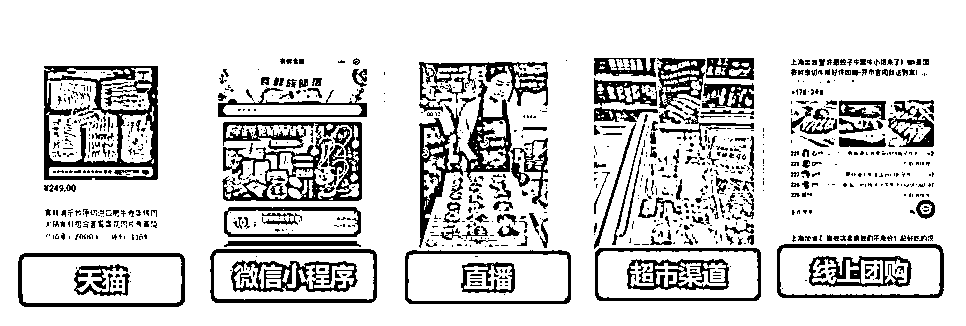
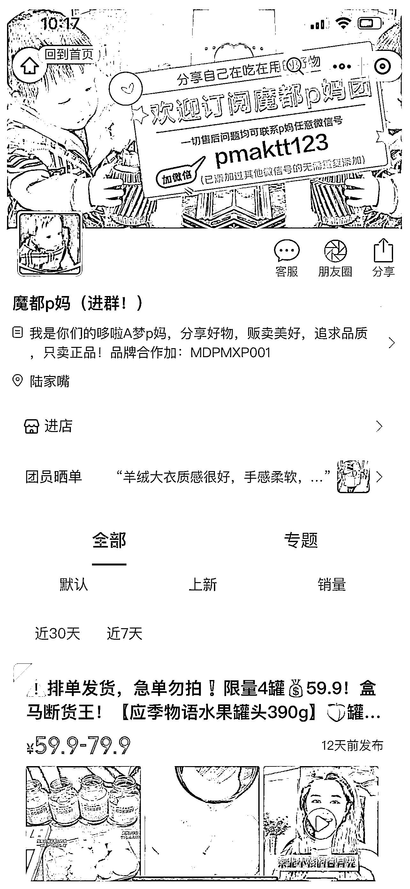
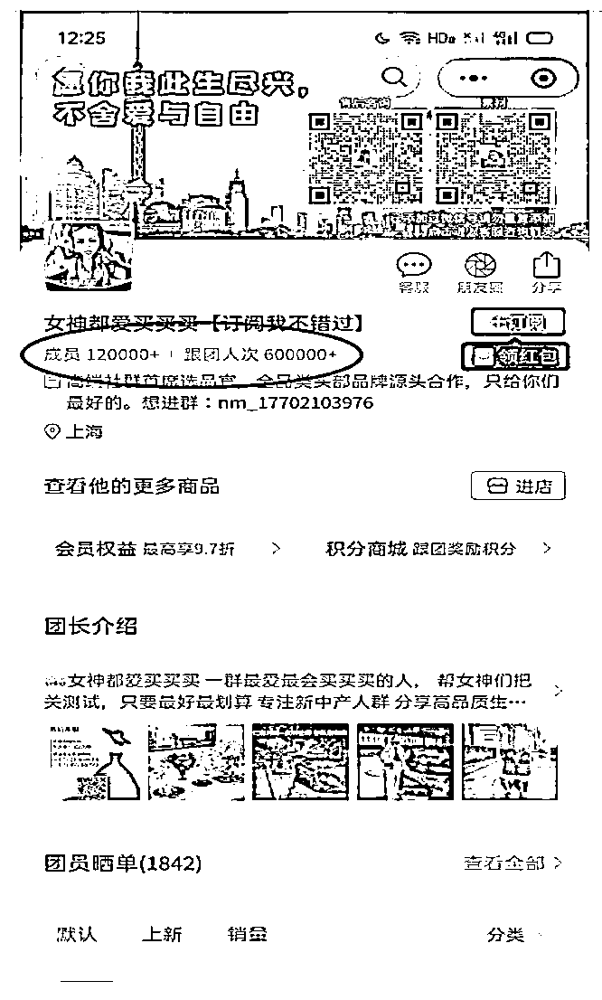
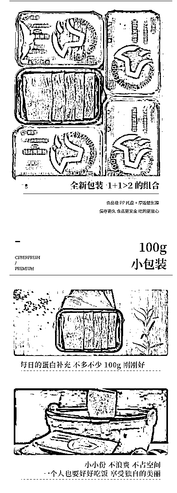
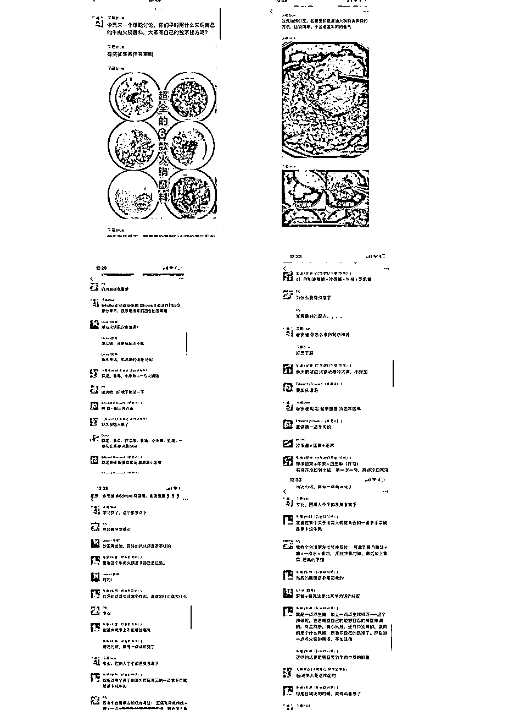
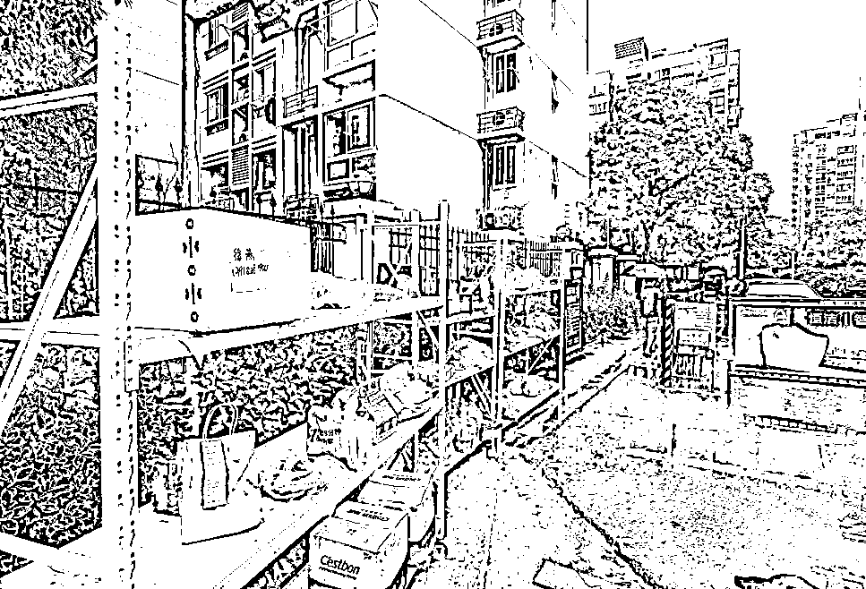

# (精华帖)(104 赞)自营牛肉品牌如何运营团购平台？通过私域运营实现稳定营业额 40-50w

作者：  深藏 blue（chu*

日期：2023-03-06

通过这篇分享，尝试帮助想在私域卖货的大家解决以下 4 个问题：

1.怎么了解客户需求？

2.怎么围绕自己的客户群，寻找合适销售的产品？

3.怎么和供应链合作，怎么选择靠谱的供应链？

4.怎么拉新？怎么提高复购率？

我是一个 10 多年的英国海归，回国后在一家 500 强企业做 IT 项目主管，一次偶然的计划，进入了牛肉进出口行业，负责 C 端零售渠道，目前通过私域运营自营牛肉品牌，实现疫情期间月销 60-70w，日常稳定在 40-50w 。

在短短的 1 年的时间，我们从零开始打造品牌，建立天猫旗舰店和私域有赞商城，布局抖音和视频号，并且快速入局拼多多的团购渠道。

在半年时间销售就差不多做到 1000 万，其中快团团社区团购方面，我们在月销单团做到了 50W+

加入生财已经差不多 2 年多了，最近有幸做了快团团大航海的教练，也借此机会，在这里给大家分享一下社区团购和私域运营这两个方向的经验。

因为今天生财很多同学都在尝试参与“快团团”这种类型的团购，所以我想从怎么做好团购的方向来告诉大家。

本来我想给大家分享的是站在品牌方的角度，一个新零售品牌负责人怎么来入局团购以及通过社群运营实现销售额的快速的增长？

但是因为很多生财同学是以个体团长的形式来参与团购的，所以我想还是从几个对大家做团长有帮助的角度来结合实战来讲讲我的快团团运营经验。

全文分为上下两个部分，上半部分侧重于定位，通过自我定位和客户定位来寻找匹配的大团长，以及设计和寻找和自己客户匹配的产品，

下半部分侧重于社群运营，讲一讲怎么做好自己客户的私域运营，主要就是微信群的运营，包括拉新，活跃社群以及复购。

上篇：定位

（1）自我定位 - 我的优势是什么？

（2）团长定位 - 我能给客户提供什么？

（3）产品定位 - 怎么寻找或设计差异化的产品

下篇：私域运营

（4）拉新 - 怎么拉新找到新用户

（5）微信群 - 怎么让群变得有价值提高客户活跃度

（6）复购 - 怎么让用户买买买

读完这篇文章，你能收获什么？

怎么对自己的客户定位？了解客户需求？

怎么围绕自己的客户群，寻找合适销售的产品？

了解怎么和供应链合作？怎么选择靠谱的供应链？

怎么拉新？怎么提高复购率？

上篇：定位

**（1）自我定位**

先讲讲第一个问题，如何对自己的客户定位？真正了解自己的客户要什么？

首先对每一个想做快团团的朋友来说，我觉得在做客户定位之前，先要做一个自我定位。

如果你是一个个人团长，你首先要了解你的优势是什么？并且你能给你的客户提供什么价值。

是以一个美食家的身份为客户提供美食选品建议，还是以时尚买手的角色给大家提供服装穿搭选择，或者以一个妈妈的角色，提供各种优质母婴产品的经验选择。

但不论你选择什么方向，要记住有两点：

① 尽可能结合自己的优势

② 寻找垂直的领域和方向

如果你是一个品牌方来说，你要对自己的品牌有个清晰的定位，了解自己的精准客户，并对自己的客户有精准画像。

举个例子，我们的牛肉是以美国谷饲中高端大厂的进口产品为主，客单价一般都在 200 元以上。依据我们的目标消费者画像来看，我们的客户群是：

No1 : 30 岁以上有家庭的女性群体为主，

No2 : 喜欢自己烹饪的

No3 : 文化水平较高，对牛肉尤其是牛排有一定认知，

No4 : 经济收入可观，生鲜产品的购买支出每月可以 2-3 次，每次支出金额在 300-500 之间。

**（2）团长定位**

有了自己的清晰定位以后，就可以思考寻找怎样的供应链和大团长，为客户提供匹配的产品服务了。

这里我要结合我们品牌方的思路，来看看如何寻找合作的团长了。这里主要有两个步骤：

第一个是在哪些渠道找？

第二个是怎么筛选？

找团长和找对象一样，不能光看颜值看长相，其实走到最后你会发现“门当户对”其实最重要。

先说渠道，和我们做电商一样，我分为线上渠道线下渠道，线上渠道我是去找一些供应链公众号，他们会定期公布一些团长的排名，帮你建立一个认知。

比如说下面这个公众号：快团帮  https://mp.weixin.qq.com/s/2xnSwbH53-0AAbMF_MlnKA

他们会定期公布一些团长卖货的数据，然后还有一些团长销售排名。

上面这是 2021 年的数据，新数据的话，魔都 P 妈早就是稳坐第一名了同时，你也能找到这些团长的二维码，有了二维码你才能有机会联系到团长。

通过扫描二维码，你就能找到这些团长在快团团上的首页链接了，这样你就能够看到详细的团长信息，包括他们的联系方式，帮卖要求，以及最近团购活动等等。

这个就是目前一直都稳居全国团长头牌的“魔都 P 妈”，据了解，目前每月流水就差不多  2 个亿，着实让人感叹团购市场的巨大。

大家看到，这里就有 P 妈的微信号和品牌联系方式了，不过说到这里，这个加微信可不是简单的活，我可以分享一些经验给大家，也是一些有趣的内容啦。

因为大家知道，这些大团长的商务，其实是非常忙，每天大大小小各种品牌方和供应链都会去联系他们和加他们的微信，繁忙的时候，他们其实根本看不过来，

所以为了能加上微信，大家是想尽各种方法，用上各种话术，据说最夸张一个案例，加了 100 次才通过，

最后他加上微信的话术是： “姐，我从冬天加您到夏天，再不通过，  一年就过去了”，结果这一次大概是商务被他感动了，终于通过了。

不过实际的情况，我必须说，几乎 90% 以上都不会通过的。

首先越大的团长他们的供应链其实很全的，而且他们已经有固定的供应链合作方，供应链定期给他们推品就可以，新品牌如果不是很有特色有差异性的，基本都不会理你了。

说到这里，我必须要说说我们后来的策略，之前我讲过，越是头部的团长，其实你的成功概率越低，  （如果你不是很有品牌知名度的大厂商或者拥有当前最火的产品资源，能引起他们关注是非常难的）。

如果按照我的“门当户对”理论，就是说，你要么自己是“大户人家”，你要么是个让人一见钟情的“绝代佳人”，否则就不要想着高攀什么“大户人家”了。

所以后来我们基本的方向就是中腰部的优质团长了，为了让这个寻找团长更有效率，当时我安排了几个同事，专门对市场上的团长做了人物画像以及数据化的分析，下面给大家讲讲我的经验：

先看一张表，这张表我们把团长的开团数据做了几个维度的重点分析：

【团长个人 IP 】

其实每个团长因为个人的背景情况，其 IP 形象是有差异的，其中比较多的是宝妈形象，还有小资女性，电器达人，装修达人等等。

因为牛排的背景和高客单价，在宝妈这个大目标方向下，我们会更细分关注：高知女性（高学历），喜欢烹饪。

【成员数量和跟团次数】

成员数量和跟团次数主要反映的是规模，数量越多，次数越多，规模越大。

【优势品类】

品类方面，我主要看团长的选品喜好，团长是否有卖过生鲜食品类，是否卖过满足同目标类型客户的产品。

① 是否有同类产品，如牛肉牛排海鲜类等生鲜肉品

② 所开团产品是否有母婴类（如儿童玩具，读物，服饰等）、健身类（运动器材，运动衣等）、厨房用品等所属目标客户群体一致的产品。

【近 30 天销量最好的产品】

帮助我们了解目前团长最近推的品的销售情况和趋势

【是否有过牛肉产品销售】

如果有过牛肉产品的销售，我们要看销售的产品是否和我们有重叠，我们有没有差异化的东西。

【开团频次】

开团频次主要是每天开团的频率，一般从 1 次到十几次不等，越大的团开团频次越高。

但是我们要找少而精，如果开团频次很高，但是人气和转换率一般的团长，并不是我们追求的。

我们一般的标准是：开团频次每天至少 10 个以内优质开团链接，跟团人气高（大于  100 次），销量较好（转化率在 2% 以上）

结合上面的数据，我们按照这样的条件进行来了筛选：

客户群体比较精准符合我们的画像，

团长对品质有一定要求，

团长的客单价比较高

团长的最近开团人气度高，转化率符合要求

最后，我们筛选出来差不多二十几个团长：

上海女神团/小荷才露尖尖角 /miu 家万能团 /Winky/ 等等十几个团长 

接下来就是沟通，寄样以及再沟通这样的繁琐过程。

这个过程非常重要的一点，就是双方的认知和价值观是否能一致，整个标准就和我说的谈恋爱是一样的，双方需要有个相互熟悉和磨合的过程。

**（3）产品定位**

社区团购的渠道有其差异性，追求商品的极致性价比是所有团长的需求点，所以很多品牌商都被要求在这个渠道提供更具性价比的商品。

我们其实也面临这样的挑战，我们当时已经开设有天猫这个渠道，当时我们天猫的最火爆的寿喜烧产品因为我们的高品质要求，整个毛利并不是很高。

如果要按照这个品的价格给更低的优惠，在社区团购来推的话，我们应该要给很高的补贴，其实大家知道，商业行为如果没有利润，依靠补贴是很难持续的。

所以后来我们产品团队对整个社区团购的商品，做了差异化的设计，具体做了下面几个方向的调整：

① 在保留寿喜烧套餐的核心品种的同时，我们更换了 2 个产品，也就是换上了 2 个重新设计的新品，新品的毛利更高，这样我们也能提供出更低的价格给到团长。

② 新品的设计上我们调整两个思路，一个是场景的设计，一个是规格的重新设计。

场景的设计，我们当时我们观察到一个趋势，牛肉消费人群中追求低脂健身人群很多，针对这种需求，我们推出了低脂牛肉套餐。

然后在规格的设计上，我们推出了一款小包装产品（ 100g 独自美丽包）。

小包装产品可以让客户从心理上感觉到，花同样的价格买到的盒数更多，所以当时我们推了一款 99 元 10 盒的限时福利抢购。

③ 和牛产品引导高端客户，当时我们在社区团购比较早的推出了和牛产品，而且我们一开始就主打最高等级的和牛产品（ M9 等级），直接吸引了很多高端客户的注意力。

大家可以看到下面我们开团的效果，在女神团，我们的产品非常短的时间获得消费者的好评。

在第三次开团的时候，我们的产品总共卖出 2000 多个订单，有点小小爆了，当时在女神团开团的食品类目中，我们排到了前三名。

按照我们客单价 200 元来计算的话，2000 个订单，也就是 40W 左右的销售额。

总结一下，我一直认为在社区渠道如果能为社区团购定制化差异化的新品是最好不过的。

差异化的产品包含很多个方向的思路，差异化的品类，差异化的产品规格，以及差异化的场景，这些都能让你避免同样的一类产品在不同渠道被反复进行比价。

下篇：私域运营

在我们社群团购中，除了和团长合作以外，我们也设立了自己的私域团购渠道，也就是品牌方以团长的身份直接销售产品给终端客户，并且取得了很好的增长效果。

私域运营中最重要的 2 个环节是拉新和复购，简单来说，就是两句话，如何用低成本找到新用户，然后持续地让客户买买买。

**（4）活动拉新**

寻找新的客户，以及源源不断寻找新的客户永远是私域运营最重要的部分。

拉新的方法有很多种，熟人介绍，朋友圈拉群，活动拉群，以及小红书等其他公域引流都是很好的方法。

因为很多线上的方法在生财都有介绍，我就重点讲一下不一样的，也是我们做的比较多的方式 —— “线下活动”拉新。

做食品类的产品，其中有个很大的逻辑就是如何低成本让客户去尝试，因为只要你的东西够好，客户尝试以后，就会很容易发展成为你的客户。

因为我们的产品价格偏中高端，考虑到要寻找精准的客户，我们经过很多次的测试，最后定位于针对一些目标社群的活动。

这里要解释一下我们的目标社群，我们的目标社群主要是指集中聚集我们的目标客户的社群，主要包含以下社群活动：

① 青少年体育俱乐部活动

② 企业工会组织的活动

③ 中高端社区活动

④ 其他活动

大家知道，线下活动要投入不少人力和物力，还有时间成本，所以找到精准客户，提高转化率非常重要。

但是找到客户只是第一步，后期的转化和留存也非常重要。

最早的时候，我们是让客户关注我们的公众号，然后推送我们的产品优惠券，但后来发现，这个路径太长了。

因为客户关注了公众号，但是后期你很难持续跟踪客户，从而导致客户流失。

后来我们的改进策略是：客户试吃满意后，我们用个人微信（企业微信）加客户，然后直接推送优惠券给客户，同时对客户做好分类标签，后续就能做个性化的推荐和跟踪。

这里同时我们会对客户做邀请加入微信群的动作，为后面的持续运营做好准备。

**（5）微信群运营**

虽然大家都有意识把自己的客户拉到自己的群里，但是实际上微信群的运营是个非常复杂的工作。

考验微信群运营的好坏，我觉得只有两个指标：客户互动率和客户下单转化率。

这两个指标是相互关联的，只有做好了客户互动，才谈的上下单转化率。

客户互动率是考察微信群活跃度最重要的指标，其实就是看客户对你的群的信息的关注情况，你发的消息或链接的点击进入率有多少，试想一下，你在群里发的消息都没有人看的话，你还有什么奢望客户能在你的群里下单呢？

在做这些之前，我觉得首先要思考一个定位问题，也就是你的群对客户的价值是什么？

大家知道，现在是信息爆炸时代，过多的群的，过多的信息，导致的结果就是客户只能有精力关注自己喜欢的东西，如果你的群的价值不够，最后的结果就是慢慢变成死群。

经过思考，我们对于我们的微信群做了以下的规划：

① 围绕牛肉定期发布一些有价值的内容，包括美食分享，烹饪经验，购买小知识等等。

高价值的内容永远是吸引客户的关键要素，所以找到客户的兴趣点，发布一些对客户有价值的内容永远是关键。

所以自己不断整理有价值的内容，然后分享到群里，制造话题，引发大家的讨论，是提高客户活跃度的重要手段。

所以我们重点做了两件事情：

第一，每周都会发布一些有意思的话题，同时带动大家讨论，  到目前为止，我们引发大家参与比较有意思，互动率比较高的话题包括：

Top1 : 你最喜欢的火锅蘸料是什么？自己怎么制作的。

Top2 : 到底牛肉是否可以反复解冻？

Top3 : 低温慢煮怎么操作，有什么低成本的低温慢煮的方法？

我放了一些我们互动做的比较好的话题的讨论的截图，大家可以参考了解，看一下我们怎么来激发客户参与的热情。

可以看到，只有客户对你的群的内容感兴趣，才会更加关注群里的信息，参与群里的互动，也才能提供互动率。

② 定期只有在群里才能够享受的优惠。

其实客户加入群，肯定有一个目的就是希望能够在群里享受到专享的福利。

这个福利本质上就是一种特权，因为这也是让客户觉得加入群的“价值”。对于这种群内的福利，我们做了这样的设计：

每周发布一次群内专享折扣福利

不定期做一些有趣的互动活动福利，包括新品试吃福利，抽奖福利等等

这里我需要强调的一点是，福利很重要，但是发布福利的形式也很重要，大家记住有趣好玩，还能有便宜才是最好的福利活动方式。

我们在群里设计的比较成功的福利活动包括以下两种：

【半价拍卖活动】- 选择一个产品，在群里做零元起拍卖，在 1 分钟内，最后一个出价最高者获得，最高出价可以规定为正常销售价格的半价，保证客户的权益。

【现金券膨胀活动】- 规定一个时间，客户出 10 元购买抵扣券，第一名购买者，可以  10 元当 50 元使用，第 2-5 名购买者，可以 10 元当 30 元使用.，第 6-20 名购买者，可以 10 元当 20 元使用。

以上两种活动可以让福利变得不确定，从而利用大家“博一博”的心理，提高参与度，对群的活跃度有很大的帮助。

**（6）复购转化**

提高了客户的参与度，那么就可以在复购转化上下文章了，但是在这里我特别想强调的是，提高复购转化，绝对不是一天到晚不断给客户推送下单的链接，其实这一点我是觉得不合适的，给客户推送产品信息是要讲究两个方面的：

① 推送的时间节点

大家要意识到，产品的推送时间绝对不是越多越好，而是要结合客户的消费频次，最好的节奏是在客户上次购买的产品差不多消耗完了，才推送你的产品。

举例子我们的牛肉产品，一般客户购买牛肉的频次周期大约为一个月 2 次。这样的话，最好推送产品信息的节奏是 1 周 1 次，最多不超过 3 次。

② 推送的内容

推送的内容大家一定不要简单做群发，结合客户的实际情况做定制化的产品推送是效果最好的。

举个例子，我一般的做法是先询问客户之前的产品感觉如何，有没有什么反馈信息，然后了解客户的要求和想法之后，再来做精准的推荐。

比如客户反馈说想吃瘦一点的牛肉，然后你就可以推荐后腿牛肉，客户说下周要请朋友吃火锅，然后你就推荐火锅套餐。

大家一定要记住，越是精准的推荐，成功率才会越高。

完结篇：最后想说的话

结合上面这两点，我想再总结一下，社区团购要做的好的话，离不开两个核心要素：

一个产品选的好，满足客户的要求，价格有竞争力

第二个是拉新和复购做的好，保证源源不断有新用户，并且不断买买买。

做好了这两个，销售额增长就是时间问题。

不过如果反思当时我们的发展过程，我们在三个月内能够快速增长，其实还有一个很客观因素就是疫情，疫情期间让团购变得非常火爆。

但是当时，我们却要面临一个最大的挑战就是配送问题，我记得当时顺丰的配送也遇到很大问题，很多网点没有办法配送，我们的产品被顺丰退回。

当时我们没有坐以待毖，而是做了一个现在看来非常难而正确的决定，这个决定在我看来，对于我们后来品牌销售增长起到了很大的作用。

所以在文章的最后一部分，我想和大家分享一下我们当时怎么在极端困难的情况下，完成服务和履约。

因为在我看来，给客户提供超过他预期的，别人做不到的服务，也是一个核心的竞争力。

当时我们面临配送的巨大困难，每天大概有 150-200 多个订单，其中顺丰能完成 50% 不到的订单，我还记得在临近上海封城的后面几天，每天情况是变得越来越难。

有一天我们积压了几乎 150 个订单。当时我和我的小伙伴说，如果这些订单我们无法配送导致客户退款，我们就浪费了好不容易积累的巨大流量，这对后期我们品牌是非常不利的。

于是，我们下定决心，要不惜一切代价，把订单履约完成。

为了履约，我们做了三套方案：

① 货拉拉配送

② 骑手配送

③ 私家车配送（也就是我自己开车去送）

我们按照上海的区域，把宝山杨浦虹口分为一个配送区域，黄埔静安徐汇作为一个区域，长宁闵行一个区域，浦东一个区域，松江一个区域，每个区域我们再去找相应的货拉拉和骑手来配送。

因为当时有很多小区有疫情，要无接触送货，对于每一个司机和骑手，为了确保他们能保质量送到客户手里，我们要求他们拍照留底。

就这样，我们当时一天最高完成自己配送 150 个订单的最高纪录，当然我们也付出了很大的配送成本，平均每一个订单的配送成本在 30 元左右，比日常的物流配送高出 1 倍。

不过也正是因为，我们当时不计成本的投入保证配送履约，让我们赢得了团长和客户的认可，当时有很多竞品是无法配送到客户手里的，所以这也让我们在后来疫情后面的销售额做到了飞速增长。

回头来看，无论团购是怎样的变化，还是要回归到商业的本质。

借用最近很火的刘强东的话，你不要跟我扯那些乱七八糟的，你们这些管理层不要跟我说那么多花的、新理念的、新词，别跟我说这些，你们要回归常识，回归到商业本质的 5 个要素（产品、价格、服务、成本、效率）。

与大家共勉！

评论区：

Unstoppabl* : 福利活动的设计真心不错

许锐 : 特别精准的人群规划和复购提升，学到了~

深藏 blue（chu* : 哈哈  还有很多实用招数有机会给大家分享

安神 : 共勉

亦仁 : 感谢分享，已加精华。

倪大胖 : 借用最近很火的刘强东的话，你不要跟我扯那些乱七八糟的，你们这些管理层不要跟我说那么多花的、新理念的、新词，别跟我说这些，你们要回归常识，回归到商业本质的 5 个要素（产品、价格、服务、成本、效率）。

光子郎 : 你这个产品的毛利率大概多少区间

芷蓝 : 这篇好详细，太厉害了
