# (精华帖)(263 赞)新手宝妈，职场副业两不误，跑通小红书引流和私域卖货，累计利润 30W+ 的经验复盘

作者：  小野

日期：2023-02-08

大家好，我是小野，终于鼓起勇气（不再偷懒），来生财分享下我生完娃以后 2 年的副业经历。

首先自我介绍下，我就职于一家医药企业，负责互联网医疗运营业务，曾在医疗互联网公司做过运营和产品经理，同时我还是一个新手妈妈，有一个 2 岁的可爱宝宝。我自  2020 年底生完娃以后，以为自己会忙于工作和育儿，但没想到自己利用业余时间跑通了小红书引流和微信私域卖货，累计利润额大概有 30 万+。

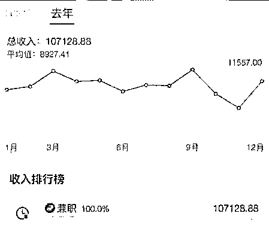 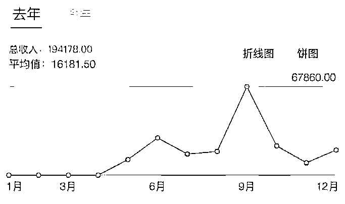

我知道这个利润额在生财有术的大牛里不算什么，但对于一部分人来说，这相当于一个人力全职工作一年的收入了。能拿到结果，一定是因为自己做对了什么吧，那么做对的部分值得沉淀下来。一是为了在生财有术里可以贡献一些可以被复制的实操方法，二也是为了给自己一个记录和复盘。

一、互联网启蒙期：深受互联网大牛的启蒙和影响

我毕业后第一份工作是在一家互联网医疗公司做产品经理和运营，从那时候开始，“流量积累-流量运营-流量变现”就深深植入在我思维里。只不过那时候是为了公司业务来积累流量，每周给业务相关的公众号写行业分析报告、追热点，以此吸引行业流量，为自己做的互联网产品的 B 端销售变现做基础。

除此之外，更受启蒙和影响的是，那时候已经有了「个人 IP」的概念。在此要感谢生财有术的嘉宾—大辉和二爷，给了我很多启蒙。很多年前，就看着大辉做「小道消息」、二爷做「二爷鉴书」，于是我 8 年前也开始做「小野食堂」，本想着好好做内容，但后来因为工作太忙（借口），从月更变成年更然后断更…

没关系，公众号虽然没有做起来，但微信好友我一直在积累。

二、私域引流期：让引流这件事成为日常

**1**、泛流量：不要错过任何一个加微信好友的机会

在 2021 年正式开始做微信私域变现之前，我有 4000 左右微信好友。我一直清醒地知道，未来微信私域是一定可以变现的，虽然不知道是什么时候，但我一定要持续地加很多很多微信好友，不放过工作里任何一个增加好友的机会。

我曾做过医药医疗行业投资经理的工作，每次出差都需要主动去认识很多行业里的人，少不了主动加微信。刚开始很不习惯，后来我想到未来很多年微信里的好友一定可以为私域变现打好基础，我就大胆放手去干。

从那时开始直到到现在，我微信好友是不设置验证的，这样加好友速度才快。后来验证泛流量这个思路是没错的，那时候加的行业里认识的人，现在有人成为了我的代理、有人成为了我的 VIP 客户。

**2**、精准流量：有相同经历的人，是最同频、最精准的流量

相信每一个妈妈都经历过备孕、怀孕的日子，那期间的很多迷茫和疑问，第一反应就是去小红书上搜一搜、问一问。在我起初加入过一个备孕群以后，我想到，我也可以自己建群成为群主啊。

于是我开始试着在小红书上记录跟备孕怀孕的一切，这几乎不需要刻意选题和准备内容，就在真实记录自己怀孕生子的生活同时，把内容用心加工成为输出对别人有价值的内容就可以。从备孕到怀孕到生孩子，虽然小红书只有 600 多粉丝，但引流到微信好友的妈妈应该有 1000～2000，这部分流量也是我目前副业的主要客户来源。

值得一提的是，我在南京鼓楼医院生产，但产检期间发现这个医院竟然没有官方孕妈交流群！后来我就建了一个群，可是从哪里引流？在生产之前，我发了一篇小红书笔记「南京鼓楼医院助产士才会告诉你的待产注意事项」，就这一篇帖子，帮我建了一个近  500 人的鼓楼医院孕妈交流群，而实际上这篇帖子的内容就是助产士门诊都会给到的一份注意事项，我只不过做了整理和编辑的工作。

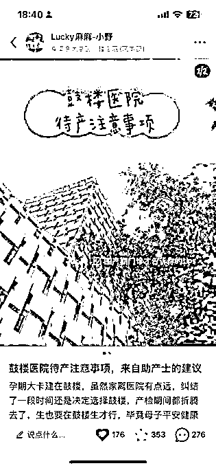

有相同经历的人，是最同频、最精准的流量。这放在任何一个领域都适用。

**3**、微信标签：所谓私域精准推送，就是手动打上标签

这几年听太多精准推送了，而微信私域里的精准，其实最原始也最有效的，就是手动打标签，包括分组标签和名字备注标签。

分组标签：分组本质上是为了方便发朋友圈。

我根据微信好友工作单位、城市、职能、认识来源等维度来进行分组，这样未来发朋友圈时，可以筛选合适的标签来发，除了屏蔽的作用，还有精准发圈的作用。比如我刚开始发布母婴社群招募时，不想打扰到其他好友，就在做了分组发圈，然后快速引流到  100 人入群。

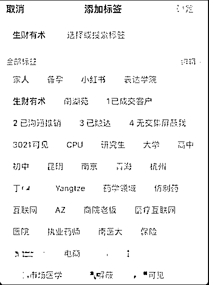

名字备注标签：本质上是为了群发（必要时），以及触达同一类别的客户。

（1）把好友/客户大致分为 4 类：

已成交（用 1 表示，后面加上成交类别，美食/母婴/减脂）

已沟通咨询但还未成交（用 2 表示，后面加上咨询类别）

未沟通触达但未来有机会（用 3 表示）

未沟通触达但朋友圈屏蔽了我（用 4 表示）

（2）备注好友基本情况：身高体重、认识来源、孩子性别及生日等，如果信息再多，就放在微信好友的描述里。对客户信息进行记录，应该是一个销售的基础功了。微信本质上是一个强大的 CRM 库，用好它，私域变现事半功倍。

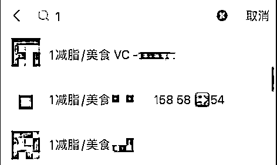

三、零售定位及变现期：产假不只是奶娃，而是有大把可以赚钱的时间啊

妈妈们都知道，生孩子休产假并不意味着放假休息，从孩子呱呱落地开始，意味着要开始学习做妈妈，要在短时间内学会关于人类幼崽的一切知识，意味着从此失去了完整的一夜睡眠，只有漫漫黑夜里没有预兆的随时醒来喂奶、换尿布以及深夜哄，意味着产假里只有很少的基本工资，而房贷、生活等开销仍然在转动甚至更多。

因此，在休了 2 个月产假后，我意识到，该做副业了，生活里多一个收入进项总是好的。在成为妈妈后，虽然没法做到每一样给都娃最好的，但我不希望因为经济压力，每一样好东西都只能看看而已，却要为孩子找平替。

回头来看，很有成就感，可能别人的产假都是无止境地奶娃，我的产假成为了微信私域变现的窗口期。

**1**、作为吃货，从美食经济起步

在这个阶段，我的思路很简单：有啥卖啥、喜欢啥卖啥，好吃的谁不爱呢？

虽然前面我引流了不少妈妈流量，但开始卖货时，我没有母婴类产品货源，所以我先选择的是自己最有热情的领域——美食。

我是云南昆明人，超级热爱家乡美食，8 年前我就开始做「小野食堂」美食公众号，这也一直是我的热情所在。恰好闺蜜有云南包浆豆腐的货源，云南人都知道这个小吃很有特色、很好吃，虽然利润不高，但就产品力而言很能打。于是我建立了「小野食堂」美食群，注册了快团团，也开始了第一条卖货朋友圈。

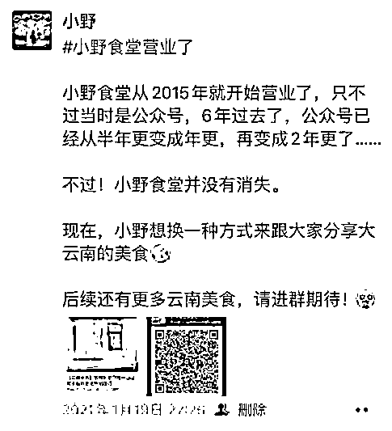

<第一条卖货朋友圈>

我之选择快团团作为工具，是因为自己一直在小区团购群买买买，自己使用体验觉得快团团这个小程序很好用，同时有了解到快团团是 2021 年才兴起的一个工具，也是拼多多旗下的，凭借拼多多实力，这个小平台应该也会很好吧。没想到，误打误撞，快团团后来成为了私域里发展很迅速的工具之一。

有了这个工具，除了包浆豆腐，我开始用自己家乡云南的资源到处找货源，大家知道的《去有风的地方》里很火的鲜花饼、米线、乳扇，以及沃柑、普洱茶、云南咖啡、版纳小玉米、饵丝……总之就是围绕云南美食的一切。当时恰逢过年前，加上好朋友们的支持，第一个月利润仔细核算后有 7000+，很开心。

这段时间，我自己找货源、自己编辑团购文案/图片、自己导订单/发货/上传单号以及处理售后，其实很累很辛苦，每天就连上传物流单号都是抱着 2 个月的娃哄睡以后完成的，经常因为抱着娃睡觉，就连操作电脑是手脚并用（哈哈哈哈又心酸又好笑）。

后来有一段时间我执着于自己找货源、自己开团，非常费时间，效率不高。我仔细反思后得到结论，供应链并不是我的强项（议价能力不强/利润不高，作为副业我时间有限），于是我决定扩大界限，不仅做云南美食也做全国美食，不仅自己开团，也可以在快团里帮卖。

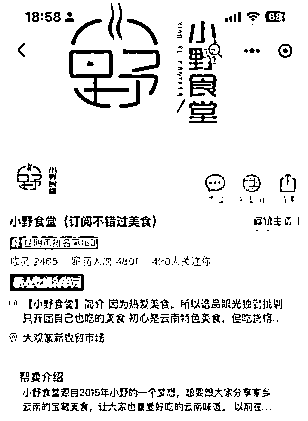

当然作为美食类产品，做好品控是第一位，至于如何选品是另外一个话题了。

**2**、作为妈妈，必选母婴经济

做了 2 个月美食团购后，我的产假只剩不到一个月了，看着自己群里的宝妈，开始在其他团购里买买买，我很焦虑。于是，想办法找到母婴货源后，我下定决心新注册一个母婴团购号，也新建了一个母婴好物团购群。

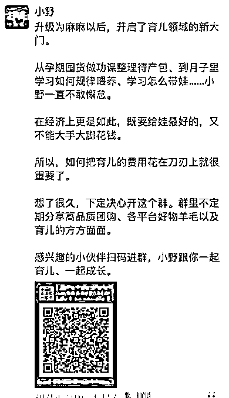

<根据微信标签分组发的朋友圈>

由于母婴产品是刚需，不用卷很多文案来创造需求，尤其在 0～1 岁这个阶段，只要把孩子吃喝玩乐货源找齐，价格有一定优势，社群姐妹有信任，服务做好，就有订单。运营一年时间后，母婴社群人数将近 500 人，母婴团购月利润也有大幅增长，也是我目前每月利润的主要来源之一。

**3**、瘦了** 20 **斤，选择了变美经济

为什么会选择「营养私教减脂和大健康」这个板块？

从我个人角度，因为生完孩子胖了 20 斤，而自己花 2 万多上了半年多瑜伽课但丝毫瘦不下来……实在忍无可忍，抓住最后一根稻草想要试试。从我药学硕士+执业药师的医药专业背景出发，我是不接受节食、代餐等减肥方法的，所以选择了一个科学的大健康营养私教方案。而且一边减肥一边分享，也遵循了“自用-分享-成交”的生意底层逻辑。

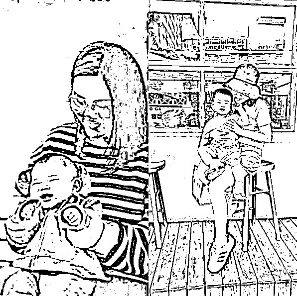

<瘦了 20 斤，是我做梦都想的事>

从客户需求角度思考，我既然做了母婴社群，大多数客户都是妈妈，大部分人应该都跟我有同样的减肥烦恼和需求吧？我既可以满足妈妈给孩子买东西的需求，也要满足妈妈本身的变美需求啊。我真心觉得，每个妈妈都值得好好瘦一次。后来的 8 个月时间，我服务了 30 多个客户成功减肥。很开心，我做到了初心、也交付了结果。

从利润角度，做大健康和服务交付类产品，利润也更高。做了 8 个月，每月利润都在 1 万元以上，营业额最高的一个月在 6 万+。

四、私域进阶期：发好朋友圈、做个「好销售」、成为好榜样

**1**、发好朋友圈：做朋友圈里的高级货架，不只是卖货，还有精彩的自己

做私域的基本功之一，就是发好朋友圈。

那么，什么是发好朋友圈？我简单总结了这 3 点：

（**1**）每天更新。

跟做自媒体一样，每天不断更是基本要求。不管是 1 条还是 10 条，一定要冒泡，否则客户会认为你三天打鱼两天晒网或者不做这门生意了，从而失去信任。

（**2**）有卖货，还要有精彩的自己。

我们每一个选择的产品、能够提供的服务，都代表了我们自己所认可的价值观和生活方式。所以，朋友圈不能只是卖货，还要有精彩的自己，有情绪、有价值、有态度。

（**3**）无自用不推荐、无体验不推广

大多数团购美食我都会自己买来吃一吃、尝一尝，并且自己拍照，为此我还买了一个比较贵的镜头。在育儿过程里，我自己大多数需要用到的东西也都会在团购里下单，然后在社群里分享。减肥我也是自己体验瘦了 20 斤，才去分享和推荐。我相信，最好的零售生意方式是，通过自己体验过的、思考过的、且擅长的方式来满足客户需求，同时创造价值。

**2**、做个好销售：没有人可以被别人说服，只自己能够说服自己

当我开始做变美经济，我发现营养私教减脂和大健康这一类服务类产品，并不像团购那样，随意聊 2 句就能成交。后来我慢慢学会，怎么洞察和挖掘客户需求。原来销售是一件以人中心的事，满足客户本身存在的需求，而不是以产品为中心，只会一味介绍产品。

有句话我很喜欢：没有人可以被别人说服，好销售就是点燃客户自己心里的小火苗。

除了满足客户需求，好销售还必须要学会的一件事就是如何跟客户保持粘性。我们在服务客户过程中，其实在有很多话题和触点可以持续跟客户产生链接，挖掘更多需求，从而达成更多生意机会。

做私域，一个客户的信任累计和持续复购，是非常宝贵的。

**3**、成为好榜样：做别人赚钱的推土机也很快乐

在我还没有正式加入生财有术时，就发圈吸引了 2 个微信好友想要加入生财（后来都加入了哈哈哈）。

在我加入生财参加了小红书航海后，我跟闺蜜聊到小红书，并且不厌其烦做她赚钱的推土机，推了很久，就在今晚，她成功引流了十几个好友并且成交了 5 单。

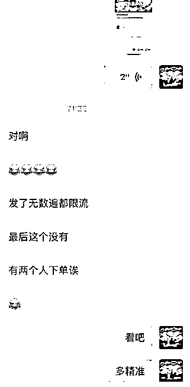

<闺蜜报喜 10 分钟后  成交了 5 单>

在我跑通小红书引流和私域卖货后，也有不少同样是新手妈妈的好友来问我如何做副业。我发现原来大家是一样的境遇，一样在有孩子后想要给孩子更好的生活、一样不甘于自己现有状态，想通过副业实现经济增项和自我价值。不少人对我说，小野你的朋友圈很有力量，小野我要跟着你赚钱。于是我开始做她们赚钱的推土机，分享生财有术、分享赚钱思路，她们也都陆续取得的实战第一步的小成绩。

<今天又收到了一个新手妈妈的开单报喜，走出了第一步>

原来，我也可以做一个带给别人力量的人，做别人赚钱的推土机也很快乐啊。

五、未来怎么走？平衡好生活工作，以及真诚是永远的必杀技

**1**、如何做到育儿、主业、副业三不误？

我问过自己，一边上班、一边带娃还要一边做副业，累不累？说不累是假的，做副业意味着做好本职工作、做好妈妈的同时，要投入更多的时间和精力。大多数晚上，我都是在给孩子哄睡后，拿起手机继续盘副业。如何提高效率就成了必修课。我自己总结了一些做副业提高效率、平衡生活的小分享。

（**1**）**   **善用工具。工具本身是用来提高效率的。比如「讯飞输入法」可以把通用话术或产品介绍都整理好，跟客户聊天效率很高；比如团购产品素材很多时，做好相册夹的图片分类，就不怕找不到实拍图、好评反馈图，快速取用…

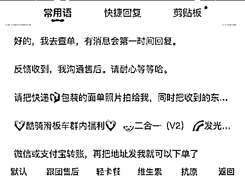

（**2**）**   **善用人。当利润有一定积累，招个助理吧。我是在去年 5 月份招了一个大学生助理，负责管理团购素财、售后沟通、和需要花时间的素材整理工作。这样极大地解放了我的碎片时间，让我有更多时间拓展客户或者思考生意如何优化。

**2**、真诚是永远的必杀技

当懂得很多销售技巧、运营技巧、文案技巧以后，我仍然吃了一些亏，经历过一个退款后拉黑删除的客户，也经历过一个高复购客户退群的窘境。然后我悟了，只有真诚才是永远的必杀技。于是，我在 2022 年底，给 50 多个客户手写了新年卡片、寄了礼物，在这个时代，手写信息弥足珍贵。相信客户会感受到我的真诚，只有真诚，副业和生意才能走得更远。

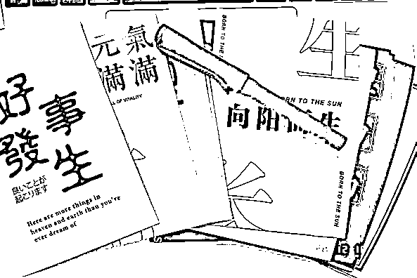 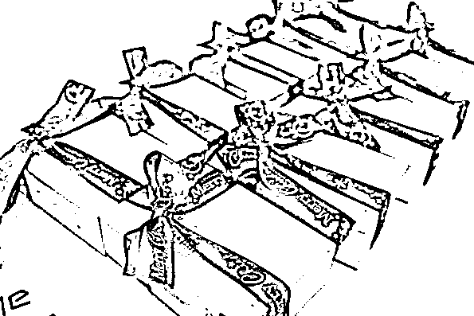

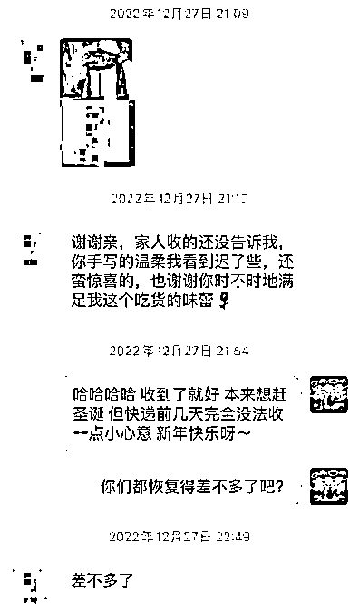 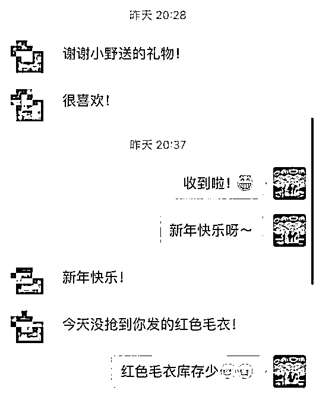 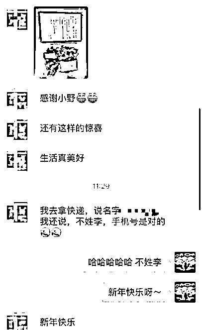

写在最后

这是我副业的经验复盘和总结，很庆幸自己一直在努力往前走，即使会有点累，但看着孩子一天天长大，这两年通过自己努力给孩子提供了更好的生活条件，育儿主业副业都没耽误，自认为这份投入非常值得。孩子从来不是阻碍我们追求梦想的阻碍，相反，我认为作为妈妈，恰恰是有这个努力的状态，一定可以给孩子更多的正向鼓励，成为孩子的榜样。

如果真要说做对了什么，可能就一件事，那就是亦仁说的，要做实战的高手。在可以出发的日子就动身吧，在心动的时候就放手干吧，不要让自己想要的，只停留在梦里。

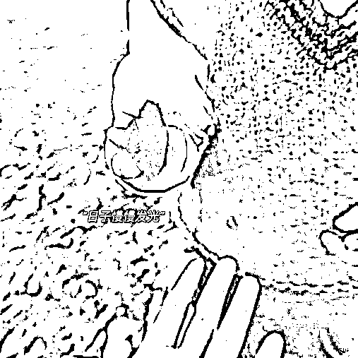

最后的最后，感谢生财有术相遇的朋友们，感谢生财圈友梁靠谱、张亚萨的改稿意见，感谢亦仁助理鱼丸不厌其烦地也做了我的“推土机”，感谢那么多精华帖的启发和思路，感谢亦仁大大！

大家一起生财有术啊！:D

评论区：

子子 : 太厉害啦！

凡人阁刘海成 : 认真看完，想添加一下好友

攀子 : 牛啊牛啊

小野 : 感谢阅读完[愉快]微信号 muyexy

青青 : 好棒哦

小野 : 谢谢认可[愉快]你也是生物医药方向的吗？

小野 : 谢谢小攀师兄[呲牙]

小野 : 我也想开个 ChatGPT 账号[可怜]

