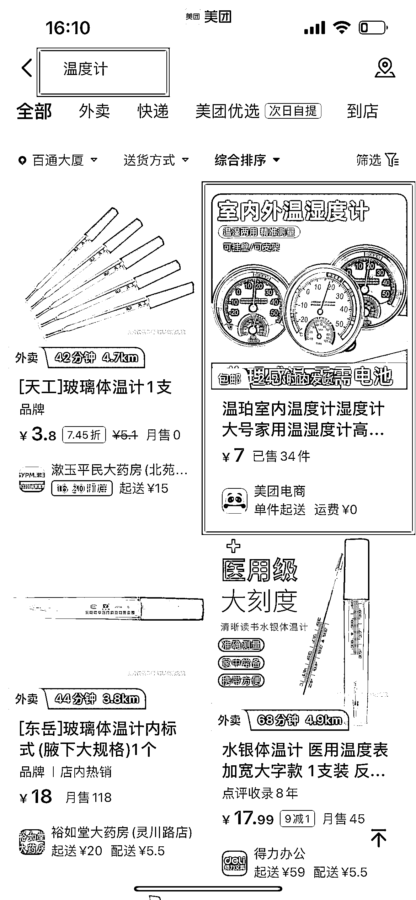
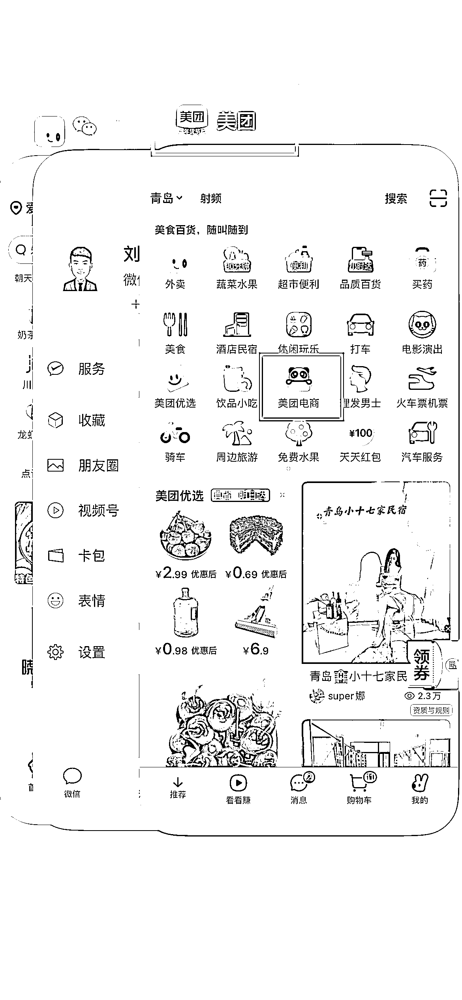
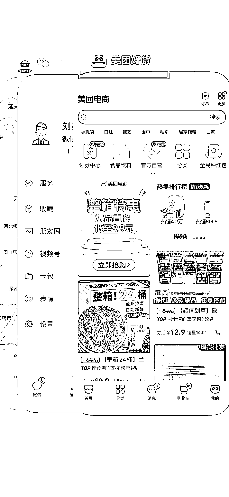
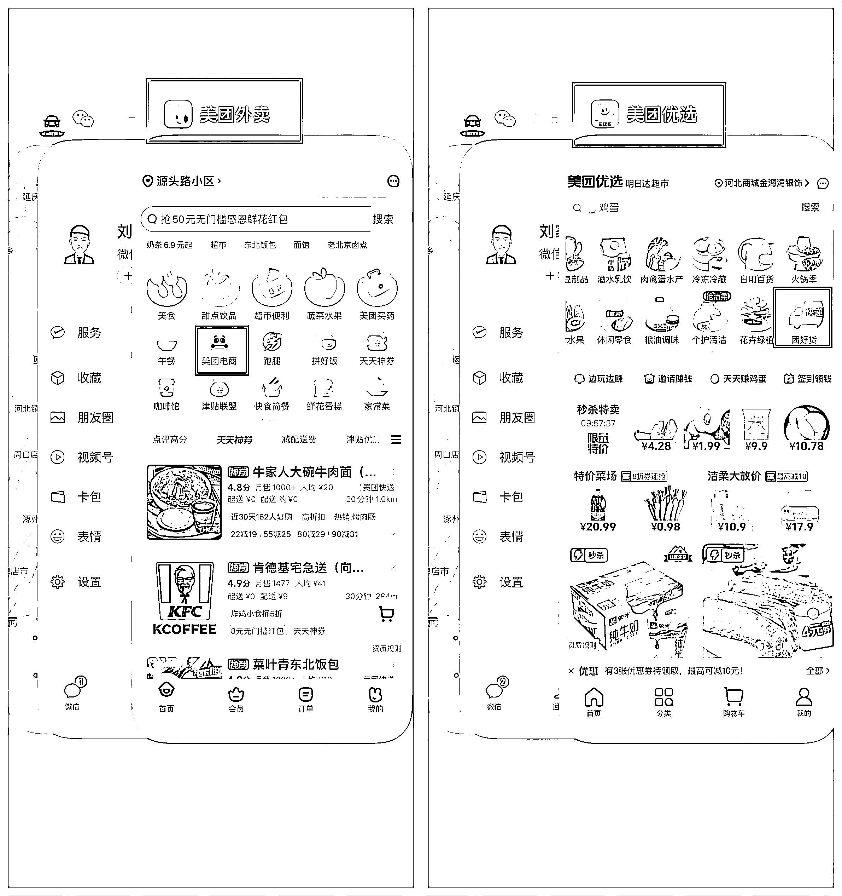
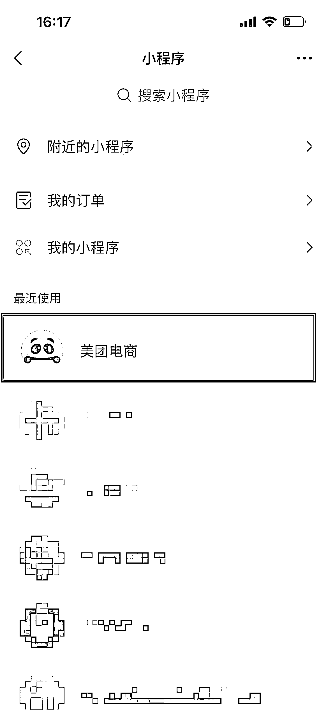

# 1.2.2 流量来源

•相较淘宝、京东、拼多多等专业平台电商，美团电商的流量较少，但两者商家数量存在指数级差距，而且美团将本地服务近十亿的用户电商化是一个任道而久远的任务，所以单店获得的流量依然可观；

•美团电商的流量当下主要以补齐其他板块 SPU 种类溢出的搜索流量为主（譬如美团优选板块商品 SPU 缺失），猜你喜欢等推荐流量为辅；

•美团电商板块的流量来源主要有以下几个入口：

美团主页搜索流量：

美团主页金刚位入口流量：

美团电商独立 APP「美团好货」：

其他独立 APP 二三级流量（譬如美团外卖、美团优选等独立 APP）：

美团电商微信小程序：

