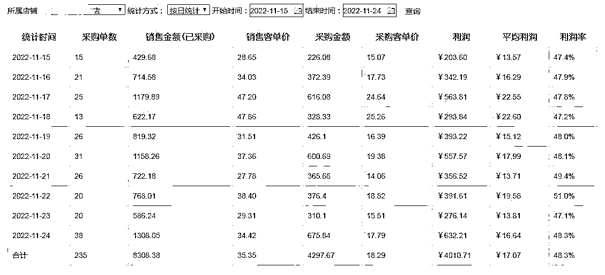
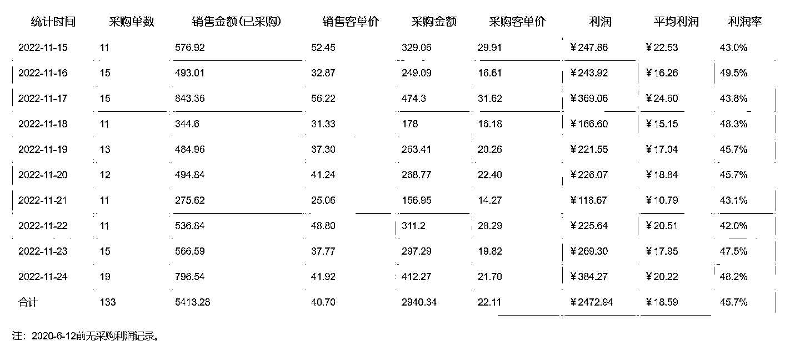
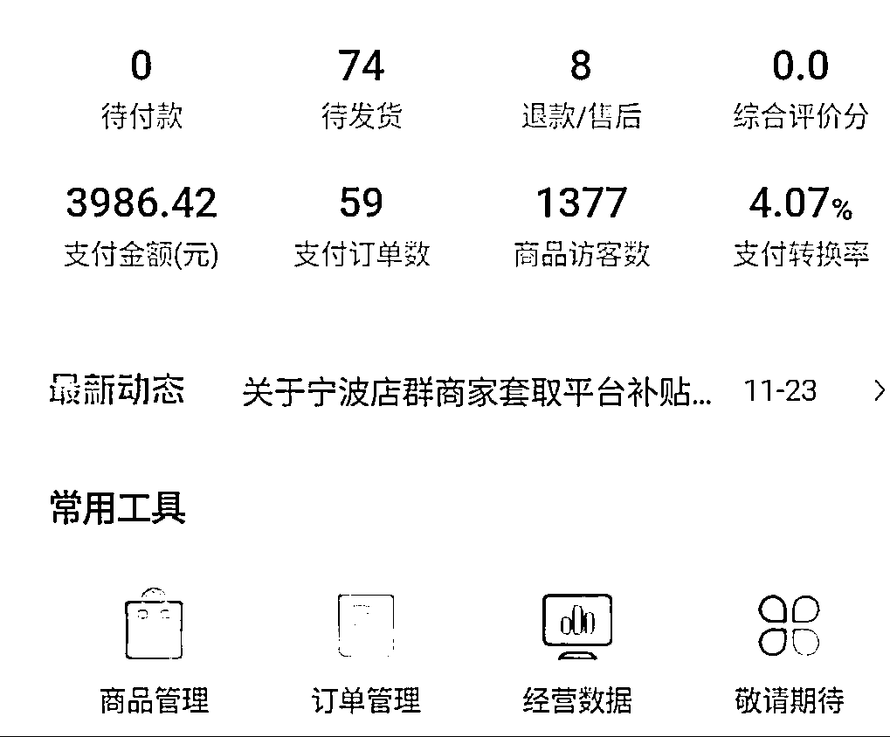

# 1.3 项目玩法

每个电商平台的玩法、赛道百花齐放，作为无货源玩家，结合大多数人的情况，结合店铺数量与资金量级，给大家总结了两种不同的玩法，两种玩法的底层逻辑不同，前者是用绝对的基数对抗概率，后者是单点打爆的精细化玩法，结合自身情况从以下两种玩法中找到适合自己的玩法：

•店铺多+资金多+轻运营：单店月利润 3-6K 左右

用绝对的基数对抗概率，通过绝对的店铺数量以及较多的资金，轻运营把玩法做“粗”，底层逻辑是一种财务逻辑打法，不再纠结于某一个店的产出，算好投产比，投多少赚多少，是否符合自己的财务逻辑。

此种玩法的门槛就是具备一定的资金体量，两三个人以上的小工作室更佳。

•店铺少+资金少+重运营：单店月利润 6-15K 左右

所有电商平台的尽头就是精细化，无论是直播带货还是传统电商，精细化是商家内卷的产物。

在有限的资金以及店铺数量内，通过精细化的运营最大化提高单店铺产出，此种玩法更加适合店铺资金有限的团队或单兵作战的个体。

