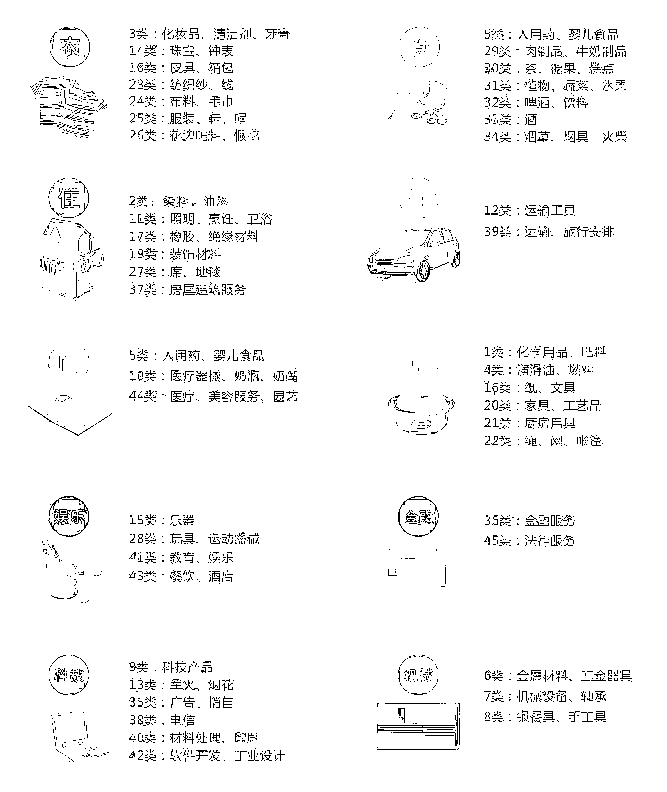

# 第二步：选择商标

1）品牌授权一般授权到美团的二级类目。根据下文图片的商标类别，选择要做的目标美团二级类目告知持有品牌的三方进行授权；

2）美团店铺二级类目与商标类别叫法不完全一致，譬如美团类目“体育用品”在下方商标图谱中叫做“运动器械”，同一类别商品只是叫法不同；

3）商标选择尽量选择明确不存在模棱两可的。

举例说明：①譬如美团电商店铺二级类目：体育用品/鞋服，尽量拿 28 类运动器械授权不拿 25 类鞋服类商标授权，因为体育用品较服装类商标特征明显，未来上架体育器械相关平台审核不易出现误审，不存在争议；②美团店铺二级类目中的体育用品/鞋服，哑铃和运动服两个商品，鞋服类商标授权的店铺上架。

