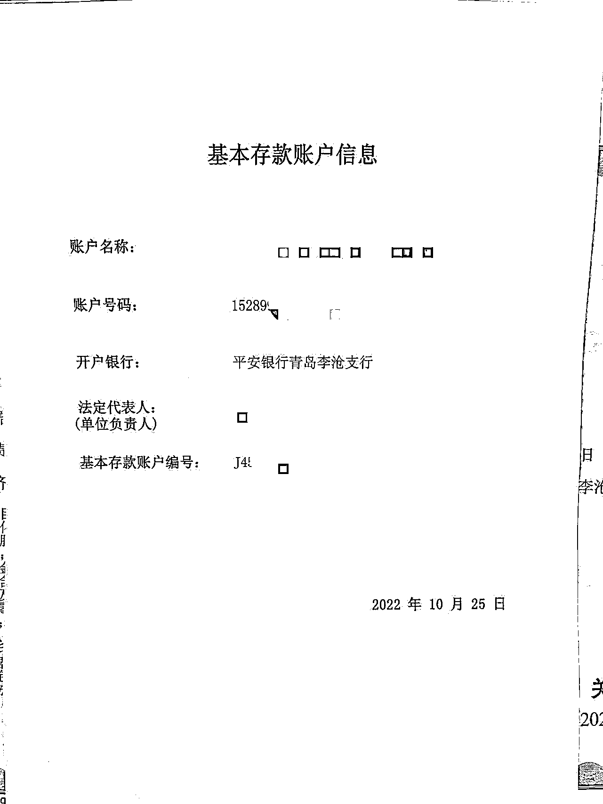
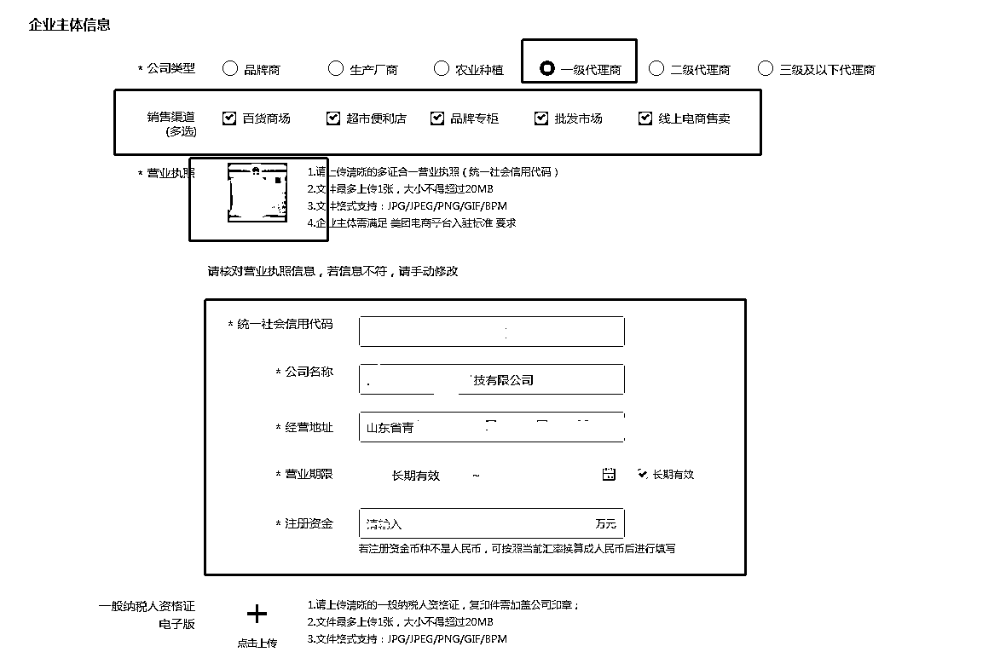
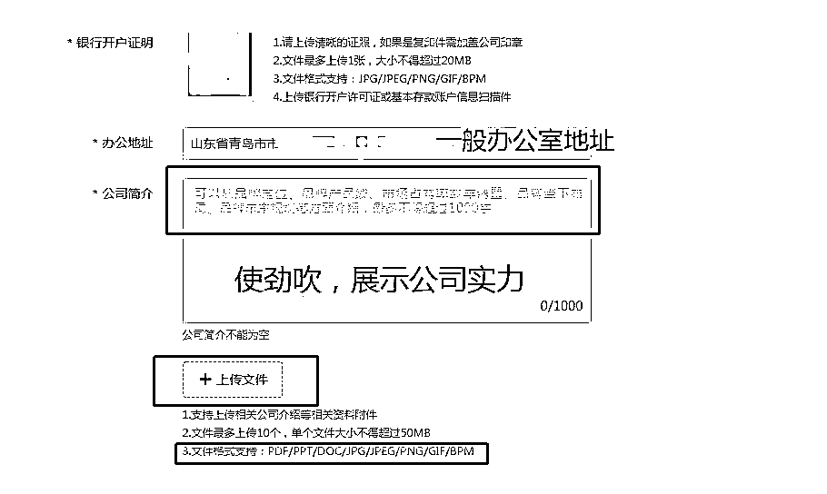

# 2.3.3 填写基本资料

选择店铺类型后，需要填写公司主体资料：

1）公司类型根据授权的商标级别确定，一般小品牌商标均为一级代理；

2）销售渠道一般全选；

3）银行开户证明示例：

4）公司简介附件位置可上传类似企业宣传册、PPT 等材料，形式不定，核心以展示实力为主，个人根据情况去百度文库等网站自行下载发挥；

•示例：

青岛 XX 网络科技有限公司注册资金 100 万，员工 40 余人，是山东省青岛市一家专业做运动健身器材的公司。公司的产品主要用于个人家庭健身，户外娱乐运动，公司团建器材等各种娱乐活动，充分发挥产品的优势，满足多场景使用。优秀的员工，先进的技术，精良的设备，严格的管理是公司得以不断发展养大、产品能够赢得用户依靠的根本所在。“精确、可靠、专业”是我们生产精神和服务信念，在吸取国内外先进技术和工艺的基础上，多年来在运动行业的智慧和经验，产品的精度、稳定性、可靠性居全国领先地位，线上京东淘宝平台均有自营和合作商，已逐步从第一代产品升级为目前的第六代产品，并仍在自己研发更为高端的产品，凭着先进的技术、卓越的品质、完善的服务，我公司产品跻身于运动用品行业的前列，产品遍及全国各地，我们用心倡导：以市场为导向，以科研为龙头，以创新为手段，用心开拓市场。注：不要照抄，大家全部一样去申请必挂！一定自己去百度！