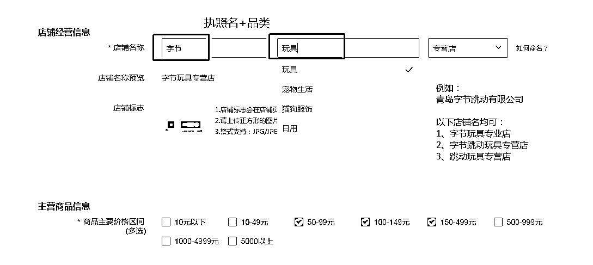
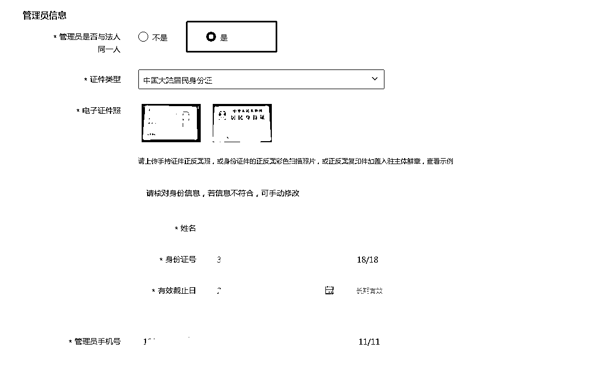
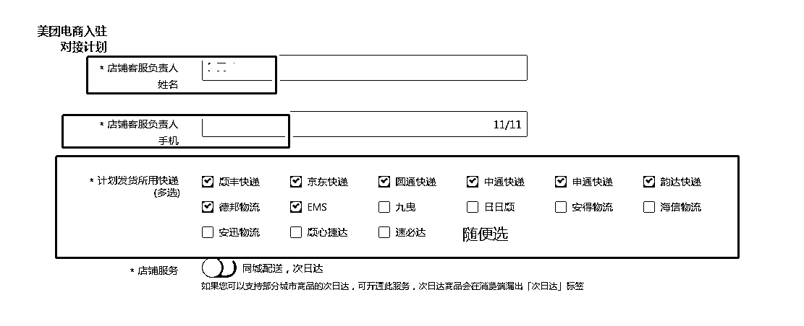

# 2.3.5 填写店铺信息

1）店铺命名规则为“执照名”+“品类”，执照名可取部分，比如

公司名：青岛字节跳动有限公司这些店铺名均可：①字节玩具专营店 ②字节跳动玩具专营店 ③跳动玩具专营店

2）价格区间全选或者选择部分均可

•主营商品说明：主营商品简介直接去淘宝搜对应类目的产品，只要主图不带品牌，直接截图即可；

•第一张为商品及价格截图，第二张为此商品评价截图。注意一定不要截取到差评；

•管理员一般选择“是”；

•快递公司任选即可，与后续发货没有任何关系，一般全选：

