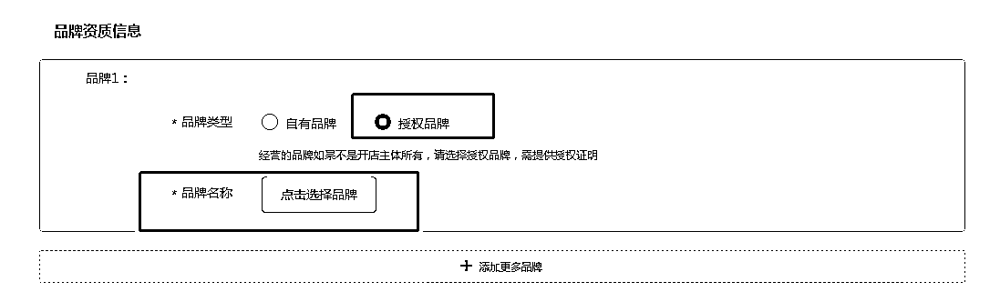
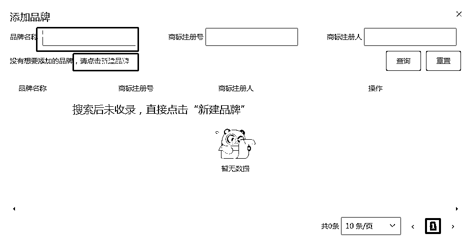
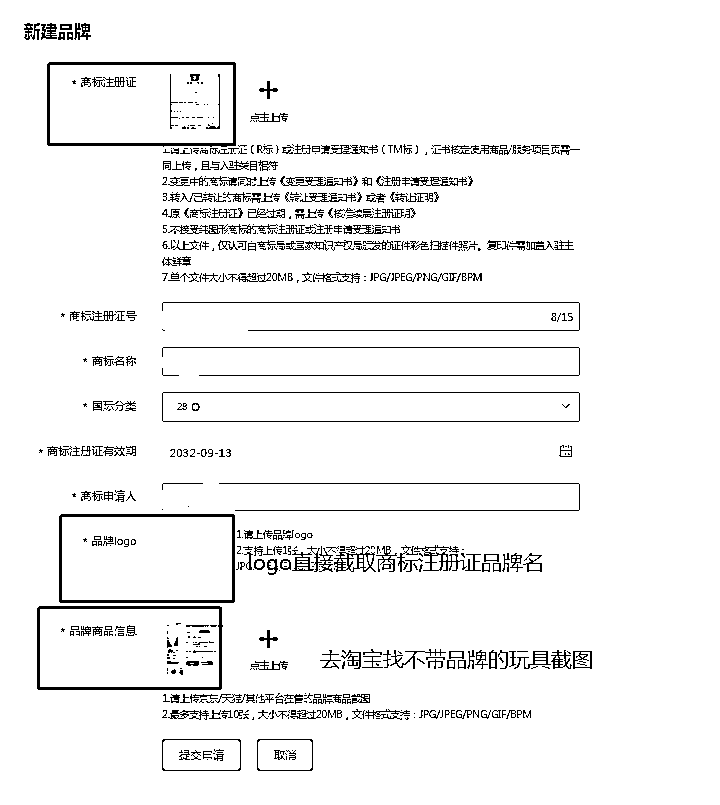
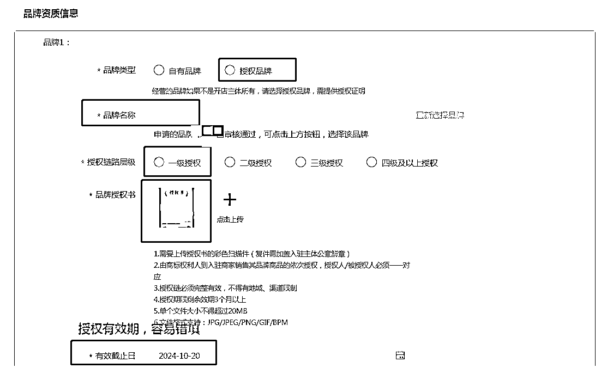
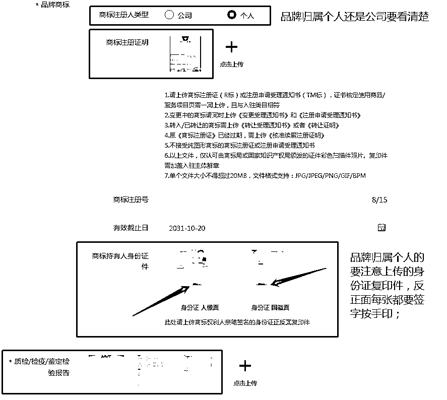

# 2.3.6 填写资质信息

1）选择授权品牌，点击选择品牌；

2）查看品牌美团库是否已收录，未收录需自行录入，需等品牌审核收录通过后方可提交入驻申请，品牌收录审核一般 2 个工作日左右；

3）品牌已收录直接搜索选择即可：

•品牌收录说明：•搜索后未收录选择“新建品牌”；•上传商标注册证，品牌 logo 直接截图商标注册证上品牌“文字”即可；•品牌信息同主营商品，去淘宝找不带品牌的截图即可；

•收录审核说明：•商标收录信息填写后，“申请的品牌“XXX”在平台审核中”，审核通过可继续填写，这时候保存退出即可；•品牌收录申请通过后，继续提示继续填写信息；•品牌持有为个人的，必须复印件签字，反正面每张都要签字按手印；•质检报告按照图示要求上传即可；

