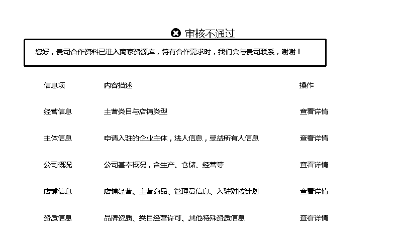
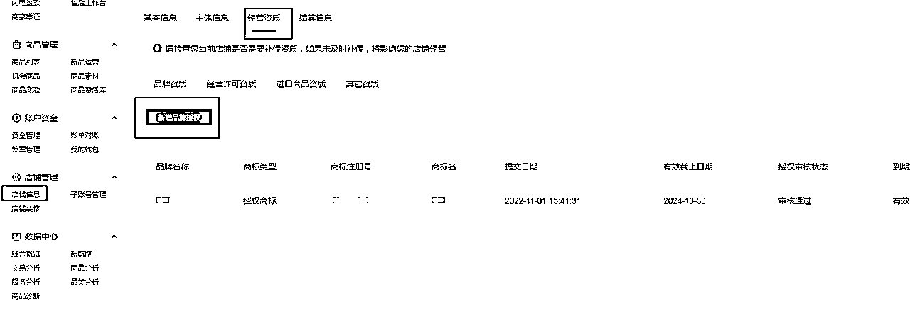

# 2.3.8 美团入驻 Q&A @刘家齐 @不语

Q：一个执照可以注册多少家店铺？

A：理论上一张执照在每个一级类目上都可以注册 3 家店铺，但美团目前对于同一主体有管控，有很大的运气成分；出现下图页面代表该执照已被美团拉黑无法再注册新的店铺，过往入驻成功的店铺无影响；

Q：【重要】如何提交多家？

A：待全部商标通过后，建议一次性提交多家，提高单执照下店数量，不要逐店提交，容易来不及提交后续店铺，执照已被拉黑。譬如：一般周五（周末休息）开始提交，周五提交 3-5 家，周六提交 3-5 家，周日提交 3-5 家。

Q：【常见】品牌录入以后提交一直显示品牌错误，怎么办？

这种情况手打品牌名录入试一下，一般是可以解决，大部分是因为字的格式的问题。

Q：【常见】已经录入现有品牌，修改草稿箱没有相应品牌弹出，怎么办？

这种情况是上传产品选择的类目，超出现有商标的经营范围，可以选择增加商标，选择经营范围符合的商标申请加入品牌库：

部分内容来源：《运营效率问题以及常见打假问题》@不语

