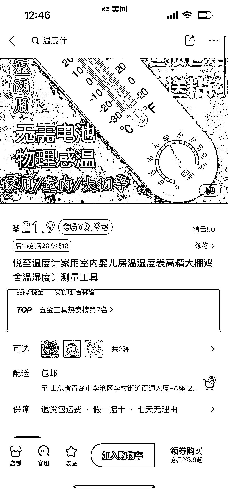
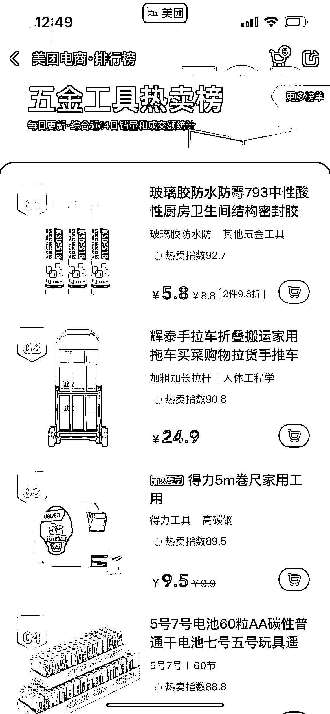

# 3.3 选品方法

【推荐】方法一：淘宝爆款选品法

1）爆款选品法的底层框架逻辑主要以在其他平台已被市场验证的爆款为主，能从淘宝红海平台厮杀出来的产品，说明在商品品质以及发货物流、服务等多方面经过了市场验证。

2）淘宝前排商品往往符合大部分人的审美，价格也相对合理。这部分商品选品几乎不会出现问题，属于安全商品，但是要注意价格带。

电脑端打开淘宝网结合美团店铺所在四级类目（四级类目主要是为了选到更精确的爆品）对应的产品，选品 5 大标准：

•月销≥2000 笔，最低≥1000 笔

防止店群同行，一般店群很难卖到 1000 笔以上

•主图无品牌、无价格；

涉及品牌授权，无法上架，每天上架人工审核；

•店铺 DSR 评分≥4.8 分（最低保证物流单项≥4.8 分）

保证上家店铺的质量、物流、服务三项指标无问题；

•200 元≥最低 sku 价格≥10 元（蓝海平台高利润、低价单多死拍单号）；

因为是两倍上传，高于 200 元价格过高很难卖出，而低于 10 元的产品即使两倍上传也不赚钱，白忙活；

•包邮且不限购；

方便处理售后以及防止客户退货我们损失发货运费；

方法二：跟款选品法

跟款选品法选品逻辑主要以美团电商平台已经验证跑出的榜单爆款跟款为主，譬如某款收纳架畅销进入美团畅销榜单，可以淘宝搜索上同款或者价格更有优势的类似款式上架，做到跟款；

操作方法：

1）在目标选品类目找到任意已上美团“热卖榜单”的商品：

2）点击打开热卖榜单，查看榜单爆款：

3）根据榜单爆款以及选品方式一的上家选择标准，选择跟款或选择榜单类似款式，一般建议选择榜单类似款式，直接 1：1 跟款一般价格无优势。

【不推荐】方法三：抖音/其他平台爆款商品选品法

根据抖音等其他电商平台的爆款商品视频进行跟进选品，大多数抖音爆款是通过信息流，或者落地页形式的广告展现，通过不同平台的广告算法机制，为产品找到最精准的流量，直接通过落地页进行成交。在消费者眼中，二类电商不如一类电商靠谱。因为这部分商品本身有一部分流量溢出，溢出的这部分流量分散到其他平台后可能会有意想不到的销量产生。

操作方法：

1）通过飞瓜、蝉妈妈、考古+等第三方短视频数据网站，找到爆款商品排行榜；

2）针对爆款商品排行榜进行跟款选品；

3）找到目标产品后，去淘宝网、1688 等平台电商网站找到价格低的上家进行上架；

4）此种选品方式不适用于蓝海平台早期，主要原因就是效率太慢。

5）更细致的选品步骤可以查看往期「抖音短视频手册」：《抖音短视频手册-选品方法》

【选品小结】所有的选品方法仅仅作为辅助和日常员工的管理抓手，无货源电商效率大于质量，我们要重测品轻选品，通过绝对的基数测品，让好的产品自己从店铺里面跑出来，蓝海平台野蛮生长期一定要关注上新效率。

