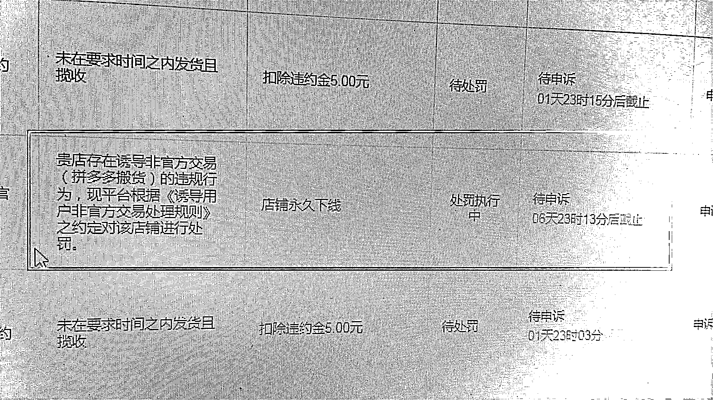

# 3.4 注意事项

美团电商目前尚处于平台中早期阶段，选品无需像其他传统电商平台太过精细，红利期选品速度大于选品质量。

同时，美团电商作为新出的电商平台规则多变，违规违禁的产品不要选择，处罚还是比较严厉的，对抗平台是没有出路的。

基于这两点情况，我们在选品时会有一些注意事项：

1）平台红线

重要的事情说三遍，不能搬多多商品、不能搬拼多多商品、不能搬拼多多商品，不然就是如下结果：

2）违规与不推荐产品

以下产品从违规以及高难度售前售后两方面原因不建议选择：

•高退换货、复杂售前售后（譬如女装、需指导安装的精密仪器等）

•预售

•国际名牌

•军警郭嘉政府擦边

•博彩类

•宗教迷信

•特殊资质（工业生产许可证、产品经营许可证）

•卡通人物（奥科曼、黑猫警长、变形金刚等）

•钱币及周边产品

•开锁工具

•化学原料等

•虚拟类目

•其他违法产品

