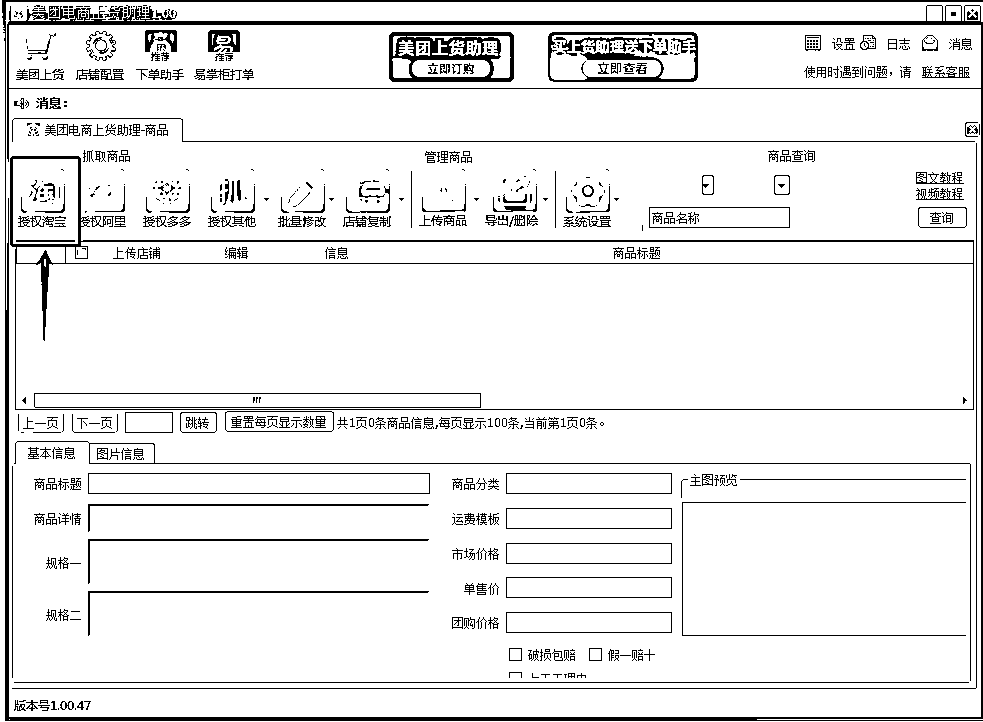
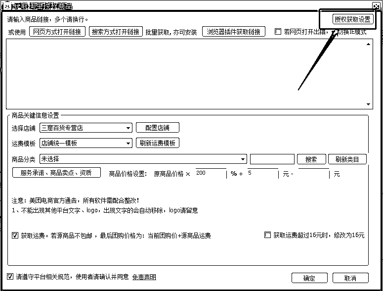
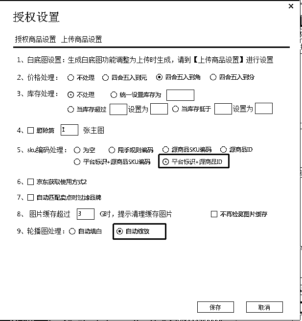
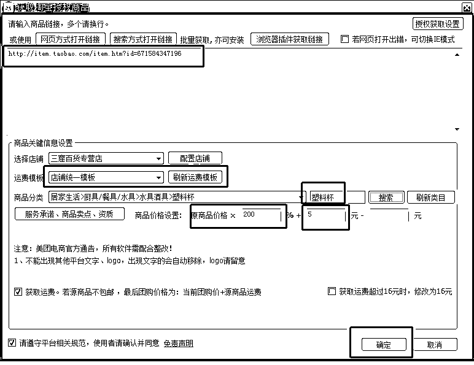

# 4.2.3 上货流程

•第一步，根据搬运的平台，我们以淘宝为例，点击“授权淘宝”：

•第二步，点击“授权获取设置”：

•【此项为重点】第三步，选择“平台标示+源商品 ID”、“自动缩放”这两个一定要选！其他默认后保存：

若未按照此项进行，因未使用甩手拍单进行采购，容易出现不能拍单的情况。

•第四步，按照下图红框进行上传前设置：

图示说明：

1）复制淘宝上家宝贝链接至软件内；

2）运费模板为前面新店设置的统一运费模板，点击刷新即可出现；

3）根据商品的所属类目选择对应的美团店铺三四级类目，商品一定不要错放类目，有违规处罚风险；

4）商品价格为两倍加 5 元上传。

•第五步，点击上传设置-上传商品至草稿箱，完成上传：

