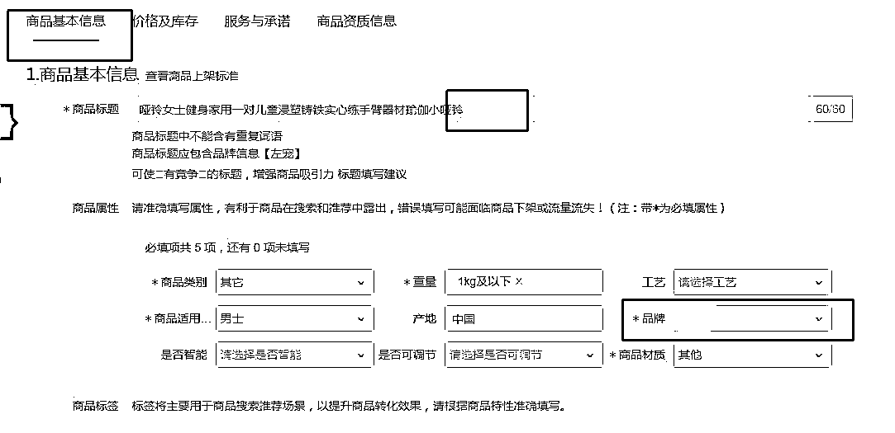
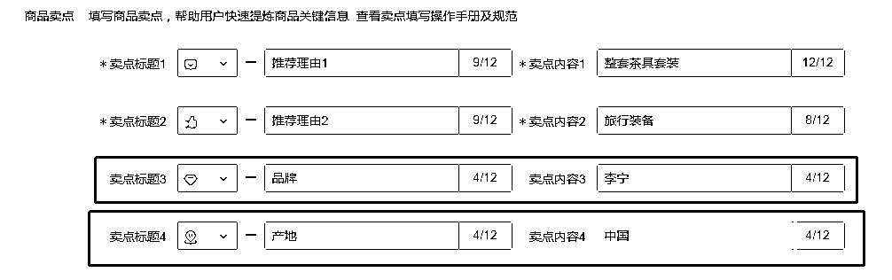

# 5.2.2 完善产品信息

•确定所负责店铺“商标品牌”（在美团商家后台-店铺信息-经营资质查看），完善店铺信息；

•商品标题需包含该店铺所售品牌商标（上一步已确认），标题最多 30 个字（30 字=60 个字符，字母算一个字符），所以去掉两个无关紧要的汉字，替换为品牌名，譬如下方的 XXX；

注：标题去掉的汉字一定是无关紧要的两个，千万不要删产品词，譬如这条链接的“哑铃”两个字，会造成平台消费者搜索不到该产品！

•所有红色「*」项均需要填写，品牌处系统一般默认空着，我们直接填写即可：

•若商品卖点里面出现了非我们的店铺“品牌”（淘宝原链接的品牌），直接把卖点 3 删掉：

