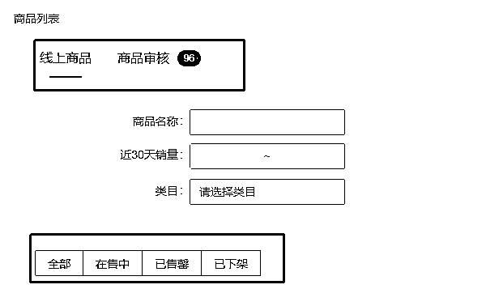

# 5.3 查看上架进度

商品列表（宝贝仓库）分为两个大类别，线上商品以及商品审核。

其中，线上商品主要为已经上线过后又下线的商品，或者目前在线的商品；

商品审核分为：待提交审核、审核中、审核驳回三个板块。

下文提到的审核上架仅涉及商品审核板块。

•商品审核：包括待提交/审核中/审核驳回

•审核时间：提交审核后一般 1-5 个工作日审核完毕，无固定时间，最长不超过 10 个工作日

