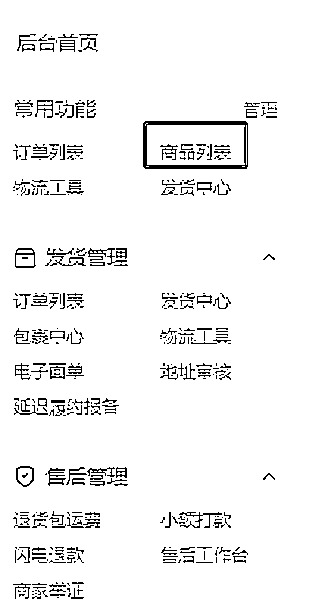
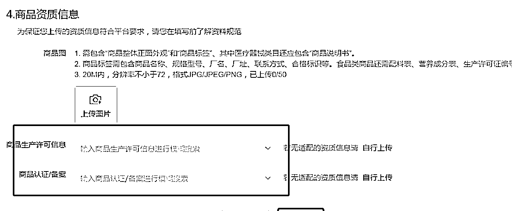

# 5.5 产品问题 Q&A

Q：修改草稿箱如何提前知道哪些产品需要资质？

打开商品列表新建商品，选择类目以后新建，下滑到底可以看到那些类目需要特殊资质，细心的圈友可以做好记录，此类链接下次可以直接删除跳过，效率会提高很多：

梳理下常见的需要资质的类目：

一般儿童玩具类，头盔类，雨伞类，通电设备，电子设备都需要 3c 证书或者能源证书，塑料制品类需要工业生产许可证。

Q：商品能不能错放类目？

举例：花瓶错放创意家居属于"小错放"，平台允许小错放，不会做处罚，利用小错放的技巧既可以提升效率也可能会有意外收获，因为每个类目的流量是不一样的。

但情趣用品错放创意家居属于"大错放"，会下架商品，后期会对店铺作 7 天禁止上新的处罚。

内容来源：《运营效率问题以及常见打假问题》@不语

