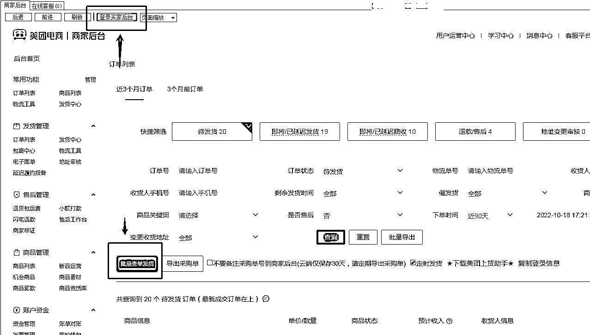

# 6.2.1 发货实操演示

1）首先登录买家后台，即我们淘宝拍单采购账号；

2）点击批量查单发货，选择快速发货（默认选择的放虚假发货）；

3）快速发货，完成商品发货；

4）如果有多个采购号，不断切换新的淘宝采购账号完成发货即可；

5）偶尔出现极个别订单淘宝上家使用的不知名小快递公司发货，美团平台不支持此快递公司，可使用自编虚假单号完成发货（偶尔一个订单影响不大，不要大规模使用）：

