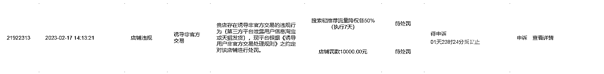
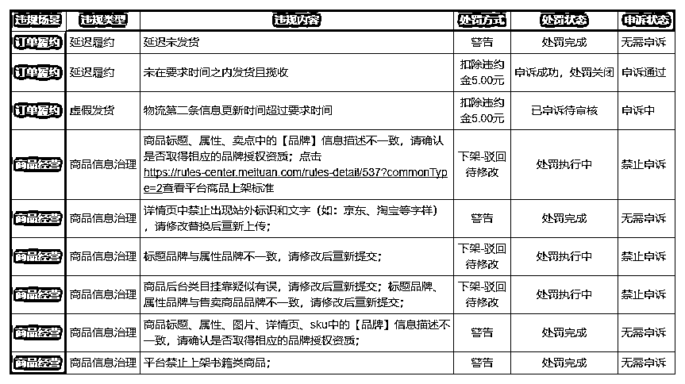

# 7.2 违规检查

做电商一定要顺应平台规则，每日检核店铺是否有违规，发生重大违规针对性的及时申诉是运营每日必做事项之一，下面给大家举例几种常见的违规以及违规申诉办法。

•违规列表入口：导航栏-违规管理-违规列表

•【‼️‼️‼️‼️‼️非常重要】重大违规：拼多多搬货

这点我们在前文选品时提到过，重要的事情说三遍，不能搬多多商品！！不能搬拼多多商品！！不能搬拼多多商品！！

不然就是如下结果：

•【‼️‼️‼️‼️‼️非常重要】重大违规：信息泄露处罚

信息泄露处罚一旦被坐实，罚款 10000 元，如上图所示。

该处罚类似前面提到的拼多多搬货处罚，目前在美团电商的处罚非常严格，两种类型均为平台最严厉处罚。

处罚原因与淘宝、抖店、京东等平台对于无货源的打击类似，只是美团的处罚更严厉。而造成美团处罚的主要原因，就是搬货客户发现后投诉至小二。

这是怎么发现的呢？大家可能在生活中也遇到过类似的情况，你在淘宝买了件东西，卖家发货后会有短信/菜鸟裹裹小程序通知你，该物品已有 xx 商家发货。这样一来，客户很容易发现我们是其他平台拍单发货的。

怎么办呢？注意以下两步。

规避方案：

第一步：淘宝采购号关闭菜鸟裹裹提醒，取消淘宝与菜鸟裹裹授权，注销菜鸟裹裹账号，支付宝菜鸟裹裹小程序解除授权。解除教程：《【美团 8】重要：淘宝采购号关闭菜鸟裹裹提醒》；第二步：一旦发现客户有投诉至小二的苗头，直接电话沟通补贴小红包或者仅退款给客户（生意有百分之几的货损很正常）。

•其他轻度违规情况汇总：

表格链接（可复制）：[《【美团电商】店铺轻度违规情况汇总》](https://shengcaiyoushu01.feishu.cn/sheets/shtcnyEXiQj9smCIbkCbaNFpROh)