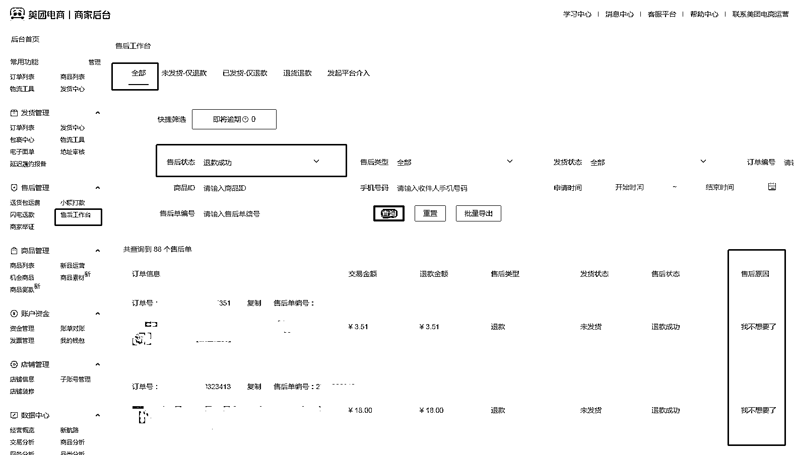
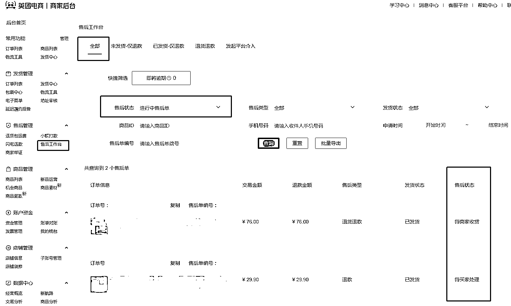

# 8.1 退款管理

•处理原则

退款处理原则即为“优先保证我们的货物/本金不丢”，若有丢失风险对客户申请进行驳回或暂不处理。

•退款管理入口

仅关注“售后工作台-现在进行中”、“售后工作台-退款成功”即可。根据退款中可能发生的各类情况，我们按以下不同方式处理即可：

1）未发货-仅退款

退款中：若已拍单，淘宝申请仅退款，上家退款后方可给客户退款。退款成功：若已拍单，【异常单记录客服 1.0 版】记录订单编号，并淘宝申请仅退款，每日跟进退款进度。退款成功/退款中：若未拍单，直接给客户审批退款即可。

2）已发货-仅退款

先驳回客户退款并写明原因，然后到淘宝申请仅退款并通知上家拦截快递；若拦截未成功，告知客户修改为“退货退款”。

3）退款退货

告知客户先不要寄回，到淘宝申请退货退款，获取正确退货地址后发给客户。

